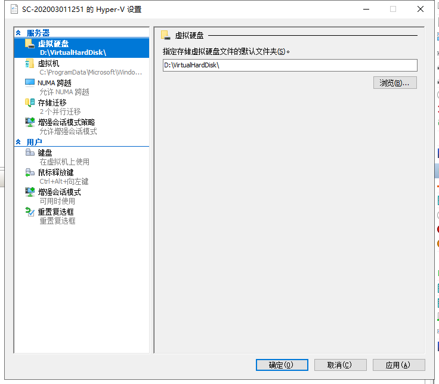
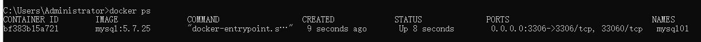
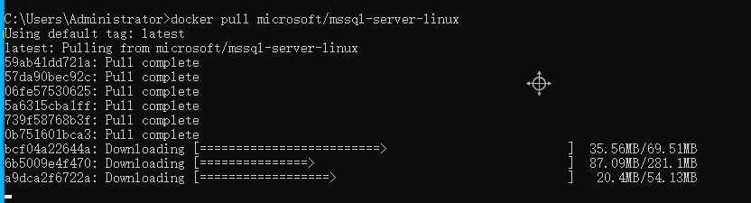
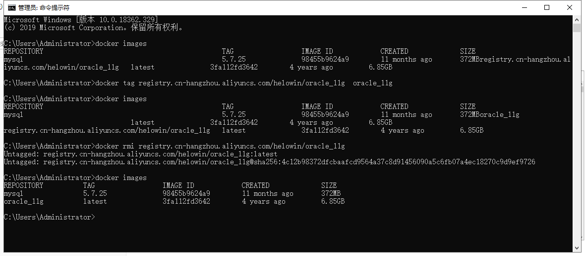
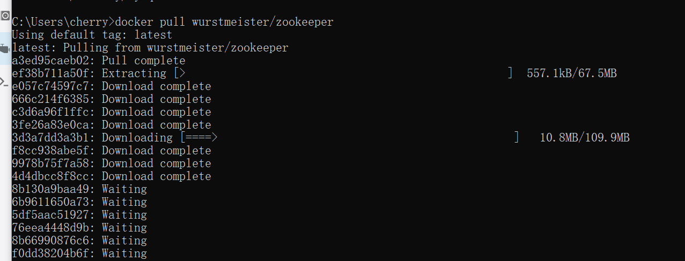
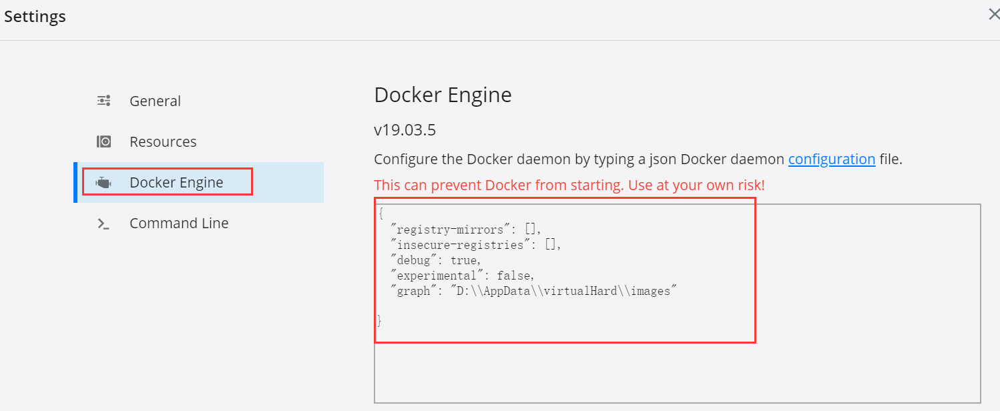
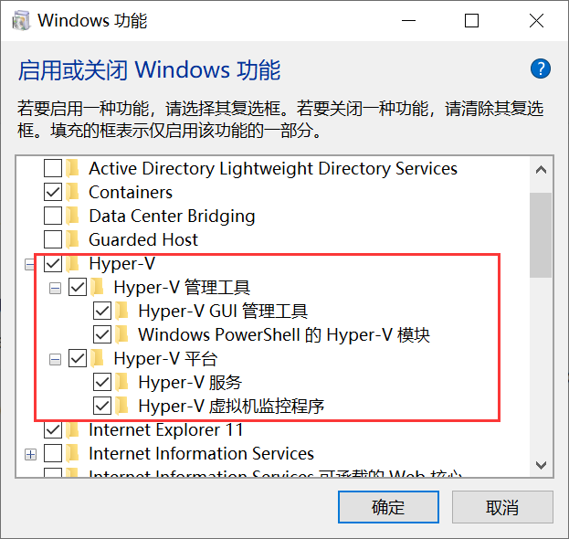
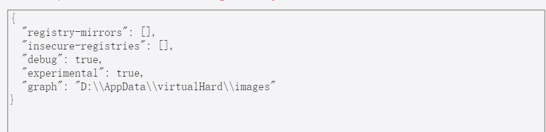

### 1. Docker 的基本操作步骤

1. docker  linux/windows上的一个应用软件,可以认为是一个VMware软件

   - docker desktop for windows

   - 要求win10 专业版、教育版，家庭版请安装docker toolbox.

     

   - 下载地址 https://download.docker.com/win/stable/Docker%20for%20Windows%20Installer.exe

     

2. image镜像

      所谓镜像，就是一个打好包的文件，类操作系统的安装镜像

   + 拖拽镜像 docker pull mysql:5.7.25
   + 查看镜像 docker images

3. 容器：启动一个镜像叫做一个容器,容器可以认为一个虚拟器
   + 启动一个镜像，变成一个容器，一个小型的虚拟机就启动了	
   + docker run --name mysql01 -e MYSQL_ROOT_PASSWORD=123456 -p 3306:3306 -d           mysql:5.7.25
   
    
   
4. 通过应该用程序连接容器内的服务

   - navicat连接docker容器中的mysql数据库 
   - sqlyog 连接mysql

5. 进入容器内部连接服务

   ​    在容器内部连接 mysql

   + 进入mysql的终端
   + docker exec -it mysql01 /bin/bash  #-it:交互模式 

   

### 2.  Docker具体操作步骤

#### 2.1 Docker基本应用

1. docker的安装
   - 如果没勾选创建桌面快捷图标，也可以简单验证下是否安装成功，在CMD Shell执行命令docker -v，查看能否输出docker版本。
   
- 镜像位置的修改
  
     windows10的docker使用的是Hyper-V虚拟机，镜像存放的默认目录是C:\Users\Public\Documents\Hyper-V\Virtual hard disks，首先停止docker。
   
     打开Hyper-V管理器，1.开始菜单右键->控制面板->管理工具->Hyper-V 管理器
   
     Hyper-V设置 虚拟机右键设置(保持两处路径一致)
   
     
   
     

2. image镜像的获取
   - 在Docker Hub上搜索想要下载的镜像，例如"mysql"，搜索结果默认安装下载量排序，一般来讲点进排在首位的就好（注意镜像名称后缀信息
   - 复制docker pull mysql并执行该命令即可开始下载，默认最新版本。

3. 查看容器信息

   docker ps  查看容器运行状态，
   容器的简写ID，容器的源镜像，创建时间，状态，端口映射信息，容器名字等

   docker run 启动容器：

4. 启动mysql

   - docker run --name mysql01 -e MYSQL_ROOT_PASSWORD=123456 -p 3306:3306 -d         mysql:5.7.25

   

   -  -name：给新创建的容器命名，此处命名为mysql01
      -e：配置信息，此处配置mysql数据库的root用户的登陆密码
      -p：端口映射，此处映射主机3306端口到容器mysql01的3306端口
      -d：成功启动容器后输出容器的完整ID，例如上图 58653e90885e...
      最后面mysql指的是mysql镜像名字。mysql 名字 5.7.25 tag

5. 进入容器内部

   

   - 进入容器

      C:\Users\Administrator>docker exec -it mysql01 /bin/bash

   - 显示容器相关信息

   root@bf383b15a721:/# ls
   bin  boot  dev  docker-entrypoint-initdb.d  entrypoint.sh  etc  home  lib  lib64  media  mnt  opt  proc  root  run  sbin  srv  sys  tmp  usr  var

   root@bf383b15a721:/# uname -a
   Linux bf383b15a721 4.19.76-linuxkit #1 SMP Thu Oct 17 19:31:58 UTC 2019 x86_64 GNU/Linux

   root@bf383b15a721:/# cat /proc/version
   Linux version 4.19.76-linuxkit (root@d203b39a3d78) (gcc version 8.3.0 (Alpine 8.3.0)) #1 SMP Thu Oct 17 19:31:58 UTC 2019
   root@bf383b15a721:/# cat /etc/issue
   Debian GNU/Linux 9 \n \l

   

   

#### 2.2Docker 创建Sqlserver数据库


1.  拉去sqlserver镜像
   - docker pull microsoft/mssql-server-linux
   - 
2. **docker run -e 'ACCEPT_EULA=Y' -e 'SA_PASSWORD=123456' -p 1433:1433 --name mssql -d microsoft/mssql-server-linux**
   ACCEPT_EULA=Y，表示接受最终用户许可协议；SA_PASSWORD=Test1234，表示设置sa用户的密码为Test1234。这个用户密码要符合强密码规范（数字、字母、大小写，至少8个字符）
   **docker ps** 　 查看mssql数据库服务是否启动
3. 


#### 2.3Docker创建Oracle数据库

 

  参考网址  https://www.cnblogs.com/baojunblog/p/11340258.html

1. 重新命名镜像为oracle_11g

- C:\Users\Administrator>docker images
- C:\Users\Administrator>docker tag registry.cn-hangzhou.aliyuncs.com/helowin/oracle_11g  oracle_11g

- C:\Users\Administrator>docker rmi registry.cn-hangzhou.aliyuncs.com/helowin/oracle_11gC:\Users\Administrator>docker images
  REPOSITORY          TAG                 IMAGE ID            CREATED             SIZE
  mysql               5.7.25              98455b9624a9        11 months ago       372MB
  oracle_11g          latest              3fa112fd3642        4 years ago         6.85GB

2. 启动容器

   docker run -d -p 1521:1521 --name oracle11g oracle_11g

3. 进入容器

   docker exec -it oracle11g bash

   进行软连接: sqlplus /nolog

   如果没有该命令则切换到root用户下:

   su root;

   密码:helowin

   编辑环境变量:

   vi /etc/profile

   export ORACLE_HOME=/home/oracle/app/oracle/product/11.2.0/dbhome_2
   export ORACLE_SID=helowin
   export PATH=$ORACLE_HOME/bin:$PATH

4. 创建软连接

     ln -s $ORACLE_HOME/bin/sqlplus /usr/bin

5. 切换到oracle用户

   su -  oracle

6. 登陆sqlplus 修改system用户密码

   -  sqlplus /nolog

   -  conn /as sysdba

   - 接着执行下面命令
     -  alter user system identified by system;
     -  alter user sys identified by sys;

7. Navicat连接Oracle

     如果此时去连接oracle的话,navicat会报错:

   ORA-12514, TNS:listener does not currently know of service requested in connect descriptor

需要进入oracle的docker容器做一个配置:

docker exec -it oracle11g  bash

需要找到这个文件tnsnames.ora;

然后修改tnsnames.ora

docker_oracle11 =
(DESCRIPTION =
(ADDRESS_LIST =
(ADDRESS = (PROTOCOL = TCP)(HOST = localhost)(PORT =1521))
)
(CONNECT_DATA =
(SERVICE_NAME = helowinXDB)
)
)

然后重启容器:

**docker restart 容器id**

现在可以用system用户连接,密码:system

连接之后创建表空间,创建用户就可以使用了


C:\Users\Administrator>



#### 2.4 Docker 创建Kafka

参考

```
参考2：
https://blog.csdn.net/lordwish/article/details/105800870

参考2：
https://blog.csdn.net/he3more/article/details/104696081?utm_medium=distribute.pc_relevant.none-task-blog-BlogCommendFromMachineLearnPai2-5.channel_param&depth_1-utm_source=distribute.pc_relevant.none-task-blog-BlogCommendFromMachineLearnPai2-5.channel_param
```




```
docker run -d --name zookeeper -p 2182:2181  wurstmeister/zookeeper
```


```
docker run -d --name kafka -p 9092:9092 -e KAFKA_BROKER_ID=0 -e KAFKA_ZOOKEEPER_CONNECT=192.168.3.10:2181/kafka -e KAFKA_ADVERTISED_LISTENERS=PLAINTEXT://192.168.3.10:9092 -e KAFKA_LISTENERS=PLAINTEXT://0.0.0.0:9092 wurstmeister/kafka
```


kafka启动参数说明：

**–link** 用于容器直接的互通。
**-e KAFKA_BROKER_ID=0** 一个 kafka节点 就是一个 broker。一个集群由多个 broker 组成。一个 broker可以容纳多个 topic
**-e KAFKA_ZOOKEEPER_CONNECT=zookeeper:2181** 配置zookeeper管理kafka的路径
**-e KAFKA_ADVERTISED_LISTENERS=PLAINTEXT://139.226.179.239:9092** 把kafka的地址端口注册给zookeeper，若远程访问要改成外网IP,千万注意是外网IP，很多文章只说是宿主机IP, 演示例子上写的是内网IP，很容易被误导
**-e KAFKA_LISTENERS=PLAINTEXT://0.0.0.0:9092** 配置kafka的监听端口
**-v /etc/localtime:/etc/localtime** 容器时间同步虚拟机的时间


###### 1.1 补充-解决2181端口占用问题

由于Hyper-V占用的2181端口，所以必须将Hyper-V停掉后把2181释放出来，但是没了Hyper-V，Dokcer就不能运行了，所以改完还要将Hyper-V启动。

查看端口占用情况

```
netsh interface ipv4 show excludedportrange protocol=tcp

```

禁用Hyper-V服务

```
dism.exe /Online /Disable-Feature:Microsoft-Hyper-V

```

解除2181端口限制

```
netsh int ipv4 add excludedportrange protocol=tcp startport=2181 numberofports=1

netsh int ipv4 del excludedportrange protocol=tcp startport=2181 numberofports=1

```

启用Hyper-V服务

```
dism.exe /Online /Enable-Feature:Microsoft-Hyper-V /All

```

检查确认端口占用情况

```
netsh interface ipv4 show excludedportrange protocol=tcp

```

问题解决，zookeeper容器顺利创建并启动

#### 2.5 如何修改镜像源让你的下载如飞

https://blog.csdn.net/my__holiday/article/details/79111397?depth_1-utm_source=distribute.pc_relevant.none-task&utm_source=distribute.pc_relevant.none-task

#### 2.5让镜像不再占用你宝贵的C盘


https://blog.csdn.net/u013948858/article/details/80811986?depth_1-utm_source=distribute.pc_relevant_right.none-task&utm_source=distribute.pc_relevant_right.none-task




配置信息：

```
{
  "registry-mirrors": [],
  "insecure-registries": [],
  "debug": true,
  "experimental": false,
  "graph": "D:\\AppData\\virtualHard\\images"

}
```

查看配置信息

```
C:\Users\cherry>docker info
Client:
 Debug Mode: false
 Images: 0
 Server Version: 19.03.5
..................
 
 Docker Root Dir: D:\AppData\virtualHard\images

```


#### 2.6 拉取镜像错误

\> docker pull mysql
Unable to find image ‘mysql:latest’ locally
latest: Pulling from library/mysql
C:\Program Files\Docker\Docker\Resources\bin\docker.exe: no matching manifest for [windows](https://www.jiloc.com/tag/windows)/amd64 10.0.18362 in the manifest list entries




Docker镜像拉取错误码：

```
docker pull mysql
```

Pulling from library/mysql
no matching manifest for unknown in the manifest list entries

解决方法：

将` experimental `设置为` true `即可.



### 3.Docker 参考网站


1. https://docs.docker.com/docker-for-windows/
2. https://www.cnblogs.com/gaogaoyanjiu/p/9392242.html
3. https://www.cnblogs.com/stilldream/p/10700428.html
4. dockerfile 创建镜像

   https://www.cnblogs.com/gaogaoyanjiu/p/9390063.html

### 4.Docker常用命令

1. 镜像的相关命令

   - 删除这个镜像docker rmi <image-id>。

   - 查看host中的镜像 docker images

   - 想要删除untagged images，也就是那些id为的image的话可以用
     docker rmi $(docker images | grep "^" | awk "{print $3}")

   - 删除全部的images
     docker rmi $(docker images -q)

   - 当要删除的iamges和其他的镜像有关联而无法删除时,可通过 -f 参数强制删除

     docker rmi -f $(docker images -q)

   -  docker tag 旧镜像名  新镜像名

2. 容器的相关命令

   - 查看所有运行中的容器docker ps；
   - 停止容器运行docker stop <container-id>；
   - 删除这个容器docker rm <container-id>；
   - 查看所有容器  docker ps -a  
   - 查看所有容器ID  docker ps -a -q 
   - stop停止所有容器 docker stop $(docker ps -a -q) /
   - remove删除所有容器 docker rm $(docker ps -a -q)    
   - docker rename 原容器名 新容器名

3. 进入容器的命令


### 5.Docker容器操作系统操作

#### 5.1操作系统简介

CentOS、Ubuntu、Debian三个linux都是非常优秀的系统，开源的系统，也分付费的商业版和free免费版本，下面简单比较这三种系统。

1. CentOS系统


很多网站站长一般都选择centOS系统，CentOS是从redhat源代码编译重新发布版。CentOS去除很多与服务器功能无关的应用，系统简单但非常稳定，命令行操作可以方便管理系统和应用，并且有帮助文档和社区的支持。

2. Ubuntu系统

 Ubuntu有亮丽的用户界面，完善的包管理系统，强大的软件源支持，丰富的技术社区，并且Ubuntu对计算机硬件的支持好于centos和debian，兼容性强，Ubuntu应用非常多，但对于服务器系统来说，个人感觉并不需要太多的各种应用程序，需要的是稳定，操作方便，维护简单的系统。如果你需要在服务器端使用图形界面，ubuntu是一个不错的选择，你需要注意的是，图形界面占用的内存非常大，而内存越大的vps价格也越高。

3. Debian系统

Debian也非常适合做服务器操作系统，与Ubuntu比较，它没有太多的花哨，稳定压倒一切，对于服务器系统来说是一条不变的真理，debian这个linux系统，底层非常稳定，内核和内存的占用都非常小，在小内存的VPS就可以流畅运行Debian，比如128m的内存，但debian的帮助文档和技术资料比较少。对于小内存，首选debian，对于非常熟悉linux系统的vps高手，首选debian。

#### 5.2vi编辑器使用


