# EA使用

## 1. 安装EA

1. 解压安装包。

2. 找到enterprisearchitect14\EA 14.0.1422下的easetup.msi。

   

   没有什么可注意的，直接默认就行，安装位置可以自己选。

   

3. 将patch下的EA.exe替换到你的EA安装目录下EA.exe。

4. 这就算破解完成了，接下来就可以正常使用了。

## 2. 创建项目，创建Model

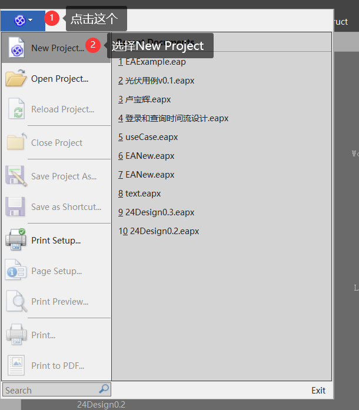


==下面添加Model，添加完Model，才能画Diagrams==


==选择你要创建哪种类型的图，然后点Create Pattern，这里我以创建类图进行举例==


创建完成


## 3. EA逆向工程

### 创建一个project

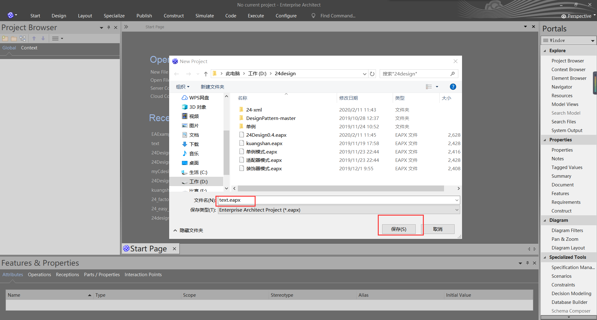

### 2.右击model，添加一个Model用于工作视图


### 3.这里我选择一个简单的类图，点击Creat Pattern（s）

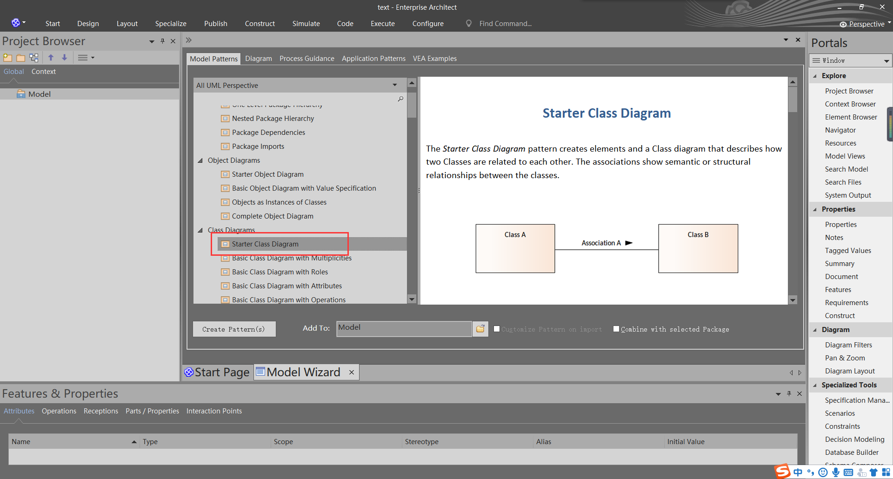

### 4.选择好咱们创建好的model


### 5.从上面栏中选择 code -> Import -> File -> Import Source Directory

或者选中model后直接使用快捷键 Crtl + Shift + u


### 6.选择好要导入文件的属性，点击OK


### 7.在左边就可以看到导入进来的包了

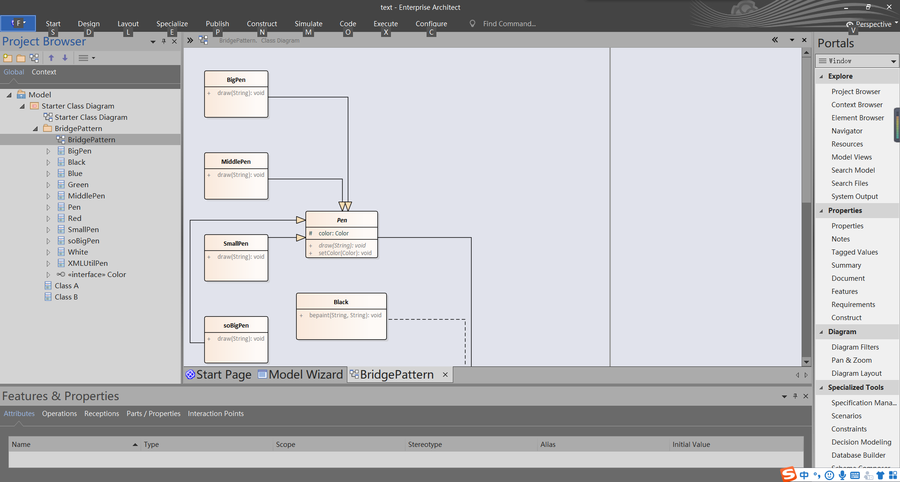

也可以查看图了

## 4. 用EA画图

==这里我以画类图来举例==

创建一个类图Model


### 创建类

1. 从Toolbox工具栏中选中class类拖到工作区

   

2. 设置类的变量

   - 在下面的Features栏中的Attribute设置变量

   

   

3. 设置类的方法

   - 在下面的Features栏中的Operations设置变量

   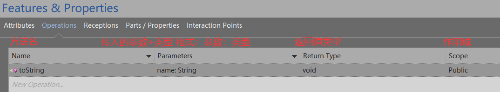

   ### 连接两个类

   


## 5. EA从图自动生成代码

这里选择使用装饰模式画的图导出代码

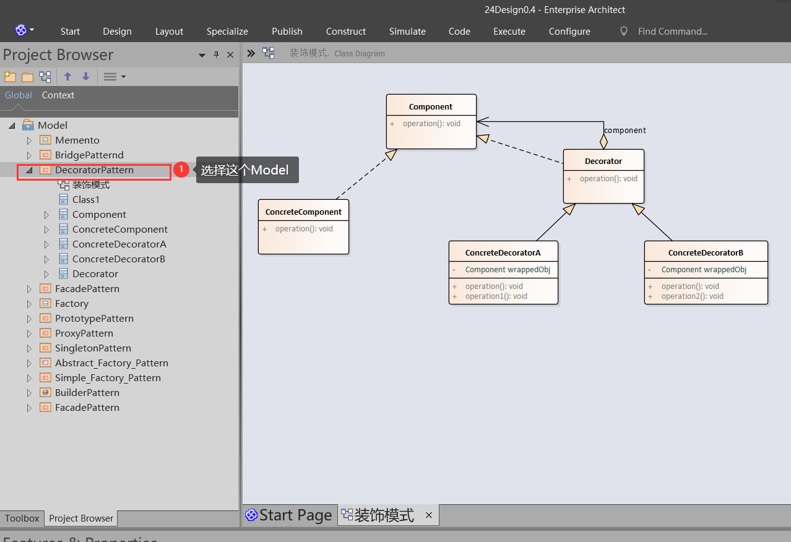


==下面操作要Select All==


==看到下面这个就算导出成功了==


## EA合并两个eapx文档

**这是两个不同eapx文件中的Model**


下面咱们要将ProjectA和ProjectB两个文档合并到一起

==使用将一个ProjectB导出为xml，再在ProjectA中导入xml==


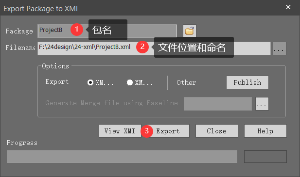

现在咱们切换到另一个工程里


==导入成功==


## 6. EA进行数据库设计

### 选择模型


==这里我以创建Student数据库来做演示==

### 创建表格

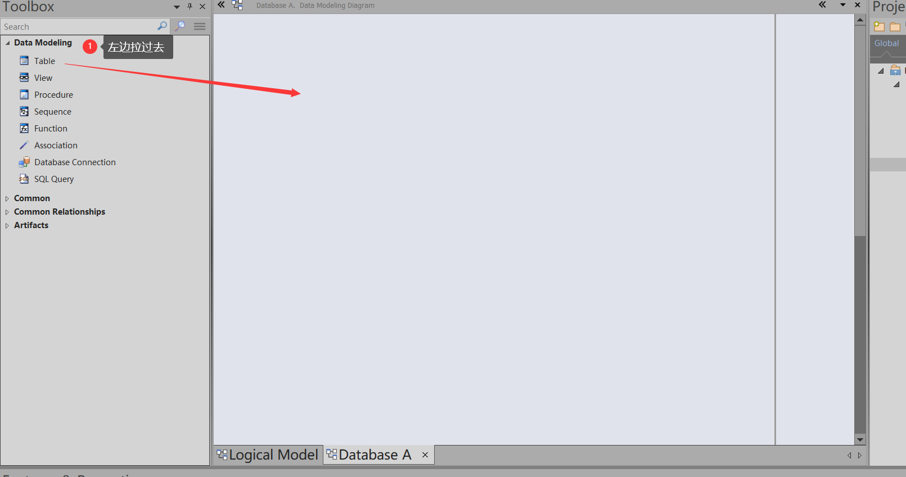


选中数据库类型

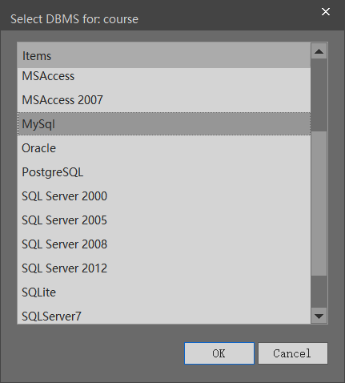


==数据表建立完成==


### 设置外键


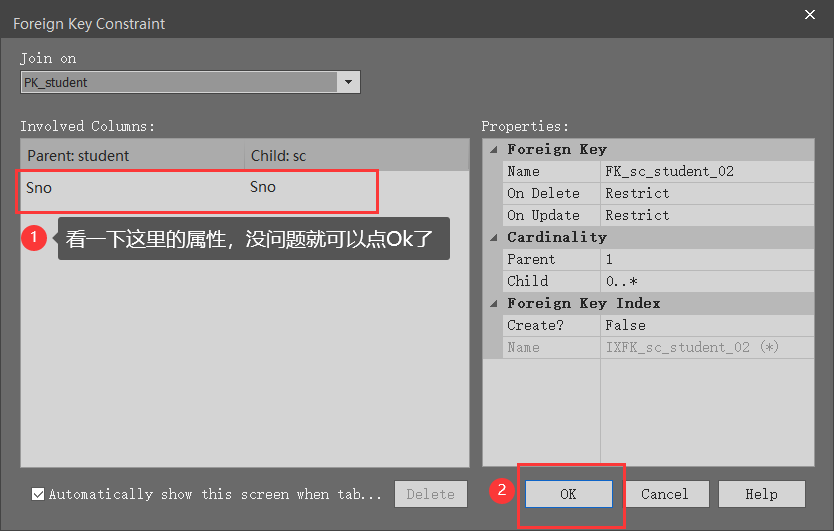

==外键设置完毕==


### 生成代码


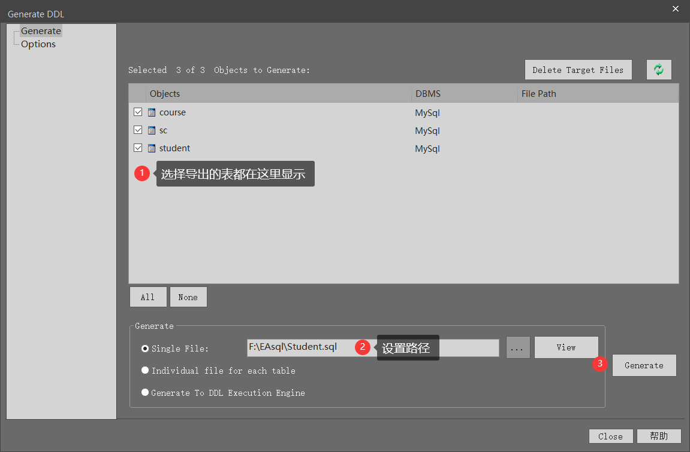

==导出成功==


==导出内容==

```mysql
/* ---------------------------------------------------- */
/*  Generated by Enterprise Architect Version 14.0 		*/
/*  Created On : 19-4月-2020 11:48:59 				*/
/*  DBMS       : MySql 						*/
/* ---------------------------------------------------- */

SET FOREIGN_KEY_CHECKS=0
; 
/* Drop Tables */

DROP TABLE IF EXISTS `course` CASCADE
;

DROP TABLE IF EXISTS `sc` CASCADE
;

DROP TABLE IF EXISTS `student` CASCADE
;

/* Create Tables */

CREATE TABLE `course`
(
	`Cno` CHAR(4) NOT NULL,
	`Cname` CHAR(40) NULL,
	`Cpno` CHAR(4) NULL,
	`Ccredit` SMALLINT NULL,
	CONSTRAINT `PK_course` PRIMARY KEY (`Cno` ASC)
)

;

CREATE TABLE `sc`
(
	`Sno` CHAR(9) NOT NULL,
	`Cno` CHAR(4) NOT NULL,
	`Grade` SMALLINT NULL
)

;

CREATE TABLE `student`
(
	`Sno` CHAR(9) NOT NULL,
	`Sname` CHAR(20) NULL,
	`Ssex` CHAR(2) NULL,
	`Sage` SMALLINT NULL,
	`Sdept` CHAR(20) NULL,
	`Cno` CHAR(4) NULL,
	CONSTRAINT `PK_student` PRIMARY KEY (`Sno` ASC)
)

;

/* Create Foreign Key Constraints */

ALTER TABLE `sc` 
 ADD CONSTRAINT `FK_sc_course`
	FOREIGN KEY (`Cno`) REFERENCES `course` (`Cno`) ON DELETE Restrict ON UPDATE Restrict
;

ALTER TABLE `sc` 
 ADD CONSTRAINT `FK_sc_student`
	FOREIGN KEY (`Sno`) REFERENCES `student` (`Sno`) ON DELETE Restrict ON UPDATE Restrict
;

SET FOREIGN_KEY_CHECKS=1
; 

```

### EA数据库反向工程

==目的：==

1. 不同数据库迁移。
2. 针对老系统的维护，系统中有几百张表，没有数据库设计文件，通过反向工程导入EA更好研究，再次进行设计。

由于EA不支持MySQL 64位的ODBC Driver，所以需要下载

==下载地址==

```
http://dev.mysql.com/get/Downloads/Connector-ODBC/5.1/mysql-connector-odbc-5.1.8-win32.msi/from/http://mysql.oss.eznetsols.org/ (windows 32bit)
```

安装的时候一直默认就行


控制面板--》管理工具--》ODBC Data Sources（32-bit）


==点击Test==


看到上面这个就可以点击OK了

==添加成功==


**接下来进行EA里面的操作**

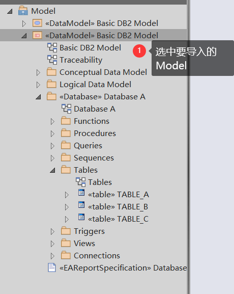


==

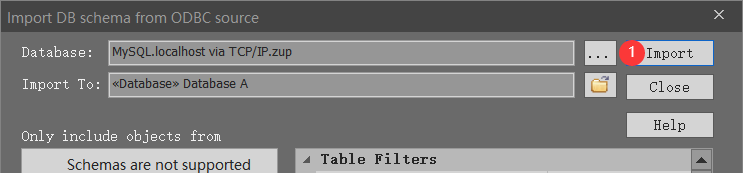


==导入成功==


如果想看外键之间的联系，将Database A图中的所有复制到Tables图中


