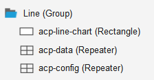
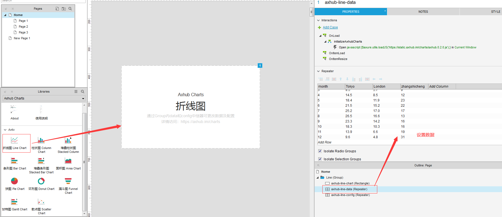
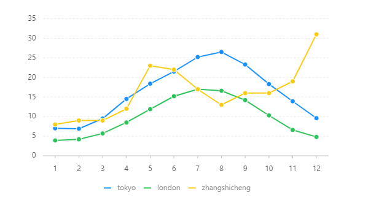
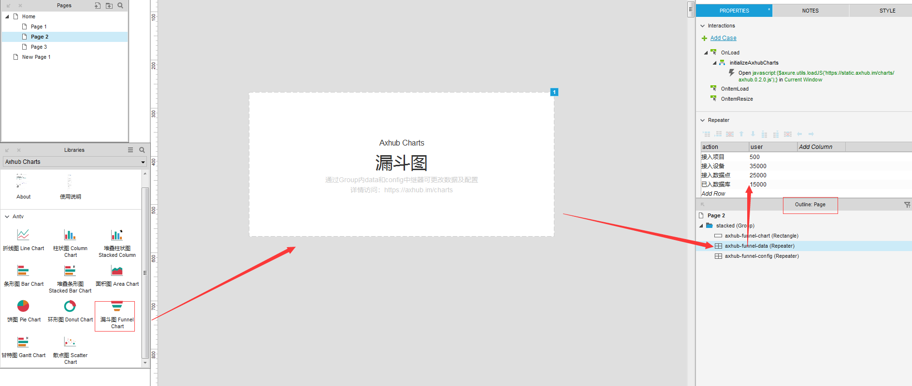

## 如何在Axure 内使用Axhub Charts

Axure是一个强大的原型工具，可以让你分分钟画出漂亮的表格，但是如何画出漂亮的折线图、饼图等图表，和客户直接进行交流？

下载：访问 https://axhub.im/charts/ 通过侧边栏下载 Axhub Charts 元件库

下载地址2： https://github.com/liuxinfengabc/cultivate/blob/master/2.CASE工具/1.设计工具/6.原型设计/

导入：在 Axure 内的 Libraries 面板，通过菜单导入下载的元件库

如何使用Axhub Charts的图表

#### **1.1原件构成与使用：**

在 Axure 内的 Libraries 面板选择对应图表，拖拽入目标页面即可，预览或生成即可看到图表。

每个图表元件一般为一个组合，组合名称可任意修改，组合内有：

- 容器矩形：一般名称为 acp-xxx-chart ，名称不可更改，为图表容器
- 数据中继器：一般名称为 acp-data ，名称不可更改，存放图表数据
- 配置中继器：一般名称为 acp-config ，名称不可更改，存放图表数据配置

acp 工作原理就是通过 javascript 读取中继器内的数据和配置，然后通过第三方图表库渲染成对应图表。

请注意，每个图表元件的组合不能打乱，否则将无法正常工作。

请注意，你在 Axure 内的 Outline（中文翻译为大纲或概要） 面板即可看到元件库组合，若找不到该面板，请尝试点击 Axure 视图 Views 菜单 - 面板 Panes 打开。

###### 更改画布

更改尺寸：在 Axure 内更改容器矩形（ acp-xxx-chart ）的尺寸和比例，图表画布即会更新

更改颜色：图表画布背景是透明的，可以在 Axure 内自行增加一个背景层，实现图表的背景和纹路等

###### 更改数据

在 Axure 内更改数据中继器（ acp-data ）的数据，即可更改数据，录入数据量大的话建议从 Excel 复制。

请注意，目前部分图表（折线图/柱状图等） x 轴不支持 '2019-10-01'， '2019/10/01'的格式时间值。

由于目前 Axure 中继器表头限制了输入中文，可以通过 [fieldAlias 配置项](https://www.yuque.com/books/share/9d8112e1-5edf-4fd0-a435-ba151986c336/gu3drv)来解决这个问题。

###### 更改配置

在 Axure 内更改数据中继器（ acp-config ）的数据，可以针对数据、坐标轴、图形、文本及提示信息更多配置，具体配置内容请查看 [配置项列表](https://www.yuque.com/books/share/9d8112e1-5edf-4fd0-a435-ba151986c336/gu3drv)。

每个图表元件，都有一个对应的config中继器，可以通过更改这里的配置项来控制图表样式，目前有以下几个可配置项（如需增加可通过axhub公众号反馈）：

theme：主题颜色，可选 default 和 dark（适合深色背景）

showLegend：是否显示图例标记，可选auto（多于1项显示）、true（显示）、false（不显示）

showAxis：是否显示坐标轴，可选true（显示）、false（不显示）

showTooltips：是否显示提示，true（显示）、false（不显示）

labelType：饼图类标签显示方式，可选default（默认）、inner（显示在扇形内）、none（不显示）

chartColor：自定义图表颜色，多个用,分隔，例如#0050B3, #1890FF, #40A9FF，元件会按顺序取色

formHeader ：自定义中继器表头，解决表头不能输入中文的问题，每列用,分隔，

​              例如 月份,东京,伦敦 （效果见下文）

xSticks：自定义横坐标刻度的数量和值，多个用,分隔

ySticks：自定义纵坐标刻度的数量和值，多个用,分隔

showText：是否显示图形中间标签文本，true（显示）、false（不显示）

#### **1.2更改图表数据：**

每个图表元件，都有一个对应的data中继器，更改该中继器的数据，即可更改生成图表的数据。

预览效果

#### **1.3更改图表高宽：**

你只需更改元件高宽，生成的图表会自动响应式更改高宽。

#### **1.4更改图表的背景：**

图表元件的背景是透明的，您可以自由为图表增加一层背景。此外，还可以通过图表对应的config中继器更改主题，目前提供了default主题适合亮色背景，dark主题时候暗色背景。

#### **1.5实现动态图表：**

你可以通过Axure的事件（Case）来更新图表对应的data中继器数据，图表本身也会自动更新，效果如下：

#### 1.6常见问题

##### **预览或生成后没有自动生成图表？**

首先请检查你的网络，Axhub Charts需要加载在线的antv或echarts的库文件来渲染图表

其次请确保不要改变元件分组Group内的axhub-xxx-chart、axhub-xxx-data、axhub-xxx-config的子元件名称，此外，且不要随意删除或移动这些子元件（Group的元件名称是可以修改的）。

##### **更改axhub-xxx-chart元件的内容？**

可以的，**axhub-xxx-chart** 的文本，边框，背景色都是可以随意编辑。会影响到图表生成的，只有该元件的高宽及可见性。

##### **有大量数据时中继器的数据编辑效率不高，**

中继器支持重excel表格直接复制数据哦~

##### **中继器表头不支持输入中文？**

V0.2.0版本的config利增加了formHeader配置项，解决表头不能输入中文的问题，值每列用,分隔，例如 月份,东京,伦敦 ，下面是折现统计图的效果

##### **能否更改图表字体、坐标轴或者图形的颜色**

图形颜色可以通过config里的chartColor配置项自定义，坐标轴刻度可以通过xSticks、ySticks配置项自定义。

其他配置后续会考虑在config开放，目前该阶段可以使用config关闭原有坐标轴，再加上自己的坐标轴的方式来实现。关闭后的图形如下：

