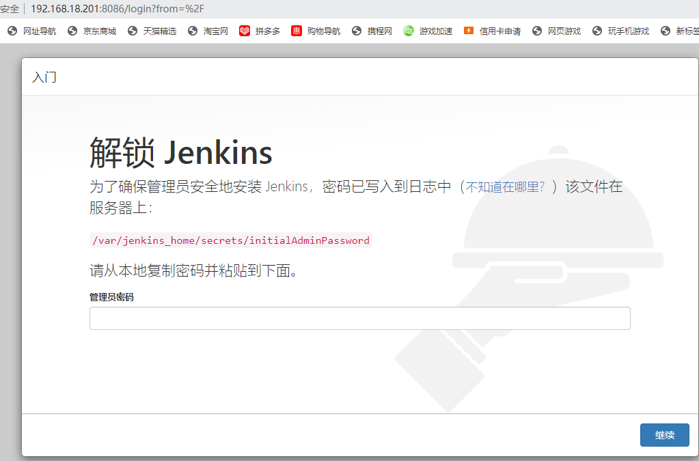
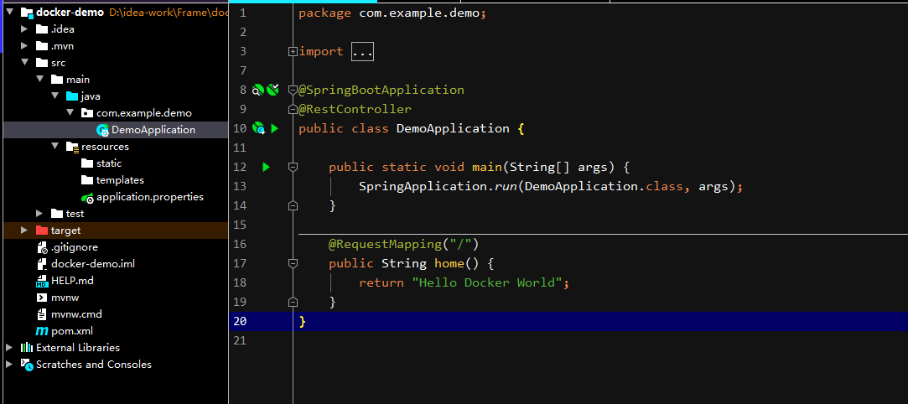
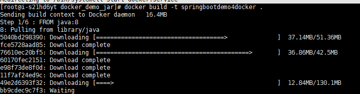

y


## 1. 开发环境搭建


### 1.1 云服务环境

```
https://docs.qingcloud.com/product/quick_start/   青云帮助文档
```

青云提供了两种组网方式：基础网络、私有网络（VxNet）。 前者是一个由青云系统维护的全局网络，后者是用户各自自行组建的网络。

基础网络的好处是简单、无需用户做任何配置与管理，即可直接使用， 但正因为它是全局网络，所以其安全保障是依靠防火墙（Security Group）来实现的。 与之相对应，私有网络需要用户创建并管理 （当然，为了简化管理，青云提供了路由器来帮助用户）， 但私有网络之间是100%隔离的，以满足对安全的100%追求。

私有网络类似物理世界中使用交换机（L2 Switch）将多台服务器连接在一起， 组成的局域网。它有两种管理方式：受管（Managed）、自管（Unmanaged）。 路由器用于多个受管私有网络之间互联，并提供三项附加服务： DHCP 服务、端口转发、VPN 隧道服务，涵盖了常用的网络配置与管理工作。 如果青云提供的路由器功能无法满足您对网络管理的需求， 您可以创建自管私有网络，并自行配置和管理该网络。

公网 IP 地址是在互联网上合法的静态 IP 地址。 在青云系统中，公网 IP 地址与您的账户而非特定的资源（主机或路由器）关联， 您可以将申请到的公网 IP 地址分配到任意位于基础网络中的资源， 并随时可以解绑、再分配到其他资源，如此可以快速替换您的对外资源。


1.2 配置YUM源

yum仓库就是使用yum命令下载软件的镜像地址。

我们通常使用 yum install 命令来在线安装 linux系统的软件， 这种方式可以自动处理依赖性关系，并且一次安装所有依赖的软体包，但是经常会遇到从国外镜像下载速度慢，无法下载的情况。那么此时我们就需要把我们的yum 源改为国内的镜像。

yum的配置文件
yum 的配置文件在 /etc/yum.repos.d 目录下, 其中有多个配置文件,每一个配置文件中都可以配置一个或多个repository, 但是最终会被合并为一个交给系统，所以多个文件只是为了方便管理。

2、yum仓库配置
下面提供了 阿里和 清华大学 两个镜像仓库配置操作说明，=实际使用时，选择其中一个配置即可。

```
yum install vim   #安装VIM编辑器
yum install wget   #安装下载工具
```

1）、备份，将 CentOS-Base.repo 为CentOS-Base.repo.backup

```
mv   /etc/yum.repos.d/CentOS-Base.repo /etc/yum.repos.d/CentOS-Base.repo.backup

 cp  /etc/yum.repos.d/CentOS-Base.repo.bak /etc/yum.repos.d/CentOS-Base.repo
```

（2）、下载新的 http://mirrors.aliyun.com/repo/Centos-7.repo,并命名为CentOS-Base.repo

```
wget -O /etc/yum.repos.d/CentOS-Base.repo http://mirrors.aliyun.com/repo/Centos-7.repo
或者
curl -o /etc/yum.repos.d/CentOS-Base.repo http://mirrors.aliyun.com/repo/Centos-7.repo
```

（3）、清除缓存

```
yum clean all # 清除系统所有的yum缓存
yum makecache # 生成yum缓存
yum update

yum install vim
```

### 1.2 安装Docker

1、Docker 要求 CentOS 系统的内核版本高于 3.10 ，查看本页面的前提条件来验证你的CentOS 版本是否支持 Docker 。

通过 **uname -r** 命令查看你当前的内核版本

```
 $ uname -r
```

2、使用 `root` 权限登录 Centos。确保 yum 包更新到最新。

```
$ sudo yum update
```


3、卸载旧版本(如果安装过旧版本的话)

```
$ sudo yum remove docker  docker-common docker-selinux docker-engine
```

4、安装需要的软件包， yum-util 提供yum-config-manager功能，另外两个是devicemapper驱动依赖的

```
$ sudo yum install -y yum-utils device-mapper-persistent-data lvm2
```

5、设置yum源

```
$ sudo yum-config-manager --add-repo https://download.docker.com/linux/centos/docker-ce.repo
```

 

6、可以查看所有仓库中所有docker版本，并选择特定版本安装

```
$ yum list docker-ce --showduplicates | sort -r
```


7、安装docker

```
$ sudo yum install docker-ce  #由于repo中默认只开启stable仓库，故这里安装的是最新稳定版17.12.0

```

 

8、启动并加入开机启动

```
$ sudo systemctl start docker
$ sudo systemctl enable docker
```

9、验证安装是否成功(有client和service两部分表示docker安装启动都成功了)

```
$ docker version
```


####  1.2.2 Docker常用命令

1. 列出所有容器 ID

```
docker ps -aq
```

2. 停止所有容器

```
docker stop $(docker ps -aq)
```

3. 停止单个容器

```
docker stop 要停止的容器名
```

4. 删除所有容器

```
docker rm $(docker ps -aq)
```

5. 删除单个容器

```
docker rm 要删除的容器名
```

6. 删除镜像

```
删除指定
docker rmi 6a8e2d5dd257  -f

删除所有image
docker rmi $(docker images -q)
```

7. 要让docker 的容器自动在开机启动，

```

docker run 指令中加入 --restart=always 就行。
sudo docker run --restart=always .....

如果创建时未指定 --restart=always ,可通过update 命令设置
docker update --restart=always xxx
```


### 1.3搭建Maven仓库

​		maven的仓库分为本地仓库，远程仓库和私服仓库。私服仓库一般是公司内部私有的，内部进行维护的。公司员工连接私服，从私服中下载jar，或者将自身的jar传到私服上。私服还可以从中央仓库下载jar，当私服中没用jar的时候，就会从中央仓库下载。

​	常用的私服有：[Apache Archiva](http://archiva.apache.org/index.cgi)，[Artifactory](http://www.jfrog.com/home/v_artifactory_opensource_overview/)，[Sonatype Nexus](http://www.sonatype.org/nexus/)。这里我们使用 Sonatype Nexus。


```
https://www.cnblogs.com/yhaing/p/8568043.html
```


#### 1.3.1Maven 的概念


Maven是一个软件项目管理工具，通过它可便捷的管理项目的生命周期。即项目的jar包依赖，开发，测试，发布打包、版本等。虽然目前的IDE工具（如eclipse）可管理开发、发布、打包工作，但还没有形成一套完成的体系。

Maven有以下几个功能特点：

1、 jar包依赖

　　这个也许会maven最突出的特点。使用maven进行开发时，不需要上网单独下载jar包，只需要在配置文件pom.xml中配置jar包的依赖关系，就可以自动下载jar包到我们的项目中（在联网情况下，maven可自动从https://repo.maven.apache.org/maven2中下载所需要的jar包。如果无法联网，可搭建基于Nexus私服的中央库并提供jar包下载）。这样，别人开发或者使用这个工程时，不需要来回的拷贝jar包，只需要复制这个pom.xml就可以自动的下载这些jar包。而且，我们自己下载jar包，还有可能造成版本的不一致，这样在协同开发的过程中就有可能造成代码运行的不一致。通过使用maven精确的匹配jar包，就不会出现这种问题了。

以下是一个项目的pom.xml中对jar包依赖的描述：


       <!-- spring需要的jar包 --> 
       <dependency> 
           <groupId>org.springframework</groupId> 
           <artifactId>spring-context</artifactId> 
           <version>3.2.4.RELEASE</version> 
           <type>jar</type> 
        </dependency> 


2 项目坐标

Maven通过特定的标识来定义项目名称，这样既可以唯一的匹配其他的jar包，也可以通过发布，使别人能使用自己的发布产品。这个标识就被叫做坐标，长的其实很普通，就是简单的xml而已。比如，以下为一个web项目的项目坐标描述信息（在该项目的pom.xml文件的开始位置）

```
  <groupId>com.nci</groupId>
  <artifactId>first_maven</artifactId>
  <version>1.0.0</version>
<packaging>war</packaging>
```

各字段说明：

  groupId：所述的项目名称，由于有的项目并不是一个jar包构成的，而是由很多的jar包组成的。因此这个groupId就是整个项目的名称。

artifactId：包的名称。

version：版本号。

packaging：包的类型，一般都是jar，也可以是war之类的。如果不填，默认就是jar。War代表web项目。


#### 1.3.2 私服搭建

​	搭建私有仓库，放到青云上。VPN登录上来。Docker容器比较

1. 执行以下命令，会自动从hub.docker.com下载最新的nexus镜像，然后启动一个名为nexus的容器，当前电脑的8081端口被映射到容器的8081端口： 
   `docker run -idt -p 8081:8081 --name nexus -v /home/data/nexus:/sonatype-work sonatype/nexus `

4. 执行命令

   docker logs -f nexus

   查看容器日志滚动信息，显示如下信息时nexus启动成功：

    

   ```
   2018-01-20 03:37:42,187+0000 INFO [jetty-main-1] org.sonatype.nexus.webresources.internal.WebResourceServiceImpl - Discovered 1971 resources 
   2018-01-20 03:37:42,189+0000 INFO [jetty-main-1] org.sonatype.nexus.webresources.internal.WebResourceServlet - Max-age: 30 days (2592000 seconds) 
   2018-01-20 03:37:42,304+0000 INFO [jetty-main-1] org.sonatype.nexus.bootstrap.jetty.InstrumentedSelectChannelConnector - Metrics enabled 
   2018-01-20 03:37:42,348+0000 INFO [jetty-main-1] org.eclipse.jetty.server.AbstractConnector - Started InstrumentedSelectChannelConnector@0.0.0.0:8081 
   2018-01-20 03:37:42,352+0000 INFO [jetty-main-1] org.sonatype.nexus.bootstrap.jetty.JettyServer - Running 
   2018-01-20 03:37:42,352+0000 INFO [main] *SYSTEM org.sonatype.nexus.bootstrap.jetty.JettyServer - Started 
   ```

   查看当前电脑的/usr/local/work/dockermaven目录，可以看到nexus容器中应用的相关文件已经在此处创建，如下图： 
   

1. 在浏览器输入地址访问nexus：http://192.168.18.110:8081/nexus
2. 对maven私有仓库的使用者来说，完全感受不到实际安装和在docker安装私有仓库的区别，您可以像前两章的实战那样，体验此仓库的jar缓存和保存二方库的服务；
3. 发布一个二方库到nexus，deploy成功后，可以在nexus上看到新的二方库，如下图所示，(deploy之前记得在nexus上设置允许上传，并且设置deployment账号的密码，详见上一章)： 
   

至此，实战maven私有仓库三部曲系列就全部结束了，希望其中的实战和demo能够助您一臂之力；


#### 1.3.3Nexus 的仓库分类

·    要用于部署无法从公共仓库获取的构件（如 oracle 的 JDBC 驱动）以及自己或第三方的项目构件。nexus内置了三个host库。

3rd party：第三方库，如mysql 的jdbc驱动jar

Release：自己开发的release版本的jar

Snapshots：自己开发的snapshot版本的jar（可理解为测试版本）


### 1.4 搭建Gitlab服务器

#### 1.4.1 gitlab以及使用

##### 1.gitlab镜像拉取


```ruby
# gitlab-ce为稳定版本，后面不填写版本则默认pull最新latest版本
$ docker pull gitlab/gitlab-ce
```


拉取镜像

##### 2.运行gitlab镜像


```csharp
$ docker run -d  -p 8082:80 -p 8083:443 -p 8084:22  --name gitlab --restart always -v /home/data/gitlab/config:/etc/gitlab -v /home/data/gitlab/logs:/var/log/gitlab -v /home/data/gitlab/data:/var/opt/gitlab gitlab/gitlab-ce
# -d：后台运行
# -p：将容器内部端口向外映射
    22: SSH访问端口，
    80：Http 访问端口，
    443：Https 访问端口，
# --name：命名容器名称
# -v：将容器内数据文件夹或者日志、配置等文件夹挂载到宿主机指定目录
    
    
```

运行成功后出现一串字符串


运行成功:

http://192.168.18.101:8082/

8082:80 -p 8083:443 -p 8084:22


此处设置密码，用户为root，最高管理权限。


##### 3.配置

按上面的方式，gitlab容器运行没问题，但在gitlab上创建项目的时候，生成项目的URL访问地址是按容器的hostname来生成的，也就是容器的id。作为gitlab服务器，我们需要一个固定的URL访问地址，于是需要配置gitlab.rb（宿主机路径：/home/data/gitlab/config/gitlab.rb）。


```uby
# gitlab.rb文件内容默认全是注释
$ vim /home/gitlab/config/gitlab.rb
```


```ruby
# 配置http协议所使用的访问地址,8082---->80
external_url 'http://192.168.18.201:8082'   #外部IP监听端口
nginx['listen_port'] = 80    #容器监听端口，默认80
# https需要下面这句
nginx['redirect_http_to_https_port'] = 8082   

# 配置ssh协议所使用的访问地址和端口
gitlab_rails['gitlab_ssh_host'] = '192.168.18.201'
gitlab_rails['gitlab_shell_ssh_port'] = 8084 # 此端口是run时22端口映射的8084端口 

```


以下文件是自动生成的，不能进行修改。

```
修改/home/data/gitlab/data/gitlab-rails/etc/gitlab.yml

vi gitlab.yml

找到关键字 * ## Web server settings *
将host的值改成映射的外部主机ip地址和端口
```


修改好后保持，退出，进入容器内，应用重新配好的配置并重启GitLab,然后查看GitLab的状态。

```
docker exec -ti gitlab /bin/bash

gitlab-ctl reconfigure #花时间比较多
gitlab-ctl restart
gitlab-ctl status

```


支持ssl(未测试)

```
vi /etc/gitlab/gitlab.rb

nginx['ssl_certificate'] = "/var/opt/gitlab/elooyoo.com/fullchain.pem"
nginx['ssl_certificate_key'] = "/var/opt/gitlab/elooyoo.com/privkey.pem"
nginx['redirect_http_to_https'] = true

```


```ruby
# 重启gitlab容器
$ docker restart gitlab
```

此时项目的仓库地址就变了。如果ssh端口地址不是默认的22，就会加上ssh:// 协议头
 打开浏览器输入ip地址(因为我的gitlab端口为80，所以浏览器url不用输入端口号，如果端口号不是80，则打开为：ip:端口号)

##### 4.创建一个项目

第一次进入要输入新的root用户密码，设置好之后确定就行


gitlab页面

下面我们就可以新建一个项目了，点击Create a project


Create a project

创建完成后：


创建完成！

#### 1.4.2 gitlab-runner安装


### 1.5 搭建Jenkins服务器


1. 使用docker 安装jenkins

```
docker run -p 8086:8080 -p 8087:50000 -v /home/data/jenkins/data:/var/jenkins_home jenkinsci/blueocean
```

docker 运行后， 执行docker logs -f myjenkins时报错：

touch: cannot touch ‘/var/jenkins_home/copy_reference_file.log’: Permission denied
Can not write to /var/jenkins_home/copy_reference_file.log. Wrong volume permissions?

需要修改下目录权限, 因为当映射本地数据卷时，/home/docker/jenkins目录的拥有者为root用户，而容器中jenkins user的uid为1000
执行如下命令即可：

chown -R 1000:1000 /home/docker/jenkins


2. 访问jenkins地址 8086




 

注意：第一次启动的时候正在加载jenkins大概会等待3-10分钟。

3.解锁jenkins

 


```
[root@i-qvtplnds data]# docker exec -it jenkisci/blueocen /bin/bash
Error: No such container: jenkisci/blueocen
[root@i-qvtplnds data]# ls
com.cloudbees.hudson.plugins.folder.config.AbstractFolderConfiguration.xml  jenkins.telemetry.Correlator.xml  secret.key.not-so-secret
config.xml                                                                  jobs                              secrets
copy_reference_file.log                                                     logs                              updates
hudson.model.UpdateCenter.xml                                               nodeMonitors.xml                  userContent
hudson.plugins.git.GitTool.xml                                              nodes                             users
identity.key.enc                                                            plugins                           war
jenkins.install.UpgradeWizard.state                                         secret.key                        workflow-libs
[root@i-qvtplnds data]# cd sercrets
-bash: cd: sercrets: No such file or directory
[root@i-qvtplnds data]# cd secret
-bash: cd: secret: No such file or directory
[root@i-qvtplnds data]# cd secrets
[root@i-qvtplnds secrets]# ls
filepath-filters.d    jenkins.model.Jenkins.crumbSalt  org.jenkinsci.main.modules.instance_identity.InstanceIdentity.KEY  whitelisted-callables.d
initialAdminPassword  master.key                       slave-to-master-security-kill-switch
[root@i-qvtplnds secrets]# cat initialAdminPassword 
87eab010550c42bba8b479e5b50955de
[root@i-qvtplnds secrets]# 

```

 


 

 

docker exec -it 7f485bd95c3b  /bin/bash 进入jenkins容器 

cat /var/jenkins_home/secrets/initialAdminPassword

### 1.6 搭建Tomcat服务器

3. 获取Tomcat8版本

   docker pull tomcat:8  

   

4. 启动tomcat

```
 docker run -d -p 8088:8080 tomcat
```

 -d表示后台运行，-p端口映射，前面的8088是外围访问端口（也就是本机ip对外开放的端口），后面8080是docker容器内部的端口。


http://localhost:8080

出现以下错误：**资源服务器未能找到目标资源的表示或者是不愿公开一个已经存在的资源表示。**

这是容器中的webapps为空导致的，执行以下命令进入容器交互模式：

```
 docker exec -it 6f6679679be8   /bin/bash
```


```
root@6f6679679be8:/usr/local/tomcat# cd webapps
//将webapps.dist内容拷贝过来
root@6f6679679be8:/usr/local/tomcat/webapps# cp -r ../webapps.dist/*  ./
root@6f6679679be8:/usr/local/tomcat/webapps# ls
ROOT  docs  examples  host-manager  manager  webapps.dist


```

执行正常：


挂在宿主机器目录到容器，持久化存储：

1. tomcat 容器 webapps 路径：/usr/local/tomcat/webapps

2. 在宿主目录下新建目录 /home/data/tomcat/webapps

3. 停止 tomcat 容器并删除该容器

   1. 查找容器的 CONTAINER ID

      ```
      docker ps -a 
      ```

   2. 停止容器

      ```
       docker stop CONTAINER_ID
      ```

   3. 删除容器

      ```
      docker rm CONTAINER_ID 
      ```

4. 重新跑一个 tomcat 容器并挂载宿主目录

   ```
   docker run --name tomcat-service -d -p 8080:8080 -v /home/data/tomcat/webapps:/usr/local/tomcat/webapps tomcat  
   
   docker run --name tomcat-service1 -d -p 8090:8080 -v /home/data/tomcat/webapps:/usr/local/tomcat/webapps tomcat
   
   docker run --name tomcat-service2 -d -p 8091:8080 -v /home/data/tomcat/webapps:/usr/local/tomcat/webapps tomcat
   
   
   docker run --name tomcat-service3 -d -p 8092:8080 -v /home/data/tomcat/webapps:/usr/local/tomcat/webapps tomcat
   ```


   5.此时访问仍然出错**资源服务器未能找到目标资源的表示或者是不愿公开一个已经存在的资源表示。**

进入容器内容拷贝内容

```
root@1a8599cd150c:/usr/local/tomcat# cd webapps
root@1a8599cd150c:/usr/local/tomcat/webapps# cd webapps
bash: cd: webapps: No such file or directory
root@1a8599cd150c:/usr/local/tomcat/webapps# cp ../webapps.dist/* ./
cp: -r not specified; omitting directory '../webapps.dist/ROOT'
cp: -r not specified; omitting directory '../webapps.dist/docs'
cp: -r not specified; omitting directory '../webapps.dist/examples'
cp: -r not specified; omitting directory '../webapps.dist/host-manager'
cp: -r not specified; omitting directory '../webapps.dist/manager'
root@1a8599cd150c:/usr/local/tomcat/webapps# cp -r ../webapps.dist/* ./
root@1a8599cd150c:/usr/local/tomcat/webapps# ls
ROOT  docs  examples  host-manager  manager
root@1a8599cd150c:/usr/local/tomcat/webapps# 

```

回到宿主机下面，进行webapps，发现内容实际拷贝到宿主机器下面

```
[root@i-s21hd6yt tomcat]# ls
webapps
[root@i-s21hd6yt tomcat]# cd webapps/
[root@i-s21hd6yt webapps]# ls
docs  examples  host-manager  manager  ROOT
[root@i-s21hd6yt webapps]# 

```

访问http://localhost :8080 可以正常访问。


### 1.7搭建Mysql数据库

```
https://blog.csdn.net/weixin_39791387/article/details/93375560
```


```
docker run -p 3306:3306 --name mysql  -v /home/data/mysql/conf:/etc/mysql  -v /home/data/mysql/logs:/var/log/mysql  -v /home/data/mysql/data:/var/lib/mysql  -e MYSQL_ROOT_PASSWORD=123456  -d mysql:5.7


docker run -p 3307:3306 --name mysql3307  -v /home/data/mysql3307/conf:/etc/mysql  -v /home/data/mysql3307/logs:/var/log/mysql  -v /home/data/mysql3307/data:/var/lib/mysql  -e MYSQL_ROOT_PASSWORD=123456  -d mysql:5.7


docker run -p 3308:3306 --name mysql3308  -v /home/data/mysql3308/conf:/etc/mysql  -v /home/data/mysql3308/logs:/var/log/mysql  -v /home/data/mysql3308/data:/var/lib/mysql  -e MYSQL_ROOT_PASSWORD=123456  -d mysql:5.7


docker run -p 3309:3306 --name mysql3309  -v /home/data/mysql3309/conf:/etc/mysql  -v /home/data/mysql3309/logs:/var/log/mysql  -v /home/data/mysql3309/data:/var/lib/mysql  -e MYSQL_ROOT_PASSWORD=123456  -d mysql:5.7

测试库：

docker run -p 3310:3306 --name mysql3310  -v /home/data/mysql3310/conf:/etc/mysql  -v /home/data/mysql3310/logs:/var/log/mysql  -v /home/data/mysql3310/data:/var/lib/mysql  -e MYSQL_ROOT_PASSWORD=123456  -d mysql:5.7

docker run -p 3311:3306 --name mysql3311  -v /home/data/mysql3311/conf:/etc/mysql  -v /home/data/mysql3311/logs:/var/log/mysql  -v /home/data/mysql3311/data:/var/lib/mysql  -e MYSQL_ROOT_PASSWORD=123456  -d mysql:5.7


docker run -p 3312:3306 --name mysql3311  -v /home/data/mysql3312/conf:/etc/mysql  -v /home/data/mysql3312/logs:/var/log/mysql  -v /home/data/mysql3312/data:/var/lib/mysql  -e MYSQL_ROOT_PASSWORD=123456  -d mysql:5.7

```


### 1.8搭建WEB服务器集群

​    nginx +tomcat   


​		搭建Nginx

```
docker pull nginx
docker run --name nginx-test -p 8080:80 -d nginx
```

运行结果如下：


### 1.9 安装可视化

```
docker run -d -p 8085:3000 --name=grafana -v /home/data/grafana/data:/var/lib/grafana -v /home/data/grafana/conf:/usr/share/grafana/conf grafana/grafana
```

选择挂载数据文件(/var/lib/grafana)和配置文件(/usr/share/grafana/conf)。前者存放panels、datasoure、页面等数据，后者为配置文件，挂载后可以直接在宿主机器上修改，重启容器后生效

### 1.910 reids安装

You can either get RedisTimeSeries setup in a Docker container or on your own machine.

To quickly try out RedisTimeSeries, launch an instance using docker:

```
sudo docker run -p 6379:6379 --name=redis --restart=always  redislabs/redistimeseries

如果不在服务器上：
redis-server --loadmodule /home/RedisTimeSeries/bin/redistimeseries.so
```


```
创建容器时没有添加参数  --restart=always ，导致的后果是：当 Docker 重启时，容器未能自动启动。

现在要添加该参数怎么办呢，方法有二：

1、Docker 命令修改

docker container update --restart=always 容器名字
```


## 2.搭建Springboot 项目

从最根本上来讲，Spring Boot就是一些库的集合，它能够被任意项目的构建系统所使用。简便起见，该框架也提供了命令行界面，它可以用来运行和测试Boot应用。框架的发布版本，包括集成的CLI（命令行界面），可以在Spring仓库中手动下载和安装。

- **创建独立的Spring应用程序**
- **嵌入的Tomcat，无需部署WAR文件**
- **简化Maven配置**
- **自动配置Spring**
- **提供生产就绪型功能，如指标，健康检查和外部配置**
- **绝对没有代码生成并且对XML也没有配置要求**


### 2.1IDEA创建Spingboot项目

```
https://www.cnblogs.com/little-rain/p/11063967.html
https://www.cnblogs.com/toutou/p/9650939.html
```


2. 模板选择

   ```
   上边下拉框可以选择Spring Boot的版本，这里使用最新版2.2.0 M4。完成后点击 Next。
   
   这里我选择了“Web”类别下的“Spring Web Starter”、“Template”类别下的“Thymeleaf”以及“SQL”类别下的“Spring Data JPA”和“Mysql Driver”。
   ```

   

pom.xml文件

```
<?xml version="1.0" encoding="UTF-8"?>
<project xmlns="http://maven.apache.org/POM/4.0.0" xmlns:xsi="http://www.w3.org/2001/XMLSchema-instance"
         xsi:schemaLocation="http://maven.apache.org/POM/4.0.0 https://maven.apache.org/xsd/maven-4.0.0.xsd">
    <modelVersion>4.0.0</modelVersion>
    <parent>
        <groupId>org.springframework.boot</groupId>
        <artifactId>spring-boot-starter-parent</artifactId>
        <version>2.3.1.RELEASE</version>
        <relativePath/> <!-- lookup parent from repository -->
    </parent>
    <groupId>com.example</groupId>
    <artifactId>demo</artifactId>
    <version>0.0.1-SNAPSHOT</version>
    <name>demo</name>
    <description>Demo project for Spring Boot</description>

    <properties>
        <java.version>1.8</java.version>
    </properties>

    <dependencies>
        <dependency>
            <groupId>org.springframework.boot</groupId>
            <artifactId>spring-boot-starter-data-jpa</artifactId>
        </dependency>
        <dependency>
            <groupId>org.springframework.boot</groupId>
            <artifactId>spring-boot-starter-web</artifactId>
        </dependency>

        <dependency>
            <groupId>mysql</groupId>
            <artifactId>mysql-connector-java</artifactId>
            <scope>runtime</scope>
        </dependency>
        <dependency>
            <groupId>org.springframework.boot</groupId>
            <artifactId>spring-boot-starter-test</artifactId>
            <scope>test</scope>
            <exclusions>
                <exclusion>
                    <groupId>org.junit.vintage</groupId>
                    <artifactId>junit-vintage-engine</artifactId>
                </exclusion>
            </exclusions>
        </dependency>
    </dependencies>

    <build>
        <plugins>
            <plugin>
                <groupId>org.springframework.boot</groupId>
                <artifactId>spring-boot-maven-plugin</artifactId>
            </plugin>
        </plugins>
    </build>
    <repositories>
        <repository>
            <id>alimaven</id>
            <url>https://maven.aliyun.com/repository/public</url>
        </repository>
    </repositories>
    <pluginRepositories>
        <pluginRepository>
            <id>alimaven</id>
            <url>https://maven.aliyun.com/repository/public</url>
        </pluginRepository>
    </pluginRepositories>

</project>

```


```


一个@SpringBootApplication注解就搞定了所有时, 它封装了核心的@SpringBootConfiguration+@EnableAutoConfiguration+@ComponentScan这三个类,大大节省了程序员配置时间,这就是SpringBoot的核心设计思想.

##@SpringBootConfiguration
读取配置文件，配置文件的路径是当前根目录(src/main/resources/application.yml等)

##EnableAutoConfiguration
开启自动配置，扫描当前的所有依赖的jar包，发现新的依赖出现将会将会根据依赖完各种自动配置（扫描start_web，自动配置内置tomcat默认路径、端口；依赖了rabbitmq，自动配置rabbitTemble）

##ComponetScan
属于Spring框架(@Component,@Service,@Controller,@Repository,@Entity)，扫描范围默认情况下是启动类坐在的同名包及其子孙包

```


添加Application.yml 文件，监听端口， 数据库连接。

```
server:
  port: 8000

spring:
  datasource:
    url: jdbc:mysql://localhost:3306/mysql?serverTimezone=UTC
    username: root
    password: 123456
    driver-class-name: com.mysql.jdbc.Driver

```


### 2.2数据库创建与连接


配置Myatis

```
<dependency>
            <groupId>org.mybatis.spring.boot</groupId>
            <artifactId>mybatis-spring-boot-starter</artifactId>
            <version>1.1.1</version>
</dependency>
<dependency>
            <groupId>mysql</groupId>
            <artifactId>mysql-connector-java</artifactId>
            <version>5.1.30</version>
</dependency>

```


```
use zuche;
CREATE TABLE `users` (
    `id` int(10) unsigned NOT NULL AUTO_INCREMENT,
    `username` varchar(255) NOT NULL,
    `age` int(10) NOT NULL,
    `phone` bigint NOT NULL,
    `email` varchar(255) NOT NULL,
    PRIMARY KEY (`id`)
)ENGINE=InnoDB AUTO_INCREMENT=1 DEFAULT CHARSET=utf8;
insert into users values(1,'赵',23,158,'3658561548@qq.com');
insert into users values(2,'钱',27,136,'3658561548@126.com');
insert into users values(3,'孙',31,159,'3658561548@163.com');
insert into users values(4,'李',35,130,'3658561548@sina.com'
```

添加User

```
package com.athm.pojo;

/**
 * Created by toutou on 2018/9/15.
 */
public class User {
    private int id;
    private String username;
    private Integer age;
    private Integer phone;
    private String email;

    public int getId() {
        return id;
    }

    public void setId(int id) {
        this.id = id;
    }

    public String getUsername() {
        return username;
    }

    public void setUsername(String username) {
        this.username = username;
    }

    public Integer getAge() {
        return age;
    }

    public void setAge(Integer age) {
        this.age = age;
    }

    public Integer getPhone() {
        return phone;
    }

    public void setPhone(Integer phone) {
        this.phone = phone;
    }

    public String getEmail() {
        return email;
    }

    public void setEmail(String email) {
        this.email = email;
    }
}
```

添加UserMapper

```
package com.athm.dao;

import com.athm.pojo.User;
import org.apache.ibatis.annotations.Mapper;
import org.apache.ibatis.annotations.Select;

import java.util.List;

/**
 * Created by toutou on 2018/9/15.
 */
@Mapper
public interface UserMapper {
    @Select("SELECT id,username,age,phone,email FROM USERS WHERE AGE=#{age}")
    List<User> getUser(int age);
}
```

添加UserSevice

```
package com.athm.service;

import com.athm.pojo.User;

import java.util.List;

/**
 * Created by toutou on 2018/9/15.
 */
public interface UserService {
    List<User> getUser(int age);
}
```

添加UserServiceImpl

```
package com.athm.service;

import com.athm.dao.UserMapper;
import com.athm.pojo.User;
import org.springframework.beans.factory.annotation.Autowired;
import org.springframework.stereotype.Service;

import java.util.List;

/**
 * Created by toutou on 2018/9/15.
 */
@Service
public class UserServiceImpl implements UserService{
    @Autowired
    UserMapper userMapper;

    @Override
    public List<User> getUser(int age){
        return userMapper.getUser(age);
    }
}
```


controller添加API方法

```
package com.athm.controller;

import com.athm.pojo.User;
import com.athm.service.UserService;
import org.springframework.beans.factory.annotation.Autowired;
import org.springframework.stereotype.Controller;
import org.springframework.web.bind.annotation.GetMapping;
import org.springframework.web.bind.annotation.RequestMapping;
import org.springframework.web.bind.annotation.ResponseBody;
import org.springframework.web.bind.annotation.RestController;

import java.util.HashMap;
import java.util.List;
import java.util.Map;

/**
 * Created by toutou on 2018/9/15.
 */
@RestController
public class IndexController {
    @Autowired
    UserService userService;
    @GetMapping("/show")
    public List<User> getUser(int age){
        return userService.getUser(age);
    }

    @RequestMapping("/index")
    public Map<String, String> Index(){
        Map map = new HashMap<String, String>();
        map.put("北京","北方城市");
        map.put("深圳","南方城市");
        return map;
    }
}
```


修改Application

```
package com.athm.zuche;

import org.mybatis.spring.annotation.MapperScan;
import org.springframework.boot.SpringApplication;
import org.springframework.boot.autoconfigure.SpringBootApplication;
import org.springframework.context.annotation.ComponentScan;

@SpringBootApplication
@ComponentScan(basePackages = {"com.athm.controller","com.athm.service"})
@MapperScan(basePackages = {"com.athm.dao"})
public class ZucheApplication {

    public static void main(String[] args) {
        SpringApplication.run(ZucheApplication.class, args);
    }
}

```


### 2.3 Spring boot 配置


一、简单介绍
在项目的开发中，有些配置文件在开发、测试或者生产等不同环境中可能是不同的，例如数据库连接、redis的配置等等。那我们如何在不同环境中自动实现配置的切换呢？Spring给我们提供了profiles机制，下面看看在Spring Boot中是如何使用Profiles功能的。

在Spring Boot中多环境配置文件名需要使用application-{profile}.properties的格式，这里的**{profile}**对应的是你的环境标识。例如：

application-dev.properties — 这是开发环境
application-prod.properties — 这是生产环境
二、激活指定profile
我们在首先在Resource目录下新建两个配置文件，分别命名为application-dev.properties以及application-prod.properties，为了方便看到区别，我们分别在三个配置文件中分别指定tomcat启动端口：


application.properties

server.port=8081
1
application-dev.properties

server.port=8082

application-prod.properties

server.port=8083

这个时候我们没有指定任何profile,执行启动类的main方法，可以看到:

Tomcat started on port(s): 8081 (http) with context path ''


程序会默认加载application.properties中的配置，我们想要使用对应的环境，只需要在application.properties中使用spring.profiles.active属性来设置，值对应上面提到的{profile}，这里就是指dev、prod:

server.port=8081
spring.profiles.active=dev

重新启动Main方法：

Tomcat started on port(s): 8082 (http) with context path ''

可以看到tomcat启动端口为8082。

####从上面的结果可以看出，application-dev.properties中的配置覆盖了application.propertie中的配置。我们在配置文件中可以将与环境无关的属性放到application.propertie中进行配置，而根据环境的变化而变化的配置放到各个application-{profile}.properties文件中。

三、激活profile的方式
上面展示了第一种激活profile的方式，即在application.properties中指定属性spring.profiles.active的值。但是这种方式在实际项目中的使用并不合适，因为你每次提交代码还要手动修改pring.profiles.active的值。

第二种可以使用命令行的方式，Spring Boot的程序一般是打成jar包，在使用java -jar 执行jar包的时候，可以再后面加上：

--spring.profiles.active=dev；
1
1
例如

java -jar target/spring-boot-helloworld-0.0.1.jar --spring.profiles.active=prod
1
1
可以看到启动端口为：

Tomcat started on port(s): 8083 (http) with context path ''
1
1
若是使用IDEA进行开发的话，还可以修改启动配置：


之后执行Main方法，依然激活了dev的配置。

第三种是修改虚拟机的配置，在虚拟机配置哪里加上：

-Dspring.profiles.active=dev
1
1


### 2.4基于IDEA自动部署系统

IntelliJ IDEA自动部署如下：
打开IntelliJ IDEA点击Tools/Deployment/Configuration（或者File-Settings-Build,Execution,Deployment-Deployment都行）,界面如下所示：


填写远程服务器信息，并测试远程服务器连接成功(下图表示测试连接成功)；


填写本地和远程服务器项目路径；


基本设置完成，最后用IntelliJ IDEA打开项目，右键点击Deployment，Unpload to 配置名(或者Tools，Deployment，Unpload to)， 上传、运行项目即可！！！


可能配置的时候有些复杂，但是如果你能配置好，测试部署方便很多 ！！！


## 3.Docker部署Springboot项目（jar)


```
https://spring.io/guides/gs/spring-boot-docker/
```


### 1.创建springboot项目


创建springboot项目

添加代码如下：

```css
@SpringBootApplication
@RestController
public class DemoApplication {

    public static void main(String[] args) {
        SpringApplication.run(DemoApplication.class, args);
    }

    @RequestMapping("/")
    public String home() {
        return "Hello Docker World";
    }
}
```



IDEA-Run---- 


在浏览器输入http://localhost:8080


### 2.打包springboot项目为jar包


IDEA打jar包，并上传到服务器

```
https://www.cnblogs.com/mysummary/p/10144204.html
```

1.打jar包直接配置好maven后，直接用自带命令，clean （清除的是target里面的东西，包括之前打的包），然后package打包就行


 

2.打war包

1 在pom.xml依赖配置中新增 <packaging>war</packaging>


2.

需要对启动类进行改写，添加@override下的代码，继承SpringBootServletInitializer类，在springBoot启动类的同级目录添加一个继承SpringBootServletInitializer 的类，该类在idea开发工具启动springBoot main函数时不会被初始化，在Tomcat启动时才会被初始化


 

[](javascript:void(0);)

```
public class Application extends SpringBootServletInitializer{
    protected static final Logger logger = LoggerFactory.getLogger(Application.class);
    @Override
    protected SpringApplicationBuilder configure(SpringApplicationBuilder builder) {
        return builder.sources(Application.class);
    }
    public static void main(String[] args){
        SpringApplication.run(Application.class, args);
        logger.info("com.cehh.Application is success!");
    }
}
```

[](javascript:void(0);)

 

```
修改pom依赖
<dependency>
   <groupId>org.springframework.boot</groupId>
   <artifactId>spring-boot-starter-tomcat</artifactId>
   <scope>provided</scope>
</dependency>
```

 


 

[](javascript:void(0);)

```
<!-- war 插件 -->
<plugin>
    <groupId>org.apache.maven.plugins</groupId>
    <artifactId>maven-war-plugin</artifactId>
    <configuration>
        <warName>demo</warName>
    </configuration>
</plugin>
```

[](javascript:void(0);)

```
warName改成自己打war包的名字
```

 

 3.在idea顶部菜单栏目中点击Build再选择Build Artifacts产品类型就可以在项目的target目录下生成对应的war；或者直接maven命令package也可以打包


4.

把生成的war放在Tomcat的webapps目录下，Tomcat的端口号最好配置成跟springBoot项目配置文件的端口号一样，不然项目运行后访问会以Tomcat的端口号为准（注意：只支持tomcat8以上运行）

5 运行并访问，运行时会初始化继承SpringBootServletInitializer的类

 

### 3. 编写Dockerfile文件


```ruby
# Docker image for springboot file run
# VERSION 0.0.1
# Author: eangulee
# 基础镜像使用java
FROM java:8
# 作者
MAINTAINER eangulee <eangulee@gmail.com>
# VOLUME 指定了临时文件目录为/tmp。
# 其效果是在主机 /var/lib/docker 目录下创建了一个临时文件，并链接到容器的/tmp
VOLUME /tmp 
# 将jar包添加到容器中并更名为app.jar
ADD demo-0.0.1-SNAPSHOT.jar app.jar 
# 运行jar包
RUN bash -c 'touch /app.jar'
ENTRYPOINT ["java","-Djava.security.egd=file:/dev/./urandom","-jar","/app.jar"]
```

**解释下这个配置文件：**

1. VOLUME 指定了临时文件目录为/tmp。其效果是在主机 /var/lib/docker 目录下创建了一个临时文件，并链接到容器的/tmp。改步骤是可选的，如果涉及到文件系统的应用就很有必要了。

2. /tmp目录用来持久化到 Docker 数据文件夹，因为 Spring Boot 使用的内嵌 Tomcat 容器默认使用/tmp作为工作目录
3. 项目的 jar 文件作为 “app.jar” 添加到容器的
4.  ENTRYPOINT 执行项目 app.jar。为了缩短 Tomcat 启动时间，添加一个系统属性指向 “/dev/./urandom” 作为 Entropy Source

如果是第一次打包，它会自动下载java 8的镜像作为基础镜像，以后再制作镜像的时候就不会再下载了。

### 4. 部署文件

在服务器新建一个docker文件夹，将maven打包好的jar包和Dockerfile文件复制到服务器的docker文件夹下


docker文件夹

### 5. 制作镜像

执行下面命令， 看好，最后面有个"."点！


```undefined
docker build -t springbootdemo4docker .
```

-t 参数是指定此镜像的tag名


ls

```

[root@i-s21hd6yt docker_demo_jar]# docker build -t springbootdemo4docker .
Cannot connect to the Docker daemon at unix:///var/run/docker.sock. Is the docker daemon running?
ERRO[0000] failed to dial gRPC: cannot connect to the Docker daemon. Is 'docker daemon' running on this host?: dial unix /var/run/docker.sock: connect: no such file or directory 

没有启动服务


[root@i-s21hd6yt docker_demo_jar]# service docker start
Redirecting to /bin/systemctl start docker.service

```

开始制作镜像：




制作完成后通过**docker images**命令查看我们制作的镜像


### 6.启动容器


```csharp
[root@localhost docker]# docker run -d -p 9000:8080 springbootdemo4docker  
  
-d参数是让容器后台运行 
-p 是做端口映射，此时将服务器中的9000端口映射到容器中的8080(项目中端口配置的是8080)端口
```

### 7. 访问网站

直接浏览器访问： http://你的服务器ip地址:8080/


## 4.Redis安装部署


### 4.1 安装redis


#### 第一步：下载redis安装包

wget http://download.redis.io/releases/redis-4.0.6.tar.gz

[](javascript:void(0);)

```
[root@iZwz991stxdwj560bfmadtZ local]# wget http://download.redis.io/releases/redis-4.0.6.tar.gz
--2017-12-13 12:35:12--  http://download.redis.io/releases/redis-4.0.6.tar.gz
Resolving download.redis.io (download.redis.io)... 109.74.203.151
Connecting to download.redis.io (download.redis.io)|109.74.203.151|:80... connected.
HTTP request sent, awaiting response... 200 OK
Length: 1723533 (1.6M) [application/x-gzip]
Saving to: ‘redis-4.0.6.tar.gz’

100%[==========================================================================================================>] 1,723,533    608KB/s   in 2.8s   

2017-12-13 12:35:15 (608 KB/s) - ‘redis-4.0.6.tar.gz’ saved [1723533/1723533]
```

[](javascript:void(0);)

 

#### 第二步：解压压缩包

tar -zxvf redis-4.0.6.tar.gz

```
[root@iZwz991stxdwj560bfmadtZ local]# tar -zxvf redis-4.0.6.tar.gz
```

 

#### 第三步：yum安装gcc依赖

yum install gcc

```
[root@iZwz991stxdwj560bfmadtZ local]# yum install gcc
```

遇到选择,输入y即可

 

#### 第四步：redis解压目录下

cd redis-4.0.6

```
[root@iZwz991stxdwj560bfmadtZ local]# cd redis-4.0.6
```

 

#### 第五步：编译安装

make MALLOC=libc　　

```
[root@iZwz991stxdwj560bfmadtZ redis-4.0.6]# make MALLOC=libc
```

 

将/usr/local/redis-4.0.6/src目录下的文件加到/usr/local/bin目录

cd src && make install

[](javascript:void(0);)

```
[root@iZwz991stxdwj560bfmadtZ redis-4.0.6]# cd src && make install
    CC Makefile.dep

Hint: It's a good idea to run 'make test' ;)

    INSTALL install
    INSTALL install
    INSTALL install
    INSTALL install
    INSTALL install
```

[](javascript:void(0);)

 

### 4.2启动redis的三种方式

 

先切换到redis src目录下

```
[root@iZwz991stxdwj560bfmadtZ redis-4.0.6]# cd src
```

 

#### 1、直接启动redis

./redis-server

[](javascript:void(0);)

```
[root@iZwz991stxdwj560bfmadtZ src]# ./redis-server
18685:C 13 Dec 12:56:12.507 # oO0OoO0OoO0Oo Redis is starting oO0OoO0OoO0Oo
18685:C 13 Dec 12:56:12.507 # Redis version=4.0.6, bits=64, commit=00000000, modified=0, pid=18685, just started
18685:C 13 Dec 12:56:12.507 # Warning: no config file specified, using the default config. In order to specify a config file use ./redis-server /path/to/redis.conf
                _._                                                  
           _.-``__ ''-._                                             
      _.-``    `.  `_.  ''-._           Redis 4.0.6 (00000000/0) 64 bit
  .-`` .-```.  ```\/    _.,_ ''-._                                   
 (    '      ,       .-`  | `,    )     Running in standalone mode
 |`-._`-...-` __...-.``-._|'` _.-'|     Port: 6379
 |    `-._   `._    /     _.-'    |     PID: 18685
  `-._    `-._  `-./  _.-'    _.-'                                   
 |`-._`-._    `-.__.-'    _.-'_.-'|                                  
 |    `-._`-._        _.-'_.-'    |           http://redis.io        
  `-._    `-._`-.__.-'_.-'    _.-'                                   
 |`-._`-._    `-.__.-'    _.-'_.-'|                                  
 |    `-._`-._        _.-'_.-'    |                                  
  `-._    `-._`-.__.-'_.-'    _.-'                                   
      `-._    `-.__.-'    _.-'                                       
          `-._        _.-'                                           
              `-.__.-'                                               

18685:M 13 Dec 12:56:12.508 # WARNING: The TCP backlog setting of 511 cannot be enforced because /proc/sys/net/core/somaxconn is set to the lower value of 128.
18685:M 13 Dec 12:56:12.508 # Server initialized
18685:M 13 Dec 12:56:12.508 # WARNING overcommit_memory is set to 0! Background save may fail under low memory condition. To fix this issue add 'vm.overcommit_memory = 1' to /etc/sysctl.conf and then reboot or run the command 'sysctl vm.overcommit_memory=1' for this to take effect.
18685:M 13 Dec 12:56:12.508 # WARNING you have Transparent Huge Pages (THP) support enabled in your kernel. This will create latency and memory usage issues with Redis. To fix this issue run the command 'echo never > /sys/kernel/mm/transparent_hugepage/enabled' as root, and add it to your /etc/rc.local in order to retain the setting after a reboot. Redis must be restarted after THP is disabled.
18685:M 13 Dec 12:56:12.508 * Ready to accept connections　　
```

[](javascript:void(0);)

 

如上图：redis启动成功，但是这种启动方式需要一直打开窗口，不能进行其他操作，不太方便。

 

按 ctrl + c可以关闭窗口。

　　

#### 2、以后台进程方式启动redis

第一步：修改redis.conf文件

将

```
daemonize no
```

 

修改为

```
daemonize yes
```

　

第二步：指定redis.conf文件启动

```
./redis-server /usr/local/redis-4.0.6/redis.conf
[root@iZwz991stxdwj560bfmadtZ src]# ./redis-server /usr/local/redis-4.0.6/redis.conf 
18713:C 13 Dec 13:07:41.109 # oO0OoO0OoO0Oo Redis is starting oO0OoO0OoO0Oo
18713:C 13 Dec 13:07:41.109 # Redis version=4.0.6, bits=64, commit=00000000, modified=0, pid=18713, just started
18713:C 13 Dec 13:07:41.109 # Configuration loaded
```

 

第三步：关闭redis进程

首先使用ps -aux | grep redis查看redis进程

```
[root@iZwz991stxdwj560bfmadtZ src]# ps -aux | grep redis
root     18714  0.0  0.1 141752  2008 ?        Ssl  13:07   0:00 ./redis-server 127.0.0.1:6379
root     18719  0.0  0.0 112644   968 pts/0    R+   13:09   0:00 grep --color=auto redis
```

 

使用kill命令杀死进程

```
[root@iZwz991stxdwj560bfmadtZ src]# kill 18714
```

　 

#### 3、设置redis开机自启动

1、在/etc目录下新建redis目录

mkdir redis

```
[root@iZwz991stxdwj560bfmadtZ etc]# mkdir redis
```

 

2、将/usr/local/redis-4.0.6/redis.conf 文件复制一份到/etc/redis目录下，并命名为6379.conf　　

```
[root@iZwz991stxdwj560bfmadtZ redis]# cp /usr/local/redis-4.0.6/redis.conf /etc/redis/6379.conf
```

 

3、将redis的启动脚本复制一份放到/etc/init.d目录下

```
[root@iZwz991stxdwj560bfmadtZ init.d]# cp /usr/local/redis-4.0.6/utils/redis_init_script /etc/init.d/redisd
```

 

4、设置redis开机自启动

先切换到/etc/init.d目录下

然后执行自启命令

```
[root@iZwz991stxdwj560bfmadtZ init.d]# chkconfig redisd on
service redisd does not support chkconfig　
```

 

看结果是redisd不支持chkconfig

解决方法：

使用vim编辑redisd文件，在第一行加入如下两行注释，保存退出

```
# chkconfig:   2345 90 10
# description:  Redis is a persistent key-value database
```

 

注释的意思是，redis服务必须在运行级2，3，4，5下被启动或关闭，启动的优先级是90，关闭的优先级是10。


 

再次执行开机自启命令，成功

```
[root@iZwz991stxdwj560bfmadtZ init.d]# chkconfig redisd on
```

　

现在可以直接已服务的形式启动和关闭redis了

启动：

service redisd start　

```
[root@izwz991stxdwj560bfmadtz ~]# service redisd start
Starting Redis server...
2288:C 13 Dec 13:51:38.087 # oO0OoO0OoO0Oo Redis is starting oO0OoO0OoO0Oo
2288:C 13 Dec 13:51:38.087 # Redis version=4.0.6, bits=64, commit=00000000, modified=0, pid=2288, just started
2288:C 13 Dec 13:51:38.087 # Configuration loaded
```

 

关闭：

方法1：service redisd stop

```
[root@izwz991stxdwj560bfmadtz ~]# service redisd stop
Stopping ...
Redis stopped
```

 

方法2：redis-cli SHUTDOWN

　 

### 4.3TimeSerials安装

安装信息

```
https://github.com/RedisTimeSeries/RedisTimeSeries
```


```
[root@i-wsad3ybt RedisTimeSeries]# ./system-setup.py 
/bin/python2 -m pip --version
pip 20.1.1 from /usr/lib/python2.7/site-packages/pip (python 2.7)
/bin/python2 -m pip install --disable-pip-version-check wheel
/bin/python2 -m pip install --disable-pip-version-check setuptools --upgrade
yum install -q -y git jq curl
yum groupinstall -y 'Development Tools'
yum install -q -y redhat-lsb-core
yum install -q -y lcov
Error: Nothing to do

```


解决办法 ：

```
方法一、更换源
mv /etc/yum.repos.d/CentOS-Base.repo /etc/yum.repos.d/CentOS-Base.repo.backup1
wget -O /etc/yum.repos.d/CentOS-Base.repo http://mirrors.aliyun.com/repo/Centos-7.repo
运行 yum makecache 生成缓存

方法二、
用EPEL方式安装nginx：
sudo yum install epel-release
yum update
yum install -q -y lcov


```

————————————————
重新安装

```
[root@i-wsad3ybt RedisTimeSeries]# yum install -q -y lcov
Package lcov-1.13-1.el7.noarch already installed and latest version
[root@i-wsad3ybt RedisTimeSeries]# ./system-setup.py 
/bin/python2 -m pip --version
pip 20.1.1 from /usr/lib/python2.7/site-packages/pip (python 2.7)
/bin/python2 -m pip install --disable-pip-version-check wheel
/bin/python2 -m pip install --disable-pip-version-check setuptools --upgrade
yum install -q -y git jq curl
yum groupinstall -y 'Development Tools'
yum install -q -y redhat-lsb-core
yum install -q -y lcov
/bin/python2 -m pip install --disable-pip-version-check git+https://github.com/RedisLabs/RAMP@master
/bin/python2 -m pip install --disable-pip-version-check -r tests/requirements.txt
/bin/python2 -m pip install --disable-pip-version-check jinja2

```

build

```
[root@i-wsad3ybt RedisTimeSeries]# make build
Compiling chunk.c...
Compiling compressed_chunk.c...
Compiling config.c...
Compiling compaction.c...
Compiling generic_chunk.c...
Compiling gorilla.c...
Compiling indexer.c...
Compiling module.c...
Compiling parse_policies.c...
Compiling rdb.c...
Compiling tsdb.c...
Building rmutil...
parse_policies.c: In function ‘parse_string_to_millisecs’:
parse_policies.c:26:5: warning: format ‘%llu’ expects argument of type ‘long long unsigned int *’, but argument 3 has type ‘u_int64_t *’ [-Wformat=]
     if (sscanf(timeStr, "%llu%c%c", &timeSize, &interval_type, &should_be_empty) != 2) {
     ^
Compiling ../../deps/RedisModulesSDK/rmutil/util.c...
Compiling ../../deps/RedisModulesSDK/rmutil/strings.c...
Compiling ../../deps/RedisModulesSDK/rmutil/sds.c...
Compiling ../../deps/RedisModulesSDK/rmutil/alloc.c...
Compiling ../../deps/RedisModulesSDK/rmutil/vector.c...
Compiling ../../deps/RedisModulesSDK/rmutil/periodic.c...
Creating ../../bin/linux-x64-release/rmutil/librmutil.a...

```

生成 /Timeserials/bin/TimeSerials.so 文件，需要加载到Redis server。ls 

### 4.4  Redis加载模块TimeSerials

#### 4.4.1 通过普通方式加载

模块有两种加载方式，一是在配置文件redis.conf中使用
 `loadmodule /path/to/TimeSerials.so` 在 Redis 启动时加载。

查看加载的模块:


file

另一种方式在运行时使用命令 `MODULE LOAD /path/to/panda.so` 加载。


file

使用MODULE UNLOAD panda卸载。


file

在载入的模块的时候可以传入参数，如：loadmodule panda.so hello panda 1234，
 参数会被传入模块的OnLoad方法中。


#### 4.4.2通过Docker 加载

You can either get RedisTimeSeries setup in a Docker container or on your own machine.

To quickly try out RedisTimeSeries, launch an instance using docker:

```
docker run -p 6379:6379 -it --rm redislabs/redistimeseries

```


#### 4.4.3 访问TimeSerials

```
 RedisTimeSeries rts = new RedisTimeSeries("localhost", 6379);
   
   Map<String, String> labels = new HashMap<>();
   labels.put("country", "US");
   labels.put("cores", "8"); 
   rts.create("cpu1", 60*10 /*10min*/, 100, labels);
   
   rts.create("cpu1-avg", 60*10 /*10min*/, 100, null);
   rts.createRule("cpu1", Aggregation.AVG, 60 /*1min*/, "cpu1-avg");
   
   rts.add("cpu1", System.currentTimeMillis()/1000 /* time sec */, 80);
   
   // Get all the timeseries in US in the last 10min average per min  
   rts.mrange(System.currentTimeMillis()/1000 - 10*60, System.currentTimeMillis()/1000, Aggregation.AVG, 60, "country=US")
```


### 5.负载均衡


#### 四层负载均衡

四层负载均衡工作在 OSI 模型的传输层，由于在传输层，只有 TCP/UDP 协议，这两种协议中除了包含源 IP、目标 IP 以外，还包含源端口号及目的端口号。

四层负载均衡服务器在接受到客户端请求后，以后通过修改数据包的地址信息（ IP+端口号 ）将流量转发到应用服务器


#### 七层负载均衡

七层负载均衡工作在 OSI 模型的应用层，应用层协议较多，常用 HTTP、Radius、DNS 等。

七层负载就可以基于这些协议来负载。 这些应用层协议中会包含很多有意义的内容。


 

 

 


#### LVS

也就是 Linux 虚拟服务器，是一个由章文嵩博士发起的自由软件项目。 使用 LVS 技术要达到的目标是：通过 LVS 提供的负载均衡技术和 Linux 操作系统实现一个高性能、高可用的服务器群集，它具有良好可靠性、可扩展性和可操作性。从而以低廉的成本实现最优的服务性能。


 

 

阿里云当前提供四层和七层的负载均衡服务。

四层采用开源软件LVS（Linux Virtual Server）+ keepalived的方式实现负载均衡，并根据云计算需求对其进行了个性化定制。

七层采用Tengine实现负载均衡。Tengine是由淘宝网发起的Web服务器项目，它在Nginx的基础上，针对有大访问量的网站需求，添加了很多高级功能和特性

https://help.aliyun.com/document_detail/27544.html?spm=a2c4g.11186623.6.549.1e7969f7ADhDwE


 


### 6.Python3+centos安装


```
import` `_ssl    ``# if we can't import it, let the error propagate``ImportError: No module named _ssl
```

在网上搜了各种方法，有说修改python3.7安装文件中的Setup.dist，将SSL部分注释掉，但自己注释掉仍然不行。有说重新装openssl库，配置python3.7的时候指定openssl，然而也是不行。反正网上各种博客说的方法都不万能，在我这都不行。之前安装的时候只是把安装步骤的linux命令敲一遍，也不明白是什么意思，为了彻底找出原因所在，自己反复折腾了2天，每条命令、每个参数选项都去搞明白到底是啥意思，最终终于把ssl这个模块搞定了，下面就把centos6.8安装python3.7的正确步骤写下。另，如果没有特殊要求，直接装python3.6就行，python3.6在centos6.8下傻瓜式安装就不会有此问题。

言归正传，安装步骤如下：

**1、安装依赖库：**

```
yum install-y zlib zlib-dev openssl-devel sqlite-devel bzip2-devel libffi libffi-devel gcc gcc-c++
```

注意，这里yum源安装的openssl的最高版本是1.0.1：

```
[root@4ed99ab56fea /]# rpm -qa | grep openssl openssl-1.0.1e-57.el6.x86_64``openssl-devel-1.0.1e-57.el6.x86_64
```

但是python3.7安装要求openssl最低版本是1.0.2，所以不能用yum安装的openssl，需要额外下载1.0.2的openssl来安装。

**2、安装1.0.2版本的openssl**

下载1.0.2版本的openssl

```
wget http://www.openssl.org/source/openssl-1.0.2j.tar.gz
```

解压openssl源代码，并安装

```
tar -zxvf openssl-1.0.2j.tar.gz
./config  --prefix=$HOME /openssl shared zlib
make && make install
```

注意！openssl配置是用config，而不是configure，另外openssl编译安装依赖zlib动态库，所以一定要shared zlib。

**3、设置环境变量LD_LIBRARY_PATH**

```
echo "export LD_LIBRARY_PATH=$LD_LIBRARY_PATH:$HOME/openssl/lib" >> $HOME/.bash_profile``source $HOME/.bash_profile
```

这一步一定要有！！LD_LIBRARY_PATH环境变量主要用于指定查找共享库（动态链接库）时除了默认路径之外的其他路径。当执行函数动态链接.so时，如果此文件不在缺省目录下‘/lib' and ‘/usr/lib'，那么就需要指定环境变量LD_LIBRARY_PATH

**4、解压python3.7，并安装，一定要指定刚才安装的1.0.2版本的openssl！！！**

```
tar -zxvf Python-3.7.0.tgz
./configure --with-openssl=$HOME/openssl
make && make install
```


运行程序出错，需要glibc-2.14.


```
wget http://ftp.gnu.org/gnu/glibc/glibc-2.14.tar.gz


[ghui@StuOS build]$ ../configure --prefix=/opt/glibc-2.14
[ghui@StuOS build]$ make -j4 
[ghui@StuOS build]$ sudo make install
[ghui@StuOS bin]$ export LD_LIBRARY_PATH=/opt/glibc-2.14/lib:$LD_LIBRARY_PATH

 
```


# Anaconda在Linux上的安装与使用

参考来源：
https://blog.csdn.net/qq_326324545/article/details/84522368
https://blog.csdn.net/sizhi_xht/article/details/80964099
https://zhuanlan.zhihu.com/p/37611680
https://blog.csdn.net/ben1010101010/article/details/90897405

欢迎讨论交流，如有侵权请联系本人！

1. 下载并安装Anaconda：

   ```bash
   # 下载Linux平台版本Anaconda，下例网页链接版本为Anaconda 2019.03 Python 3.7 version 64-Bit (x86) Installer for Linux
   wget https://repo.anaconda.com/archive/Anaconda3-2019.03-Linux-x86_64.sh
   # 安装Anaconda，建议直接安装，不使用root权限，除非你是系统的管理员
   bash Anaconda3-2019.03-Linux-x86_64.sh
   ```

   以下为安装过程中的选项说明：

   ```text
   # 确认安装位置，默认位置为用户个人文件夹下的anaconda3文件夹
   Anaconda3 will now be installed into this location...
   [/home/current_user/anaconda3] >>>
   # 确认是否由Anaconda进行终端的初始化，一般选择是，否则无法使用虚拟环境
   Do you wish the installer to initialize Anaconda3 by running conda init? [yes|no]
   [no] >>> yes
   ```

   安装完成后，Anaconda会设置终端开启时，自动进入base虚拟环境，我们需要取消这一设置，因为虚拟环境是可嵌套的，在base环境中再进入虚拟环境可能会产生不可控的问题。使用以下命令取消这一行为：

   ```bash
   conda config --set auto_activate_base false
   ```

2. 创建并使用虚拟环境：

   建议不要直接使用本地的Python环境，而是创建自己的虚拟环境。这样做有两点好处，一是能够在虚拟Anaconda环境中进行随意的定制而不用担心破坏原本的终端环境，二是熟悉了虚拟环境的用法之后，可以制作多个虚拟环境用于不同的任务，这样就可以使得对于依赖包的版本要求不同的项目可以共存在一个账号上。

   ```bash
   # 创建名为my_virtual_env的虚拟环境，并安装Python3.7及必要的Python库。此命令也可以不指定Python版本，但会创建一个不含Python的空环境，如果没有特殊需求，请直接指定Python版本
   conda create -n my_virtual_env python=3.7
   # 激活虚拟环境
   conda activate my_virtual_env
   # 关闭虚拟环境
   conda deactivate
   # 列出所有存在的虚拟环境名称
   conda env list
   # 删除指定虚拟环境，如果为空环境则此命令失效（也就是未指定Python版本的时候）
   conda remove -n my_virtual_env --all
   # 删除指定虚拟环境，无论此环境是否为空
   conda env remove -n my_virtual_env
   # 安装Anaconda收录的Python包，使用此命令Anaconda会自动检查新安装包与已安装包之间是否有依赖库版本冲突
   conda install package
   # 安装所有Python收录的包，包括Anaconda未收录的Python包，不会检查依赖库版本冲突
   pip install package
   # 查找相关包的所有收录版本
   conda search package
   # 导出虚拟环境配置表及使用配置表文件创建虚拟环境
   conda env export > conda_env.yaml
   conda env create -f conda_env.yaml
   ```

3. 在`~/.bash_aliases`中添加以下内容，以便以后快速开启关闭虚拟环境：

   ```bash
   alias jumpin='conda activate my_virtual_env'
   alias crawlout='conda deactivate'
   ```

   添加完成后使用`source ~/.bash_aliases`命令重新执行该文件，之后就可以使用定制命令操作虚拟环境的激活和关闭