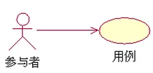
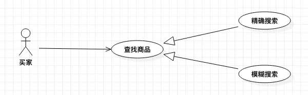
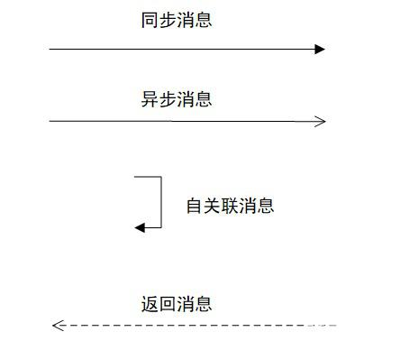
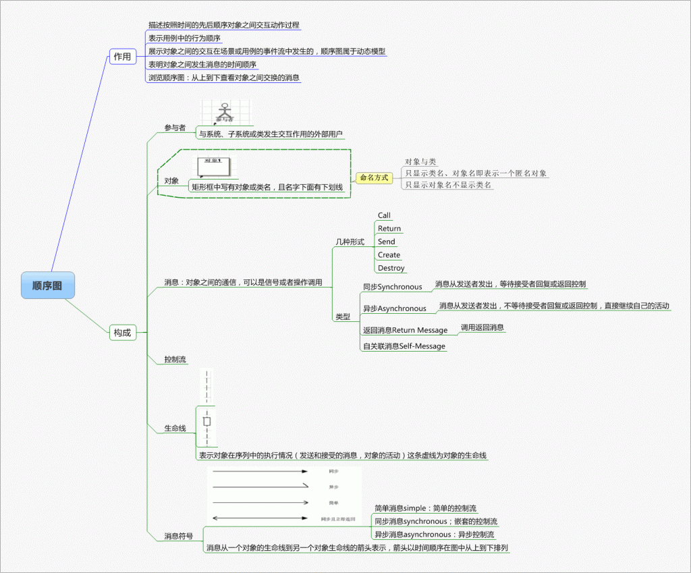

### 1.图形区别

#### 1.1 活动图与顺序图

1. 活动图描述的是对象活动的顺序关系所遵循的规则，它着重**表现的是系统的行为**，表现**数据业务流程**，而非系统的处理过程。

2. 顺序图**着重描述处理过程**，它的主要控制结构是顺序、分支和循环，各个处理过程之间有严格的顺序和时间关系。

活动图表现数据业务流程

顺序图偏重于交互的时间次序

协作图展示对象的交互关系
时序图主要侧重于对象间消息传递在时间上的先后关系, 
而协作图表达对象间的交互过程及对象间的关联关系，或者说为空间上的关系

使用阶段：

**在需求分析阶段使用：用例图和活动图。**

**在详细设计阶段使用：时序图**、协作图

### 2.用例图

#### 2.1 基本概念

用例是用户期望具备的功能，每一个用例说明一个系统提供给它的使用者的一种服务或功能。用例的目标是要定义系统的一个行为，但并不显示系统的内部结构。用例名一般为动宾短语，符号是椭圆加用例。

用例图是指由参与者（Actor）、用例（Use Case），边界以及它们之间的关系构成的用于描述系统功能的视图。 用例图（User Case）是外部用户（被称为参与者）所能观察到的系统功能的模型图。

用例图的应用场景：

1. 用来描述要开发的系统的功能需求和系统的使用场景。
2. 促进开发过程中各个阶段工作的进展。
3. 用来验证与确认系统需求。

用例建模是实现系统需求分析的一个很好的方法，通过它可以使得系统分析员和客户之间能够更好地沟通系统的需求。

#### 2.2 用例要素构成

##### 参与者 (Actor)

参与者也叫角色，它表示了系统的用户。这里需要注意的是：**这里的用户并不特指人，如果我们开发的是公共 API 项目，那么这个时候，API 的调用者就是我们的用户。**

参与者指的不是用户本身，而是它在系统中所扮演的角色。举个例子来说，张三是淘宝店的店主，这个时候他参与淘宝的交互时，他既可以是店主这个角色，也可以作为买家在淘宝上购买东西，这个时候张三在系统中扮演了两个角色，这两个角色是两个不同的参与者即`买家`和`卖家`。

参与者的作用是：

- 建立系统的外部用户模型
- 对系统边界之外的对象进行描述

#### 2.3 用例的关系

1. 参与者与用例间的关联关系：参与者与用例之间的通信，也成为关联或通信关系。

2. 用例与用例之间的关系：包含关系（include）、扩展关系（extend）、泛化关系。

3. #### 包含关系

   包含关系描述的是一个用例需要某种功能，而该功能被另外一个用例定义，那么在用例的执行过程中，就可以调用已经定义好的用例。表示符号：**<>**

   

   包含关系

   

   实例一

   

   实例二

   #### 8、扩展关系

   用一个用例（可选）扩展另一个用例（基本例）的功能，将一些常规的动作放在一个基本用例中，将**可选的或只在特定条件下才执行的动作**放在它的扩展用例中。表示符号：**<\**>\**>。\****

   

   实例

   #### 9、泛化关系

   子用例继承了父用例所有的结构、行为和关系，是父用例的一种特殊形式。

   

   

   

   

#### 2.4 如何确定用例

##### 用例图建模及应用

创建用例图模型主要包含3部分内容：

- 识别系统中的角色和用例
- 区分用例之间的先后次序
- 创建用例图模型结构

##### 识别系统中的角色和用例

这部分工作通常由系统分析员通过和客户沟通来完成。

要获取系统的用例，首先要找出系统的角色。

要获取系统角色可以在与客户沟通时，询问用户一些问题来识别角色。可以参考下列问题：

- 谁将使用系统的主要功能？
- 是需要系统的支持以完成日常工作？
- 谁负责维护、管理系统并保持系统正常运行？
- 系统需要与哪些外部系统交互？
- 系统需要处理哪些硬件设备？
- 谁对系统运行产生的结果比较感兴趣？

当我们获取到系统角色后，我们可以通过角色来列出它的用例。可以通过回答下列问题来识别用例：

- 每个角色执行的操作有什么？
- 什么角色将要创建、存储、改变、删除或者读取系统中的信息？
- 什么用例会创建、存储、改变、删除或读取这个信息？
- 角色需要通知外部系统的突然变化嘛？
- 系统需要通知角色正在发生的事情吗？
- 什么用例将支持和维护系统？

### 3.活动图

### 4.顺序图

类图模型描述了系统的类及类之间的关系。类图模型也称为系统的静态结构，因此从类图模型中我们还看不到业务的处理过程以及类与类交互的信息，在UML建模语言中，这些信息是通过顺序图来描述的。

**顺序图用于描述在业务处理过程中类之间的交互顺序，这些交互顺序是在场景或用例的信息流中发生的。由于描述的是动态行为，顺序图中类被称为对象，也就是实例化后的类。**

**在顺序图中共有四个基本符号：**

（1）参与者符号，由一个方框加一个小人图形表示，小人图形在方框之上，方框内写入参与者的名称；

参与者是一个外部、物理的人，它扮演用户的角色，代表物理的人。对象是系统中被实例化的类，例如人脉系统的用户类在系统运行过程中，会创建多个对象，每个对象就是类的一个实例，一个实例对应一个外部参与者。

（2）对象符号，由一个方框表示，方框内写入对象的名称；

（3）生命线符号，由虚线或狭窄的竖直方框表示；

**竖直的虚线称为生命线**，每一个参与者和对象都有生命线，它用于描述场景内的参与者和对象的生命周期，时间是从上到下，生命线显示了消息的顺序，消息沿生命线从上到下依次发生。

（4）消息符号，有带消息描述的方向箭头表示。下图是一个典型的顺序图，表明了顺序图要使用的通用格式和符号。

​															图 1 顺序图的符号

**对象生命线上的长条矩形框表示对象处于激活状态**，当一条消息传递给对象的时候，对象响应该消息并触发对象的某个行为，这时该对象就处于激活状态。当对象没有被激活时，对象处于休眠状态，等待接收消息被激活。

在顺序图中，对象之间的交互是通过发送和接收消息来实现的。一个对象向另一个对象发送消息并希望得到回应时，会有两种情况，**一种情况是暂停活动并等待消息的回应，直至收到消息回应后再开启活动，这是同步消息；另外一种情况是不管是否收到消息的回应，活动照样执行，即不需要暂停活动来等待消息的回应，这是异步消息**。

在顺序图中，还有一种消息就是自关联消息，自关联消息就是对象向自己发送消息。例如，对象在活动中调用内部的方法或函数。

下图是各种消息的表示方法。

图 2 顺序图中消息的表示方法

在绘制顺序图模型时，可能需要绘制一些流程控制，例如循环和条件流程控制，消息机制无法绘制这些流程控制。顺序图另外提供了“片段”机制用于描述比较复杂的动作序列，支持的片段有循环片段、可选片段、备用片段和其他片段。

图 3 用户登录顺序图

上图是用户登录顺序图。用户在登录系统的过程中，可能会输错账号或密码，系统允许用户重新输入账号或密码再次登录。因此用户的登录过程是一个循环流程，在顺序图用循环片段来表示。

