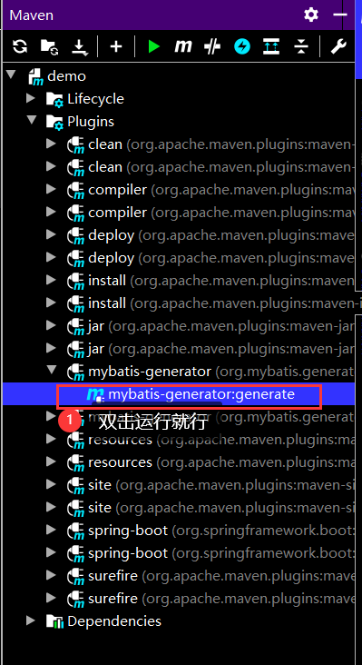
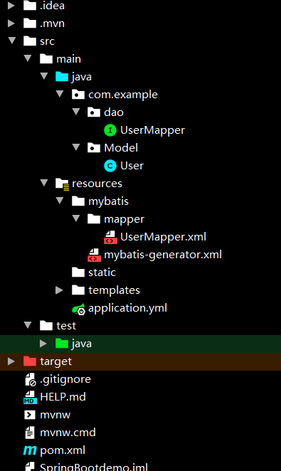

# MyBatis自动生成

## 1. 使用MyBatis Generator插件自动生成

### Mybatis-generator是什么？

书归正传，Mybatis-generator是什么？在使用Mybatis的时候，dao接口，entity实体类，还有每个实体类对应的xml都得自己写吧，这其实也是工作量稍微大一点的事情，而我们的插件Mybatis-generator就是自动生成这些代码的

### 1. 创建一个Maven项目

### 2. pom.xml文件需要添加4个引用，如下

``` xml
<dependencies>
    
        <dependency>
            <groupId>org.mybatis.spring.boot</groupId>
            <artifactId>mybatis-spring-boot-starter</artifactId>
            <version>2.0.1</version>
        </dependency>
    
        <dependency>
            <groupId>mysql</groupId>
            <artifactId>mysql-connector-java</artifactId>
            <version>8.0.15</version>
        </dependency>

        <dependency>
            <groupId>org.mybatis.generator</groupId>
            <artifactId>mybatis-generator-core</artifactId>
            <version>1.3.7</version>
        </dependency>
    </dependencies>


    <build>
        <plugins>

            <plugin>
                <!--Mybatis-generator插件,用于自动生成Mapper和POJO-->
                <groupId>org.mybatis.generator</groupId>
                <artifactId>mybatis-generator-maven-plugin</artifactId>
                <version>1.3.2</version>
                <configuration>
                    <!--配置文件的位置-->
                    <configurationFile>src/main/resources/mybatis/mybatis-generator.xml</configurationFile>
                    <verbose>true</verbose>
                    <overwrite>true</overwrite>
                </configuration>
                <executions>
                    <execution>
                        <id>Generate MyBatis Artifacts</id>
                        <goals>
                            <goal>generate</goal>
                        </goals>
                    </execution>
                </executions>
                <dependencies>
                    <dependency>
                        <groupId>org.mybatis.generator</groupId>
                        <artifactId>mybatis-generator-core</artifactId>
                        <version>1.3.2</version>
                    </dependency>
                </dependencies>
            </plugin>
        </plugins>
    </build>
</project>
```

**这里，我来解释以下这几个依赖**

1. mybatis-spring-boot-starter mybatis的SpringBoot版本，这个肯定需要吧
2. mysql-connector-java 用来连接数据库的依赖
3. mybatis-generator-core 插件，也得要吧
4. plugin 下面的plugin插件那里，复制我的就可以了，需要注意的是src/main/resources/mybatis/mybatis-generator.xml这个路径是我自己的，你自己改一下你的mybatis-generator.xml的路径，这个文件接下来会创建


### 3. 创建mybatis-generator.xml文件

这个xml位置要和前面写的路径一致，内容直接复制就行，需要改的地方下面说

```xml-dtd
<?xml version="1.0" encoding="UTF-8"?>
<!DOCTYPE generatorConfiguration
        PUBLIC "-//mybatis.org//DTD MyBatis Generator Configuration 1.0//EN"
        "http://mybatis.org/dtd/mybatis-generator-config_1_0.dtd">

<generatorConfiguration>
    <!--数据库驱动-->
    <classPathEntry    location="F:\maven-repository\mysql\mysql-connector-java\8.0.15\mysql-connector-java-8.0.15.jar"/>
    <context id="context"    targetRuntime="MyBatis3">
        <commentGenerator>
            <property name="suppressDate" value="true"/>
            <property name="suppressAllComments" value="true"/>
        </commentGenerator>
        <!--数据库链接地址账号密码-->
        <jdbcConnection driverClass="com.mysql.cj.jdbc.Driver" connectionURL="jdbc:mysql://localhost:3306/smbms?serverTimezone=UTC" userId="root" password="123456">
        </jdbcConnection>
        <javaTypeResolver>
            <property name="forceBigDecimals" value="false"/>
        </javaTypeResolver>
        <!--生成Model类存放位置-->
        <javaModelGenerator targetPackage="com.example.Model" targetProject="src/main/java">
            <property name="enableSubPackages" value="true"/>
            <property name="trimStrings" value="true"/>
        </javaModelGenerator>
        <!--生成映射文件存放位置-->
        <sqlMapGenerator targetPackage="mybatis.mapper" targetProject="src/main/resources">
            <property name="enableSubPackages" value="true"/>
        </sqlMapGenerator>
        <!--生成Dao类存放位置-->
        <javaClientGenerator type="XMLMAPPER" targetPackage="com.example.dao" targetProject="src/main/java">
            <property name="enableSubPackages" value="true"/>
        </javaClientGenerator>
        <!--生成对应表及类名-->
        <table tableName="smbms_user" domainObjectName="User" enableCountByExample="false" enableUpdateByExample="false" enableDeleteByExample="false" enableSelectByExample="false" selectByExampleQueryId="false"/>

    </context>
</generatorConfiguration>
```


1. location="F:\maven-repository\mysql\mysql-connector-java\8.0.15\mysql-connector-java-8.0.15.jar" 这个location，必须写绝对路径，我暂时不知道其他的写法。这里你就写你的Maven仓库的路径就可以了，找到mysql的jar，和maven里面引用的mysql的版本一致。
2. 这个需要改，你自己写吧，mysql8版本之后需要加com.mysql.cj.jdbc.Driver，加上cj。
3. model和mapper没啥改的，包名改成你的，路径就是src/main/resources或者java
4. 最后这个也简单，就是这个表生成的实体类叫什么名字。

### 4. 运行



**生成前：**


生成后：



## 2. 使用idea自带功能进行自动生成


1. 找到Database

   

2. 选择MySql


==在Schemas中可以选择显示哪几个数据库==


**连接成功后的样子**


==生成前==


==生成后==

