### 1.正则表达式简介

正则表达式，又称规则表达式（英语：Regular Expression，在代码中常简写为regex、regexp或RE），计算机科学的一个概念。

正则表达式(regular expression)描述了一种字符串匹配的模式（pattern），可以用来检查一个串是否含有某种子串、将匹配的子串替换或者从某个串中取出符合某个条件的子串等。


```
123
x1=10
x2 =12
y=x2-x1 
if(x1> x2)
  y=-y
```

正确结果：应该是123  ，10 ，12 


正则表达式在线工具:

http://c.runoob.com/front-end/854

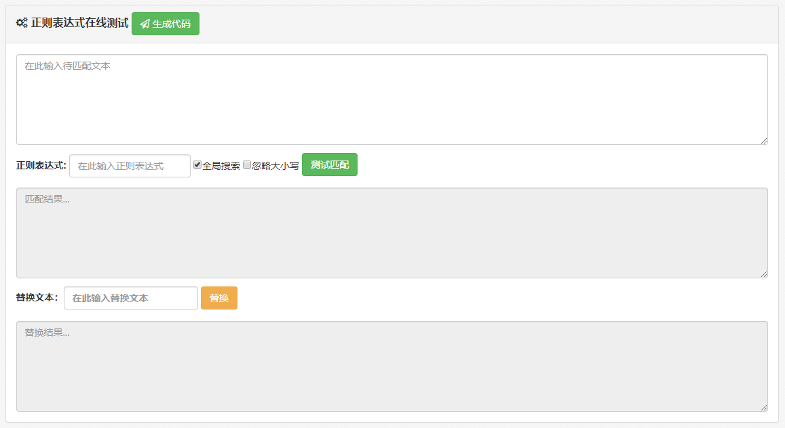

#### 1.1正则表达式组成


1. **普通字符指我们平常使用的字符，如字母、数字和汉字等。**

   

2. **元字符指可以匹配某些字符形式的具有特殊含义的字符，其作用类似于DOS命令使用的通配符。**

   - *
   - ?

   

3. **元字符包括基本书写符号、限定符、匹配字符集符，下面分别介绍这三种元字符。**

##### 1）基本书写符号

```
与算术表达式需要加减乘除以及小括号表示不同的含义相似，正则表达式的基本书写符号同样表示了特殊的含义。
正则表达式中的基本书写符号除了包括用于表示具有特殊含义的字符本身的转义符反斜杠外，还包含一些元字符或者对元字符进行分组的其他特殊的表示形式，以组成各种复杂的正则表达式。
```

```
 	 ^         匹配字符串的开头
     $         匹配字符串的末尾。
     .           匹配任意字符除了换行符，当re.DOTALL标记被指定时，则可以匹配换行符
     [...]       用来表示一组字符,单独列出：[amk] 匹配 'a'，'m'或'k'
     [^...]      不在[]中的字符：[^abc] 匹配除了a,b,c之外的字符。
     *           匹配0个或多个的表达式。
     +           匹配1个或多个的表达式。
     ?           匹配0个或1个由前面的正则表达式定义的片段，非贪婪方式
     \.?         表示有一个点或者没有也行(用于匹配浮点数字) # ? 在这里表示匹配0个或1个
     			 1.0  1   89.0  89.1    89 
     *?  +?  ??  最小匹配  
     {n}         精确匹配n个前面表达式。
     {n,}        最少匹配n个前面表达式。
     {n, m}      匹配 n 到 m 次由前面的正则表达式定义的片段，贪婪方式
     a|b         匹配a或b
     ()          匹配括号内的表达式，也表示一个组
     \w     匹配字母数字,汉字和下划线_'''
     \W     匹配非字母数字
     \s     匹配任意空白字符，等价于 [\t\n\r\f].
     \S     匹配任意非空字符
     \d     匹配任意数字，等价于 [0-9].
     \D     匹配任意非数字
     \A     匹配字符串开始
     \Z     匹配字符串结束，如果是存在换行，只匹配到换行前的结束字符串。
     \z     匹配字符串结束
     \G     匹配最后匹配完成的位置。
     \b     匹配一个单词边界
           this is a word 
     \B     匹配非单词边界。

```

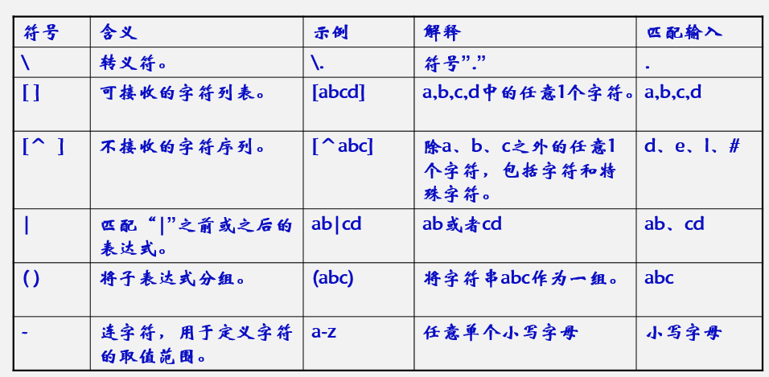

b   

| 符号 | 含义   | 示例 | 解释    | 匹配输入 |
| ---- | ------ | ---- | ------- | -------- |
| \    | 转义符 | \\.  | 符号“.” | .        |
| []   |        |      |         |          |
| [^]  |        |      |         |          |
|      |        |      |         |          |
|      |        |      |         |          |
|      |        |      |         |          |


##### 2） 正则表达式中的限定符

正则表达式中的限定符用于限制某个字母满足正则表达式要求的特征，如起始字符、结束字符、字符重复次数等。

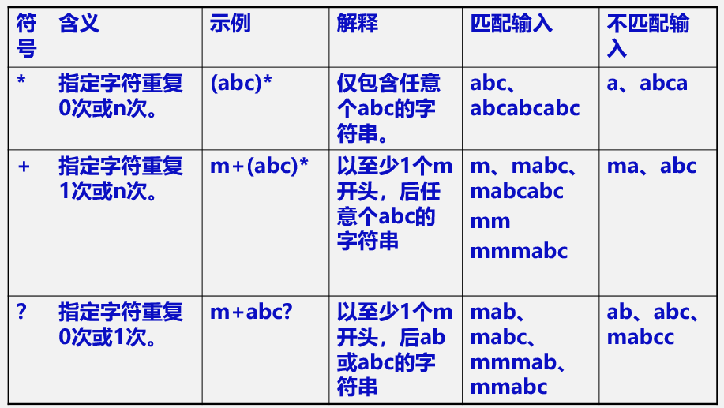

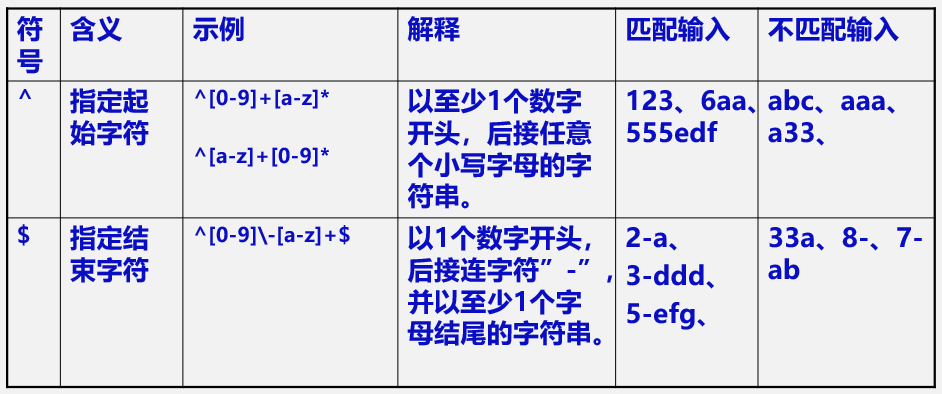

```

有^时匹配必须从字符串开头开始，如 正则 "^abc" 可以匹配"abcd" 但不能匹配"dabc"
有$时最后一个字符必须在字符串结尾
同时有^和$表示必须匹配整个字符串如正则"^abc$"匹配字符串"abc"，但不能匹配"abcd"
```


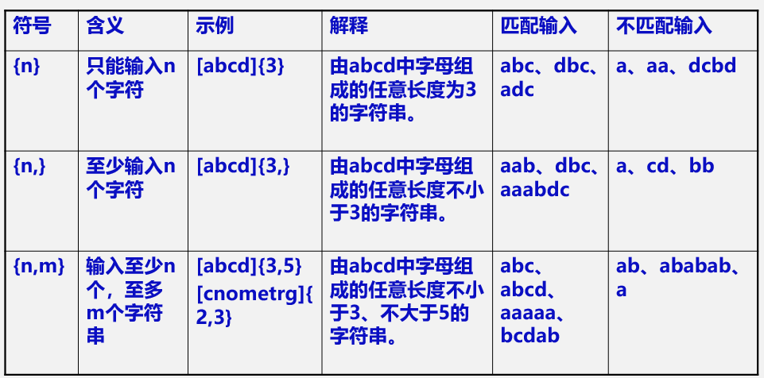


##### 3）正则表达式中的匹配字符集

匹配字符集是预定义的用于正则表达式中的符号集。
匹配字符集用于检查字符串中的单个指定字符的合法性。
使用匹配字符集有效地简化了表达式的书写。如，单个数字、大小写字母、下划线的正则表达式，

```
不使用匹配字符集，为“[0-9A-Za-z_]”。
使用匹配字符集，为” \w”。
```

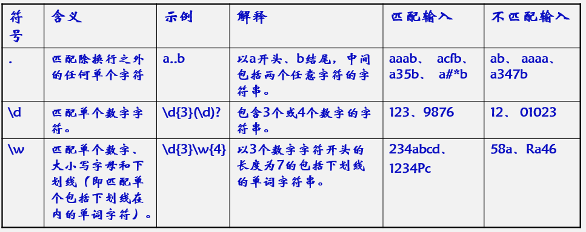

##### 4）匹配字符集例子

如果将其用于验证输入内容是否合法，还需要增加一些限定符。
“电子邮箱地址”的验证使用常规方式是非常繁琐的，而使用匹配字符集方式，就十分简洁，具体如下：

```

\w+@\w+(\.\w+)+$
字符  @ 字符 . 字符 字符结束
  liuxinfeng18@163.com

liuxinfeng@sdjzu.edu.cn
[0-9A-Za-z_]+@ [0-9A-Za-z_]+[\. [0-9A-Za-z_]+]+$

```


### 2.正则表达式匹配实例


```
fo+$ 
可以与目标对象中的 “fool”, “fo”, 或者 “football”等在字母f后面连续出现一个或多个字母o的字符串相匹配

eg*
与目标对象中的 “easy”, “ego”, 或者 “egg”等在字母e后面连续出现零个或多个字母g的字符串相匹配 

Wil?
与目标对象中的”Win”,“Wilson”等在字母i后面连续出现零个或一个字母l的字符串相匹配 

Jim\{2,6\}  Go{2,}gle
规定字符m可以在匹配对象中连续出现2-6次，可以同jimmy或jimmmmmy等字符串相匹配
Google goooogle gooooooooooooooogle

^hell 
以 “hell”, “hello”或 “hellhound”开头的字符串 

    #  liuxinfeng@163.com
    
ar$
以 “car”, “bar”或 “ar” 结尾的字符串 

[A-Z]
A到Z范围内任何一个大写字母相匹配 

[a-z]
从a到z范围内任何一个小写字母相匹配 

[0-9]
从0到9范围内任何一个数字 

([a-z][A-Z][0-9])+
任何由字母和数字组成的字符串

to|too|2 
与目标对象中的 “to”, “too”, 或 “2” 相匹配 

[^A-C]
与目标对象中除A，B，和C之外的任何字符相匹配 

```


### 3.正则表达式应用


#### 3.1 正则表达式在find中的应用

```

find /dev/ –name tty[0-9]

l在/dev下查找以tty开头，后面跟一个数字的文件
```


#### 3.2从文字中抓取数字


```
123
x1=10
x2 =12
y=x2-x1 
if(x1> x2)
  y=-y
```

正确结果：应该是123  ，10 ，12 

##### 3.3.1 \d{1,}，找到的数字不合适，

对10得出两个结果 1 ，10， X2 的数字2也被不正确的检索出来。


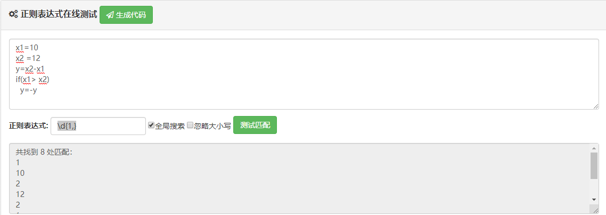


##### 3.3.2 ^\d{1,}  只能匹配行头

**不正确，原因匹配字符串的开头**

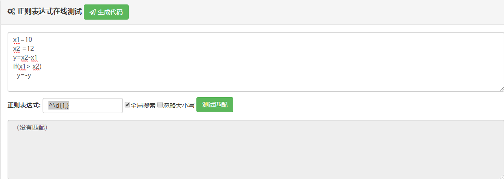

如果头部添加123，则检测结果：

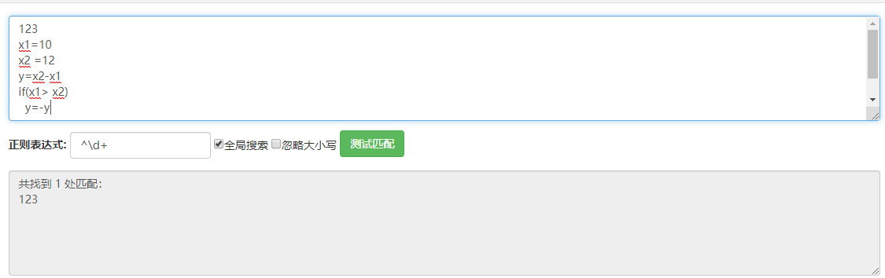

```
123
x1=10
x2 =12
y=x2-x1 
if(x1> x2)
  y=-y
456

```

只能检测到结果，推测使用js，把字符串认为是一行代码，只是检测行头。在2008中进行检测，则可以检测到。

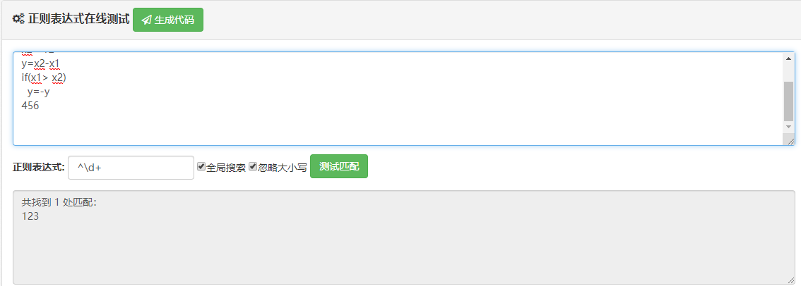

##### 3.3.3 正确的匹配 \b\d{1,}

```
\b\d{1,}
```

​	匹配结果

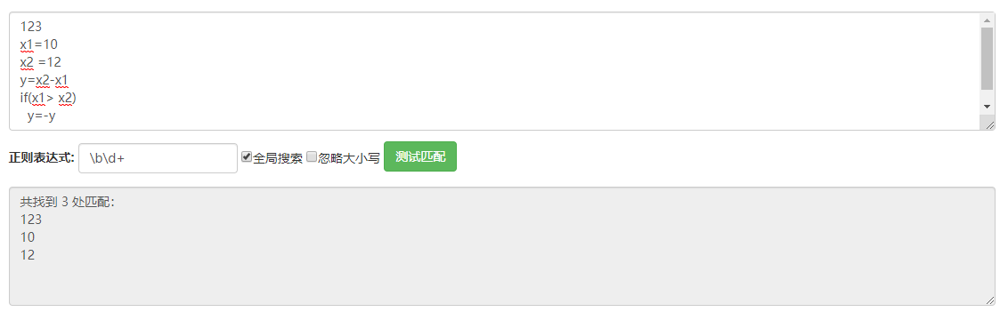


3.3.4  使用在线测试不能正确测试行尾

```
789a
x1=10
x2 =12
y=x2-x1 
if(x1> x2)
  y=-y
456
```

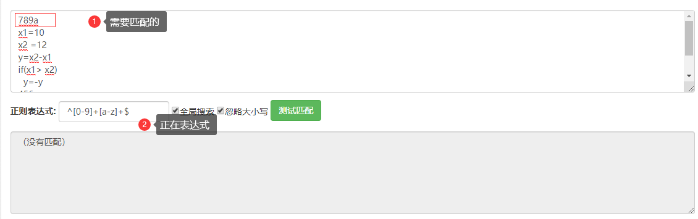

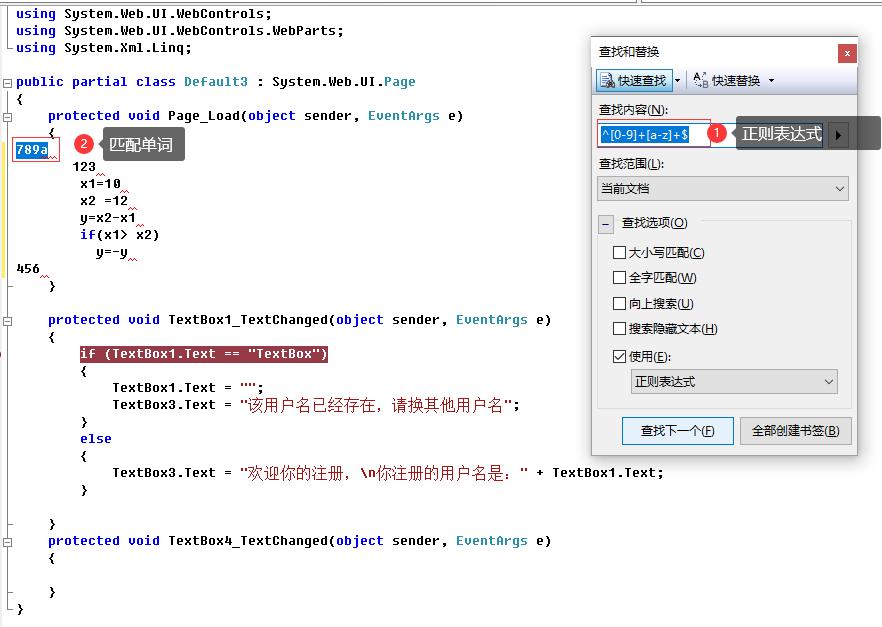

#### 3.3正则表达式应用-匹配空格\s

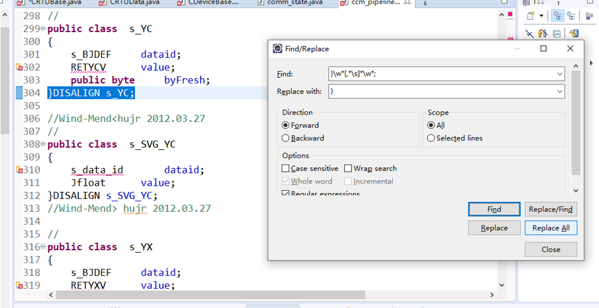


#### 3.4正则表达式应用-  }(\w*[,*\s]*\w*)*;


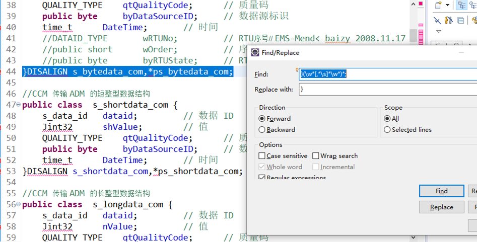


#### 3.4 VS.NET 2008 正则表达式的应用


1. 发现在VS2008 不支持 \d  数字，只能用[0-9]进行表示

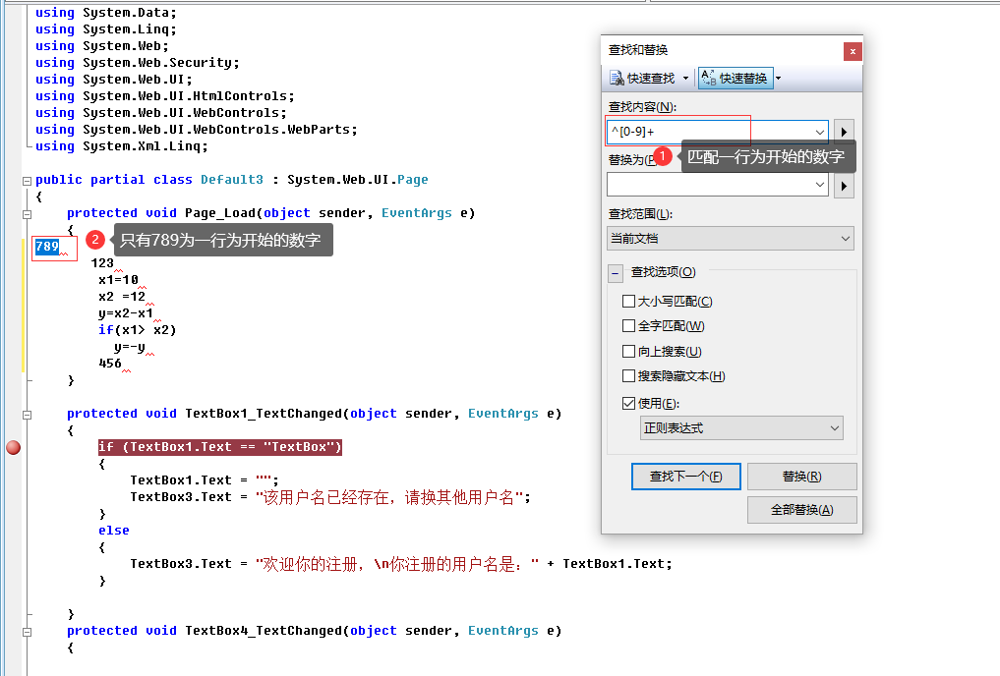


2. 匹配单词的开头不能用\b ，只能用<表示开始，用>表示结束。


```


```

