## 1.HTML基础

#### 1.1 概述

##### 1 HTML标记

HTML文档中，分为单标记和双标记。双标记都是按“<标记>和</标记>” 的格式配对使用的，单标记以“<标记/>”的格式使用。标记中可以包含属性，一般格式为：<标记   属性1=“值1”   属性2=“值2” …>
例如：

```
<font size="1" color="#dd0000" face="宋体" >HTML学习</font>

```

 注意：属性之间必须使用空格隔开，属性名和属性值之间用等号隔开，等号左边是属性名称，右边是属性值。

##### 2 XHTML的基本结构

（1）文档类型定义(DOCTYPE)
（2）文件头部(head)
（3）文件主体(body)

##### 3 HTML与XHTML标记的区别

1. XHTML更严格：
   - 所有元素必须要求正确嵌套

     ```
     以下是正确的嵌套：
     <p>布啦布啦
     <b>独树一帜</b>。
     </p>
     以下是错误的嵌套：
     <p>布啦布啦
     <b>独树一帜</p>
     </b>。
     ```

     

   - 标记名字一定要用小写字母

     ```
     
     以下是正确的：
     
     ```

     

   - 给所有属性值加引号

     ```
     HTML 并不强制要求属性值加双引号。
     比如在HTML你可以写: 
     <table width=100 height=200>…</table>
     但在 XHTML 里，应该写成：
     <table width=“100” height=“200”>…</table>
     ```

     

   - 所有的XHTML元素一定要关闭

     ```
     <p>This is a paragraph      错误。
     <p>This is a paragraph</p>  正确
     ```

     

   - 单标签要结束用 />来结束

     ```
     This  is a break  <br>错误。
     This is a break  <br/>  正确。
     
     ```


#### 1.2文件头部

文件头部主要放置IE浏览器标题栏的名称，或是其他需要给浏览器的信息。文件头部包含在head标记中。<head>头部标记</head> 其头部标记包含有四个标签，分别是：

```
<title></title>，只能有一个。
<base>，只能有一个。
<link>，可以有多个。
<meta>可以有多个，它有两种表示形式：
1、<meta name="" content="">
2、<meta http-equiv=""content=""> 
```


##### 1 base

```
<base> 标签为页面上的所有链接规定默认URL相对地址。
通常情况下，浏览器会从当前文档的 URL 中获取URL相对地址。
使用 <base> 标签可以手动改变URL相对地址，这其中包括 <a>、、<link>等标签中的 URL相对地址。
<base>标签有两个重要的属性：href属性和target属性。
href属性：规定页面中所有相对链接的基准 URL（即默认URL相对地址）。
target属性：规定网页的打开方式，取值分为：
_self，自我覆盖、默认。
_blank，创建新窗口打开新页面。
_top，在浏览器的整个窗口打开，将会忽略所有的框架结构。
_parent， 指向父框架文档。
```


```
<html>
<head>
<base href="http://www.w3school.com.cn/i/" />
<base target="_blank" />
</head>
<body>

<h1>
<a href="http://www.w3school.com.cn">W3school</a>
<h1>
</body>
</html>

```

##### 2 link标签

```
用于定义当前文档与其他文档的关系，其主要用途是链接样式表。
<link>标签的常用属性如下：
href:定义被链接文档的位置。
rel:定义当前文档与被链接文档之间的关系。
type:规定被链接文档的 MIME 类型。
如：
<link  href="style.css"  rel="stylesheet"  type="text/css"  />
以上语句确定本网页的CSS样式表为当前路径下的外部文件style.css。
```

##### 3 meta标签

meta标签用来描述一个HTML网页文档的属性，例如作者、日期和时间、网页描述、关键词、页面刷新等。

```
有两种用法：
（1）<meta name="" content="">
（2）<meta http-equiv="" content=""> 
其中，
name属性用于在网页中加入一些关于网页的描述信息，网页的关键字，主要内容、作者和版权等。
http-equiv属性相当于http的文件头作用，它可以向浏览器传回一些有用的信息，以帮助正确和精确地显示网页内容，与之对应的属性值为content，content中的内容其实就是各个参数的变量值。

name属性主要有以下几种可选值，
keywords：网页的关键字，例如 ：
 <meta name=“keywords”  content=“关键词1，关键词2，……”> 
description：网页的主要内容。例如：
 <meta name=“description” content=“你网页的简述”> 
Robots: 相当于一个搜索引擎导航开关，用来告诉搜索引擎页面是否可以被检索。它的属性可选值以及相关意义分别是：
all：文件将被检索，且页面链接可被查询，该值也是默认值。
none：文件将不被检索，且页面链接不可被查询。
index/noindex：文件将被检索/文件将不被检索。
follow/ nofollow ：页面链接可被查询/页面链接不可被查询。
author:标注网页的作者。例如：
<meta name="author" content="作者名">  。
copyright:标注版权。 例如：
<meta name="copyright" content="版权声明">


```

http-equiv属性主要有以下几种可选值：

```
1. content-type：指定网页的类型和字符集。 例如：
<meta http-equiv="content-type" content="text/html" charset="gb2312">  
2. refresh，指定自动刷新或跳转的开始时间与跳转的网址。例如：
<meta http-epuiv="refresh" content="3"> 网页3秒自动刷新一次。
<meta http-epuiv=" refresh" content=" 3";url=http//www.baidu.com>
网页3秒后自动跳转到百度网站。
3.Expires指定网页在缓存中的过期时间。例如：
<meta http-epuiv= " explres "  content= " Wed,26 Feb 1997 08:21:57 GMT " >。
page-enter和page-exit它是用于指定进入和退出的缓存效果，共有0-23种显示效果，例如（盒状收缩）：
<meta http-equiv="page-enter" content=" revealTrans(duration=1,transition=0)"/>
```


Page-Enter与Page-Exit例子：

```
<html>
<head>
<title>Page-Enter和Page-Exit使用</title>
<meta http-equiv="page-enter" content="revealTrans(Duration=1,Transition=23)">     
<meta http-equiv="page-exit" content="revealTrans(Duration=3,Transition=11)"> 
</head>
<a href="font_color.htm">字体颜色</a><br/>
<a href="font_face.htm">字体字型</a><br/>
<a href="font_size.htm">字体大小</a><br/>
</body>
</html>

```

#### 1.3文件主体

文件主体是将被浏览器显示在窗口中的内容。包括文件内的文字、图片、影像、动画、颜色、音效等。
文件主体包含在<body></body>标签对内部。例子：

```
<html>
<head>
    <title>我的第一个主页</title>
</head>
<body>
  <h3>欢迎光临我的主页</h3>
  <p>这是我第一次做主页，无论怎么样，我都会努力做好！</p>
</body>
</html>

```


#### 1.4 HTML标记

##### 1 HTML标记一览


##### 2. h1至h6标记


##### 3. p标签和br标记


##### 4. 文字样式标记


##### 5. 文字修饰标记


##### 6. 列表制作标记


##### 7. 超链接标记


##### 8. img标记


##### 9. 表格标记

## 2.CSS样式

CSS，Cascading style sheet，层叠样式表，是为了弥补HTML在布局和样式方面的不足而产生的。
在XHTML网页中，通常用CSS对页面整体布局和样式控制

### 2.1 CSS布局应运而生

表格最初的目的是：显示表格状的数据。后来，表格被用于网页布局时，设置其 border=“0” ，使得网页设计师可以将图片和文本放在这无形的网格中。表格布局的主要弊端如下：

```
1. 把样式和内容混合在一起，使得文件的大小无谓变大，减慢速度，浪费用户的流量费用。
2. 重新设计现有的站点和内容代价昂贵。
3. 极难保持整个站点的视觉的一致性，花费也极高。
```

为了避免表格网页布局与生俱来的弊端，CSS布局应运而生。Cascading style sheet，层叠样式表。利用CSS布局，网页设计者可使页面的**实际内容与呈现格式**的逻辑分离。 CSS布局的主要优势如下：

```
1.一次编写，重复使用。
2.把样式和内容分离，内容简单规范，方便代码维护。只要修改网站的CSS样式表，就可以改变整个站点的整体表现形式，大大减少了重复劳动。
3.缩小文件体积，CSS文件无需重复下载，增快网络访问速度。
4.在不改变HTML的情况下，可快速修改和切换网站的整体设计和风格。
5.帮助网站保持视觉的一致性。
```

如何查看样式：（按F12,查看Elements）

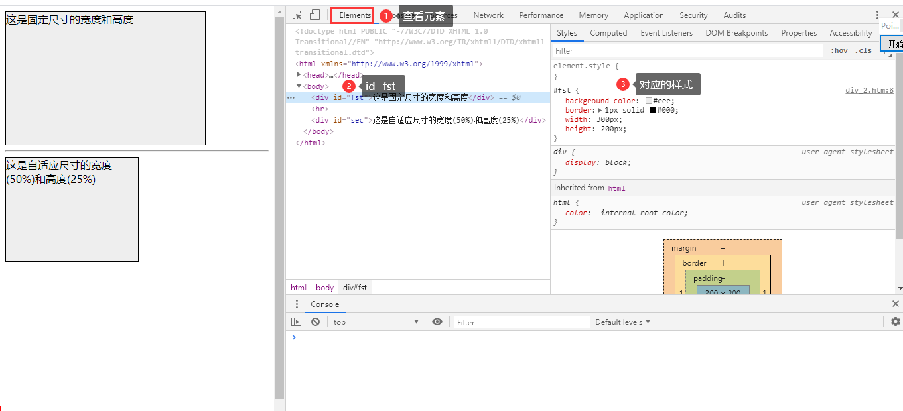

### 2.2 div标记和span标记

#### 1） div

div标记是一个块状元素，其实就是一个大容器，可以包含任何标记，如段落、标题、文本、表格等，也可以嵌套使用。div的一般使用方法如下：

```
<div  id=“id名称”>
     <h2>div标记</h2>
     <p>div标记是一个块状元素。</p>
     
</div>
```

div可以多层进行嵌套使用。嵌套的目的是为了实现更多复杂的页面排版。例如，当设计一个网页时，首先需要有整体布局，需要产生头部、中部和底部，代码如下：

```
<div id="all">
  <div id="top">顶部</div>
  <div id="mid">
      <div id="list">列表</div>
	<div id="content"> 内容</div>	  
  </div>
  <div id="bt">底部</div>
</div>
```

#### 2） span

span标记是内联元素，只能容纳文本和其它内联元素，可与其它内联元素位于同一行，宽度和高度不起作用。一行内可以被span划分成好几个区域，从而实现某种特定效果。

#### 3）div 与span区别

1. div是一个块级元素(大容器)，可以包含段落、标题、表格等其他元素，有固定的宽度和高度。

2. span是一个内联元素(小容器)，一行内的内容可以被span划分成好几个区域，span 没有固定的格式表现。当对它应用样式时，它才会产生视觉上的变化。

   ```
   <div id=“content”>
      <p>This is <span class=“body”>crazy</span></p>
   </div>
   
   ```

   

### 2.2 CSS提供的样式

```
字体样式
文字样式
背景样式
区域样式
分类样式
```


#### 2.2.1字体样式

字体样式用于设置HTML元素的字体、大小、粗细、常规/斜体等样式。如：

```
font-family：字体。
font-size：大小。
font-weight：粗细。
font-style：常规/斜体。
line-height: 行高，用于设定行间距,单位为px(像素)或em(相对于文本的字体尺寸的倍数)。
font：font-family、font-size、font-weight、font-style等样式的综合表示法。

```

#### 2.2.2文字样式

文字样式用于设置字符间距、文字间距、文字的对齐方式、文字效果等。如：

```
letter-spacing:字符间距
word-spacing:文字间距
text-decoration:指定下划线、顶线、删除线等文字效果。
```


#### 2.2.3背景样式

背景样式用于设置背景颜色、背景图片、背景图片是否重复排列等。如：

```
backgroud-color：背景颜色
backgroud-image：背景图片
backgroud-repeat：背景图片是否重复排列
backgroud:背景颜色、背景图片、是否重复等背景样式的综合表示法
```


#### 2.2.4区域样式

用于设置区域的高度、宽度、内外边距大小、边框样式等。如：

```
margin:用于指定区域的外边距大小。
height:用于指定区域的高度。
width:用于指定区域的宽度。
border:指定区域四周的边框粗细、样式及颜色。
padding：指定区域文字与区域边界的间距（即内边距）的大小。
```

#### 2.2.5分类样式

用于指定HTML元素的显示方式、列表项图片的相关属性等。如：

```
display：用于指定HTML元素的显示方式。
list-style-image：用于指定列表项图片的文件路径及名称。
list-style-type：用于指定列表项符号或编号
```


### 2.3 CSS布局与表格布局

在传统网页中，常用表格对页面整体进行布局。 

示例：table.html

```
<html>
<head>
<title>简单表格布局</title>
</head>
<body>
<table width="400" border="0" align="center" cellpadding="0" cellspacing="0">
  <tr>
    <td height="20" valign="top" bgcolor="#cccccc">
            <font color="#0000ff"><b>顶部</b></font>
    </td>
  </tr>
  <tr>
    <td>
       <table width="100%" border="0" cellpadding="0" cellspacing="0">
      <tr>
        <td width="25%" height="120" valign="top" bgcolor="#eeeeee">
             <font color="#ff0000">列表</font>
        </td>
        <td width="75%" height="120" valign="top" bgcolor="#f7f7f7">
        <font color="#ff0000">内容</font>
         </td>
      </tr>
    </table></td>
  </tr>
  <tr>
     <td height="20" valign="top" bgcolor="#cccccc">
         <font color="#0000ff"><b>底部</b></font>
     </td>
  </tr>
</table>
</body>
</html>
```


css.html

```
<!DOCTYPE html PUBLIC "-//W3C//DTD XHTML 1.0 Transitional//EN" "http://www.w3.org/TR/xhtml1/DTD/xhtml1-transitional.dtd">
<html xmlns="http://www.w3.org/1999/xhtml">
<head>
<meta http-equiv="Content-Type" content="text/html; charset=gb2312" />
<title>XHTML+CSS简单布局</title>
<style type="text/css">
  #all{width:400px;	   margin:0px auto;	   color:#f00;	   }
  #top,#bt{height:20px;width:100%;background-color:#ccc;color:#00f;font-weight:bold;}
  #mid{width:100%;       height:120px;    }
  #list{width:25%;height:100%; float:left;background-color:#eee;}
  #content{width:75%;height:100%;float:left;background-color:#f7f7f7;}
  #bt{ float:left;}
</style>
</head>
<body>
<div id="all">
  <div id="top">顶部</div>
  <div id="mid">
      <div id="list">列表</div>
      <div id="content"> 内容</div>	  
  </div>
  <div id="bt">底部</div>
</div>
</body>
</html>
```

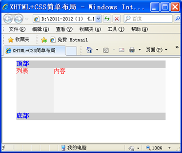

### 2.4 CSS声明方法

声明CSS通常有3种方法，并且这3种方法可以混合使用。
(1)行间样式表
(2)内部样式表
(3)外部样式表

优先级比较：

XHTML元素被多种CSS声明样式时，采取就近原则。
内部样式表的优先性高于外部样式表。
行间样式表的优先性又高于内部样式表。

#### 2.4.1行间样式表

行间样式表指CSS编写在XHTML标签的style属性中。一般格式为：

```

<标记 style=“属性1:值1;属性2:值2…”>信息内容</标记>
例如：
<p style=“font-size:20;color:black”>信息内容</p>
这种方式比较灵活，但样式和内容没有分离，一般不推荐使用。
示例：行间样式表.htm

```


#### 2.4.2内部样式表

 这种方式把CSS代码集中编写在头部信息的<style></style>标签内，很好地做到了样式与内容的分离，使用最为广泛。

```

一般格式为：
<style>
     选择符1{属性1:值1;属性2:值2…}
     选择符2{属性1:值1;属性2:值2…}
     ……
</style>
例如：
<style>
          p{   font-family:隶书;font-size:30 ;color:blue }  
          .note1 {color:green}
          .note2 {color:blue} 
</style>

```

示例：内部样式表.htm

```
<html>
    <head>
        <title>内部样式表</title>
        <style>             
            p{   font-family:隶书}  
            p.title{font-size:30 ;color:blue }
            p.content{font-size:20;color:olive }
            p.author{font-size:20;color:black }
            .note1 {color:green}
            .note2 {color:red}             
        </style>    
    </head>
    <body>
        <p  class="title">蝶恋花</p>
        <p  class="content">&nbsp;&nbsp; &nbsp;&nbsp;庭院深深深几许？杨柳堆烟，帘幕无重数。玉勒雕鞍游冶处，楼高不见章台路。 雨横风狂三月暮，门掩黄昏，无计留春住。泪眼问花花不语，乱红飞过秋千去。
        </p>
        <p  class="author">宋&nbsp;&nbsp;欧阳修</p>
        <div class="note1">注释1: 章台路意指歌妓聚居之所。<br></div>
        注释2:<span class="note2">[冶游生春露]，</span>冶游即春游。
    </body> 
</html>
```


#### 2.4.3外部样式表

外部样式表是把CSS样式编码单独编写在一个独立的css文件中，由网页进行调用。只要修改网站的外部样式表，就可以改变整个站点的整体表现形式，大大减少了重复劳动。**这种方式是CSS应用中最好的一种形式，尤其在大型网站比较多见**。

```
外部样式表中的css样式的一般格式为：
选择符1{
               属性1:值1;
               属性2:值2
               …
               }
选择符2{
                属性1:值1;
                属性2:值2
                …
                }
…

```

在网页中调用外部样式表有两种格式：

```
(1) @import url(外部样式表名.css);
(2)<link   rel=“stylesheet”  href=“外部样式表名.css”   type=“text/css” />
如，假设样式表为“style.css”,有以下两种设置格式：
(1) @import url(style.css);
(2)<link   rel=“stylesheet”  href=“style.css”   type=“text/css” />
示例：style.css、外部样式表1.htm
```

例子stytle.css

```
p{ font-family:隶书}  
p.title{font-size:30 ;color:blue }
p.content{font-size:20 ;color:olive }
p.author{font-size:20 ;color:black }
.note1 {color:green}
.note2 {color:red} 


```

外部样式表2.html

```
<html>
    <head>
        <title>外部样式表2</title>
        <link rel="stylesheet" href="style.css" type="text/css">
    </head>
    <body>
        <p  class="title">蝶恋花</p>
        <p  class="content">&nbsp;&nbsp; &nbsp;&nbsp;庭院深深深几许？杨柳堆烟，帘幕无重数。玉勒雕鞍游冶处，楼高不见章台路。 雨横风狂三月暮，门掩黄昏，无计留春住。泪眼问花花不语，乱红飞过秋千去。</p>
        <p  class="author">宋&nbsp;&nbsp;欧阳修</p>
        <div class="note1">注释1: 章台路意指歌妓聚居之所。<br></div>
        注释2:<span class="note2">[冶游生春露]，</span>冶游即春游。
    </body> 
</html>
```


### 2.5 CSS基本语法

2.5.1 三个核心

```
选择符。选择符指CSS这段代码所控制的对象，比如id、class、标签等。

属性。属性则是CSS所控制对象的各项样式属性，类型非常多，例如文本颜色、对齐、宽度、高度等。

值。值即为属性所对应的量化或描述设置。例如font-size属性值为12px、14px、16px等。
CSS代码实质上就是选择符、属性和值的代码段组合而成。


```

CSS代码编写的格式为：

```
选择符{ 属性1：值1；
              属性2：值2；
               ……
               属性n：值n;
}
```

2. 

#### 2.5.1 CSS选择符

##### CSS选择符有5种

```
标签选择符
id选择符
class选择符
伪类选择符
通配选择符
```

##### 1. 标签选择符

```
标签选择符，对XHTML中已有的标签作选择符进行样式定义，例如：
p{color:blue;}
h1{color:red;}
示例：id_class.htm

```

##### 2. id选择符

```
标签设置了id属性(唯一标识)后，就可以通过id名称给该标签设置独一无二的样式。
id名称可自定义，但不能以数字开头，CSS代码中引用id名称，前面须加上”#”符号。
例如，id名称为hello的div标签，在CSS代码中引用的形式如下：
#hello{color:#ff0000;}
示例：id_class.htm

```

##### 3. class 选择符

```
多个标签可使用同一个class属性名称，使多个标签拥有统一的样式。
class名称可自定义，但不能以数字开头，CSS代码中引用class名称前面须加上点号“.”。
例如，class名称为reader的CSS代码：
.reader{color:#ff0000;}
示例：id_class.htm

```

例子：

```
<html>
  <head>   <title>css样式演示</title>
   <style>    
     h1{color:red;}
     p{color:blue;}
     #hello{background-color:#ccffff; 
                  width:400px;height:80px;line-height:2em}
     .reader{font-weight:bold; color:#ff00ff; }
   </style>
</head>
<body>
<h1>这是1号标题的新样式</h1>
<p>这是段落的新样式</p>
<div id="hello">
    <span class="reader">这是class为reader的字体样式</span>
    <br/>这是id为hello的div的样式
</div>
</body>
</html>

```

效果图：

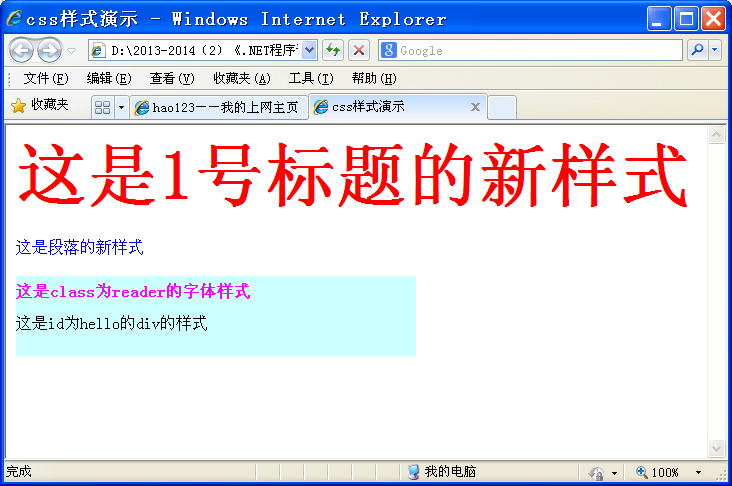

##### 4.伪类选择符

```
伪类及伪对象选择符是一组CSS预定义好的类和对象，不需要进行id和class属性的声明。以超级链接为例：
a:visited{color:#ff0000;}
以上代码代表页面中的超级链接被访问过后，其样式设置为红色文本。

```

| **伪类选择符** | **用途**                   |
| -------------- | -------------------------- |
| **a:link**     | **未访问的超级链接**       |
| **a:hover**    | **鼠标悬浮在上的超级链接** |
| **a:active**   | **选定激活的超级链接**     |
| **a:visited**  | **已访问的超级链接**       |


```
<html>
<head>
<title>CSS超链接伪类</title>
<style>
a:link {color: #FF0000;text-decoration: none}     /* 未被访问的链接为红色 */
a:visited {color: #00FF00;text-decoration: none}  /* 已被访问过的链接为绿色 */
a:hover {color: #FFCC00;text-decoration: underline} /* 鼠标悬浮在上的链接为橙色 */
a:active {color: #0000FF;text-decoration: underline} /* 鼠标点中激活的链接为蓝色 */
</style>
</head>
<body>
<p><a href = "first.htm">我的第一个网页</a></p>
<p><a href = "font_color.htm">字体颜色</a></p>
<p><a href = "font_face.htm">字体字型的设置</a></p>
</body>
</html>

```

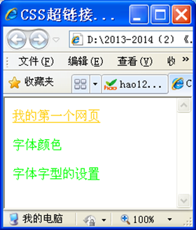

##### 5.通配选择符

```
在DOS操作系统中有一个*通配符，如*.*代表任何文件、*.mp3代表所有的mp3文件。
CSS中也有*通配选择符，代表所有对象，例如：
*{margin:0px;}
以上CSS代码代表所有对象的外边距为0像素。

```

##### 6.组合选择符

```
选择符还可以互相进行组合，形成新的选择符类型，常用的有4种组合方式：
群组选择符
包含选择符
标签指定式选择符
自由组合选择符

```

###### 6.1群组选择符

```
即当需要对多个选择符进行相同的样式设置时，可以把多个选择符写在一起，并用逗号分隔，例如：
p,span,div,li{color:#ff0000;}

```

###### 6.2包含选择符

```
即通过标签的嵌套包含关系组合选择符，包含关系的2个选择符用空格分隔，例如：
p span{color:#ff0000;}
以上代码只有p标签内的span标签所含文本被设置为红色。

```

###### 6.3标签指定式选择符

```
即标签选择符和id或class的组合，两者之间不须分隔，例如：
p#hello{color:red;}
p.reader{color:blue;}
以上代码表示id名称为hello的p标签文本为红色，
class名称为reader的p标签文本为蓝色。

```

###### 自由组合选择符

```
即综合以上的选择符类型自由组合的选择符，例如：
p#hello span{color:#ff0000;}
以上代码表示id名称为hello的p标签内span标签的文本为红色。

```


```
<html>
<head>
<title>选择符综合实例</title>
<style>
  body{font-family: 宋体;font-size: 12px;}
  *{margin:0px;}
  h2,p{color:blue;}
  p span{color:#ff00ff;}
  p#content1{color:green;}
  p.style1{color:black;}
  p#content2 span{color:red;}
</style>
</head>
<body>
  <h2>猫爱打呼噜 原来是治病</h2>
  <p>猫在休憩时，喉咙中常会发出呼噜呼噜的声音。有人认为这是猫在<span>打呼噜，</span>但科学家却发现这是猫咪自疗的方式之一。
  </p>
  <p id="content1">美国北卡罗莱纳州科学家发现，家猫打呼声的频率约在27至44赫兹，美洲狮、中南美洲豹猫、非洲山猫、印度豹及西南亚野猫等的打呼声频率为20至50赫兹。</p>
  <p  id="content2">科学家指出，某种频率的音波可以刺激猫科动物医疗骨伤的疗程。猫科动物喉头发出的呼噜声，其疗伤的效用就如同人类置身于超音波下疗伤的效用。以上的发现使得<span>“九命怪猫”</span>之谜得以破解。 </p>
  <p class="style1">猫从高楼上坠下不死，且迅速复原的例子比比皆是。最近刊载于美洲动物医疗协会杂志中的一份研究报告指出，在调查了132宗猫自平均5.5层楼高的高度坠下的案例后发现，90%都存活下来。</p>
</body>
</html>


```

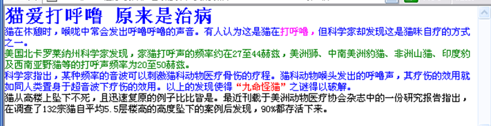

##### 7.id与class的区别

同样的id名称在页面中只使用一次，可用于页面的布局等应用。
同样的class名称可在页面中多次使用，作用于多个对象，以达到统一样式设置的目的，可用于文本颜色等应用。
提示：id和name的自定义名称大小写敏感，推荐统一使用小写。

#### 2.5.2 属性

```
CSS代码中的颜色值和HTML中设置略有区别，特殊情况下CSS代码中的颜色值可以缩写。
颜色值一般采用16进制代码，即#abcdef，当a=b,c=d,e=f时，#abcdef可缩写为#ace，如#f00代表红色。
颜色值另一种表示方法为rgb方法，红绿蓝三色使用十进制表示或百分比表示，例如：
p#hello{color:rgb(255,0,0);}
p#hello{color:rgb(100%,0,0);}

```

#### 2.5.3常用数字单位

| **单位** | **说明**                                                     | **示例**         |
| -------- | ------------------------------------------------------------ | ---------------- |
| **px**   | pixel，像素。屏幕上显示的最小单位，直观方便。像素是相对于显示器屏幕分辨率而言的。 | height:500px;    |
| **em**   | 即％，在CSS中，1em＝100％，是一个比率，指相对当前元素内文本高度的倍数。 | font-size:1.2em; |
| **pt**   | pt，点，又名“磅”，是一个标准的用于印刷的长度单位，1pt=1/72英寸=0.03527厘米。 | font-size:12pt;  |

#### 2.5.3 id和class的区别

#### 2.6 div+css布局


```
<html >
<head>
<title>设置div样式</title>
<style type="text/css">
html,body{height:100%; }
#fst {	background-color: #eee;
	border:1px solid #000;
	width:300px;height:200px;}
#sec {background-color: #eee;
	border:1px solid #000;
	width:50%;height:25%;}
</style></head>
<body>
<div id="fst">
这是固定尺寸的宽度和高度
</div><hr />
<div id="sec">这是自适应尺寸的宽度(50%)和高度(25%)</div>
</body>
</html>

```


##### 常用元素

XHTML的标签分为2种元素：块状元素和内联元素。
块状元素：默认是占据一行的位置，下一个元素将被迫挤到下一行显示。块状元素有固定的高度和宽度。
内联元素：内联元素会使得下一个元素自动贴到自己的右边显示，同一行能容纳多个内联元素。内联元素不能设置高度和宽度。

块状元素

```
div – 层
p - 段落
table -表格
ol – 有序列表
ul – 无序列表
h1-h7 – 七级标题

```

内联元素

```
span
img - 图片
a - 超级链接
font - 字体设定
b - 粗体
i - 斜体
u - 下划线

```

```
块状元素和内联元素可以相互转化。
块状元素转化为内联元素：css设置display:inline ;
内联元素转化为块状元素：css设置display:block ;
```


#### 2.7 css盒模型

CSS盒模型是从CSS诞生之时便产生的一个概念。
对于网页中的大部分对象(不论块状元素还是内联元素)，实际呈现的形式都是一个盒子形状对象，即块状对象。
在CSS设计过程中，要做的就是安排一个个盒子的内容。

```

CSS的margin、border和padding均可拆分上、下、左、右4部分。
margin：margin-top、margin-bottom、margin-left、margin-right。
border：border-top、border-bottom、 border-left、border-right。
padding：padding-top、padding-bottom、padding-left、padding-right
```

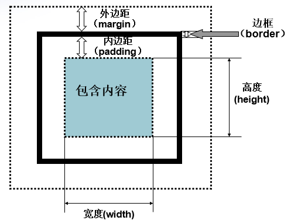

```
盒子实际占据的宽度= margin-left + 
				  padding-left +
                  border-left  + 
                  width + 
                  padding-right + 
                  border-right +
                  margin-right
                  
盒子实际占据的高度= 	  margin-top + 
					border-top + 
					padding-top+ 
					height + 
					padding-bottom + 
					border-bottom + 
					margin-bottom
```

### 2.6CSS布局页面

#### 2.6.1使用CSS布局页面顶部内容


#### 2.6.2使用CSS制作网站导航


#### 2.6.3使用CSS制作列表


#### 2.6.4使用CSS制作内容的版式


#### 2.6.5解析“CSS禅意花园”经典案例


```


```


## 3. 网页制作实战


```
正式网页制作前，要使用photoshop先设计出页面的效果图，然后再根据效果图设计HTML页面。       
以如左图所示的效果图为例，介绍利用DIV+CSS技术进行网页制作的全过程。
```

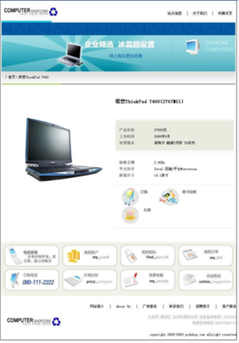


### 3.1 页面分析

```
在进行页面代码制作之前，首先来对网站的整体进行构思，对设计的页面进行分析。
(1)页面整体布局
(2)寻找实现这种框架结构的方法
(3)确定各个div的id名
```

1. 页面整体布局

   ```
   从整体上说，页面是上、中、下3行布局，从中间部分的划分来说，是二列式的左右布局。
   
   
   ```

   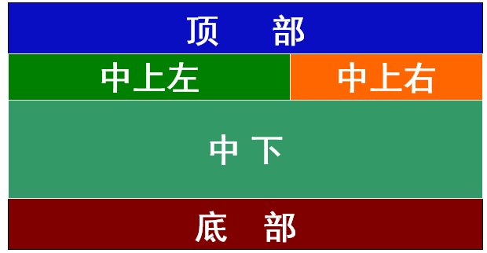


具体页面布局：

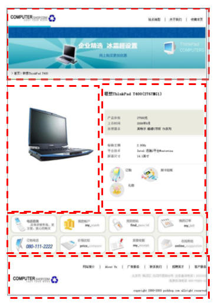

2. 寻找实现框架的方法

   ```
   对于整体来说，把一个容器分成3份，上、中、下，分别都使用div标签定义空间。
   对于中间部分来说，又分为中上、中下两部分。
   对于中上部分来说，又分为中上左、中上右两部分。
   ```

3. 确定各个div的id名字

   ```
   确定父div 的id名为container。
   从上到下确定各子div的id名分别为header、content和footer。
   确定在CSS代码中，仅设置父div container的宽度，其他子div在container中通过外边距定位或浮动定位即可
   ```

   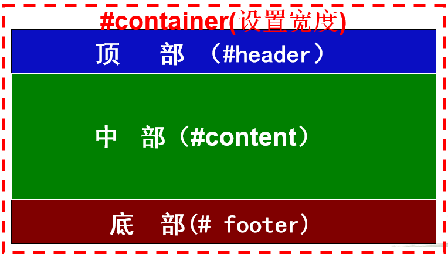

### 3.2 框架制作

#### 3.2.1 代码制作

打开VS.NET2008，新建一个ASP.NET网站，添加一个HTML文件。
首先编写XHTML代码，在XHTML格式文件的主体<body></body>内添加XHTML代码，如下：

```
<div id=“container”>
   <div id=“header”></div>
   <div id=“content”></div>
   <div id=“footer”></div>
</div>
```

#### 3.3.3 css样式制作

现在来添加CSS样式，在XHTML格式文件的<head></head>中添加如下代码：
<style></style>
然后，使用CSS选择符为定义了id的XHTML标签进行样式设置。

添加CSS的过程中，要经常参照UI界面的设计图，并且使用Photoshop软件打开设计图，利用参考线精确确定坐标和页面中每个模块的位置关系。使用参考线将这个页面的框架结构进行划分。
**在参考线的帮助下，可以掌握页面中每个模块的位置，以及长度、宽度，是CSS样式编写的重要辅助方法。**

使用photoshop中标尺与参考线，确定网页效果图中的网页的整体CSS代码如下：

```
*{margin:0px; padding:0px;}
body { font-size: 12px;	font-family: "宋体";   }
#container { width: 800px; margin: 0px auto;  }
#content{  height: 714px;   }
#footer {   height: 155px;    }
```

注：以上像素值都是在效果图中利用标尺和参考线精确测量得来的

### 3.3 页面设计

#### 3.3.1 页面顶部设计

##### 1.页面分析

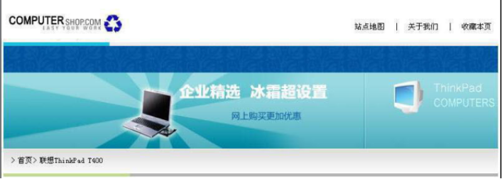

##### 2.草图：

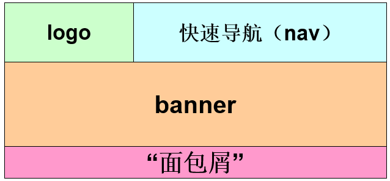


```
logo部分与快速导航部分(nav)可以视为二列式布局，使用浮动定位方法实现布局设计，并且二者放在同一个div容器top中。
中间的banner部分和下面的”面包屑”部分(crumbs)分别使用一个div容器。
top部分、banner部分和crumbs部分各占据一行，宽度都设置为与页面一样的宽度。

```

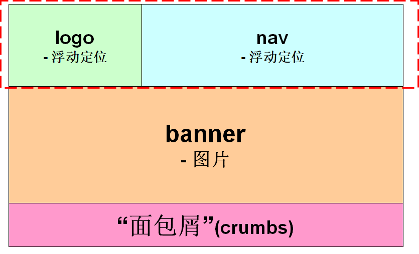

##### 3.容器命名

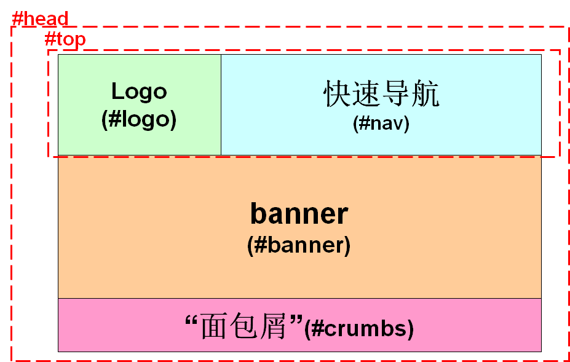

##### 4.页面顶部代码

```
<div id="header">
     <div id="top">
             <div id="logo">
                 
             </div>
	      <div id="nav"></div>
          </div>
     <div id="banner"></div>
     <div id="crumbs">
       <div id="crumbscontent"></div>
       <div id="crumbsline >
            
       </div>
     </div>
</div>
```

logo的定位是使用了id选择符#logo设置上、下、左外边距来实现的。
logo部分浮动向左，nav部分浮动向右，实现左右二列式布局。

```
#top{ width:100%; }
#logo{ margin-left:6px; margin-top:24px; 
                margin-bottom:14px;float:left; }
#nav{ float:right; margin-top:33px; }
```

#### 3.3.2 页面中上部布局设计

##### 1. 页面分析

```
页面中上部的页面分析分为以下几个步骤：
（1）根据页面中上部的设计图，构思草图。
（2）左侧图片和右列内容使用浮动定位实现二列式布局，并且设置宽度和高度。
（3）为每个区域的div的id或者class命名。
注：在此，若不给左侧图片和右列内容设置高度，会出现下面图片浮动上来的情况。
```

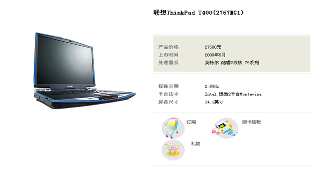

##### 2.构思草图

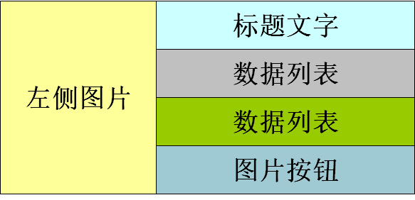


##### 3.两列式布局

```
左侧图片和右列内容使用浮动定位实现二列式布局，并且设置固定宽度。
```

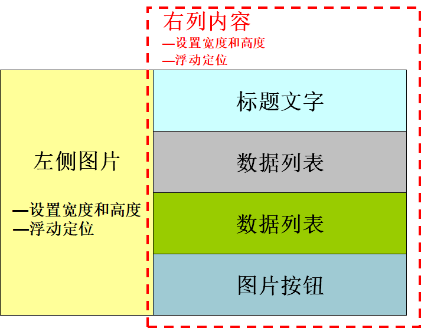

##### 4.为每个区域的div的id或者class命名

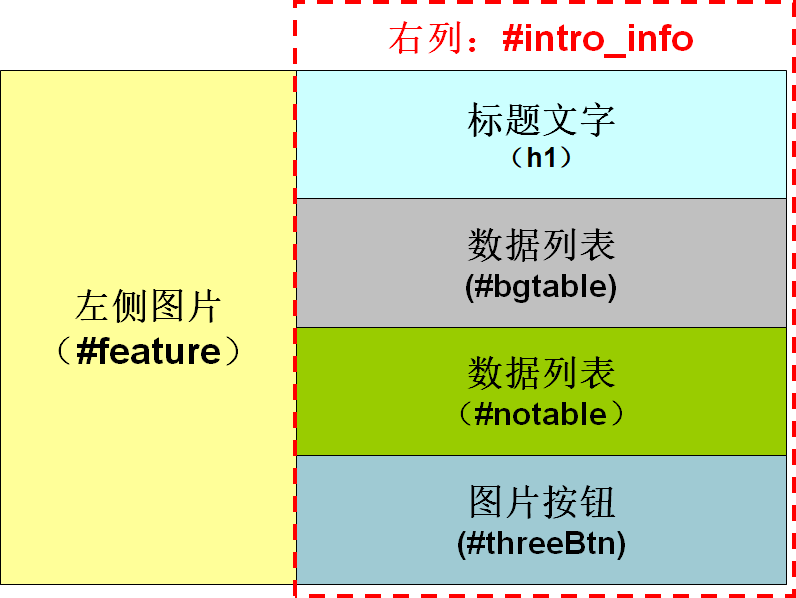

##### 5.代码制作

(1)添加制作页面中上部的HTML结构代码。

```
<div id="info">
    <div id="productshow">
        
    </div>
    <div id="intro_info">
      <h1>联想ThinkPad T400(2767MG1)</h1>
      <div id="bgtable"></div>
      <div id="notable"></div>
      <div id="threeBtn></div>
    </div>
  </div>
```

(2)为页面中上部的每个部分的布局添加CSS代码。

```
#info{ height:550px; width:100%;}
#productshow{ margin-top:88px; margin-left:80px; width:276px; float:left; height:460px;}
#intr_info{margin-left:30px; float:right; width:400px; height:100%; line-height:20px;}
#intr_info h1{ font-size:20px; margin-top:37px; margin-bottom:50px;}
#threeBtn{ margin-left:20px;}
#threeBtn img{ margin-right:20px;}
```

在以上代码中，为左列和右列设置浮动定位，实现二列式布局。
为图片按钮定义了外边距，实现定位。

#### 3.3.3页面中下部布局

##### 1.页面分析

```
（1）根据页面中下部的设计图，构思草图。
（2）确定每部分都使用div容器浮动定位，并设置每个div的宽度。
（3）为每个区域的div的id或者class命名。
```

##### 2.构思草图


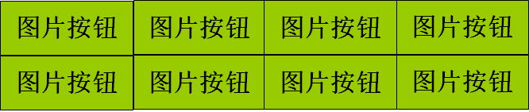


```
确定使用div容器浮动定位，设置每个div的宽度。
为div的id或者class命名。图片按钮(#function_channel)
```


##### 3.代码制作

（1）制作页面中下部的XHTML结构代码。

```
<div id="function_channel">
    <div><a href="#"></a></div>
    <div><a href="#"></a></div>
    <div><a href="#"></a></div>
    <div><a href="#"></a></div>
    <div><a href="#"></a></div>
    <div><a href="#"></a></div>
    <div><a href="#"></a></div>
    <div><a href="#"></a></div>
</div>
```


（2）为实现每个部分的布局添加CSS代码。

```
#function_channel{ margin-left:12px;}
#function_channel div{ float:left; margin-left:3px;}
#function_channel img{ border-style:none;}

```

#### 3.3.4 页面底部的布局设计

##### 1.页面分析


##### 2.构思草图

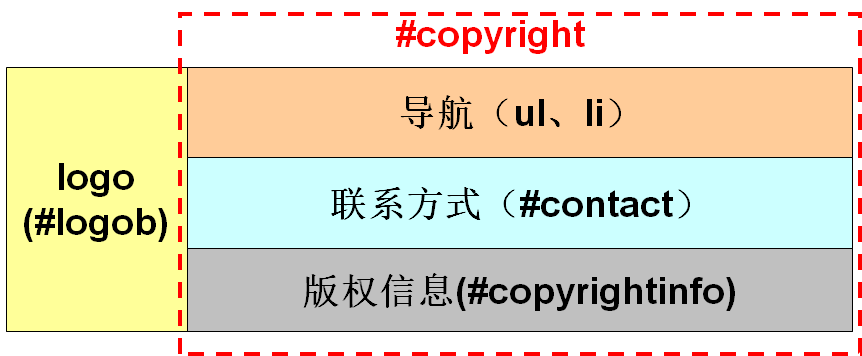


##### 3.代码制作

（1）制作页面底部的结构XHTML代码

```
<div id="footer">
    <div id="logob">
       
    </div>
    <div id="copyright">
      <ul>……</ul>
      <p id="contact">……</p>
      <p id="copyrightinfo">
         copyright 2000-2003 ……
     </p>
    </div>
  </div>
```

（2）为实现每个部分的布局添加CSS代码

```
#logob{ margin-top:70px; margin-left:20px; float:left;}
#copyright{ float:right; margin-top:25px;}
#contact{ margin-top:15px; text-align:right;     line-height:20px; color:#ACACAC;  }
#copyrightinfo{ margin-top:15px; text-align:right;    line-height:20px;}

```

### 3.4 模块设计

模块设计，就是对页面中的具体的内容进行布局实现，例如导航的制作、数据列表的制作、图片按钮的排版、文本的排版等。下面将分别对网页中的每一个内容模块进行CSS布局设计。

#### 3.4.1快速导航制作

这个页面有两个位置使用了导航形式：页面顶部的右上角和页面底部的右上角。
为了页面代码的多样化，针对这两个导航系统，使用了不同的实现方法。
页面顶部右上角的导航使用了普通的文字链接并列的方法，整个导航放在div容器中控制位置。
页面底部右上角的导航使用了无序列表的形式，导航项使用<li></li>标签来控制，整个导航通过ul控制位置。

##### 1）页面顶部的导航

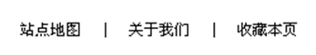

（1）页面顶部的导航模块的具体XHTML代码如下：

```

<div id="nav">
   <a href="#">站点地图</a>|
   <a href="#">关于我们</a>|
   <a href="#">收藏本页</a>
</div>


```

（2）为超链接添加CSS样式，代码如下：

```
a{ text-decoration:none; color:#000000; }
a:hover{ text-decoration:none; color:#210EC0;}
```


##### 2）页面底部的导航

页面底部的导航模块的HTML代码如下：

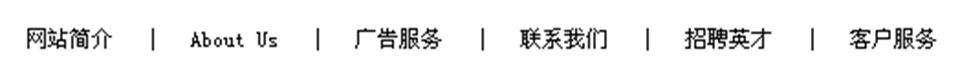

```

<div id="copyright">
      <ul>
        <li><a href="#">网站简介</a></li>
        &nbsp;&nbsp;|&nbsp;&nbsp;
        <li><a href="#">About Us</a></li>
        &nbsp;&nbsp;|&nbsp;&nbsp;
        <li><a href="#">广告服务</a></li>
        &nbsp;&nbsp;|&nbsp;&nbsp;
        <li><a href="#">联系我们</a></li>
        &nbsp;&nbsp;|&nbsp;&nbsp;
        <li><a href="#">招聘英才</a></li>
        &nbsp;&nbsp;|&nbsp;&nbsp;
        <li><a href="#">客户服务</a></li>
      </ul>
</div>

```

为页面底部的导航添加CSS样式，代码如下：

```
#copyright ul{ list-style-type:none;}
#copyright ul li{ display:inline;}
```


#### 3.4.2”面包屑”制作

制作“面包屑”的主要任务是设计文字链接样式。

带有背景的“面包屑”，需要注意的是设置好文本的背景图中的显示位置，通过CSS的行高属性，能够控制文本在背景中的显示位置。

“面包屑”中连接文字之间使用”>”分隔，表示子属关系，后者是前者的分支。
（1）添加“面包屑”的XHTML代码如

```
<div id="crumbscontent">
   ><a href="#">首页</a>
   ><a href="#">联想ThinkPad T400</a>
</div>
```

（2）为“面包屑”的添加CSS样式，代码如下：

```

 #crumbscontent{ 
    background-image:url(images/crumbs_bg.jpg);    
    background-repeat:repeat-x; 
    height:40px; 
    line-height:40px;
    }

```

注意：以上“面包屑”的背景是通过背景图片横向平铺来实现的。


#### 3.4.3数据表格制作

在页面中上部分别使用了有背景的数据表格和无背景的数据表格。
注意：div和table混排时，div和table的margin无效,只需要将该div的display属性设置为inline-table，即可使该div和table的margin有效。

有背景的数据表格的id为“bgtable”。
无背景的数据表格的id为“notable”
其CSS代码如下：

```
#bgtable{ height:110px; background-color:#EAEADE; display:inline-table; width:100%;}
#notable{ height:110px; display:inline-table;width:100%;  }
#bgtable table,#notable table{margin-top:25px; margin-left:15px; line-height:20px;}
table th{ width:115px; text-align:left; color:#8D8D85;}
```


## 4.JavaScript基础


工具使用

1. 网页编辑工具  WebStrom  HbuilderX   Idea

   优点： 智能感知，可视化设计。

2. 调试工具 chrome+  F12    360 +F12


## 5.photoshop的基本使用

### 5.1快捷键使用

1. 放大缩小： 视图->放大缩小 CTRL +  ++      CTRL +  --
2. 标尺 ： 视图->标尺   CTRL + R

### 5.2 标尺和参考线

使用Photoshop软件打开设计图源文件，使用“视图->标尺”（**CTRL + R**）菜单打开标尺工具。
右单击标尺区域，在弹出的快捷菜单中选择“像素”项，标尺变为以像素为单位。
使用光标从标尺区域可以拖出参考线到任意位置，并可任意移动参考线。

### 


1. CS编程中 UI与代码是一体化，C#代码表示属性、行为，窗体表示外观。有状态的[不涉及提交]。

2. BS编程中，前端是HTML+JS+CSS,后端 是服务器，采用C#/Java进行编写，二者通过http通信。无状态[客户端提交到服务端，客户端页面使命完成，服务端重新生成HTML页面，发送到客户端(response)]  <飞向月球>

3. MS web  form封装了代码，增加了asp.net服务端控件， <asp:Button ID="btnHello" runat="server" 
               OnClick="Button1_Click" OnCommand="Button1_Command" Text="myFirstButton" />，可以直接进行类CS编程。

   优点：消息、方法、属性，可以进行可视化编程。提升了开发效率。

   缺点：封装了大量的细节，坏处：出了问题难于调试。重量级客户端，不适用于手机平板；分工不清晰。（美工 前端  后台服务）。

```

```

1. 引言和相关工作分开写 

2. 这个领域的算法和自己的算法分开来写

   - 目前有几类算法，算法存在的问题。已有算法的问题

   - 讲解你们的算法，算法的有点。算法的优点说的比较简单。

3. 三种特征融合起来，进行熔池的重建设。没有特别完全不一样的方法。
4. 校准的工作是大家都知道的工作。
5. 第四部分，图像预处理。图像处理的算法。只是引用了一篇文献，没有写自己如何处理的。直接给出了处理结果。（处理过程要写清楚）
6. 实验部分。没有说明实验的参数、实验数据和环境；数据来源说清楚。
7. 重建结果，需要进行验证。只用某一种特征点，效果如何，两种如何；和三特征融合进行比较，好在哪里。
8. 是否有公开数据集，是否通过公开数据集进行比较。
9. 和其他现成的检测算法进行比较