# ArcGIS发布地图服务--ArcMap

 一般做完矢量图绘制工作后，生成的.mxd文件只能在ArcMap中查看，为了方便用户进行浏览，我们需要发布地图服务。 

地图服务是一种利用 ArcGIS 使地图可通过 Web 进行访问的方法。适合在多种 Web 和 intranet 情景下使用。对于同一地图服务，可由多个用户分别在 ArcMap、Web 应用程序、ArcGIS Online 和移动应用程序中同时使用。首先在 ArcMap 中制作地图，然后将地图作为服务发布到 ArcGIS Server 站点上。之后，Internet 或 Intranet 用户便可在 Web 应用程序、ArcGIS for Desktop、ArcGIS Online 以及其他客户端应用程序中使用此地图服务。

## 一、启动ArcMap并且添加shp文件

1、 打开开始菜单，点开ArcGIS文件夹，找到ArcMap并点开 。

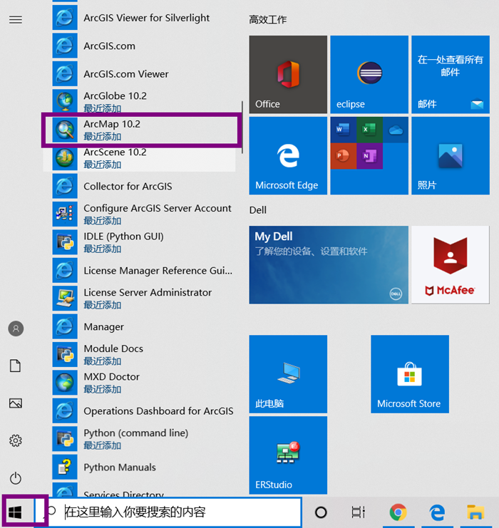

 

2、启动ArcMap10.2，新建一个空地图文档。

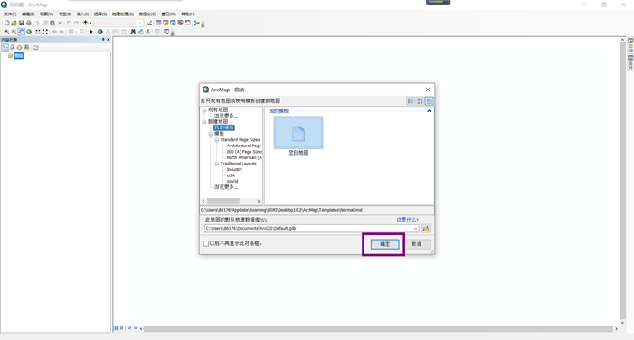

 

3、 添加shp文件需要Add Data对话款内完成，打开Add Data对话框有两种方法，第一种是点击菜单栏File->Add Data ->Add Data 

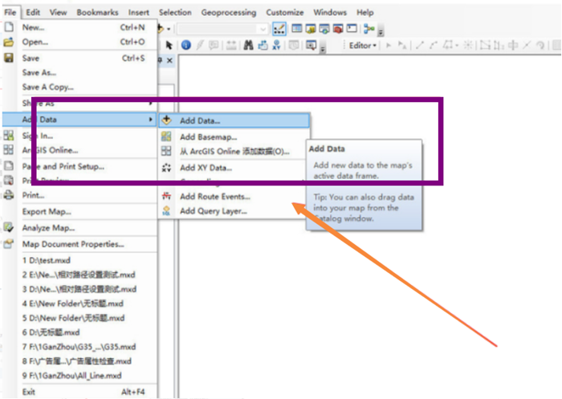

 

 第二种是下拉工具条里＋，点击Add Data 。

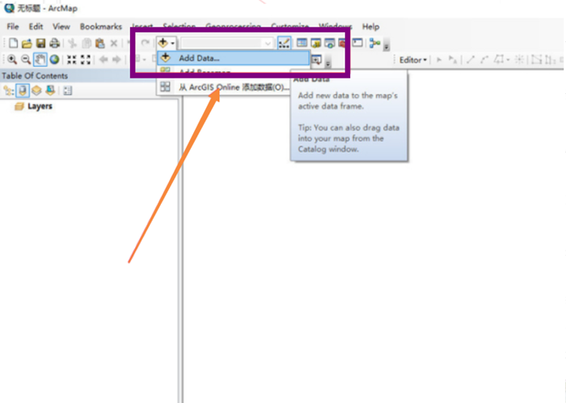

 

4、 在Add Data对话框中，选择文件夹找到shp文件。首次打开Add Data对话框下拉是没有系统盘符的，需要点击Connect to Folder图标，然后找到盘符或者文件夹，点击确定。 

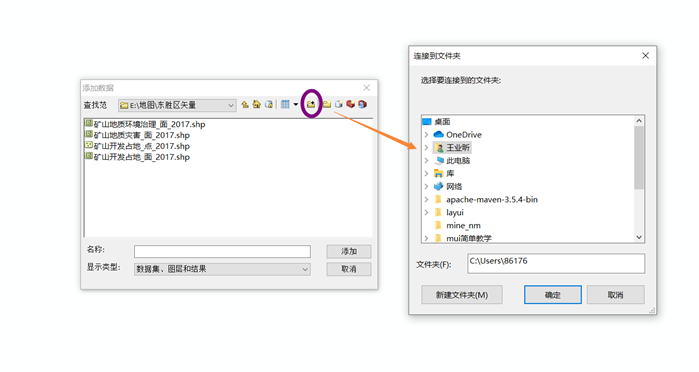

 

5、 再次下拉，可见添加了E盘盘符, 然后找到文件夹下的道shp文件，选中并点击Add按钮。 

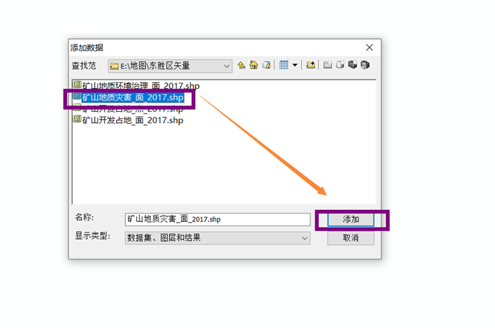

 

6、 此时已将shp文件添加至ArcMap中 。

 

## 二、ArcMap连接 arcgis server

1、 在目录树中展开 GIS 服务器节点 

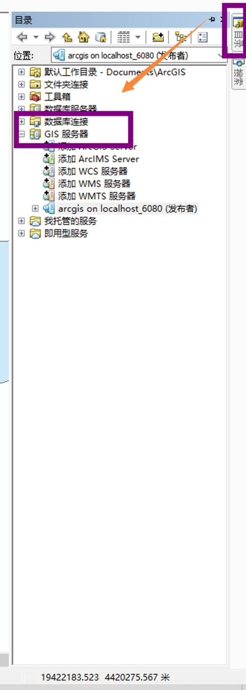

 

2、 双击添加 ArcGIS Server 

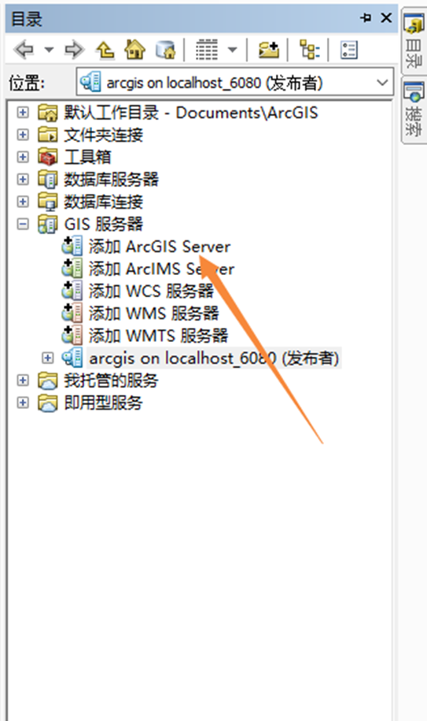

 

3、 选择管理 GIS 服务器，然后单击下一步 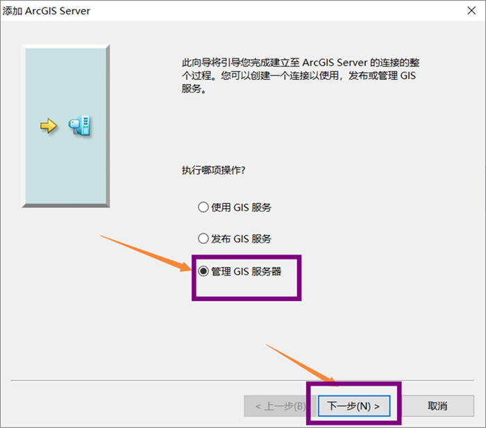

4、 对于服务器 URL，输入要连接的 ArcGIS Server 站点的 URL（ 我这里就输入自己本机的URL ）、输入用户名和密码 ，单击完成。

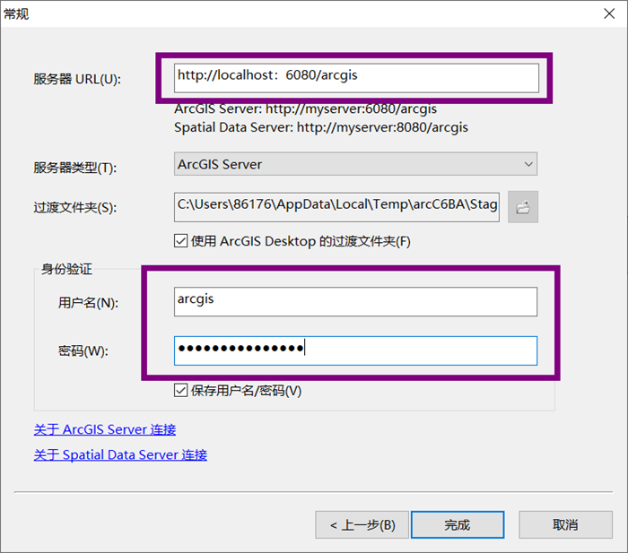

 

5、 连接随即出现在目录树的 GIS 服务器结点中， 现在即已连接到一个管理连接 。

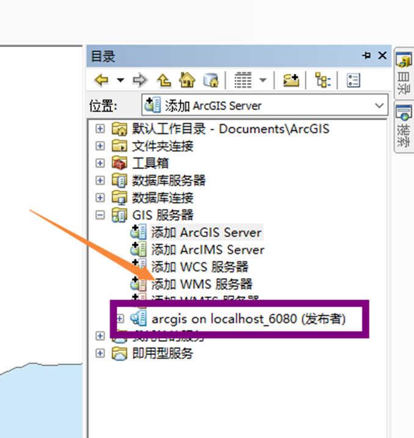

 

## 三、发布地图服务

1、 在主菜单中依次选择(File->Share As->Service（即 文件->共享为->服务） 

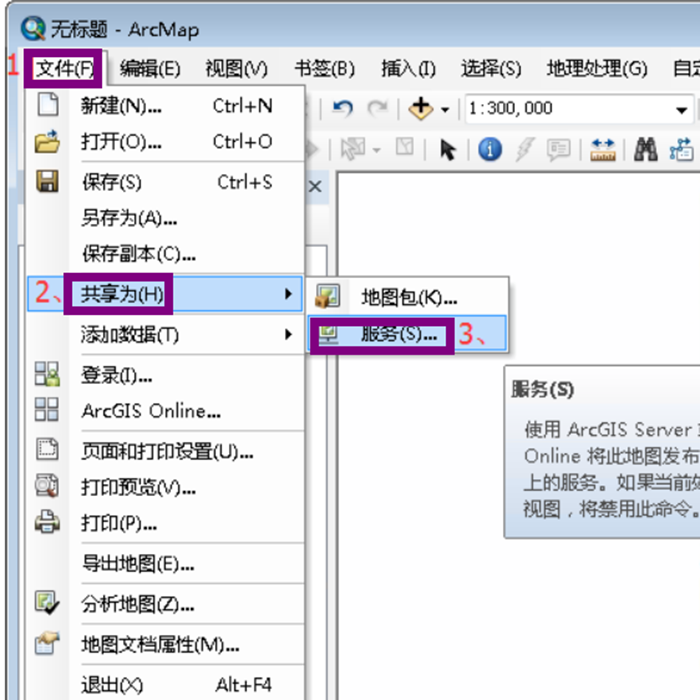

 

2、 选择“Save a service defintion file”（即发布服务）, 然后单击“下一步”。

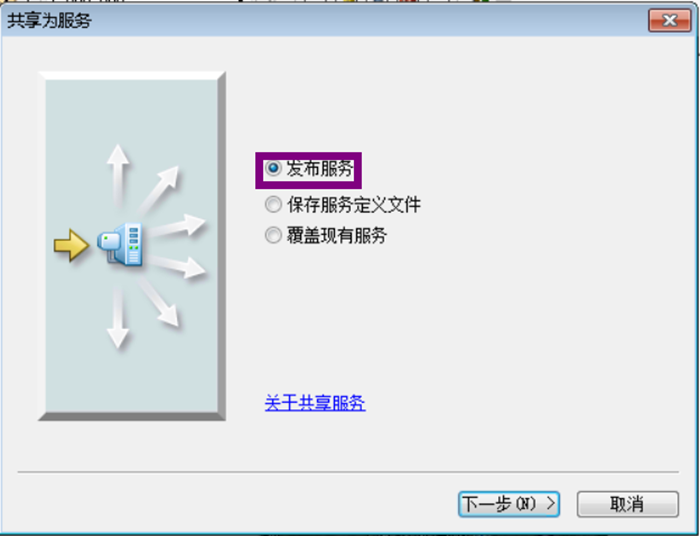

 

3、选择现有连接并设置“服务的名称”。

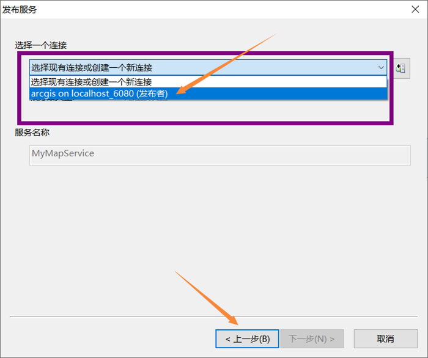

 

4、 选择文件保存位置 。

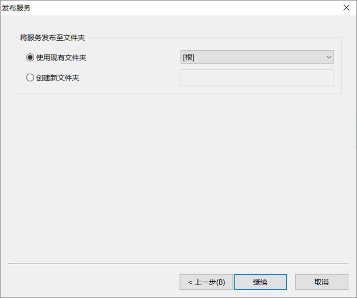

 

5、点击发布按钮。

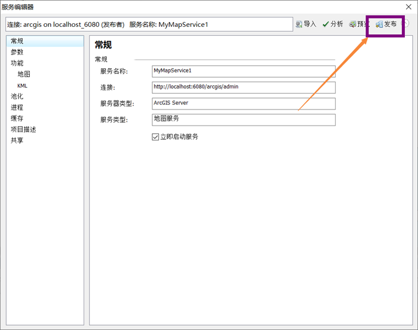

 

6、正在分析打包数据。

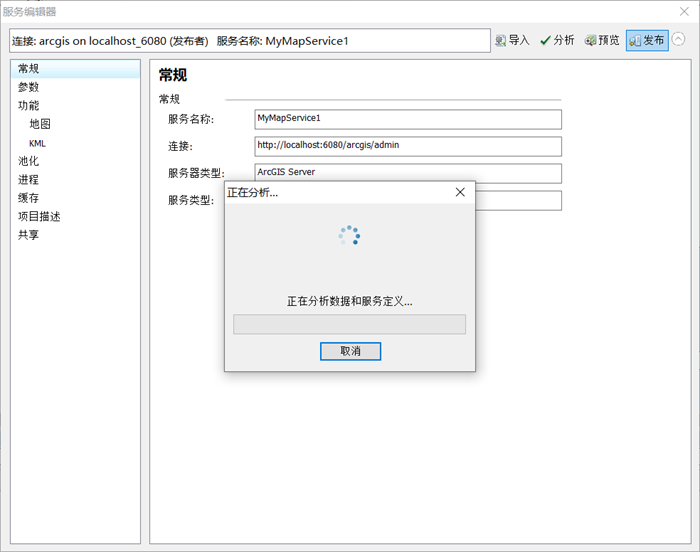

 

7、发布成功！

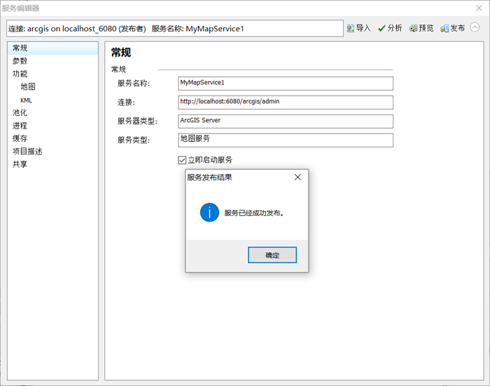

 

8、登录到ArcGIS Server管理器发现地图服务发布成功啦。

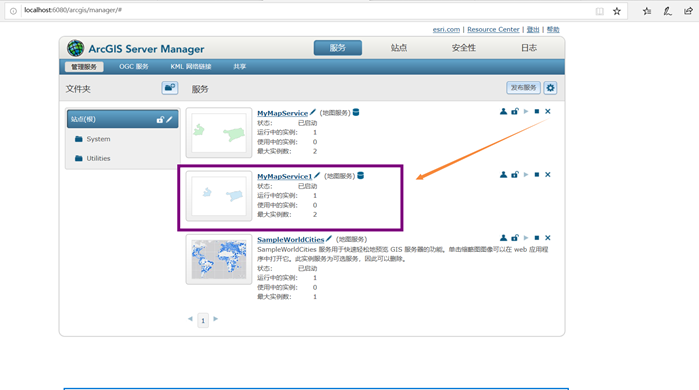

 

## 四、发布地图服务中可能出现的问题

**Arcgis Server****端口被占用，服务无法启动**

**1****、原因：**

arcgis server常用的端口包括：6443、6080、4000~4004。

6443、6080是arcgis server 发布的地图服务，外部访问的端口。此端口被占用，一般服务无法访问。

4000~40004是arcgis server 发布地图时模式占用的端口。一般被arcgis server启动后的两个javaw.exe进程占用。此端口被占用，地图服务一般无法启动。
 **2****、解决办法：**

 可进入arcgis server的admin目录，将arcgis Server的4000~4004端调整为其它端口。 

**3****、具体操作：**

admin目录： 

 浏览器输入路径，如：http://Ip地址:6080/arcgis/admin/machines/您的机器名/edit

（或者把Server manager的路径中 manager 修改为 admin/machines/这里是您的机器名/edit）

修改Ports中4000端口为其他空闲端口（一般改成4005或4006就可以解决了）