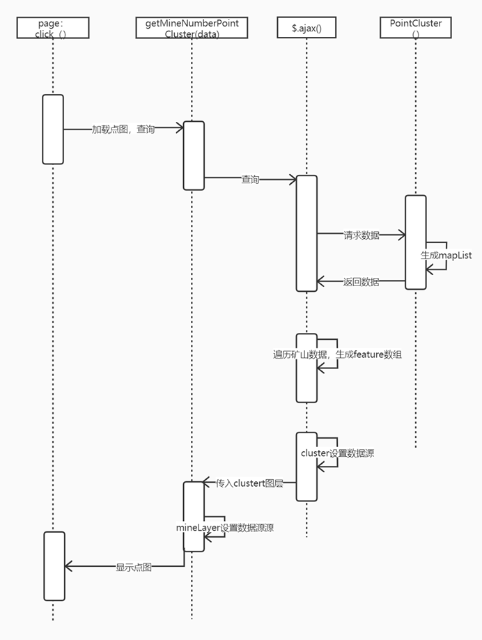

# 1.  点图的加载

## 1.1序列图



 

## 1.2 序列图说明

前端页面：nmminePortal.jsp

页面调用方法：getMineNumberPointCluster(data)

```
data：加载点图时，所需的查询条件， 如：查询年份，生产状态，省份 
例子：provinces=15&surveyYears=2017
```

maplist：后台查询返回的数据，数据格式Map<String, List<NmmineGisData>>，NmmineGisData是矿山业务逻辑层的实体

```
public class NmmineGisData {
    private Integer markerId;  //id
    private String title;    //标题、名称
    private Double longitude;  //经纬度
    private Double latitude;  //经纬度
    private Integer type;   //类型
    private Integer servesYears;  //服务年限
    private String province; //声明称
```

 

```
public Integer getMarkerId() {
    return markerId;
}

public void setMarkerId(Integer markerId) {
    this.markerId = markerId;
}

public String getTitle() {
    return title;
}

public void setTitle(String title) {
    this.title = title;
}

public Double getLongitude() {
    return longitude;
}

public void setLongitude(Double longitude) {
    this.longitude = longitude;
}

public Double getLatitude() {
    return latitude;
}

public void setLatitude(Double latitude) {
    this.latitude = latitude;
}

public Integer getType() {
    return type;
}

public void setType(Integer type) {
    this.type = type;
}

public Integer getServesYears() {
    return servesYears;
}

public void setServesYears(Integer servesYears) {
    this.servesYears = servesYears;
}

public String getProvince() {
    return province;
}

public void setProvince(String province) {
    this.province = province;
}
```

}

```
feature数组生成：遍历返回的数据，每个数据生成ol.feature,并设置几何信息
```

 

显示点图：

```
var source = new ol.source.Vector({
    features: features
});
var clusterSource = new ol.source.Cluster({  //集群
    source: source,
    distance: 40
});
mineLayer.setSource(clusterSource);
```

 

 

```
 
 
```

 

# 2 Openlayer

## 2.1 思维导图

 

## 2.2 说明

ol.map（）用来渲染地图，openlaye的功能都需要在ol.Map中实现

ol.View即视图涉及到地图移动，放大，缩小，旋转等，其中Resolution参数是设置分辨率，Zoom参数设置缩放等级，Projection设置投影坐标系，Rotation用来设置旋转，Center设置视图中心，Extend设置地图范围

layers设置图层，其中的ol.layer.Vector()用来设置矢量图层，矢量图层的数据源是feature，feature的geometry属性可以设置集合形状，Circle用来设置圆形，LineString用来设置多线串几何，point用来设置点，Polygon设置多边形，style属性用来设置样，可以用样式含函数StyleFunction作为参数，也可以用style.Style作为参数，该参数中fill用于设置填充，image用于设置图片，stroke用于设置边，text设置文本。

ol.layer.Tile()用来设置在网格中提供预渲染的平铺图像的图层源，TileDebug用来显示每个图块的坐标。TileImage提供图像的源的基类，可以用BingMaps、WMS、TieJson、TileWms、WMTS、XYZ作为数据源。