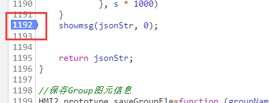
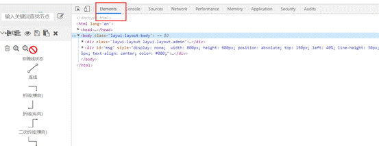
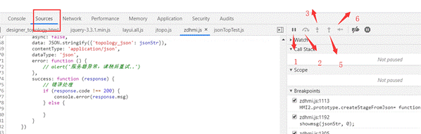
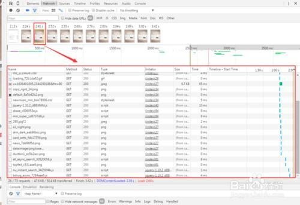

Chrome调试js帮助文档


### 1.Chrome 调试常用板块：


打开要调试的页面，按F12进入控制台，选择Source Tab框


添加断点：选中要设置断点的代码行，在行号的位置单击鼠标左键即可



下面主要介绍几个常用板块：

#### 1.1 Nerwork

Network是网络工具，可以查看请求数据的状态，类型，大小，时间等，如下图。可以查看发送的请求是否正确，返回的数据是否正常等。


#### 1.2 Elements

元素面板，查看Web页面的HTML与CSS，最重要的是可以双击元素，对当前页面进行修改，调试页面样式会非常非常方便。



 

#### 1.3 Sources

Sources可以用来查看页面的源文件，包括JS文件和Html文件。找到想要调试的JS代码，在代码前单击，即可设置断点。当运行JS代码时，会自动进入到断点执行,可以单步运行、进入函数体内调试、直接运行到下一断点等。


当设置断点运行暂停后，我们需要手动控制代码的执行，

Sources有五个按钮来方便我们调试js问题，从左到右依次是恢复执行，跳过下一个函数，跳入下一个函数和跳出下一个函数以及逐步执行下一行



1）恢复执行

点击恢复执行按钮，代码就会跳到下一个断点处

2）跳过下一个函数

如果觉得代码中调用的某个函数是值得信任的，那么当代码执行到这一行时，可以点击跳过

3）跳入下一个函数

如果代码执行到某行调用了某个函数，可以点击跳入函数，继续执行

5）跳出下一个函数

如果不想继续查看调用函数的内部代码，可以点击跳出按钮，回到调用该函数的主流程中

6）逐步执行下一行

如果不知道哪里出了问题，希望一行行的查找问题，这个时候可以点击逐步执行按钮，这样代码就会按照执行逻辑一行一行的运行。


### 2.代码调试


#### 2.2 js代码规范化

我们点击Sources中的Javascript代码文件，可以看出，这些代码是经过压缩的。如果直接阅读这一块代码，很快就会感到理解困难了。

我们点击下方的大括号｛｝图标，即可使用Pretty Print功能了。


会在一个新标签页面打开反压缩后并经过重新排版美化的Javascript代码。

### 3.Network查看

```
如图所示，Chrome的Network面板主要由5个部分组成，包括控制器、过滤器、概览、请求列表、概要，下面简单介绍下这5个部分的作用。

控制器：控制面板的外观与功能

过滤器：过滤请求列表中显示的资源

按住Command（Mac）或Ctrl（Window/Linux），然后点击过滤器可以同时选择多个过滤器。
概览：显示HTTP请求、响应的时间轴。

请求列表：默认时间排序，可选择显示列。

概要：请求总数、总数据量、总花费时间等。
```

Network用来


```
initiator 标记请求是由哪个对象或进程发起的(请求源)
parser: 请求由 chrome 的 HTML 解析器发起
redirect: 请求是由 http 页面发起的重定向
script: 请求是由 script 脚本发起的
other: 请求是由其他进程发起的,比如用户点击一个链接跳转到另一个页面或者在地址栏输入 URL 地址
```


#### 3.3 查看资源详情

通过点击某个资源的Name可以查看该资源的详细信息，根据选择的资源类型显示的信息也不太一样，可能包括如下Tab信息：

Headers 该资源的HTTP头信息。
Preview 根据你所选择的资源类型（JSON、图片、文本）显示相应的预览。
Response 显示HTTP的Response信息。
Cookies 显示资源HTTP的Request和Response过程中的Cookies信息。
Timing 显示资源在整个请求生命周期过程中各部分花费的时间。


##### 3.3.1 资源HTTP头信息

在Headers标签里面可以看到HTTP Request URL、HTTP Method、Status Code、Remote Address等基本信息和详细的Response Headers 、Request Headers以及Query String Parameters或者Form Data等信息。

1. Request请求方法

```
1   GET     请求指定的页面信息，并返回实体主体。
2   HEAD    类似于get请求，只不过返回的响应中没有具体的内容，用于获取报头
3   POST    向指定资源提交数据进行处理请求（例如提交表单或者上传文件）。数据被包含在请求体中。POST请求可能会导致新的资源的建立和/或已有资源的修改。
4   PUT     从客户端向服务器传送的数据取代指定的文档的内容。
5   DELETE  请求服务器删除指定的页面。
6   CONNECT HTTP/1.1协议中预留给能够将连接改为管道方式的代理服务器。
7   OPTIONS 允许客户端查看服务器的性能。
8   TRACE   回显服务器收到的请求，主要用于测试或诊断。
9   PATCH   实体中包含一个表，表中说明与该URI所表示的原内容的区别。
10  MOVE    请求服务器将指定的页面移至另一个网络地址。
11  COPY    请求服务器将指定的页面拷贝至另一个网络地址。
12  LINK    请求服务器建立链接关系。
13  UNLINK  断开链接关系。
14  WRAPPED 允许客户端发送经过封装的请求。
15  Extension-mothed    在不改动协议的前提下，可增加另外的方法。
```


Status Code HTTP 状态码
Remote Address 服务器远程地址

Referrer
referrer是HTTP请求header的报文头，用于指明当前流量的来源参考页面。通过这个信息，我们可以知道访客是怎么来到当前页面的。这对于Web Analytics非常重要，可以用于分析不同渠道流量分布、用户搜索的关键词等。
但是，这个字段同时会造成用户敏感信息泄漏（如：带有敏感信息的重置密码URL，若被Web Analytics收集，则存在密码被重置的危险）。

Referrer Policy States
No Referrer：任何情况下都不发送Referrer信息

No Referrer When Downgrade：仅当协议降级（如HTTPS页面引入HTTP资源）时不发送Referrer信息。是大部分浏览器默认策略。

Origin Only：发送只包含host部分的referrer.

Origin When Cross-origin：仅在发生跨域访问时发送只包含host的Referer，同域下还是完整的。与Origin Only的区别是多判断了是否Cross-origin。协议、域名和端口都一致，浏览器才认为是同域。

Unsafe URL：全部都发送Referrer信息。最宽松最不安全的策略。

```


```


##### 3.3.2 资源预览信息

在Preview标签里面可根据选择的资源类型（JSON、图片、文本、JS、CSS）显示相应的预览信息。下图显示的是当选择的资源是JSON格式时的预览信息。

##### 3.3.3 资源Response信息

在Response标签里面可根据选择的资源类型（JSON、图片、文本、JS、CSS）显示相应资源的Response响应内容(纯字符串)。下图显示的是当选择的资源是CSS格式时的响应内容。

##### 3.3.4  资源Cookies信息

如果选择的资源在Request和Response过程中存在Cookies信息，则Cookies标签会自动显示出来，在里面可以查看所有的Cookies信息。

##### 3.3.5 时间消耗：

 分析资源在请求的生命周期内各部分时间花费信息
在Timing标签中可以显示资源在整个请求生命周期过程中各部分时间花费信息，可能会涉及到如下过程的时间花费情况：
Queuing 排队的时间花费。可能由于该请求被渲染引擎认为是优先级比较低的资源（图片）、服务器不可用、超过浏览器的并发请求的最大连接数（Chrome的最大并发连接数为6）.
Stalled 从HTTP连接建立到请求能够被发出送出去(真正传输数据)之间的时间花费。包含用于处理代理的时间，如果有已经建立好的连接，这个时间还包括等待已建立连接被复用的时间。
Proxy Negotiation 与代理服务器连接的时间花费。
DNS Lookup 执行DNS查询的时间。网页上每一个新的域名都要经过一个DNS查询。第二次访问浏览器有缓存的话，则这个时间为0。
Initial Connection / Connecting 建立连接的时间花费，包含了TCP握手及重试时间。
SSL 完成SSL握手的时间花费。
Request sent 发起请求的时间。
Waiting (Time to first byte (TTFB)) 是最初的网络请求被发起到从服务器接收到第一个字节这段时间，它包含了TCP连接时间，发送HTTP请求时间和获得响应消息第一个字节的时间。
Content Download 获取Response响应数据的时间花费。

```

```


#### 3.4 Capture screenshots（捕捉网页截图） 

Capture screenshots是自动分析DOM树的变化，截下DOM树变化各个重要阶段时的页面。除了截图外，还能看到每个截图所对应的Network情况，通过横向比较，可以发现一些请求（图片、js、css、xhr等）对页面的影响。

ctr+shift+i或者F12打开开发者工具；

打开Network面板，点亮左上角那个像是摄像机的图标（鼠标移上去会提示Capture screenshots）。

[](https://www.gwygd.com/upload/d/36/d36246f052acbc8a4de31d0efa017be5.jpg)

点亮该图标后，会打开新的一折叠面板，在该面板上会提示按Ctrl + R来启动截图。

[](https://www.gwygd.com/upload/2/8f/28f24d2e5af52dee59c972416538028b.jpg)

按Ctrl + R后，截图就自动完成了，如下图所示：

双击某截图就能看大图；

[](https://www.gwygd.com/upload/2/d4/2d4697117e63e58a61fe4009e15cd9e7.jpg)

点击选中某截图，就能查看该截图时刻的Network情况。

[](https://www.gwygd.com/upload/6/f0/6f0540c42c92191bb28d2466918409b5.jpg)