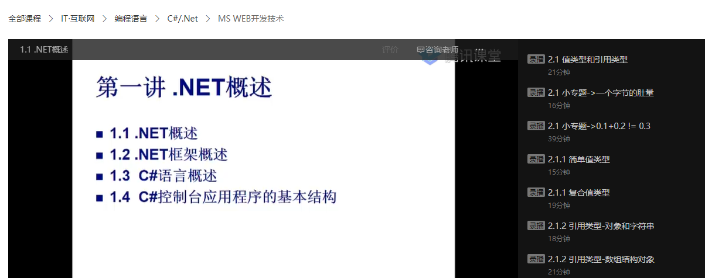
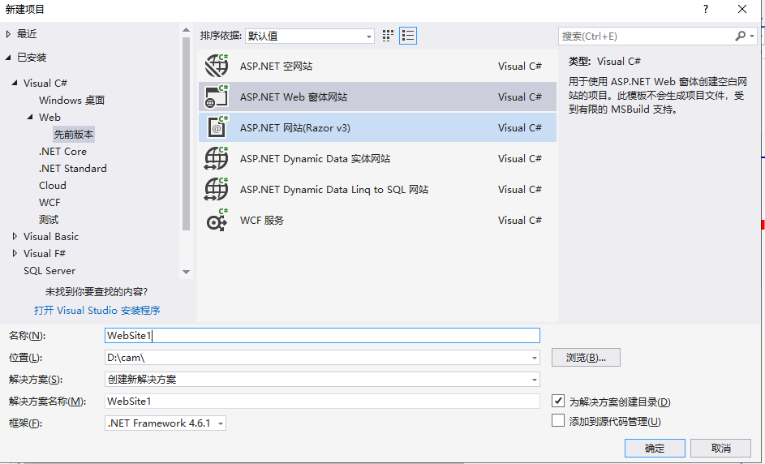
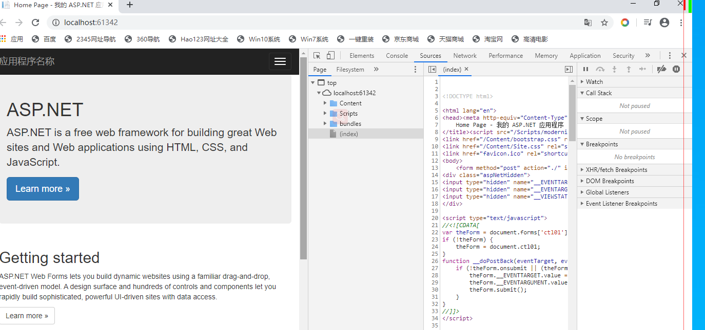
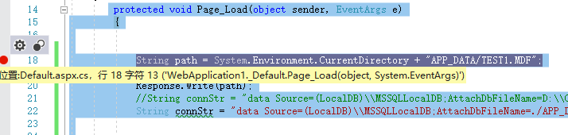
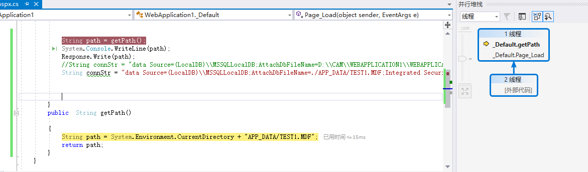

### 1.互动与教学工具

#### 1.1各种工具比较

1. 腾讯课堂

   - 常规版本，需要申请。分为免费、付费。付费功能比较多。

   - 免费的不能看签名，不能生成回放。

   - 优点就是能够形成目录，随时可看。MS_WEB的录播视频：

     https://ke.qq.com/course/1129123?taid=6093841334614691&tuin=25363a4e

     

2. 腾讯极速课堂

   - 是应对疫情的快速开课版本。10分钟开课
   - 优点：快速开课，生成回放
   - 缺点：目录性差。

3. 章鱼云：简单。

4. 腾讯会议

   - 优点：多方会谈，可以全体开语音。
   - 缺点：没有签到，不能录屏。

5. QQ视频

   - 优点：快捷、方便；能够随时看到不在线的情况
   - 缺点：屏幕的展示流畅度不如腾讯课堂、会议；不能生成回放、也不能签到。

6. 智慧树

   -  优点：专业的、面向大学培训的网站；课程建设、班级建设、作业、任务、考试、签到、生成课堂记录。
   - 缺点：没有发现基于pc的客户端，只能上传ppt进行讲解，不能展示屏幕。

#### 1.2工具使用

1. 使用腾讯急速课堂进行课堂直播
2. 使用智慧树进行手势签到、课程管理、资料管理


3.使用腾讯课堂网站进行录播视频的学习



### 2.学习中用到的工具

1. typora markdown的编辑工具

   - Markdown 是一种轻量级标记语言，它允许人们使用易读易写的纯文本格式编写文档。

   - Markdown 语言在 2004 由约翰·格鲁伯（英语：John Gruber）创建。

   - Markdown 编写的文档可以导出 HTML 、Word、图像、PDF、Epub 等多种格式的文档。

   - Markdown 编写的文档后缀为 **.md**, **.markdown**。

2. GITHUB最大开源网站

    https://github.com/liuxinfengabc/cultivate

   

3. https://www.yuque.com/ 鱼雀

   -  有道记事本 团队成员超过5人付费

### 3.开发工具

1.   VS2008 /vs2017 开发C#  asp.net
2.  idea  java web/js
3.  webstorm  js/h5
4.  pycharm python
5.  hubilder  mui移动端的h5开发
6.  docker的使用。

### 4.vs2008/vs2017

#### 4.1使用vs创建项目


1. 可以创建app(winform /linuxform)、web(asp.net)，跨平台运行windows/linux(centos ubuntu debian)

   



2. 创建一个web form

    

   

3. 使用web服务器：Tomcat /apache /IIS(微软专用Internet Information System)

     

4. 点击运行  ，激活浏览器chrome 方位 http://localhost:61342/

5. 在chrome浏览器中，F12可以查看网页源码，进行调试和跟踪

    


#### 4.2使用vs进行调试


1. 使用Response.write()输出信息到网页进行调试。

 protected void Page_Load(object sender, EventArgs e)
        {


            String path = System.Environment.CurrentDirectory + "APP_DATA/TEST1.MDF";
            System.Console.WriteLine(path);
            Response.Write(path);
          
            }

    


2. 设置断点进行调试，图中红色点为程序断点（程序执行到此处，等候命令）

      

   

3. 点击网页刷新，进入后台代码的位置

   

4. 通过 工具栏或者F10 F11等功能键进行代码的执行


5. 查看堆栈

   


#### 4.3使用vs访问数据库


#### 4.4 使用vs2017访问数据库


1. vs2017自带数据sqlexpress数据，链接名称(LocalDB)\\MSSQLLocalDB

​	于程序员来说，编程过程中或多或少会和数据库打交道。如果采用Visual Studio进行程序开发，则微软的Sql Server数据库是最好的选择。但是问题来了，Sql Server数据库动辄几个G，安装后占用的空间也相当大，是不是每个开发人员在开发时都需要安装Sql Server呢？其实，对于小型项目、测试型项目、学习型项目的开发，完全没必要使用Sql Server那么高大上的数据库。微软自己也深知这点，因此，推出了Sql Server数据库的超级简化版本：Sql Server LocalDB。这个小型的数据库完全可以满足普通项目的开发和调试，关键是它只有几十M，可以大大减轻PC的运行压力。本文将简要介绍在Visual Studio 2015中LocalDB数据库的使用方法。

```
 String path = System.Environment.CurrentDirectory+ "APP_DATA/TEST1.MDF";
        //String connStr = "data Source=(LocalDB)\\MSSQLLocalDB;AttachDbFileName=D:\\CAM\\WEBAPPLICATION1\\WEBAPPLICATION1\\APP_DATA\\TEST1.MDF;Integrated Security=True";
        String connStr = "data Source=(LocalDB)\\MSSQLLocalDB;AttachDbFileName=./APP_DATA/TEST1.MDF;Integrated Security=True";
```


            SqlConnection conn = new SqlConnection(connStr);
            if (conn.State == ConnectionState.Closed)
            {
                conn.Open();
            }
            if (conn.State == ConnectionState.Broken)
            {
                conn.Close();
                conn.Open();  
             }

#### 4.4 使用chrome 调试前端js代码


