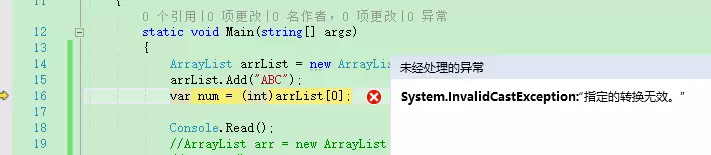

### 1.互动与教学工具

#### 1.1各种工具比较

1. 腾讯课堂

   - 常规版本，需要申请。分为免费、付费。付费功能比较多。

   - 免费的不能看签名，不能生成回放。

   - 优点就是能够形成目录，随时可看。MS_WEB的录播视频：

     https://ke.qq.com/course/1129123?taid=6093841334614691&tuin=25363a4e

     

2. 腾讯极速课堂

   - 是应对疫情的快速开课版本。10分钟开课
   - 优点：快速开课，生成回放
   - 缺点：目录性差。

3. 章鱼云：简单方便，知名度不高。

4. 腾讯会议

   - 优点：多方会谈，可以全体开语音。
   - 缺点：没有签到，不能录屏。

5. QQ视频

   - 优点：快捷、方便；能够随时看到不在线的情况
   - 缺点：屏幕的展示流畅度不如腾讯课堂、会议；不能生成回放、也不能签到。

6. 智慧树

   -  优点：专业的、面向大学培训的网站；课程建设、班级建设、作业、任务、考试、签到、生成课堂记录。
   - 缺点：没有发现基于pc的客户端，只能上传ppt进行讲解，不能展示屏幕。

#### 1.2工具使用

1. 使用腾讯极速课堂进行课堂直播
2. 使用智慧树进行手势签到、课程管理、资料管理


3.使用腾讯课堂网站进行录播视频的学习


### 2.学习中用到的工具

1. typora markdown的编辑工具

   - Markdown 是一种轻量级标记语言，它允许人们使用易读易写的纯文本格式编写文档。

   - Markdown 语言在 2004 由约翰·格鲁伯（英语：John Gruber）创建。

   - Markdown 编写的文档可以导出 HTML 、Word、图像、PDF、Epub 等多种格式的文档。

   - Markdown 编写的文档后缀为 **.md**, **.markdown**。

2. GITHUB最大开源网站

    https://github.com/liuxinfengabc/cultivate

   

3. https://www.yuque.com/ 鱼雀

   -  有道记事本 团队成员超过5人付费

### 3.开发工具

1.   VS2008 /vs2017 开发C#  asp.net
2.  idea  java web/js
3.  webstorm  js/h5
4.  pycharm python
5.  hubilder  mui移动端的h5开发
6.  docker的使用。

### 4.vs2008/vs2017

#### 4.1使用vs创建项目


1. 可以创建app(winform /linuxform)、web(asp.net)，跨平台运行windows/linux(centos ubuntu debian)

   


2. 创建一个web form

    

   

3. 使用web服务器：Tomcat /apache /IIS(微软专用Internet Information System)

     

4. 点击运行  ，激活浏览器chrome 方位 http://localhost:61342/

5. 在chrome浏览器中，F12可以查看网页源码，进行调试和跟踪

    


#### 4.2使用vs进行调试


1. 使用Response.write()输出信息到网页进行调试。

 protected void Page_Load(object sender, EventArgs e)
        {


            String path = System.Environment.CurrentDirectory + "APP_DATA/TEST1.MDF";
            System.Console.WriteLine(path);
            Response.Write(path);
          
            }


​    


2. 设置断点进行调试，图中红色点为程序断点（程序执行到此处，等候命令）

      

   

3. 点击网页刷新，进入后台代码的位置

   

4. 通过 工具栏或者F10 F11等功能键进行代码的执行


5. 查看堆栈

   


#### 4.3使用vs访问数据库


#### 4.4 使用vs2017访问数据库


1. vs2017自带数据sqlexpress数据，链接名称(LocalDB)\\MSSQLLocalDB

​	于程序员来说，编程过程中或多或少会和数据库打交道。如果采用Visual Studio进行程序开发，则微软的Sql Server数据库是最好的选择。但是问题来了，Sql Server数据库动辄几个G，安装后占用的空间也相当大，是不是每个开发人员在开发时都需要安装Sql Server呢？其实，对于小型项目、测试型项目、学习型项目的开发，完全没必要使用Sql Server那么高大上的数据库。微软自己也深知这点，因此，推出了Sql Server数据库的超级简化版本：Sql Server LocalDB。这个小型的数据库完全可以满足普通项目的开发和调试，关键是它只有几十M，可以大大减轻PC的运行压力。本文将简要介绍在Visual Studio 2015中LocalDB数据库的使用方法。

```
 String path = System.Environment.CurrentDirectory+ "APP_DATA/TEST1.MDF";
        //String connStr = "data Source=(LocalDB)\\MSSQLLocalDB;AttachDbFileName=D:\\CAM\\WEBAPPLICATION1\\WEBAPPLICATION1\\APP_DATA\\TEST1.MDF;Integrated Security=True";
        String connStr = "data Source=(LocalDB)\\MSSQLLocalDB;AttachDbFileName=./APP_DATA/TEST1.MDF;Integrated Security=True";
```


            SqlConnection conn = new SqlConnection(connStr);
            if (conn.State == ConnectionState.Closed)
            {
                conn.Open();
            }
            if (conn.State == ConnectionState.Broken)
            {
                conn.Close();
                conn.Open();  
             }

#### 4.4 使用chrome 调试前端js代码


### 5.面向对象程序设计

人：

母胎中，呼吸、营养 远祖（海里生物）；

出生之后，呼吸新鲜空气；


#### 5.1装箱与拆箱

**装箱和拆箱是值类型和引用类型之间相互转换是要执行的操作。**

1. 装箱在值类型向引用类型转换时发生

2. 拆箱在引用类型向值类型转换时发生

object obj = 1;   整型常量1赋给object类型的变量obj；

常量1是值类型，值类型是要放在栈上的，而object是引用类型，它需要放在堆上；要把值类型放在堆上就需要执行一次装箱操作。

```
C:\Program Files (x86)\Microsoft SDKs\Windows\v10.0A\bin\NETFX 4.6.1 Tools\x64\ILDASM.exe
```

IL是.NET框架中中间语言**（Intermediate Language）**的缩写。使用.NET框架提供的[编译器](http://baike.baidu.com/view/487018.htm)可以直接将源程序编译为.exe或.dll文件，但此时编译出来的程序代码并不是CPU能直接执行的机器代码，而是一种中间语言IL（Intermediate Language）的代码(来源百度)

```
using System;
namespace ConsoleApp2
{
    class Program
    { 
        static void Main(string[] args)
        {
            int i = 1;
        }
    }
}
```

IL代码

`.method private hidebysig static void  Main(string[] args) cil managed`
`{`
  `.entrypoint`
  `// 代码大小       4 (0x4)`
  `.maxstack  1`
  `.locals init ([0] int32 i)`
  `IL_0000:  nop`
  `IL_0001:  ldc.i4.1//表示将整型数1放到栈顶（Evalulation stack)` 

 `IL_0002:  stloc.0//从 Evaluation Stack 取出一個值，放到第 0 号变数（V0）`
  `IL_0003:  ret`
`} // end of method Program::Main`


原始代码：

```
using System;
namespace ConsoleApp2
{
    class Program
    { 
        static void Main(string[] args)
        {
            Ojbect i = 1;
        }
    }
}
```

这行语句的IL代码如下：

```
.method private hidebysig static void  Main(string[] args) cil managed
{
  .entrypoint
  // 代码大小       9 (0x9)
  
  //声明object类型的名称为objValue的局部
  .maxstack  1
  .locals init ([0] object obj)
  IL_0000:  nop
  
  IL_0001:  ldc.i4.1  //表示将整型数1放到栈顶
  
  //执行IL box指令，在内存堆中申请System.Int32类型需要的堆空间(heap)
  IL_0002:  box        [mscorlib]System.Int32
  
  //弹出堆栈上的变量，将它存储到索引为0的局部变量中
  IL_0007:  stloc.0
  IL_0008:  ret
} // end of method Program::Main


```

　

拆箱操作：

```
object objValue = 4;
int value = (int)objValue;
```


IL代码

```
.method private hidebysig static void  Main(string[] args) cil managed
{
  .entrypoint
  // 代码大小       16 (0x10)
  .maxstack  1
  .locals init ([0] object objValue,
           [1] int32 'value')
  IL_0000:  nop
  IL_0001:  ldc.i4.4   //将整型数字4压入栈
  IL_0002:  box        [mscorlib]System.Int32
  IL_0007:  stloc.0 //弹出Evalulation stack堆栈上的变量，将它存储到索引为0的局部变量中
  IL_0008:  ldloc.0 //将索引为0的局部变量（即objValue变量）压入栈
  IL_0009:  unbox.any  [mscorlib]System.Int32//执行IL 拆箱指令unbox.any 将引用类型object转换成System.Int32类型
  IL_000e:  stloc.1//将栈上的数据存储到索引为1的局部变量即value
  IL_000f:  ret
} // end of method Program::Main
```


拆箱操作的执行过程是将存储在堆上的引用类型值转换为值类型并给值类型变量。**装箱操作和拆箱操作是要额外耗费cpu和内存资源的，所以在c# 2.0之后引入了泛型来减少装箱操作和拆箱操作消耗。**

#### 5.2 泛型

如果没有泛型，引用https://www.jianshu.com/p/93e8a6dd5571

```csharp
//下面是一个处理string类型的集合类型
 public class MyStringList
    {
        string[] _list;
        public void Add(string x)
        {
            //将x添加到_list中，省略实现
        }
        public string this[int index]
        {
            get { return _list[index]; }
        }
    }
 //调用
 MyStringList myStringList = new MyStringList();
 myStringList.Add("abc");
 var str = myStringList[0];
```


```csharp
示例2
    //如果我们需要处理int类型就需要复制粘贴然后把string类型替换为int类型：
    public class MyIntList
    {
        int [] _list;
        public void Add(int x)
        {
            //将x添加到_list中，省略实现
        }
        public int this[int index]
        {
            get { return _list[index]; }
        }
    }
   //调用
    MyIntList myIntList = new MyIntList();
    myIntList.Add(100);
    var num = myIntList[0];
```

代码大部分是重复的，于是乎，做如下改变：

```csharp
示例3
 public class MyObjList
    {
        object[] _list;
        public void Add(object x)
        {
            //将x添加到_list中，省略实现
        }
        public object this[int index]
        {
            get { return _list[index]; }
        }
    }
 //调用
 MyObjList myObjList = new MyObjList();
myObjList.Add(100);
 var num = (int)myObjList[0];
```

**从上面这三段代码中，我们可以看出一些问题：**

1. int和string集合类型的代码大量重复（维护难度大）。
2. object集合类型发生了装箱和拆箱（损耗性能）。
3. object集合类型是存在安全隐患的（类型不安全）。




**我们必须解决如下问题**
1、避免代码重复
2、避免装箱和拆箱
3、保证类型安全


**泛型：通过参数化类型将类型抽象化，来实现在同一份代码上操作多种数据类型，从而实现灵活的复用。**

另一方面，泛型使得设计如下类和方法成为可能：

**这些类和方法将一个或多个类型的指定推迟到客户端代码声明并实例化该类或方法的时候，这样可避免运行时强制转换或装箱操作带来的成本或风险。**

```cpp
示例4
    //将示例3改装下
    public class MyList<T>
    {
        T [] _list;
        public void Add(T x)
        {
            //将x添加到_list中，省略实现
        }
        public T this[int index]
        {
            get { return _list[index]; }
        }
    }
```

class Test<T> 
{
        public T obj;
        public Test(T obj)      {        this.obj = obj;         }
 }              
 class Program
 {
        static void Main(string[] args) 
        {
            int obj1 = 2;
            Test<int> test1 = new Test<int>(obj1);
            Console.WriteLine("int:" + test1.obj1);
            string obj2 = "hello world";
            Test<string> test2 = new Test<string>(obj2);
            Console.WriteLine("String:" + test2.obj2);
            Console.Read();
        }
    }	

**型参数** T
 类型参数可以理解为泛型的"形参"（"形参"一般用来形容方法的），有“形参”就会有实参。如我们声明的List<string>，string就是实参;List<int> ,int就是实参，而List<string>和List<int>是两种不同的类型。


过**类型参数**解决了代码重复的问题，如何**解决装箱、拆箱以及类型安全**的问题：

```cpp
 //示例5
       List<int> list = new List<int>();
       list.Add(100);//强类型无需装箱
       //list.Add("ABC"); 编译期安全检查报错
       int num = list[0];//无需拆箱  
```

声明泛型类型时，因为确定了**类型实参**，所以操作泛型类型不需要装箱、拆箱，而且泛型将大量安全检查**从运行时转移到了编译时**进行，保证了类型安全。


在示例4中，自定义泛型集合只是添加和获取类型参数的实例，除此之外，没有对类型参数实例的成员做任何操作。C#的所有类型都继承自Object类型，也就是说，我们目前只能操作Object中的成员(Equals,GetType,ToString等)。但是，我自定义的泛型很多时候是需要操作类型更多的成员

新需求，打印员工的信息

```cpp
示例6
    public class Person
    {
        public string Name { get; set; }
        public int Age{ get; set; }
    }
    public class Employee : Person {  }
    public class PrintEmployeeInfo<T>
    {
        public void Print(T t)
        {
            Console.WriteLine(t.Name);//报错
        }
    }
```

| 约束                | 描述                                                         |
| ------------------- | ------------------------------------------------------------ |
| where T：结构       | 类型参数必须是值类型。 可以指定除 Nullable 以外的任何值类型。 |
| where T：类         | 类型参数必须是引用类型；这同样适用于所有类、接口、委托或数组类型 |
| where T：new()      | 类型参数必须具有公共无参数构造函数。 与其他约束一起使用时，new() 约束必须最后指定。 |
| where T：<基类名称> | 类型参数必须是指定的基类或派生自指定的基类                   |
| where T：<接口名称> | 类型参数必须是指定的接口或实现指定的接口。 可指定多个接口约束。 约束接口也可以是泛型。 |
| where T：U          | 为 T 提供的类型参数必须是为 U 提供的参数或派生自为 U 提供的参数 |

​    

```cpp
示例7
 public class PrintEmployeeInfo<T> where T:Person
    {
        public void Print(T t)
        {
            Console.WriteLine(t.Name);
        }
    }
```


### 6.HTML基础

