本文参考了大量的网络内容，如有侵权，请告知。

https://blog.csdn.net/hguisu/article/details/78258430

### 1.系统开发的阶段划分

**特点：集百家之长，从系统开发阶段划分、实际案例讲解、UML图的应用场景分析三个方面进行阐述。**


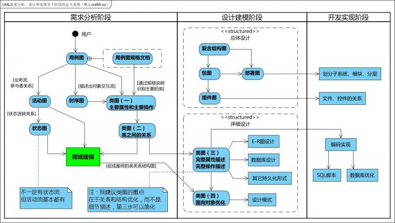


UML图可以应用于需求分析、设计建模、开发实施多个应用场景，只是侧重点不同，细化程度不同。

在需求分析阶段可以用使用用例图、活动图、时序图、类图进行建模。

```
软件工程的一般开发过程：愿景分析、业务建模，需求分析，健壮性设计，关键设计，最终设计，实现……
```


### 2.需求分析

需求分析阶段要业务用例图，活动图，对象状态复杂时需要画状态图。

##### 2.1 基本概念

用例是用户期望具备的功能，每一个用例说明一个系统提供给它的使用者的一种服务或功能。用例的目标是要定义系统的一个行为，但并不显示系统的内部结构。用例名一般为动宾短语，符号是椭圆加用例。

用例图是指由参与者（Actor）、用例（Use Case），边界以及它们之间的关系构成的用于描述系统功能的视图。 用例图（User Case）是外部用户（被称为参与者）所能观察到的系统功能的模型图。

##### 2.2 用例要素构成


##### 2.3 用例的关系

a）参与者与用例间的关联关系：参与者与用例之间的通信，也成为关联或通信关系。


b）用例与用例之间的关系：包含关系（include）、扩展关系（extend）、泛化关系。

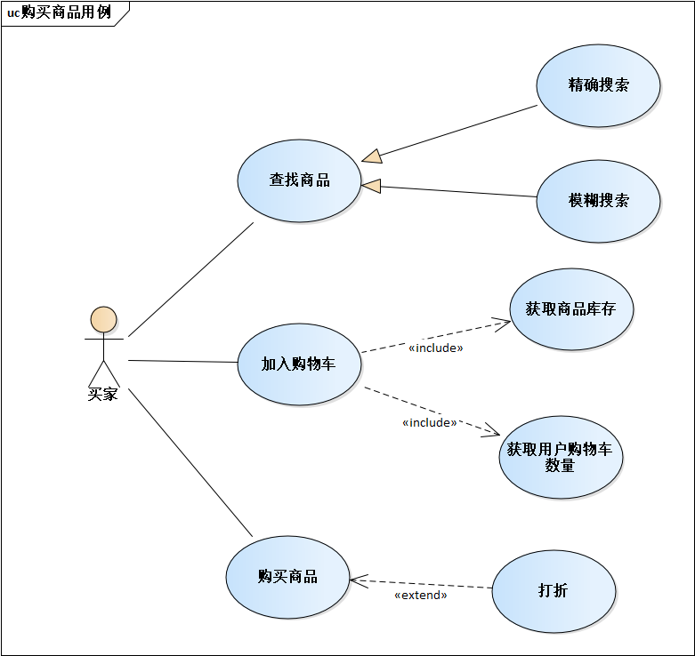


###### 2.3.1 包含关系

用例A,用例B都包含用例C。

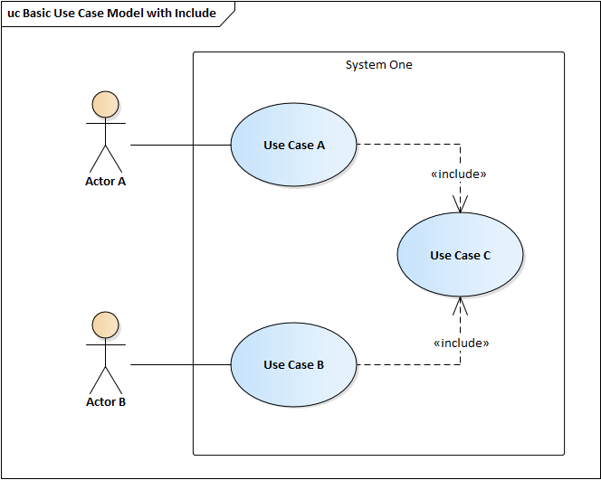

###### 2.3.2 扩展关系

用例A 为基本用例，用例B为扩展用例。


###### 2.3.3 泛化关系

用例B从从里A继承。

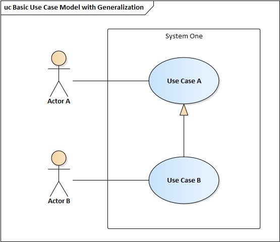

##### 2.4 用例的确定

###### 2.4.1用例图建模及应用

创建用例图模型主要包含3部分内容：

- 识别系统中的角色和用例
- 区分用例之间的先后次序
- 创建用例图模型结构

###### 2.4.2识别系统中的角色和用例

这部分工作通常由系统分析员通过和客户沟通来完成。

要获取系统的用例，首先要找出系统的角色。

要获取系统角色可以在与客户沟通时，询问用户一些问题来识别角色。可以参考下列问题：

- 谁将使用系统的主要功能？
- 是需要系统的支持以完成日常工作？
- 谁负责维护、管理系统并保持系统正常运行？
- 系统需要与哪些外部系统交互？
- 系统需要处理哪些硬件设备？
- 谁对系统运行产生的结果比较感兴趣？

当我们获取到系统角色后，我们可以通过角色来列出它的用例。可以通过回答下列问题来识别用例：

- 每个角色执行的操作有什么？
- 什么角色将要创建、存储、改变、删除或者读取系统中的信息？
- 什么用例会创建、存储、改变、删除或读取这个信息？
- 角色需要通知外部系统的突然变化嘛？
- 系统需要通知角色正在发生的事情吗？
- 什么用例将支持和维护系统？

##### 2.5 业务用例与系统用例

分清业务用例和系统用例，是做需求分析的第一步:

用例 use case，或译使用案例、用况，是软件工程或系统工程中对系统如何反应外界请求的描述，是一种通过用户的使用场景来获取需求的技术。每个用例提供了一个或多个场景，该场景说明了系统是如何和最终用户或其它系统互动，也就是谁可以用系统做什么，从而获得一个明确的业务目标。

**业务用例：属于业务范围的概念。顾名思义，在具体用户所接触的真实业务中总结出来的例子，体现了需求，属于功能性需求，需要actor来实现的**

**系统用例：属于系统范围的概念。也可理解为要实现某个业务用例的系统级实现**

系统用例并不是业务需求的细分

最常见的例子就是档案管理，从业务用例来说，添加档案，修改档案，删除档案，对于系统用例。可能修改档案比较麻烦，就只是添加档案，删除档案就可以实现业务层面的功能性需求。

比如点菜：在业务层面，点菜人员只需要点菜，或者是取消点菜，但是在需求用例中需要体现增加菜品，减少菜品，取消点单

 

以下是百度结果：

业务用例是用来捕获功能性需求的，功能性需求是由actor的业务目标来体现的。也就是对于actor来说，他所负责的业务需要由一系列的业务目标组成。比如一个档案管理员，他的业务目标就是维护档案。比如论坛管理员，他的业务目标有维护用户，维护帖子等..这些业务目标构成actor职责的全部。业务用例体现了需求。
而需求的实现有多种方式。如何实现它，是由系统用例来体现的，它们并不是一个简单的细分关系，虽然看上去象。就说维护档案吧，这样一个业务目标，会有多种不同的用例场景去完成它，这些场景包括如何增加档案，如何修改档案，如何删除档案....对于系统用例来说，就是通过分析这些场景，来决定哪些场景中的哪些部分是要纳入系统建设范围的。比如维护档案业务用例中，假设由于某个原因，修改档案很困难，只能通过先删除，再全部重建的方式来实现，那么系统用例就增加档案，删除档案，而没有修改档案。
业务用例和系统用例是分别站在客户的业务视角和系统建设视角来规划的。业务用例不是接近，而是完全的直接需求，系统用例也不是业务逻辑的详细划分，而是系统对需求的实现方式，但不是与程序设计无关，它只是说，要建设的系统功能性需求由这些系统用例构成。
所以业务用例和系统用例都是需求范畴，它们分别代表了业务范围和系统范围。

```


```


#### 1.2原型界面设计

使用Axure画出原型界面。


#### 1.3领域模型设计

##### 1.3.1建模背景

```
按照一般的项目管理过程，“需求”之后是“分析”，领域模型（ domain model（业务对象模型））是完成从需求分析（自然语言）到面向对象设计的一座桥梁。用例是没有类的概念的，是纯自然的语言（比如英语、汉语）写的，因为用例实际上由客户口述给我们、然后由我们形成文档化的用例文档，无法完成从自然语言到面向对象语言的转换。

领域模型，顾名思义就是显示最重要的业务概念和它们之间关系，是真实世界各个事物的表示（现实世界的可视化抽象字典）。是描述业务领域（业务实体）的静态结构，而不是软件中各构件的表示（类：表示业务概念，通常只包含重要属性；关联、泛化：表达概念之间的关系）。用来帮助我们理解相关领域知识的模型，是描述业务用例实现的对象模型。

领域模型过程中识别出来的对象和具体的语言无关，也没有方法。换句话说，public、private、函数这些面向对象的属性在领域模型阶段不需要分析出来。
参考:
https://www.cnblogs.com/ppgeneve/p/5089113.html
```

##### 1.3.2 如何建设模型

领域模型”阶段我们要做什么、该怎么做。**领域建模的三字经方法:找名词、定属性、连关系。** 

（1）找出用例模型中的名词，尽可能多的找出概念类（识别方法：概念类分类列表、名词性短语）。

```
a.概念分类列表：人、事物、地点、组织、概念、事件、规则、抽象名词、交易项目、角色、设备、组织结构（对用例进行识别：实体、过程中的信息、角色的输入输出、操作设备等）

b.名词分析法：识别问题域和用例描述中的名词和名词性短语作为候选的概念类和属性，从候选项中，摒弃多余的名词，确定最终的对象（注意是作为类还是属性，类可以是一种标识、状态和行为）
```

（2）然后识别这些名词本身的相关信息，定属性。

```
a.语法：
      可见性 属性名：类型 多重性=默认值{特性表}  
      [可见性] 属性名 [：类型] [=初始值]
b.属性类型是简单的数据类型为佳，如果是复杂概念，考虑是否单独作为一个概念类
c.任何属性都不表示外键，即不应该用属性来联系概念类，区别于数据库设计中的外键
```

（3）以及名词之间的相互关联关系，关联、继承、依赖。

```
关联：类之间的某种语义关系包括聚合，组合
继承：一般到特殊
依赖：表明一个元素（源元素）的定义或实现依赖另一个元素（被依赖元素）的定义或实现
```


###### 1.找出用例模型中的名词

原有用例如下，用蓝色加黑标出名词（重复的就不标了）：

1）**顾客**携带**商品**到**收银台**；

2）**收银员**扫描**商品条形码**；

3）**系统**根据条形码获取并显示**商品信息**；

4）收银员重复2~3步，直到所有商品扫描完毕；

5）系统计算**商品总额**；

...

n）系统打出**商品清单**，完成**交易**。

这个用例中的名词有“顾客”、“商品”、“收银台”、“收银员”、“商品条形码”、“系统”、“商品信息”、“商品总额”、“商品清单”、“交易”。稍加整理：

1）“顾客”、“收银员”是系统的外部对象，不需要我们进行设计，但这些对象要和系统进行交互；

2）“商品”、“商品条形码”、“商品信息”、“商品总额”、“商品清单”、“交易”是领域对象，但“商品条形码”、“商品信息”可以算作“商品”的属性、“商品总额”可以算作“交易”的属性，最后从这个用例总结出来的领域对象有**“商品”、“商品清单”、“交易”**三个。

###### 2.识别这些名词本身的相关信息

一个对象的属性可能分布在多个用例中，因此可以通过迭代不断的完善一个对象的属性，大家可以看到，我们在第一步中的样例就已经分析了一部分了：“商品条形码”、“商品信息”可以算作“商品”的属性。

对象除了属性外，还有一些约束或者限制，这些在用例中可能有，也可能没有，这就需要分析人员来发现了。比如说交易金额必须大于0.1元小于99999元这种约束，用例中不一定会体现，可能需要分析人员向客户咨询。

###### 3.识别对象间的关系

面向对象设计就是依靠对象间的互相协作来配合完成相应的功能，因此识别出对象和对象本身的属性外，还要识别对象间的关系，例如1对多、1对1、依赖等，详细的各种关系可以参考UML的标准定义。

我们以第一步识别的三个对象为例：“商品清单”包含多个“商品”、一次“交易”对应一个“商品清单”、一个“商品”只能属于一个“交易”等。

###### 4.画出领域模型UML图

结合前三步的分析，画出UML领域模型图。

 参考领域模型：

https://wenku.baidu.com/view/e5ca5879773231126edb6f1aff00bed5b9f37324.html


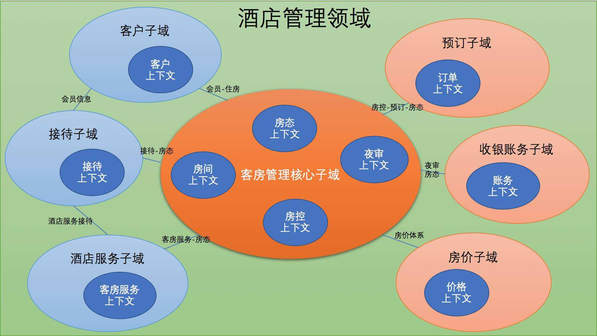


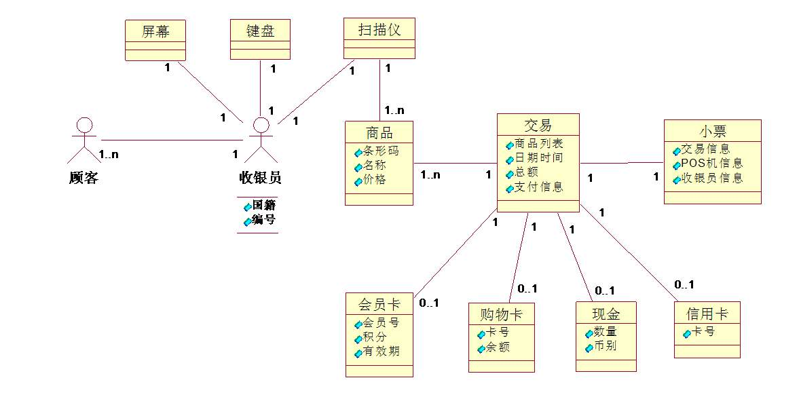


#### 1.4 活动图进行需求分析

​     活动图是状态机的一个变体，用来描述执行算法的工作流程中涉及的活动。活动状态代表了一个活动：一个工作流步骤或一个操作的执行。活动图描述了一组顺序的或并发的活动。活动视图用活动图来体现。

​    活动图（Activity Diagram）可以实现对系统动态行为的建模，主要是将用例细化，即用例内部的细节可以以活动图的方式描述。活动图描述活动的顺序，主要表活动之间的控制流，是内部处理驱动的流程，在本质上是一种流程图。先看一下基本图标。


​	 活动图可以认为是用例的细化。

1. 购物场景：

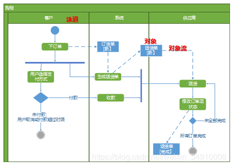

2. 支付场景


#### 1.5 用序列图画业务流程

在潘加宇的《软件方法》[7]中比较了活动图和序列图，推崇使用序列图来表达业务，称之为业务序列图，然后基于业务序列图来识别系统用例（区别于业务用例，即是本文所称用例）。可以发现当处理多个业务角色时，序列图确实拥有与活动图相当的表现力。那么，序列图如果用在用例规约中，将是什么景象？ 

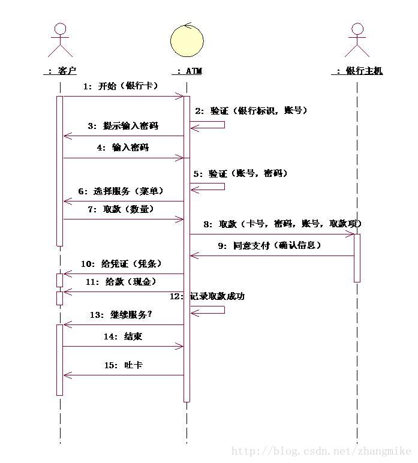

​																图片来源于网络

可以看到序列图表达的内容与基本流文字是一样的，更加直观，但显然的需要更多时间，而且并不能充分说明交互细节，毕竟在图片上不适宜打上密密麻麻的字。更关键的上述这幅图中有“银行主机”，这就超出了单个用例的范畴。

总的来说，序列图不是用例的标准配置，在用例规约中使用序列图可以更好的呈现事件流，但其将花费更多时间，如果在单个用例内再考虑其它角色和其它用例，那么所费时间更多，而且有可能与前期业务分析重复，也有可能与后续设计分析重复。

在编写有效用例一书中，明确指出在用例规约中画序列图是不合适的。

参考：
https://www.cnblogs.com/kubixuesheng/p/5156492.html
https://wenku.baidu.com/view/0123d837abea998fcc22bcd126fff705cd175c45.html


```
业务序列图的组成：业务执行者、业务工人、业务实体，以及三者间的交互，以完成某个业务用例的实现流程。业务工人[Business worker]——位于业务组织内部，负责业务流程中某些工作的人员。比如银行柜员，诊所的医生。业务实体[Business Entity]——在业务用例的实现流程中，业务工人所使用的“系统”。例如银行的数钞机，学校的校园卡系统。业务实体可以和业务工人相互取代各自的职责。


采用序列图来描述业务现状的步骤：

　　1.识别业务对象：业务执行者、业务工人、业务实体；

　　2.确定业务对象间的职责、协作及交互顺序

　　3.绘制业务序列图。

　　其中绘制图的时候，生命线（Lifeline）是一条垂直的虚线，用来表示序列图中的对象在一段时间内的存在

　　

　　示例：比如为某家招聘公司进行业务建模——画出业务现状序列图，招聘的业务用例描述：招聘公司在XXX市人才交流中心前台，要求发布招聘信息，并向工作人员出示公司资质证明，工作人员核实资质的有效性，招聘公司将招聘简介给工作人员。工作人员在招聘记彔本上填写公司招聘职位，招聘条件，以及公司简介等信息，并要求招聘公司核实，招聘公司核实无误后，工作人员将招聘信息用彩纸张贴在招聘信息栏内，工作人员向招聘公司收取一定费用。（注意：在现实工作中，类似如上的信息都是分析师与组织的业务专家深入沟通后才能获得的）。本例的业务对象是，招聘公司（业务执行者），工作人员（业务工人），找到业务对象之后，开始确定各个对象之间的职责，交互……
```

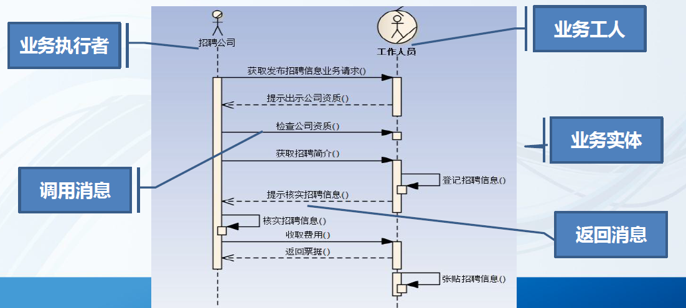


### 2.架构设计

#### 2.1生产力与架构

架构可分为**业务架构、应用架构、技术架构**，业务架构是**生产力**（战略），应用架构是**生产关系**（战术），技术架构是**生产工具**（装备）。业务架构决定应用架构，应用架构需要适配业务架构，并随着业务架构不断进化，同时应用架构依托技术架构最终落地。 

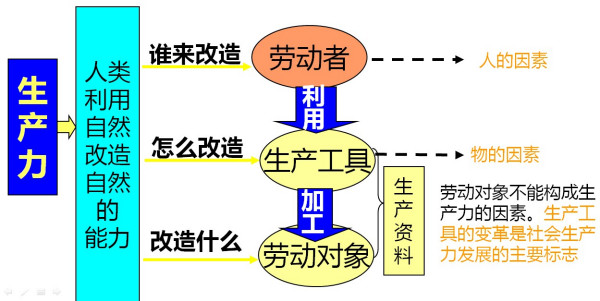

1. 生产力：指具有一定生产经验和劳动技能的**劳动者**和所使用的**生产资料**结合起来, 从而在**物质资料生产过程中所发生的力量**, 也就是人类在生产过程中征服和改造自然界, 并获得适合自己需要的物质资料的能力。

2. 生产关系：指人们在物质资料生产过程中结成的**社会关系**。它的具体内容包括人们在物质资料的生产、交换、分配、消费等方面的关系。生产资料所有制是生产关系的基础。一定的生产资料所有制形式, 决定人们在生产中一定的地位和相互关系、一定的换关系、一定的产品分配和消费关系。

   生产力决定生产关系，生产关系要适应生产力的发展，生产关系是生产力发展的形式，生产关系会反作用于生产力。这是唯物史观的基本原理。 生产关系有两种基本类型：一是以[公有制](https://baike.baidu.com/item/公有制)为基础的生产关系，二是以[私有制](https://baike.baidu.com/item/私有制)为基础的生产关系

3. 生产工具：又称劳动工具，是人们在生产过程中用来直接对劳动对象进行加工的物件。它被用于劳动者和劳动对象之间，起传导劳动的作用。是劳动资料的基本的和主要的部分，是机械性的劳动资料。从原始人的石斧、弓箭，到现代化的各种各样的机器、工具、技术设备等，都同样起着传导劳动的作用，均属生产工具。


#### 2.2架构划分

1. 系统架构：指的完整系统的组成架构。**包括业务规划，业务模块、业务流程，对整个系统的业务进行拆分，对领域模型进行设计，把现实的业务转化成抽象对象。**例如系统分成几个部分？服务平台、管理门户、终端门户、ATM门户、外部系统以及接口、支撑系统等，将这些系统进行合理的划分。然后再进行功能分类细分，例如服务平台内部划分为系统管理、用户管理、帐号管理、支付管理、接口层、统计分析等逻辑功能。总之，将整个系统业务分解为逻辑功能模块，并且科学合理，就是系统架构。

   

2. 应用架构：应用架构定义系统有哪些应用、以及应用之间如何分工和合作。应用作为独立可部署的单元，为系统划分了明确的边界（生产关系，各司其职）。应用架构深刻影响系统功能组织、代码开发、部署和运维等各方面。这里所谓应用就是各个逻辑模块或者子系统。主要考虑部署，例如不同的应用如何分别部署，如何支持灵活扩展、大并发量、安全性等，需要画出物理网络部署图。按照应用进行划分的话，还需要考虑是否支持分布式SOA。

3. 技术架构：从技术层面描述，主要是分层模型，例如持久层、数据层、逻辑层、应用层、表现层等，然后每层使用什么技术框架，确定组成应用系统的实际运行组件（lvs，nginx，tomcat，php-fpm等），这些运行组件之间的关系，以及部署到硬件的策略。系统架构的设计要求架构师具备软件和硬件的功能和性能的过硬知识，这也是架构设计工作中最为困难的工作。

4. 数据架构：

5. 代码架构：

6. 部署拓扑架构（物理架构）：

#### 2.3战略与战术设计

系统架构是战略设计与战术设计的完美结合：

- **战略设计**：业务架构用于指导架构师如何进行系统架构设计。

- **战术设计**：应用架构要根据业务架构来设计。

- **战术实施**：应用架构确定以后，就是技术选型。

  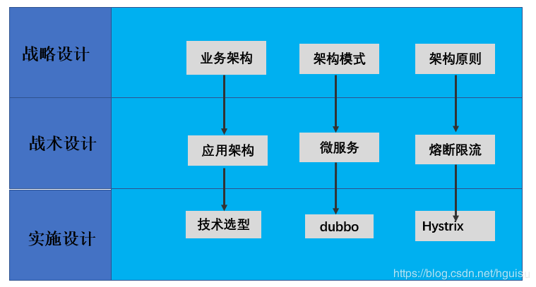

#### 2.4业务架构

1. 总体架构图（京东业务架构）

   

2. 业务模块（功能结构图）

3. 业务流程

#### 2.5 应用架构

1、职责划分:   明确应用（各个逻辑模块或者子系统）边界
   1）逻辑分层
   2）子系统、模块定义。
   3）关键类。
2、职责之间的协作：
   1）接口协议：应用对外输出的接口。
   2）协作关系：应用之间的调用关系。

    应用分层有两种方式：
    
    一种是水平分（横向），按照功能处理顺序划分应用，比如把系统分为web前端/中间服务/后台任务，这是面向业务深度的划分。
    
    另一种是垂直分（纵向），按照不同的业务类型划分应用，比如进销存系统可以划分为三个独立的应用，这是面向业务广度的划分。
    
     应用的合反映应用之间如何协作，共同完成复杂的业务case，主要体现在应用之间的通讯机制和数据格式，通讯机制可以是同步调用/异步消息/共享DB访问等，数据格式可以是文本/XML/JSON/二进制等。
    
     应用的分偏向于业务，反映业务架构，应用的合偏向于技术，影响技术架构。分降低了业务复杂度，系统更有序，合增加了技术复杂度，系统更无序。
    
     应用架构的本质是通过系统拆分，平衡业务和技术复杂性，保证系统形散神不散。
    
     系统采用什么样的应用架构，受业务复杂性影响，包括企业发展阶段和业务特点；同时受技术复杂性影响，包括IT技术发展阶段和内部技术人员水平。业务复杂性（包括业务量大）必然带来技术复杂性，应用架构目标是解决业务复杂性的同时，避免技术太复杂，确保业务架构落地。
#### 2.6 技术架构


#### 2.7 物理架构

 拓扑架构，包括架构部署了几个节点，节点之间的关系，服务器的高可用，网路接口和协议等，决定了应用如何运行，运行的性能，可维护性，可扩展性，是所有架构的基础。这个图主要是运维工程师主要关注的对象。

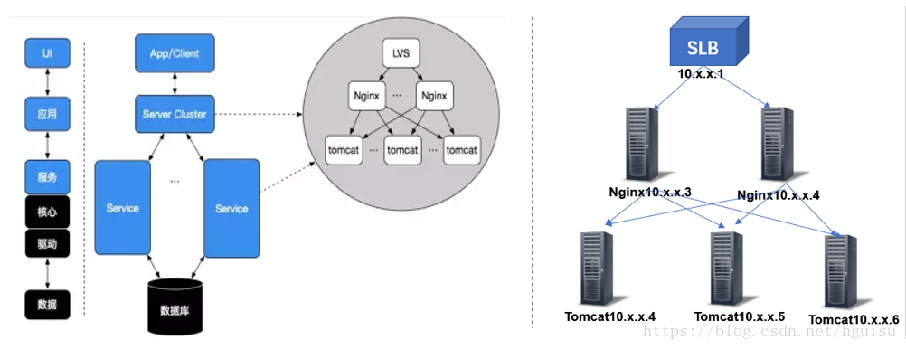

### 3.模块结构/详细设计

#### 3.1 模块接口

##### 3.1.1 表格

##### 3.1.2 UML接口图


#### 3.2 状态变迁


#### 3.3 数据库设计


#### 3.4 类图


### 4. UML十八般武器


基本思路： 

**特点：集百家之长，从系统开发阶段划分、实际案例讲解、UML图的应用场景分析三个方面进行阐述。**


1. UML讲解

```
1. 用自然界讲解UML图。形象有趣的案例。 动物王国/疯狂动物城？

2. 用真实项目案例进行观摩（有真实系统，能够运行）github?  分布式能源运维？钉钉？禅道？

3. 用一个小的项目管理系统布置作业（简单可靠），
   人员管理 权限体系  成本管理 进度管理  报销管理  
```

2. 从项目应用的角度进行讲解，每个图在项目开发不同的阶段的应用。

   ```
   在UML系统开发中有三个主要的模型：
   功能模型: 从用户的角度展示系统的功能，包括用例图。
   对象模型: 采用对象，属性，操作，关联等概念展示系统的结构和基础，包括类图。
   动态模型: 展现系统的内部行为。 包括序列图，活动图，状态图。
   ```

   

#### 4.1 UML思维导图

UML中有3种构造块：事物、关系和图。

1. 事物是对模型中最具有代表性的成分的抽象；

   ```
   构件事物是名词，是模型的静态部分。
   行为事物是动态部分，表示行为。
   分组事物是组织部分。
   注释事物是解释部
   ```

2. 关系是把事物结合在一起

   ```
   依赖：一个事物变化会引起另一个事物变化。
   聚集：特殊的关联，描述整体与部分的组合关系。
   泛化：是一种特殊与一般的关系，如子元素（特殊）与父元素（一般），箭头指向父元素。
   实现：类元之间的关系，其中一个类元指定了由另一个类元保证执行的契约。一般用在接口和实现他们的类之间或用例和实现它们的协作之间。
   ```

3. 图聚集了相关的的事物。

​      UML提供9种视图：类图、对象图，用例图，序列图、协作图，状态图、活动图，构件图和部署图。


```

```


#### 4.2  静态结构

##### 4.2.1  类图


   类图实例：


##### 4.2.2  对象图

#### 4.3  动态行为图

##### 4.3.1 状态图

 用来描述一个特定的对象所有可能的状态,以及由于各种事件的发生而引起的状态之间的转移和变化。
并不是所有的类都需要画状态图，有明确意义的状态，在不同状态下行为有所不同的类才需要画状态图。如下，
一个机器的状态图 

```
https://blog.csdn.net/pzq915981048/article/details/83038008
```

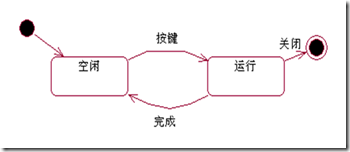

再如CD Player的状态图：


不同对象之间的状态转换。

1.  原始状态图

​            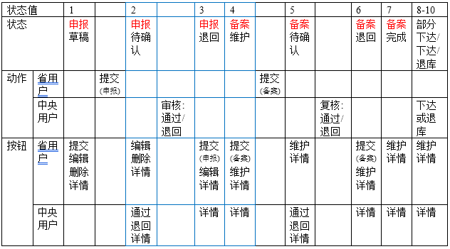            

2. 通过UML修改后的状态图

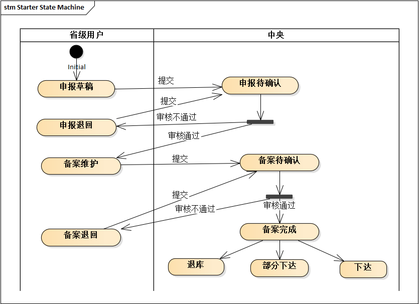


使用状态图，能更清晰体现出Action State的转换关系。

##### 4.3.2 活动图

 活动图(activity diagram)是UML的动态视图之一，用来描述事物或对象的活动变化流程。活动图可看作状态图的特殊形式。**特殊性在于活动图中的一个活动结束后将立即进入下一个活动而不需要事件触发活动的转移。** 活动图用于描述系统的工作流程和并发行为。活动图被设计用于简化描述一个过程或操作的工作步骤。例如，可以用活动图对一个软件的开发过程建模；还可以对诸如求Fibnacci数列第n个数的数值之类的操作进行建模。


4.2.1 活动图组成元素

```
▪活动（Activity）
▪动作流（Action Flow）
▪分支（Branch）与合并（Merge）
▪分叉（Fork）和汇合（Join）
▪泳道（Swimlane）
▪对象流（Object Flow）
```


###### 4.2.1 带泳道的活动图

```
泳道代表特定含义的状态职责的部分。在活动图中，每个活动只能明确的属于一个泳道，泳道明确的表示了哪些活动是由哪些对象进行的。
每个泳道都有一个与其他泳道不同的名称。
每个泳道可能由一个或者多个类实施，类所执行的动作或拥有的状态按照发生的事件顺序自上而下的排列在泳道内。


```

###### 4.2.2 活动图绘制要点

```
⑴ 识别要对工作流描述的类或对象。找出负责工作流实现的业务对象，这些对象可以是显示业务领域的实体，也可以是一种抽象的概念和事物。找出业务对象的目的是为每一个重要的业务对象建立泳道。

⑵ 确定工作流的初始状态和终止状态，明确工作流的边界。

⑶ 对动作状态或活动状态建模。找出随时间发生的动作和活动，将它们表示为动作状态或活动状态。

⑷ 对动作流建模。对动作流建模时可以首先处理顺序动作，接着处理分支与合并等条件行为，然后处理分叉与汇合等并发行为。

⑸ 对对象流建模。找出与工作流相关的重要对象，并将其连接到相应的动作状态和活动状态。

⑹ 对建立的模型进行精化和细化。

```


##### 4.3.3 时序图

类图模型描述了系统的类及类之间的关系。类图模型也称为系统的静态结构，因此从类图模型中我们还看不到业务的处理过程以及类与类交互的信息，在UML建模语言中，这些信息是通过顺序图来描述的。

**顺序图用于描述在业务处理过程中类之间的交互顺序，这些交互顺序是在场景或用例的信息流中发生的。由于描述的是动态行为，顺序图中类被称为对象，也就是实例化后的类。**

**在顺序图中共有四个基本符号：**

（1）参与者符号，由一个方框加一个小人图形表示，小人图形在方框之上，方框内写入参与者的名称；

参与者是一个外部、物理的人，它扮演用户的角色，代表物理的人。对象是系统中被实例化的类，例如人脉系统的用户类在系统运行过程中，会创建多个对象，每个对象就是类的一个实例，一个实例对应一个外部参与者。

（2）对象符号，由一个方框表示，方框内写入对象的名称；

（3）生命线符号，由虚线或狭窄的竖直方框表示；

**竖直的虚线称为生命线**，每一个参与者和对象都有生命线，它用于描述场景内的参与者和对象的生命周期，时间是从上到下，生命线显示了消息的顺序，消息沿生命线从上到下依次发生。

（4）消息符号，有带消息描述的方向箭头表示。下图是一个典型的顺序图，表明了顺序图要使用的通用格式和符号。


​															图 1 顺序图的符号

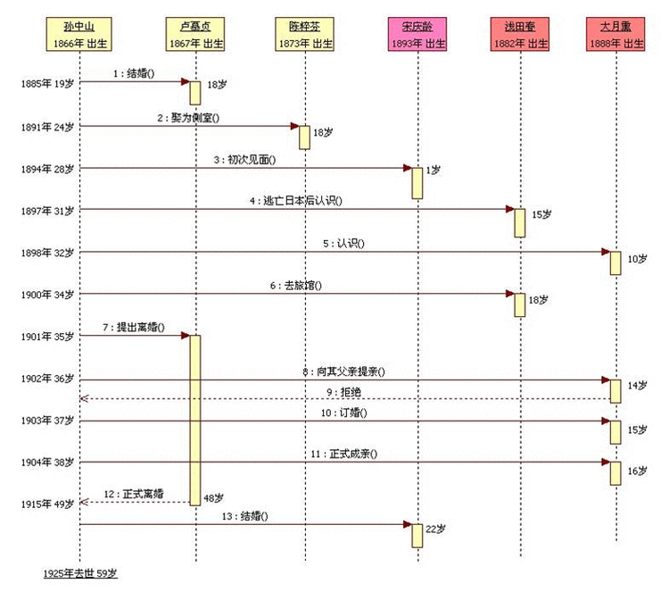


**对象生命线上的长条矩形框表示对象处于激活状态**，当一条消息传递给对象的时候，对象响应该消息并触发对象的某个行为，这时该对象就处于激活状态。当对象没有被激活时，对象处于休眠状态，等待接收消息被激活。

在顺序图中，对象之间的交互是通过发送和接收消息来实现的。一个对象向另一个对象发送消息并希望得到回应时，会有两种情况，**一种情况是暂停活动并等待消息的回应，直至收到消息回应后再开启活动，这是同步消息；另外一种情况是不管是否收到消息的回应，活动照样执行，即不需要暂停活动来等待消息的回应，这是异步消息**。

在顺序图中，还有一种消息就是自关联消息，自关联消息就是对象向自己发送消息。例如，对象在活动中调用内部的方法或函数。

下图是各种消息的表示方法。

图 2 顺序图中消息的表示方法

```

```

　消息的名字代表责任和目的！！！具体格式就是，A—》B，A请求B做某事的过程，注意是B做事情，A只请求，如下对比；


消息的方向代表了责任的委托！绝不是数据的流动！如下对比：

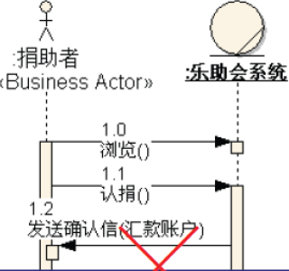


在绘制顺序图模型时，可能需要绘制一些流程控制，例如循环和条件流程控制，消息机制无法绘制这些流程控制。顺序图另外提供了“片段”机制用于描述比较复杂的动作序列，支持的片段有循环片段、可选片段、备用片段和其他片段。

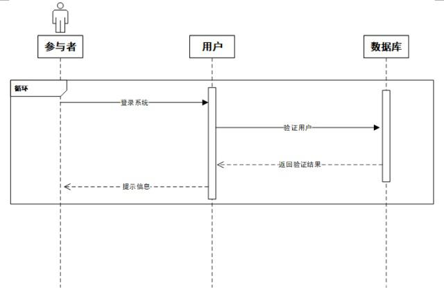图 3 用户登录顺序图

上图是用户登录顺序图。用户在登录系统的过程中，可能会输错账号或密码，系统允许用户重新输入账号或密码再次登录。因此用户的登录过程是一个循环流程，在顺序图用循环片段来表示。


#### 4.3才艺比拼

3. 活动图与流程图的区别
   活动图描述系统使用的活动、判定点和分支，看起来和流程图没什么两样，并且传统的流程图所能表示的内容，大多数情况下也可以使用活动图表示，但是两者是有区别的，不能将两个概念混淆。

     活动图与流程图的区别：
     ⑴ 流程图着重描述处理过程，它的主要控制结构是顺序、分支和循环，各个处理过程之间有严格的顺序和时间关系
     活动图描述的是对象活动的顺序关系所遵循的规则，它着重表现的是系统的行为，而非系统的处理过程。
     ⑵ 活动图能够表示并发活动的情形，而流程图不能。
     ⑶ 活动图是面向对象的，而流程图是面向过程的。

4. 活动图与状态图区别
   活动图与状态图都是状态机的表现形式，但是两者还是有本质区别：
     状态图着重描述从一个状态到另一个状态的流程，主要有外部事件的参与。
     活动图着重表现从一个活动到另一个活动的控制流，是内部处理驱动的流程

5. 活动图与顺序图的区别：

  6. 活动图描述的是对象活动的顺序关系所遵循的规则，它着重**表现的是系统的行为**，表现**数据业务流程**，而非系统的处理过程。

  7. 顺序图**着重描述处理过程**，它的主要控制结构是顺序、分支和循环，各个处理过程之间有严格的顺序和时间关系。

     使用阶段：

     **在需求分析阶段使用：用例图和活动图。**

     **在详细设计阶段使用：时序图、协作图**

     

     协作图展示对象的交互关系
     时序图主要侧重于对象间消息传递在时间上的先后关系, 
     而协作图表达对象间的交互过程及对象间的关联关系，或者说为空间上的关系

#### 4.10 状态图与状态模式

##### 4.4.1文档的状态流程

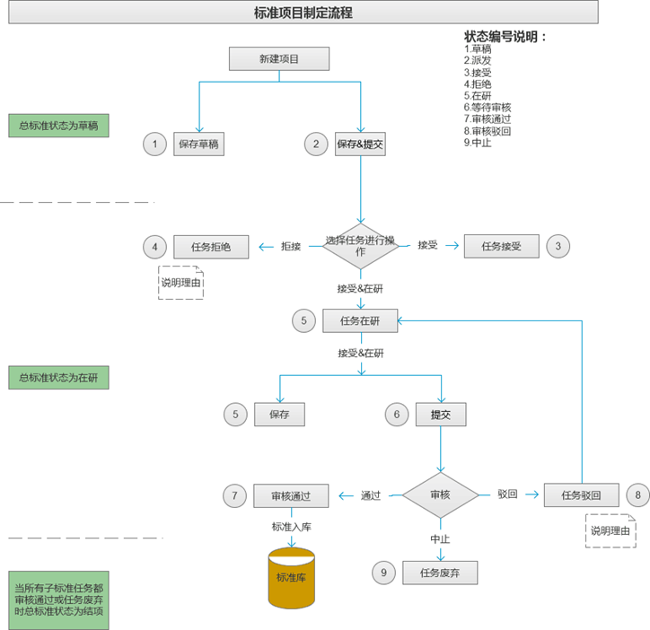

问题：

```
1.状态定义不清晰,容易产生歧义。
2.动作与状态没有分开。
```

##### 4.4.2 设计模式-状态模式

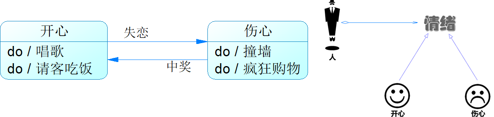


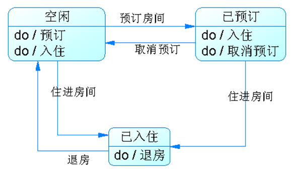

```
在很多情况下，一个对象的行为取决于一个或多个动态变化的属性，这样的属性叫做状态，这样的对象叫做有状态的 (stateful)对象，这样的对象状态是从事先定义好的一系列值中取出的。当一个这样的对象与外部事件产生互动时，其内部状态就会改变，从而使得系统的行为也随之发生变化。在UML中可以使用状态图来描述对象状态的变化。

状态模式(State Pattern) ：允许一个对象在其内部状态改变时改变它的行为，对象看起来似乎修改了它的类。其别名为状态对象(Objects for States)，状态模式是一种对象行为型模式。

```

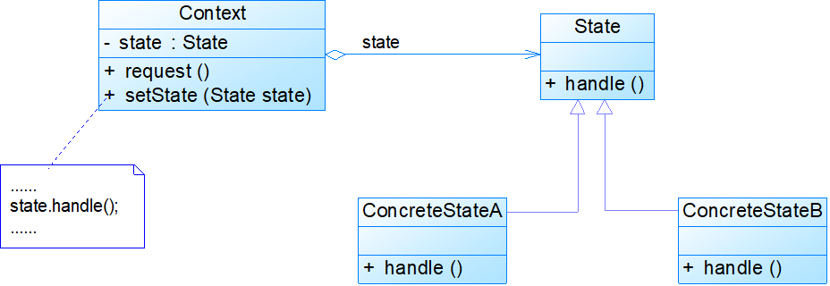

##### 4.4.3修改后的状态图


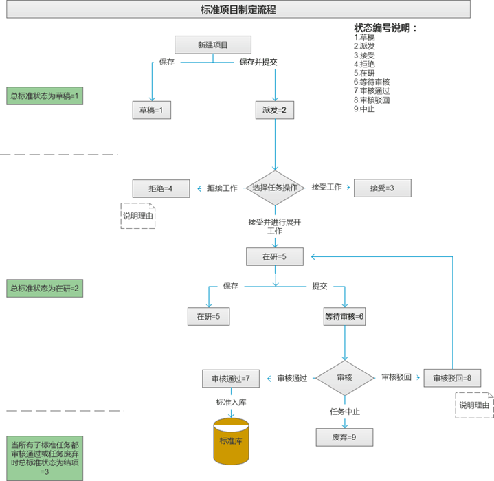


```
1.用线标识Action(动作)
2.用文本框标识State(状态)
清晰，直观。
```

优化后的版本：


优化：泳道图进行优化：


4.4.4 编程实现


```
在每个页面对应的服务中实现状态转换
1、保存函数
if(State==1  &&Action==1)
		State=2
2、提交函数
if(State==2 &&Action==2)
		State=3

3、任务接受函数
     if(State==2  &&Action==4)
		State=4   

```

缺点：
1）多个编程者分别实现，容易出错
2）状态流程改动，需要全局替换，维护量大


改进后：

```
getState(Action,currentState)
{
	int nextState=;
	if(State==2  &&Action==3)
		NextState=3;
	else if(state==2&& Action==4)
	      NextState=5;
	……
	return nextState;	
}

优点：
1）单独状态函数，方便修改
2）独立控制

```


```

Struct{ int aciton ,int currentState,int  Next State}status; 
Map <string key, status>mapState?

getState(Action,currentState)
{
	key=Action+currentState;
	return mapState.getKey(key);
}

优点：
1）状态放到配置信息中，对外开发
2）可以写成独立的Util


```


Java代码

```
package cn.weld.utils;
import java.util.HashMap;
import java.util.Map;
//usage: StateMachine.getInstance.getNextState();

public class  StateMachine {

    private Map<String ,Status>mapState=new HashMap<String ,Status>(); 
      private static StateMachine singletonState = new StateMachine();    
      public static StateMachine getInstance() {
            return singletonState;
     }
    private StateMachine()  {
        Status sta=new Status(1,2,3); 
        mapState.put(sta.getKey(), sta);
        sta=new Status(1,2,4);//--->
        mapState.put(sta.getKey(), sta);
    }

    public int getNextState(int action ,int currentState){
        String key=String.format("%d%d",currentState+action);
        return mapState.get(key).getNextState();
    }

    private class Status {
        int currentState;
        int action;
        int nextState;
        String key;
        Status(int currentState,int action,int nextState){
        this.currentState=currentState;
        this.action=action;
        this. nextState=nextState;
        this.key=String.format("%d%d",currentState+action);
    }

    public int getNextState() {
        return nextState;
    }
    public String getKey() {
        return key;
    }
}
```

### 5. EA安装与使用


```

 
1、你还在没经过设计就直接敲代码吗？ 设计先行的理念哪去了？
2、你难道不想要有一种工具，可以把你设计的东西直接转换成代码或者sql语句，以减轻你的工作量吗？
3、你想一直都敲代码吗？程序员可不是吃青春饭的，时间久了，就该要好好考虑转变开发角色的事情了。


一、什么是EA？
Enterprise Architect 是Sparx Systems 公司的旗舰产品。它覆盖了系统开发的整个周期，除了开发类模型之外，还包括事务进程分析，使用案例需求，动态模型，组件和布局，系统管理，非功能需求，用户界面设计，测试和维护等。    
```

#### 5.1 EA文件合并

1. 导出xml文件

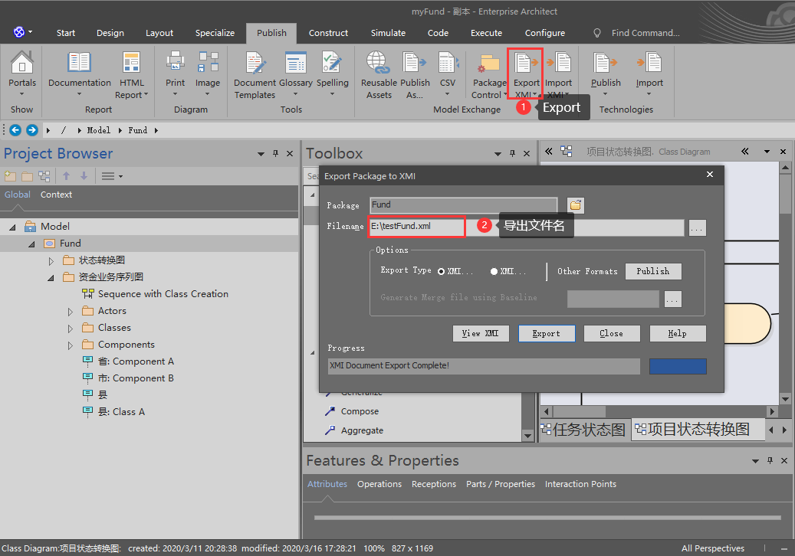

2. 导入xml文件

   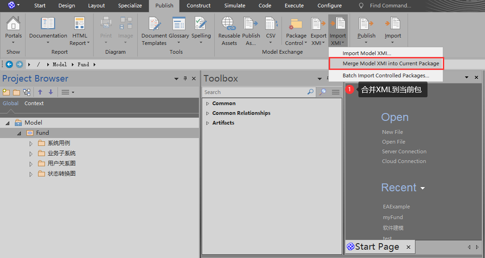

3. 合并

   注意经过测试XML File也需要选择 和Merge相同的文件。

   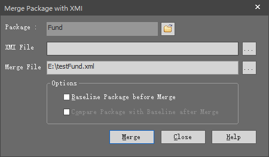