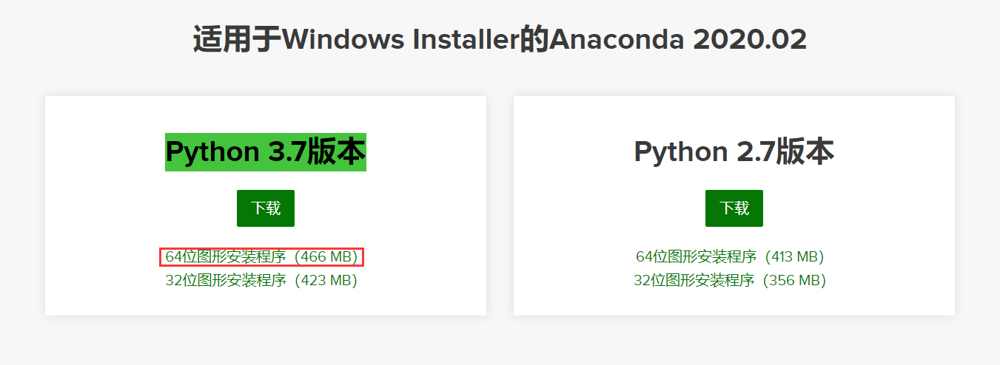
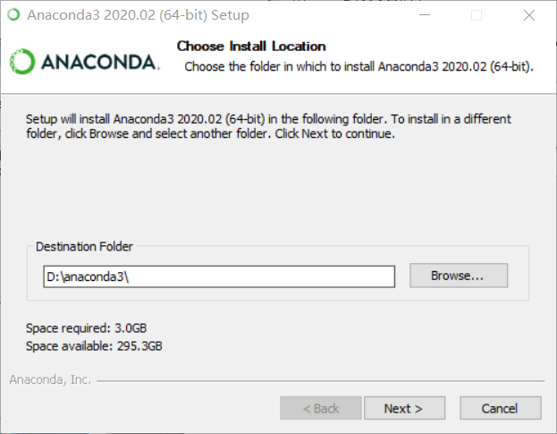
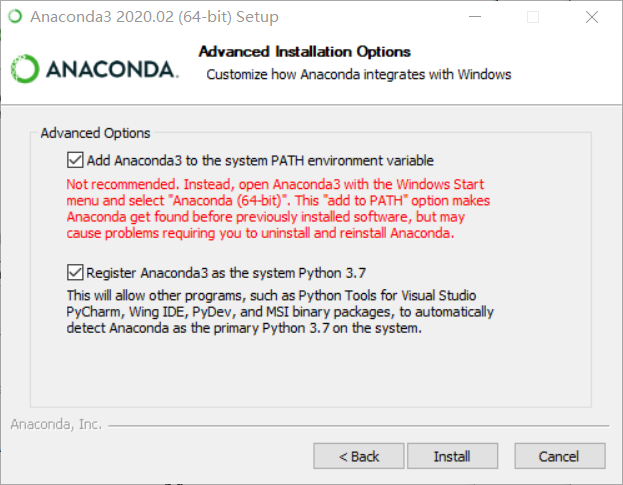
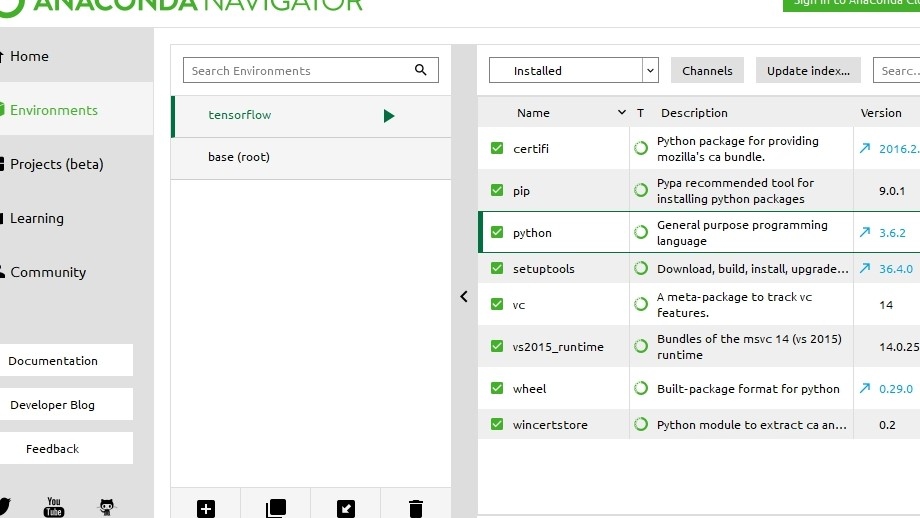
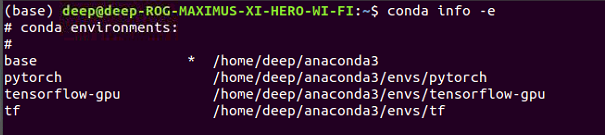
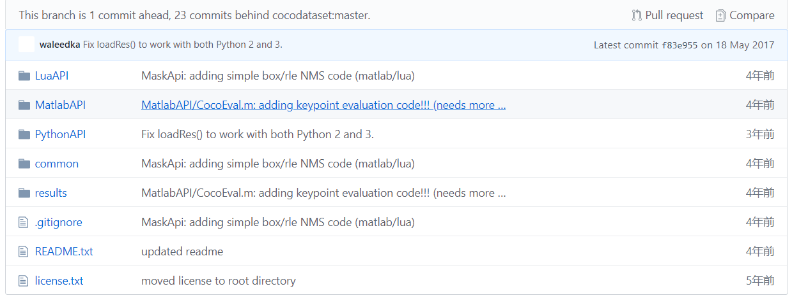
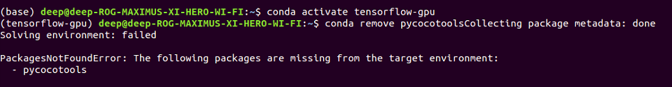
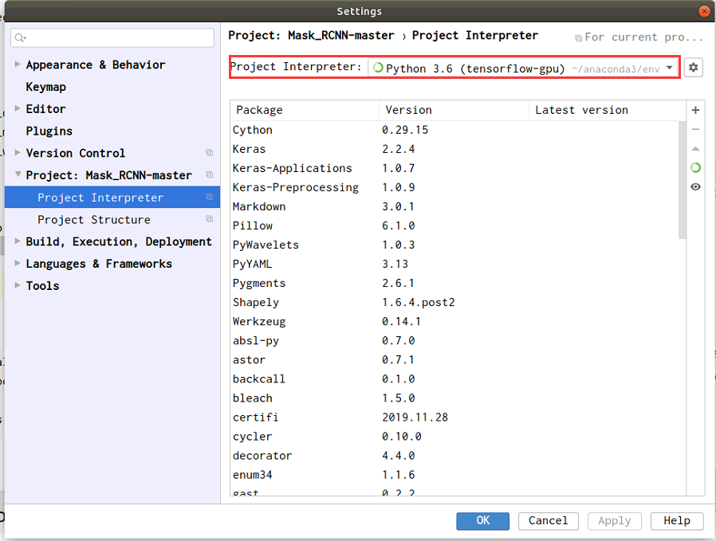

#  TensorFlow 和Keras的安装说明

基于windows10+python3.6


## 一.下载并安装Anaconda

 	从 https://www.continuum.io/downloads 下载 anaconda, 现在的版本
有python2.7版本和python3.7版本，下载好对应版本、对应系统的anaconda，
它实际上是一个sh脚本文件。

进入网页后选择操作系统windows，然后选择版本。点击图一红圈下载：

名称为：Anaconda3-2020.02-Windows-x86_64.exe

是一个可执行的exe文件，下载完成好，直接双击就可以安装了。
在安装的时候，假设我们安装在D盘根目录，如图二所示：





两个选项全选（这里第一个变红是因为，已经装过了，path中已经有anaconda的变量了）

然后等待安装完成就可以了。
此处需要安装scipy
打开cmd命令行,输入 conda install scipy 按回车即可


输入 `conda list` 

就可以查询现在安装了哪些库，常用的 `numpy`, `scipy` 名列其
中。如果你还有什么包没有安装上，

可以运行`conda install ***` 

来进行安装。（\*\*\*为需要的包的名称）。

如果某个包版本不是最新的

运行 `conda update **`
就可以更新了。


## 二. 安装Tensortflow

### 1. 配置安装环境

打开“开始目录”，找到Anaconda/Anacondaprompt，以管理员权限运行，
否则会出现permission denied。输入：

>conda install python=3.6

建立名为tensorflow的conda计算环境（一定要是python3.5.2，py3.5.1与
py3.6安装会报出找不到tensorflow资源的错误）。输入：

>conda create -n tensorflow python=3.6

激活tensorflow环境。输入：

> activate tensorflow

输入python --version，查看是否切换到python3.6 工作环境

### 2. 安装tensorflow

安装完以后，在 anaconda navigator 会出现这个环境 如下图，如果没有出
现，检查上边环境路径问题




激活环境,继续在Anaconda Prompt输入:

> activate tensorflow

然后输入命令

> pip install tensorflow

### 3. 测试tensorflow

在Anaconda Prompt中启动tensorflow环境，并进入python环境

输入测试代码：

```python
import tensorflow as tf
hello = tf.constant('Hello,TensorFlow!')
sess = tf.Session()
print(sess.run(hello))
```

运行结果：


## 三. 安装Keras

用pip方式安装很简单。即打开cmd，输入 `pip install keras`,然后等待安装完
毕即可。

注意：

> 此处keras 默认backend 为tensorflow，如果想使用theano作为后台，则需
> 要将tensorflow更改为theano。
> 更改方法：访问C:\Users\Administrator\.keras 把 backend 中的 tensorflow
> 更改为theano即可。到此为止配置完成了


## 四. 问题与解决方案

问题：在利用pycharm进行编译时，遇到找不到module tensorflow的问题
解决方案：
anaconda自动将tensorflow装在了D:\anaconda3\envs\tensorflows路径
下，只需要将D:\anaconda3\envs\tensorflows\Lib\site-packages路径下的
所有文件夹复制到D:\anaconda3\Lib\site-packages（跳过重复文件）即可解
决。

# mask_rcnn下pycocotools安装

## 1.准备工作

首先安装anaconda，创建好自己的环境，如服务器中的四个anaconda环境。



​			

查看本机环境列表输入下列命令

```shell
conda info -e
```


## 2.安装下载pycocotools

### 1. 从github上下载pycocotools

```shell
git clone https://github.com/waleedka/coco.git
```

从github上下载下来项目（需要提前安装好github）

项目结构如图：



从图上可以看到pycocotools 支持Lua，matlab，Python三种语言。


### 2. 安装pycocotools

来使用pip安装PythonAPI中的安装程序

```shell
pip install git+https://github.com/waleedka/coco.git#subdirectory=PythonAPI
```


## 3. 配置pycocotools

### 1. 激活待使用的anaconda环境

本次测试使用的环境是下列中的tensorflow-gpu

```
base                  *  /home/deep/anaconda3
pytorch                  /home/deep/anaconda3/envs/pytorch
tensorflow-gpu           /home/deep/anaconda3/envs/tensorflow-gpu
tf                       /home/deep/anaconda3/envs/tf
```

激活tensorflow-gpu 环境，只写下列命令

```shell
conda activate tensorflow-gpu
```



出现上图所示的输出，说明已经激活并进入tensorflow-gpu


### 2. 安装pycocotools 包

在tensorflow-gpu环境下执行

```shell
pip install pycocotools
```

即可安装成功


##  4. note

安装pycocotools 时，可能会出先没有cython包，只要执行下列命令安装即可

```shell
pip install cython
```


当全部安装完成之后，在pycharm中将解释器配置成刚才的环境



运行示例代码即可

如若出现<font color=red>`module ‘coco’ has no attribute ‘Cococonfig’`</font>

将代码中的 <font color=red>`import coco`</font>
修改为<font color=red> `from samples.coco import coco`</font>

