## 附录1：开发环境配置

### 1.  JDK安装

#### 1.1 下载JDK

JDK1.8下载地址：https://www.oracle.com/cn/java/technologies/javase/javase-jdk8-downloads.html

选择Windows x64（32位系统选择x86）

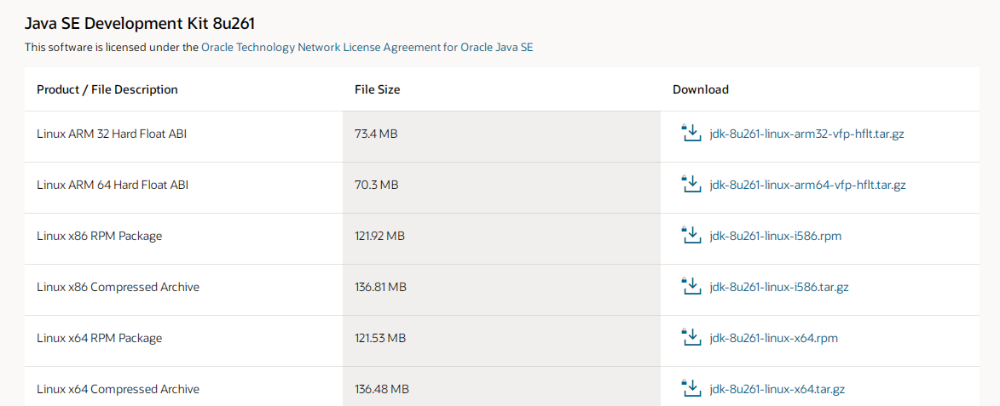

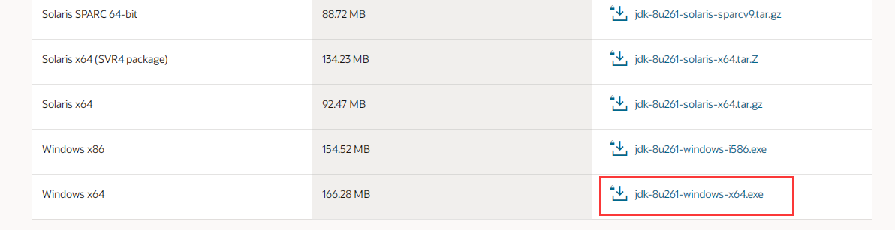

选中同意，开始下载


#### 1.2 安装JDK

下载好后双击安装


点击下一步

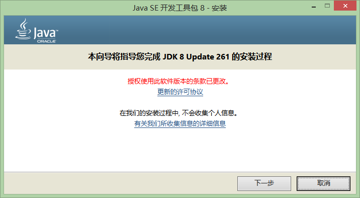

更改路径

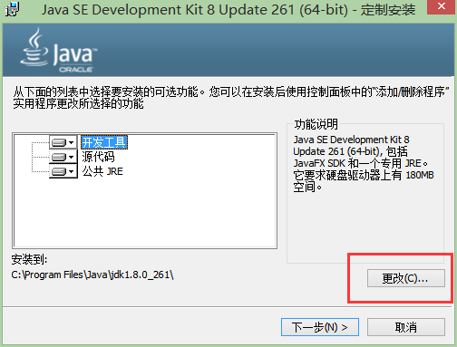

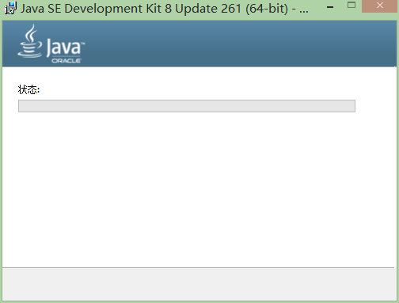

选择JRE的路径

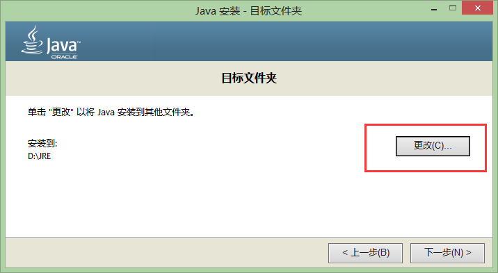

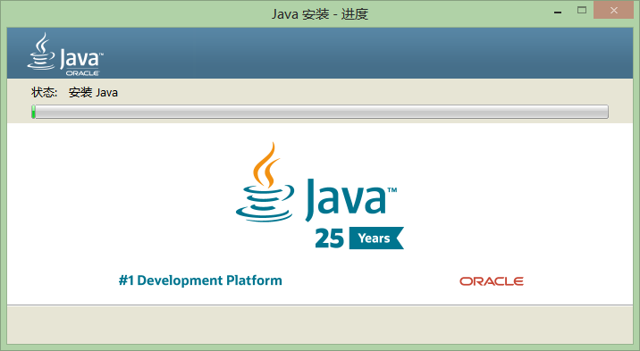

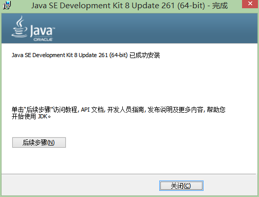

#### 1.3 配置环境变量

桌面图标“计算机”（或者“我的电脑”）右击，单击“属性”；

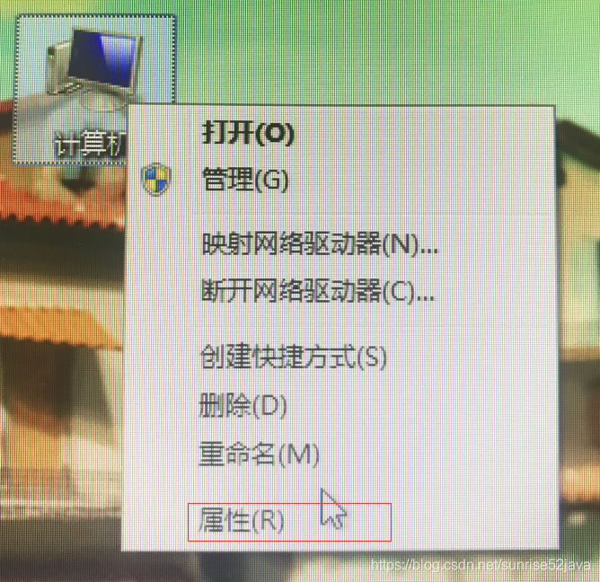

选择高级系统设置

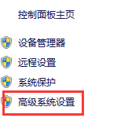

选择高级-环境变量

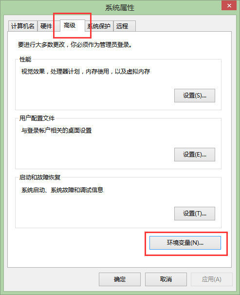

在弹出的“环境变量”框中，选择下方“系统变量（S）”下面的按钮“新建”；

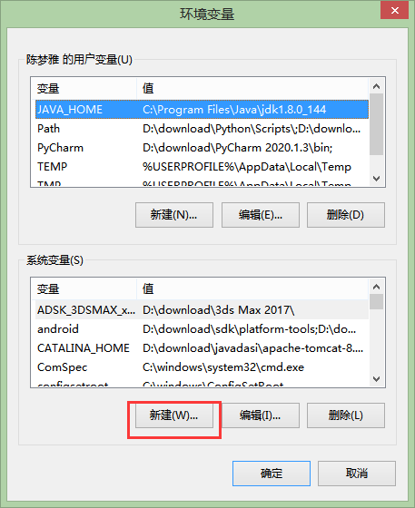

设置环境变量，3个变量都设置好；

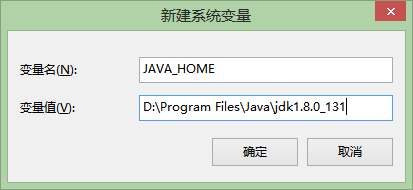

需要设置3个环境变量，详情如下：

JAVA_HOME
D:\Program Files\Java\jdk1.8.0_131 （刚才JDK的安装目录）

Path
%JAVA_HOME%\bin;%JAVA_HOME%\jre\bin;（JRE安装到了D:\Program Files\Java\jdk1.8.0_131\jre）

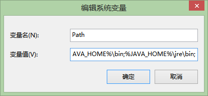

CLASSPATH
.;%JAVA_HOME%\lib;%JAVA_HOME%\lib\tools.jar （第1个分号前面还有个点，别丢了）

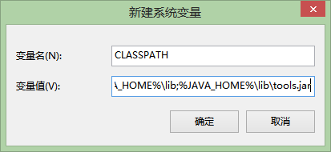

设置好后点击“确认”

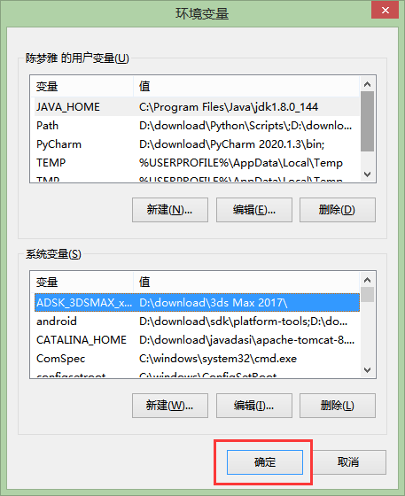

#### 1.4验证jdk安装是否成功

win+R，输入cmd，回车，打开cmd.exe；

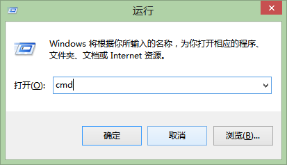

输入 java -version 或者 javac -version，能顺利显示安装的版本即可；

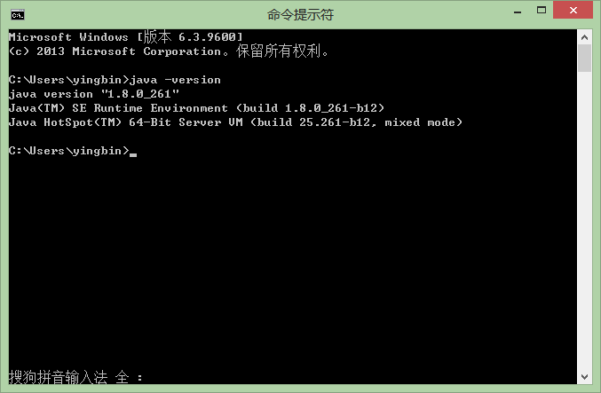

### 2. Maven

#### 1. 1下载

官网下载地址：http://maven.apache.org/download.cgi


下载最新版本的即可

#### 1.2.安装

下载完成后，将下载到的压缩包解压即可。

文件目录：


#### 1.3. 配置

##### 1.3.1 环境变量配置

添加系统变量：

- 变量名：

  ```
  M2_HOME
  ```

  

- 变量值：Maven解压目录


##### 1.3.2 编辑Path环境变量

在Path环境变量处，增加新的变量值：

- %M2_HOME%\bin


##### 1.3.3 cmd窗口测试

打开cmd，输入mvn -v检测


##### 1.3.4 创建本地仓库

Maven的作用可以简单的理解为下载项目所需jar包，既然需要下载jar包，那么就要指定jar包的下载目录，即本地仓库

1. 在自己选定的位置创建文件夹，作为本地仓库，来存放jar包
   
   local为我自己的本地仓库

2. 在Maven的配置文件seeting.xml文件中，添加上本地仓库的目录

   1. IDEA打开Maven目录下conf下的settings.xml文件
      可以看到，settings.xml文件中多数都为注释部分

   2. 在settings标签下添加本地仓库的绝对路径

      ```xml
      <localRepository>本地仓库的绝对路径</localRepository>
      ```

      

##### 1.3.5 增加国内镜像

增加国内镜像，可以大幅提高jar包下载速度

1. IDEA打开IDEA打开Maven目录下conf下的settings.xml文件

2. 在<mirrors>标签中增加如下代码：

   ```xml
   <mirror>
   <id>alimaven</id>
   <mirrorOf>central</mirrorOf>
   <name>aliyun maven</name>
   <url>http://maven.aliyun.com/nexus/content/groups/public/</url>
   </mirror>
   ```

#### 4. IDEA相关设置

Ctrl + Alt + S打开设置，搜索Maven，出现下图界面：


- Maven home directory：Maven安装目录
- User settings file：Maven目录下conf下的settings.xml文件
- Local repository：本地仓库路径（如果settings.xml文件书写正常，本地仓库可被自动识别）

### 2. SVN配置

1. 下载

官网下载地址：https://tortoisesvn.net/downloads.zh.html
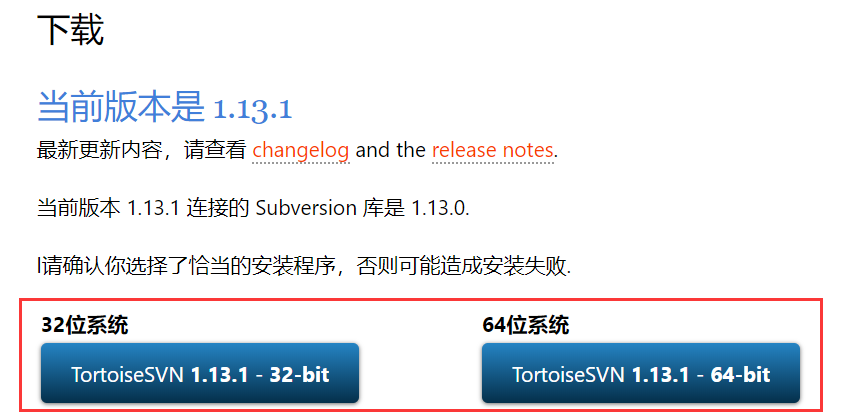

选择对应32位或64位

#### 2. 安装

安装过程非常简单，但需要注意一点：选择command line cilent tools


这一项默认是没有选择的，一定要自己手动选择！

#### 3. IDEA相关设置

Ctrl + Alt + S打开设置，Versin Control--->Subversion


在右边，输入svn，下方的Use custom configuration directory ，IDEA会自动识别。

### 3. Tomcat

#### 1. 下载

官网下载地址：https://tomcat.apache.org/download-90.cgi


#### 2. 安装

将下载得到的压缩包解压，即可完成安装。


#### 3. 配置

3.1 环境变量配置

添加系统变量：

- 变量名：CATALINA_HOME
- 变量值：Tomcat解压目录

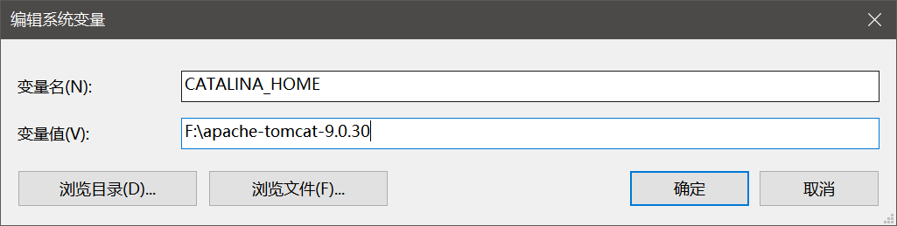

##### 3.2 编辑Path环境变量

在Path环境变量处，增加新的变量值：

- %CATALINA_HOME%\bin
- %CATALINA_HOME%\lib

##### 3.3 Tomcat启动测试

双击Tomcat安装目录下bin下startup.bat
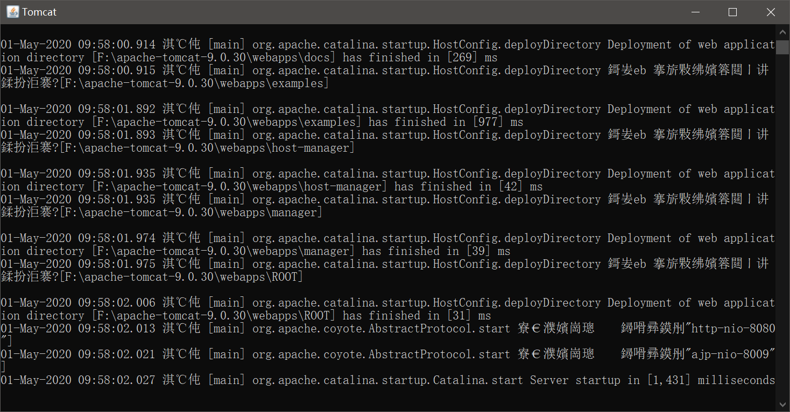

出现上图界面，即安装配置完成。

### 4. IDEA相关设置

1. 点击run下的Edit Configurations
   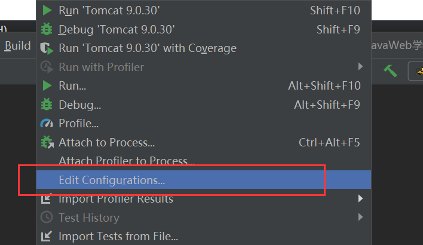

2. 选择左上角的+号，然后选择local Tomcat
   

3. 在Name处，填写自己想要选取的名字，然后点击Configure
   

4. 在Tomcat Home处，选择Tomcat的安装目录；在Tomcat base directory处选择Tomcat的安装目录
   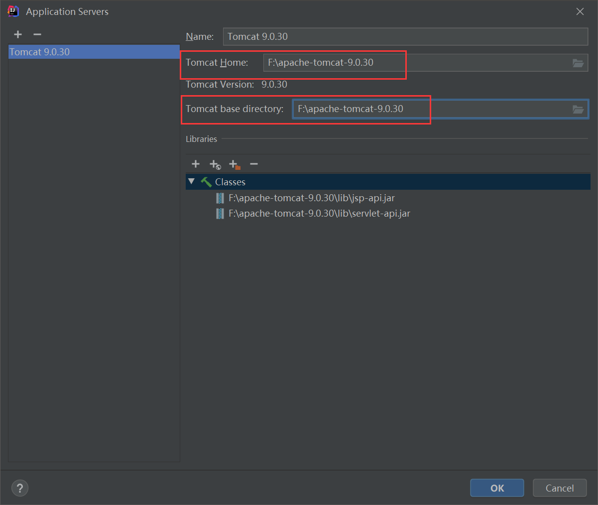

   完成配置。

   ### Anaconda搭建Python开发环境

   参考来源：
   https://blog.csdn.net/qq_326324545/article/details/84522368
   https://blog.csdn.net/sizhi_xht/article/details/80964099
   https://zhuanlan.zhihu.com/p/37611680
   https://blog.csdn.net/ben1010101010/article/details/90897405

   欢迎讨论交流，如有侵权请联系本人！

   1. 下载并安装Anaconda：

      ```bash
      # 下载Linux平台版本Anaconda，下例网页链接版本为Anaconda 2019.03 Python 3.7 version 64-Bit (x86) Installer for Linux
      wget https://repo.anaconda.com/archive/Anaconda3-2019.03-Linux-x86_64.sh
      # 安装Anaconda，建议直接安装，不使用root权限，除非你是系统的管理员
      bash Anaconda3-2019.03-Linux-x86_64.sh
      ```

      以下为安装过程中的选项说明：

      ```text
      # 确认安装位置，默认位置为用户个人文件夹下的anaconda3文件夹
      Anaconda3 will now be installed into this location...
      [/home/current_user/anaconda3] >>>
      # 确认是否由Anaconda进行终端的初始化，一般选择是，否则无法使用虚拟环境
      Do you wish the installer to initialize Anaconda3 by running conda init? [yes|no]
      [no] >>> yes
      ```

      安装完成后，Anaconda会设置终端开启时，自动进入base虚拟环境，我们需要取消这一设置，因为虚拟环境是可嵌套的，在base环境中再进入虚拟环境可能会产生不可控的问题。使用以下命令取消这一行为：

      ```bash
      conda config --set auto_activate_base false
      ```

   2. 创建并使用虚拟环境：

      建议不要直接使用本地的Python环境，而是创建自己的虚拟环境。这样做有两点好处，一是能够在虚拟Anaconda环境中进行随意的定制而不用担心破坏原本的终端环境，二是熟悉了虚拟环境的用法之后，可以制作多个虚拟环境用于不同的任务，这样就可以使得对于依赖包的版本要求不同的项目可以共存在一个账号上。

      ```bash
      # 创建名为my_virtual_env的虚拟环境，并安装Python3.7及必要的Python库。此命令也可以不指定Python版本，但会创建一个不含Python的空环境，如果没有特殊需求，请直接指定Python版本
      conda create -n my_virtual_env python=3.7
      # 激活虚拟环境
      conda activate my_virtual_env
      # 关闭虚拟环境
      conda deactivate
      # 列出所有存在的虚拟环境名称
      conda env list
      # 删除指定虚拟环境，如果为空环境则此命令失效（也就是未指定Python版本的时候）
      conda remove -n my_virtual_env --all
      # 删除指定虚拟环境，无论此环境是否为空
      conda env remove -n my_virtual_env
      # 安装Anaconda收录的Python包，使用此命令Anaconda会自动检查新安装包与已安装包之间是否有依赖库版本冲突
      conda install package
      # 安装所有Python收录的包，包括Anaconda未收录的Python包，不会检查依赖库版本冲突
      pip install package
      # 查找相关包的所有收录版本
      conda search package
      # 导出虚拟环境配置表及使用配置表文件创建虚拟环境
      conda env export > conda_env.yaml
      conda env create -f conda_env.yaml
      ```

   3. 在`~/.bash_aliases`中添加以下内容，以便以后快速开启关闭虚拟环境：

      ```bash
      alias jumpin='conda activate my_virtual_env'
      alias crawlout='conda deactivate'
      ```

      添加完成后使用`source ~/.bash_aliases`命令重新执行该文件，之后就可以使用定制命令操作虚拟环境的激活和关闭

      

##  附录2：运行环境搭建


### 1.1 云服务环境

```
https://docs.qingcloud.com/product/quick_start/   青云帮助文档

青云提供了两种组网方式：基础网络、私有网络（VxNet）。 前者是一个由青云系统维护的全局网络，后者是用户各自自行组建的网络。

基础网络的好处是简单、无需用户做任何配置与管理，即可直接使用， 但正因为它是全局网络，所以其安全保障是依靠防火墙（Security Group）来实现的。 与之相对应，私有网络需要用户创建并管理 （当然，为了简化管理，青云提供了路由器来帮助用户）， 但私有网络之间是100%隔离的，以满足对安全的100%追求。
```


1.2 配置YUM源

yum仓库就是使用yum命令下载软件的镜像地址。

我们通常使用 yum install 命令来在线安装 linux系统的软件， 这种方式可以自动处理依赖性关系，并且一次安装所有依赖的软体包，但是经常会遇到从国外镜像下载速度慢，无法下载的情况。那么此时我们就需要把我们的yum 源改为国内的镜像。

yum的配置文件
yum 的配置文件在 /etc/yum.repos.d 目录下, 其中有多个配置文件,每一个配置文件中都可以配置一个或多个repository, 但是最终会被合并为一个交给系统，所以多个文件只是为了方便管理。

2、yum仓库配置
下面提供了 阿里和 清华大学 两个镜像仓库配置操作说明，=实际使用时，选择其中一个配置即可。

```
yum install vim   #安装VIM编辑器
yum install wget   #安装下载工具
```

1）、备份，将 CentOS-Base.repo 为CentOS-Base.repo.backup

```
mv   /etc/yum.repos.d/CentOS-Base.repo /etc/yum.repos.d/CentOS-Base.repo.backup

 cp  /etc/yum.repos.d/CentOS-Base.repo.bak /etc/yum.repos.d/CentOS-Base.repo
```

（2）、下载新的 http://mirrors.aliyun.com/repo/Centos-7.repo,并命名为CentOS-Base.repo

```
wget -O /etc/yum.repos.d/CentOS-Base.repo http://mirrors.aliyun.com/repo/Centos-7.repo
或者
curl -o /etc/yum.repos.d/CentOS-Base.repo http://mirrors.aliyun.com/repo/Centos-7.repo
```

（3）、清除缓存

```
yum clean all # 清除系统所有的yum缓存
yum makecache # 生成yum缓存
yum update

yum install vim
```

### 1.2 Docker搭建

#### 1.2.1 安装流程

1、Docker 要求 CentOS 系统的内核版本高于 3.10 ，查看本页面的前提条件来验证你的CentOS 版本是否支持 Docker 。

通过 **uname -r** 命令查看你当前的内核版本

```
 $ uname -r
```

2、使用 `root` 权限登录 Centos。确保 yum 包更新到最新。

```
$ sudo yum update
```


3、卸载旧版本(如果安装过旧版本的话)

```
$ sudo yum remove docker  docker-common docker-selinux docker-engine
```

4、安装需要的软件包， yum-util 提供yum-config-manager功能，另外两个是devicemapper驱动依赖的

```
$ sudo yum install -y yum-utils device-mapper-persistent-data lvm2
```

5、设置yum源

```
$ sudo yum-config-manager --add-repo https://download.docker.com/linux/centos/docker-ce.repo
```

 

6、可以查看所有仓库中所有docker版本，并选择特定版本安装

```
$ yum list docker-ce --showduplicates | sort -r
```


7、安装docker

```
$ sudo yum install docker-ce  #由于repo中默认只开启stable仓库，故这里安装的是最新稳定版17.12.0

```

 

8、启动并加入开机启动

```
$ sudo systemctl start docker
$ sudo systemctl enable docker
```

9、验证安装是否成功(有client和service两部分表示docker安装启动都成功了)

```
$ docker version
```


####  1.2.2 Docker常用命令

1. 列出所有容器 ID

```
docker ps -aq
```

2. 停止所有容器

```
docker stop $(docker ps -aq)
```

3. 停止单个容器

```
docker stop 要停止的容器名
```

4. 删除所有容器

```
docker rm $(docker ps -aq)
```

5. 删除单个容器

```
docker rm 要删除的容器名
```

6. 删除镜像

```
删除指定
docker rmi 6a8e2d5dd257  -f

删除所有image
docker rmi $(docker images -q)
```

7. 要让docker 的容器自动在开机启动，

```
docker run 指令中加入 --restart=always 就行。
sudo docker run --restart=always .....

如果创建时未指定 --restart=always ,可通过update 命令设置
docker update --restart=always xxx
```

8. 进入容器内部执行命令

```
 docker exec -it 6f6679679be8   /bin/bash
```


#### 1.2.3 Docker使用

```
1.镜像安装：
docker pull tomcat
docker pull nginx

2.启动容器
docker run -it --name webdemo -p 80:8080 tomcat /bin/bash
启动一个交互式的容器，名字是webdemo，-p 80:8080表示将容器的8080端口映射到主机的80端口，这样我们只要访问主机的80端口就可以访问到容器的服务了。

docker run -d -p 8088:8080 tomcat
docker run -d -p 8089:8080 tomcat
安装两个实例，端口分别为8088,8089

docker run -p 8080:80 -d docker.io/nginx
安装nginx，端口为8080。在测试的过程中，发现ubuntu上对80端口有限制，不能直接访问，所以映射为8080

3.如何将文件从主机复制到容器中：

从主机复制到容器 sudo docker cp host_path containerID:container_path
从容器复制到主机 sudo docker cp containerID:container_path host_path

长的字符串是容器的id
 
 
 4.docker 下修改参数：
 
 docker cp 3c8d188f7fb48:/etc/mysql/mysql.conf.d/mysqld.cnf /home/
修改文件内容，添加参数行 log_bin=on
docker cp /home/mysqld.cnf 3c8d188f7fb48:/etc/mysql/mysql.conf.d/mysqld.cnf
docker reload 3c8d188f7fb48
```

### 1.3搭建Maven仓库

​		maven的仓库分为本地仓库，远程仓库和私服仓库。私服仓库一般是公司内部私有的，内部进行维护的。公司员工连接私服，从私服中下载jar，或者将自身的jar传到私服上。私服还可以从中央仓库下载jar，当私服中没用jar的时候，就会从中央仓库下载。

​	常用的私服有：[Apache Archiva](http://archiva.apache.org/index.cgi)，[Artifactory](http://www.jfrog.com/home/v_artifactory_opensource_overview/)，[Sonatype Nexus](http://www.sonatype.org/nexus/)。这里我们使用 Sonatype Nexus。


```
https://www.cnblogs.com/yhaing/p/8568043.html
```


#### 1.3.1Maven 的概念


Maven是一个软件项目管理工具，通过它可便捷的管理项目的生命周期。即项目的jar包依赖，开发，测试，发布打包、版本等。虽然目前的IDE工具（如eclipse）可管理开发、发布、打包工作，但还没有形成一套完成的体系。

Maven有以下几个功能特点：

1、 jar包依赖

　　这个也许会maven最突出的特点。使用maven进行开发时，不需要上网单独下载jar包，只需要在配置文件pom.xml中配置jar包的依赖关系，就可以自动下载jar包到我们的项目中（在联网情况下，maven可自动从https://repo.maven.apache.org/maven2中下载所需要的jar包。如果无法联网，可搭建基于Nexus私服的中央库并提供jar包下载）。这样，别人开发或者使用这个工程时，不需要来回的拷贝jar包，只需要复制这个pom.xml就可以自动的下载这些jar包。而且，我们自己下载jar包，还有可能造成版本的不一致，这样在协同开发的过程中就有可能造成代码运行的不一致。通过使用maven精确的匹配jar包，就不会出现这种问题了。

以下是一个项目的pom.xml中对jar包依赖的描述：


       <!-- spring需要的jar包 --> 
       <dependency> 
           <groupId>org.springframework</groupId> 
           <artifactId>spring-context</artifactId> 
           <version>3.2.4.RELEASE</version> 
           <type>jar</type> 
        </dependency> 


2 项目坐标

Maven通过特定的标识来定义项目名称，这样既可以唯一的匹配其他的jar包，也可以通过发布，使别人能使用自己的发布产品。这个标识就被叫做坐标，长的其实很普通，就是简单的xml而已。比如，以下为一个web项目的项目坐标描述信息（在该项目的pom.xml文件的开始位置）

```
  <groupId>com.nci</groupId>
  <artifactId>first_maven</artifactId>
  <version>1.0.0</version>
<packaging>war</packaging>
```

各字段说明：

  groupId：所述的项目名称，由于有的项目并不是一个jar包构成的，而是由很多的jar包组成的。因此这个groupId就是整个项目的名称。

artifactId：包的名称。

version：版本号。

packaging：包的类型，一般都是jar，也可以是war之类的。如果不填，默认就是jar。War代表web项目。


#### 1.3.2 私服搭建

​	搭建私有仓库，放到青云上。VPN登录上来。Docker容器比较

1. 执行以下命令，会自动从hub.docker.com下载最新的nexus镜像，然后启动一个名为nexus的容器，当前电脑的8081端口被映射到容器的8081端口： 
   `docker run -idt -p 8081:8081 --name nexus -v /home/data/nexus:/sonatype-work sonatype/nexus `

2. 执行命令

   docker logs -f nexus

   查看容器日志滚动信息，显示如下信息时nexus启动成功：

    

   ```
   2018-01-20 03:37:42,187+0000 INFO [jetty-main-1] org.sonatype.nexus.webresources.internal.WebResourceServiceImpl - Discovered 1971 resources 
   2018-01-20 03:37:42,189+0000 INFO [jetty-main-1] org.sonatype.nexus.webresources.internal.WebResourceServlet - Max-age: 30 days (2592000 seconds) 
   2018-01-20 03:37:42,304+0000 INFO [jetty-main-1] org.sonatype.nexus.bootstrap.jetty.InstrumentedSelectChannelConnector - Metrics enabled 
   2018-01-20 03:37:42,348+0000 INFO [jetty-main-1] org.eclipse.jetty.server.AbstractConnector - Started InstrumentedSelectChannelConnector@0.0.0.0:8081 
   2018-01-20 03:37:42,352+0000 INFO [jetty-main-1] org.sonatype.nexus.bootstrap.jetty.JettyServer - Running 
   2018-01-20 03:37:42,352+0000 INFO [main] *SYSTEM org.sonatype.nexus.bootstrap.jetty.JettyServer - Started 
   ```

   查看当前电脑的/usr/local/work/dockermaven目录，可以看到nexus容器中应用的相关文件已经在此处创建，如下图： 
   

3. 在浏览器输入地址访问nexus：http://192.168.18.110:8081/nexus

4. 对maven私有仓库的使用者来说，完全感受不到实际安装和在docker安装私有仓库的区别，您可以像前两章的实战那样，体验此仓库的jar缓存和保存二方库的服务；

5. 发布一个二方库到nexus，deploy成功后，可以在nexus上看到新的二方库，如下图所示，(deploy之前记得在nexus上设置允许上传，并且设置deployment账号的密码，详见上一章)： 
   

至此，实战maven私有仓库三部曲系列就全部结束了，希望其中的实战和demo能够助您一臂之力；


#### 1.3.3Nexus 的仓库分类

·    要用于部署无法从公共仓库获取的构件（如 oracle 的 JDBC 驱动）以及自己或第三方的项目构件。nexus内置了三个host库。

3rd party：第三方库，如mysql 的jdbc驱动jar

Release：自己开发的release版本的jar

Snapshots：自己开发的snapshot版本的jar（可理解为测试版本）


### 1.4 搭建Gitlab服务器

#### 1.4.1 gitlab以及使用

##### 1.gitlab镜像拉取


```ruby
# gitlab-ce为稳定版本，后面不填写版本则默认pull最新latest版本
$ docker pull gitlab/gitlab-ce
```

拉取镜像

##### 2.运行gitlab镜像


```csharp
$ docker run -d  -p 8082:80 -p 8083:443 -p 8084:22  --name gitlab --restart always -v /home/data/gitlab/config:/etc/gitlab -v /home/data/gitlab/logs:/var/log/gitlab -v /home/data/gitlab/data:/var/opt/gitlab gitlab/gitlab-ce
# -d：后台运行
# -p：将容器内部端口向外映射
    22: SSH访问端口，
    80：Http 访问端口，
    443：Https 访问端口，
# --name：命名容器名称
# -v：将容器内数据文件夹或者日志、配置等文件夹挂载到宿主机指定目录
    
    
```

运行成功后出现一串字符串


运行成功:

http://192.168.18.101:8082/

8082:80 -p 8083:443 -p 8084:22

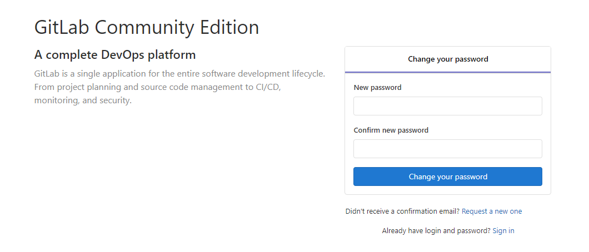

此处设置密码，用户为root，最高管理权限。


##### 3.配置

按上面的方式，gitlab容器运行没问题，但在gitlab上创建项目的时候，生成项目的URL访问地址是按容器的hostname来生成的，也就是容器的id。作为gitlab服务器，我们需要一个固定的URL访问地址，于是需要配置gitlab.rb（宿主机路径：/home/data/gitlab/config/gitlab.rb）。


```uby
# gitlab.rb文件内容默认全是注释
$ vim /home/gitlab/config/gitlab.rb
```


```ruby
# 配置http协议所使用的访问地址,8082---->80
external_url 'http://192.168.18.201:8082'   #外部IP监听端口
nginx['listen_port'] = 80    #容器监听端口，默认80
# https需要下面这句
nginx['redirect_http_to_https_port'] = 8082   

# 配置ssh协议所使用的访问地址和端口
gitlab_rails['gitlab_ssh_host'] = '192.168.18.201'
gitlab_rails['gitlab_shell_ssh_port'] = 8084 # 此端口是run时22端口映射的8084端口 

```


以下文件是自动生成的，不能进行修改。

```
修改/home/data/gitlab/data/gitlab-rails/etc/gitlab.yml

vi gitlab.yml

找到关键字 * ## Web server settings *
将host的值改成映射的外部主机ip地址和端口
```


修改好后保持，退出，进入容器内，应用重新配好的配置并重启GitLab,然后查看GitLab的状态。

```
docker exec -ti gitlab /bin/bash

gitlab-ctl reconfigure #花时间比较多
gitlab-ctl restart
gitlab-ctl status

```


支持ssl(未测试)

```
vi /etc/gitlab/gitlab.rb

nginx['ssl_certificate'] = "/var/opt/gitlab/elooyoo.com/fullchain.pem"
nginx['ssl_certificate_key'] = "/var/opt/gitlab/elooyoo.com/privkey.pem"
nginx['redirect_http_to_https'] = true

```


```ruby
# 重启gitlab容器
$ docker restart gitlab
```

此时项目的仓库地址就变了。如果ssh端口地址不是默认的22，就会加上ssh:// 协议头
 打开浏览器输入ip地址(因为我的gitlab端口为80，所以浏览器url不用输入端口号，如果端口号不是80，则打开为：ip:端口号)

##### 4.创建一个项目

第一次进入要输入新的root用户密码，设置好之后确定就行


gitlab页面

下面我们就可以新建一个项目了，点击Create a project


Create a project

创建完成后：


创建完成！

#### 1.4.2 gitlab-runner安装


### 1.5 搭建Jenkins服务器


1. 使用docker 安装jenkins

```
docker run -p 8086:8080 -p 8087:50000 -v /home/data/jenkins/data:/var/jenkins_home jenkinsci/blueocean
```

docker 运行后， 执行docker logs -f myjenkins时报错：

touch: cannot touch ‘/var/jenkins_home/copy_reference_file.log’: Permission denied
Can not write to /var/jenkins_home/copy_reference_file.log. Wrong volume permissions?

需要修改下目录权限, 因为当映射本地数据卷时，/home/docker/jenkins目录的拥有者为root用户，而容器中jenkins user的uid为1000
执行如下命令即可：

chown -R 1000:1000 /home/docker/jenkins


2. 访问jenkins地址 8086


 

注意：第一次启动的时候正在加载jenkins大概会等待3-10分钟。

3.解锁jenkins

 


```
[root@i-qvtplnds data]# docker exec -it jenkisci/blueocen /bin/bash
Error: No such container: jenkisci/blueocen
[root@i-qvtplnds data]# ls
com.cloudbees.hudson.plugins.folder.config.AbstractFolderConfiguration.xml  jenkins.telemetry.Correlator.xml  secret.key.not-so-secret
config.xml                                                                  jobs                              secrets
copy_reference_file.log                                                     logs                              updates
hudson.model.UpdateCenter.xml                                               nodeMonitors.xml                  userContent
hudson.plugins.git.GitTool.xml                                              nodes                             users
identity.key.enc                                                            plugins                           war
jenkins.install.UpgradeWizard.state                                         secret.key                        workflow-libs
[root@i-qvtplnds data]# cd sercrets
-bash: cd: sercrets: No such file or directory
[root@i-qvtplnds data]# cd secret
-bash: cd: secret: No such file or directory
[root@i-qvtplnds data]# cd secrets
[root@i-qvtplnds secrets]# ls
filepath-filters.d    jenkins.model.Jenkins.crumbSalt  org.jenkinsci.main.modules.instance_identity.InstanceIdentity.KEY  whitelisted-callables.d
initialAdminPassword  master.key                       slave-to-master-security-kill-switch
[root@i-qvtplnds secrets]# cat initialAdminPassword 
87eab010550c42bba8b479e5b50955de
[root@i-qvtplnds secrets]# 

```

 


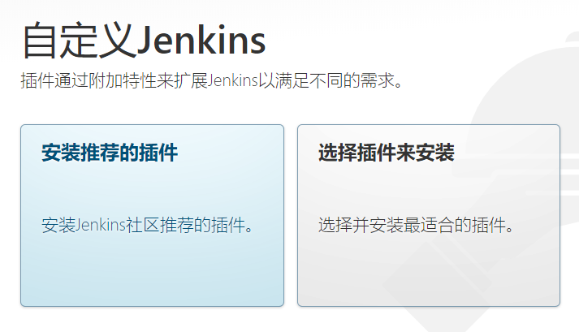

 

 

docker exec -it 7f485bd95c3b  /bin/bash 进入jenkins容器 

cat /var/jenkins_home/secrets/initialAdminPassword

### 1.6 搭建Tomcat服务器

3. 获取Tomcat8版本

   docker pull tomcat:8  

   

4. 启动tomcat

```
 docker run -d -p 8088:8080 tomcat
```

 -d表示后台运行，-p端口映射，前面的8088是外围访问端口（也就是本机ip对外开放的端口），后面8080是docker容器内部的端口。


http://localhost:8080

出现以下错误：**资源服务器未能找到目标资源的表示或者是不愿公开一个已经存在的资源表示。**

这是容器中的webapps为空导致的，执行以下命令进入容器交互模式：

```
 docker exec -it 6f6679679be8   /bin/bash
```


```
root@6f6679679be8:/usr/local/tomcat# cd webapps
//将webapps.dist内容拷贝过来
root@6f6679679be8:/usr/local/tomcat/webapps# cp -r ../webapps.dist/*  ./
root@6f6679679be8:/usr/local/tomcat/webapps# ls
ROOT  docs  examples  host-manager  manager  webapps.dist


```

执行正常：


挂在宿主机器目录到容器，持久化存储：

1. tomcat 容器 webapps 路径：/usr/local/tomcat/webapps

2. 在宿主目录下新建目录 /home/data/tomcat/webapps

3. 停止 tomcat 容器并删除该容器

   1. 查找容器的 CONTAINER ID

      ```
      docker ps -a 
      ```

   2. 停止容器

      ```
       docker stop CONTAINER_ID
      ```

   3. 删除容器

      ```
      docker rm CONTAINER_ID 
      ```

4. 重新跑一个 tomcat 容器并挂载宿主目录

   ```
   docker run --name tomcat-service -d -p 8080:8080 -v /home/data/tomcat/webapps:/usr/local/tomcat/webapps tomcat  
   
   docker run --name tomcat-service1 -d -p 8090:8080 -v /home/data/tomcat/webapps:/usr/local/tomcat/webapps tomcat
   
   docker run --name tomcat-service2 -d -p 8091:8080 -v /home/data/tomcat/webapps:/usr/local/tomcat/webapps tomcat
   
   
   docker run --name tomcat-service3 -d -p 8092:8080 -v /home/data/tomcat/webapps:/usr/local/tomcat/webapps tomcat
   ```


   5.此时访问仍然出错**资源服务器未能找到目标资源的表示或者是不愿公开一个已经存在的资源表示。**

进入容器内容拷贝内容

```
root@1a8599cd150c:/usr/local/tomcat# cd webapps
root@1a8599cd150c:/usr/local/tomcat/webapps# cd webapps
bash: cd: webapps: No such file or directory
root@1a8599cd150c:/usr/local/tomcat/webapps# cp ../webapps.dist/* ./
cp: -r not specified; omitting directory '../webapps.dist/ROOT'
cp: -r not specified; omitting directory '../webapps.dist/docs'
cp: -r not specified; omitting directory '../webapps.dist/examples'
cp: -r not specified; omitting directory '../webapps.dist/host-manager'
cp: -r not specified; omitting directory '../webapps.dist/manager'
root@1a8599cd150c:/usr/local/tomcat/webapps# cp -r ../webapps.dist/* ./
root@1a8599cd150c:/usr/local/tomcat/webapps# ls
ROOT  docs  examples  host-manager  manager
root@1a8599cd150c:/usr/local/tomcat/webapps# 

```

回到宿主机下面，进行webapps，发现内容实际拷贝到宿主机器下面

```
[root@i-s21hd6yt tomcat]# ls
webapps
[root@i-s21hd6yt tomcat]# cd webapps/
[root@i-s21hd6yt webapps]# ls
docs  examples  host-manager  manager  ROOT
[root@i-s21hd6yt webapps]# 

```

访问http://localhost :8080 可以正常访问。


### 1.7搭建Mysql数据库

```
https://blog.csdn.net/weixin_39791387/article/details/93375560
```


```
docker run -p 3306:3306 --name mysql  -v /home/data/mysql/conf:/etc/mysql  -v /home/data/mysql/logs:/var/log/mysql  -v /home/data/mysql/data:/var/lib/mysql  -e MYSQL_ROOT_PASSWORD=123456  -d mysql:5.7


docker run -p 3307:3306 --name mysql3307  -v /home/data/mysql3307/conf:/etc/mysql  -v /home/data/mysql3307/logs:/var/log/mysql  -v /home/data/mysql3307/data:/var/lib/mysql  -e MYSQL_ROOT_PASSWORD=123456  -d mysql:5.7


docker run -p 3308:3306 --name mysql3308  -v /home/data/mysql3308/conf:/etc/mysql  -v /home/data/mysql3308/logs:/var/log/mysql  -v /home/data/mysql3308/data:/var/lib/mysql  -e MYSQL_ROOT_PASSWORD=123456  -d mysql:5.7


docker run -p 3309:3306 --name mysql3309  -v /home/data/mysql3309/conf:/etc/mysql  -v /home/data/mysql3309/logs:/var/log/mysql  -v /home/data/mysql3309/data:/var/lib/mysql  -e MYSQL_ROOT_PASSWORD=123456  -d mysql:5.7

测试库：

docker run -p 3310:3306 --name mysql3310  -v /home/data/mysql3310/conf:/etc/mysql  -v /home/data/mysql3310/logs:/var/log/mysql  -v /home/data/mysql3310/data:/var/lib/mysql  -e MYSQL_ROOT_PASSWORD=123456  -d mysql:5.7

docker run -p 3311:3306 --name mysql3311  -v /home/data/mysql3311/conf:/etc/mysql  -v /home/data/mysql3311/logs:/var/log/mysql  -v /home/data/mysql3311/data:/var/lib/mysql  -e MYSQL_ROOT_PASSWORD=123456  -d mysql:5.7


docker run -p 3312:3306 --name mysql3311  -v /home/data/mysql3312/conf:/etc/mysql  -v /home/data/mysql3312/logs:/var/log/mysql  -v /home/data/mysql3312/data:/var/lib/mysql  -e MYSQL_ROOT_PASSWORD=123456  -d mysql:5.7

```


### 1.8搭建WEB服务器集群

​    nginx +tomcat   


​		搭建Nginx

```
docker pull nginx
docker run --name nginx-test -p 8080:80 -d nginx
```

运行结果如下：


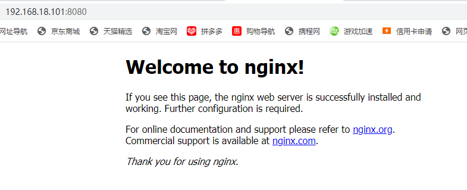


### 1.9 安装可视化工具grafana


```
docker run -d -p 8085:3000 --name=grafana -v /home/data/grafana/data:/var/lib/grafana -v /home/data/grafana/conf:/usr/share/grafana/conf grafana/grafana
```

选择挂载数据文件(/var/lib/grafana)和配置文件(/usr/share/grafana/conf)。前者存放panels、datasoure、页面等数据，后者为配置文件，挂载后可以直接在宿主机器上修改，重启容器后生效


### 1.10 Redis安装部署


##### 4.1 安装redis


###### 第一步：下载redis安装包

wget http://download.redis.io/releases/redis-4.0.6.tar.gz

[](javascript:void(0);)

```
[root@iZwz991stxdwj560bfmadtZ local]# wget http://download.redis.io/releases/redis-4.0.6.tar.gz
--2017-12-13 12:35:12--  http://download.redis.io/releases/redis-4.0.6.tar.gz
Resolving download.redis.io (download.redis.io)... 109.74.203.151
Connecting to download.redis.io (download.redis.io)|109.74.203.151|:80... connected.
HTTP request sent, awaiting response... 200 OK
Length: 1723533 (1.6M) [application/x-gzip]
Saving to: ‘redis-4.0.6.tar.gz’

100%[==========================================================================================================>] 1,723,533    608KB/s   in 2.8s   

2017-12-13 12:35:15 (608 KB/s) - ‘redis-4.0.6.tar.gz’ saved [1723533/1723533]
```

[](javascript:void(0);)

 

###### 第二步：解压压缩包

tar -zxvf redis-4.0.6.tar.gz

```
[root@iZwz991stxdwj560bfmadtZ local]# tar -zxvf redis-4.0.6.tar.gz
```

 

###### 第三步：yum安装gcc依赖

yum install gcc

```
[root@iZwz991stxdwj560bfmadtZ local]# yum install gcc
```

遇到选择,输入y即可

 

###### 第四步：redis解压目录下

cd redis-4.0.6

```
[root@iZwz991stxdwj560bfmadtZ local]# cd redis-4.0.6
```

 

###### 第五步：编译安装

make MALLOC=libc　　

```
[root@iZwz991stxdwj560bfmadtZ redis-4.0.6]# make MALLOC=libc
```

 

将/usr/local/redis-4.0.6/src目录下的文件加到/usr/local/bin目录

cd src && make install

[](javascript:void(0);)

```
[root@iZwz991stxdwj560bfmadtZ redis-4.0.6]# cd src && make install
    CC Makefile.dep

Hint: It's a good idea to run 'make test' ;)

  

```

[](javascript:void(0);)

 

#### 4.2启动redis的三种方式

 

先切换到redis src目录下

```
[root@iZwz991stxdwj560bfmadtZ redis-4.0.6]# cd src
```

 

##### 1、直接启动redis

./redis-server

[](javascript:void(0);)

```
[root@iZwz991stxdwj560bfmadtZ src]# ./redis-server
18685:C 13 Dec 12:56:12.507 # oO0OoO0OoO0Oo Redis is starting oO0OoO0OoO0Oo
18685:C 13 Dec 12:56:12.507 # Redis version=4.0.6, bits=64, commit=00000000, modified=0, pid=18685, just started
18685:C 13 Dec 12:56:12.507 # Warning: no config file specified, using the default config. In order to specify a config file use ./redis-server /path/to/redis.conf
                _._                                                  
           _.-``__ ''-._                                             
      _.-``    `.  `_.  ''-._           Redis 4.0.6 (00000000/0) 64 bit
  .-`` .-```.  ```\/    _.,_ ''-._                                   
 (    '      ,       .-`  | `,    )     Running in standalone mode
 |`-._`-...-` __...-.``-._|'` _.-'|     Port: 6379
 |    `-._   `._    /     _.-'    |     PID: 18685
  `-._    `-._  `-./  _.-'    _.-'                                   
 |`-._`-._    `-.__.-'    _.-'_.-'|                                  
 |    `-._`-._        _.-'_.-'    |           http://redis.io        
  `-._    `-._`-.__.-'_.-'    _.-'                                   
 |`-._`-._    `-.__.-'    _.-'_.-'|                                  
 |    `-._`-._        _.-'_.-'    |                                  
  `-._    `-._`-.__.-'_.-'    _.-'                                   
      `-._    `-.__.-'    _.-'                                       
          `-._        _.-'                                           
              `-.__.-'                                               

18685:M 13 Dec 12:56:12.508 # WARNING: The TCP backlog setting of 511 cannot be enforced because /proc/sys/net/core/somaxconn is set to the lower value of 128.
18685:M 13 Dec 12:56:12.508 # Server initialized
18685:M 13 Dec 12:56:12.508 # WARNING overcommit_memory is set to 0! Background save may fail under low memory condition. To fix this issue add 'vm.overcommit_memory = 1' to /etc/sysctl.conf and then reboot or run the command 'sysctl vm.overcommit_memory=1' for this to take effect.
18685:M 13 Dec 12:56:12.508 # WARNING you have Transparent Huge Pages (THP) support enabled in your kernel. This will create latency and memory usage issues with Redis. To fix this issue run the command 'echo never > /sys/kernel/mm/transparent_hugepage/enabled' as root, and add it to your /etc/rc.local in order to retain the setting after a reboot. Redis must be restarted after THP is disabled.
18685:M 13 Dec 12:56:12.508 * Ready to accept connections　　
```

[](javascript:void(0);)

 

如上图：redis启动成功，但是这种启动方式需要一直打开窗口，不能进行其他操作，不太方便。

 

按 ctrl + c可以关闭窗口。

　　

##### 2、以后台进程方式启动redis

第一步：修改redis.conf文件

将

```
daemonize no
```

 

修改为

```
daemonize yes
```

　

第二步：指定redis.conf文件启动

```
./redis-server /usr/local/redis-4.0.6/redis.conf
[root@iZwz991stxdwj560bfmadtZ src]# ./redis-server /usr/local/redis-4.0.6/redis.conf 
18713:C 13 Dec 13:07:41.109 # oO0OoO0OoO0Oo Redis is starting oO0OoO0OoO0Oo
18713:C 13 Dec 13:07:41.109 # Redis version=4.0.6, bits=64, commit=00000000, modified=0, pid=18713, just started
18713:C 13 Dec 13:07:41.109 # Configuration loaded
```

 

第三步：关闭redis进程

首先使用ps -aux | grep redis查看redis进程

```
[root@iZwz991stxdwj560bfmadtZ src]# ps -aux | grep redis
root     18714  0.0  0.1 141752  2008 ?        Ssl  13:07   0:00 ./redis-server 127.0.0.1:6379
root     18719  0.0  0.0 112644   968 pts/0    R+   13:09   0:00 grep --color=auto redis
```

 

使用kill命令杀死进程

```
[root@iZwz991stxdwj560bfmadtZ src]# kill 18714
```

　 

##### 3、设置redis开机自启动

1、在/etc目录下新建redis目录

mkdir redis

```
[root@iZwz991stxdwj560bfmadtZ etc]# mkdir redis
```

 

2、将/usr/local/redis-4.0.6/redis.conf 文件复制一份到/etc/redis目录下，并命名为6379.conf　　

```
[root@iZwz991stxdwj560bfmadtZ redis]# cp /usr/local/redis-4.0.6/redis.conf /etc/redis/6379.conf
```

 

3、将redis的启动脚本复制一份放到/etc/init.d目录下

```
[root@iZwz991stxdwj560bfmadtZ init.d]# cp /usr/local/redis-4.0.6/utils/redis_init_script /etc/init.d/redisd
```

 

4、设置redis开机自启动

先切换到/etc/init.d目录下

然后执行自启命令

```
[root@iZwz991stxdwj560bfmadtZ init.d]# chkconfig redisd on
service redisd does not support chkconfig　
```

 

看结果是redisd不支持chkconfig

解决方法：

使用vim编辑redisd文件，在第一行加入如下两行注释，保存退出

```
# chkconfig:   2345 90 10
# description:  Redis is a persistent key-value database
```

 

注释的意思是，redis服务必须在运行级2，3，4，5下被启动或关闭，启动的优先级是90，关闭的优先级是10。


 

再次执行开机自启命令，成功

```
[root@iZwz991stxdwj560bfmadtZ init.d]# chkconfig redisd on
```

　

现在可以直接已服务的形式启动和关闭redis了

启动：

service redisd start　

```
[root@izwz991stxdwj560bfmadtz ~]# service redisd start
Starting Redis server...
2288:C 13 Dec 13:51:38.087 # oO0OoO0OoO0Oo Redis is starting oO0OoO0OoO0Oo
2288:C 13 Dec 13:51:38.087 # Redis version=4.0.6, bits=64, commit=00000000, modified=0, pid=2288, just started
2288:C 13 Dec 13:51:38.087 # Configuration loaded
```

 

关闭：

方法1：service redisd stop

```
[root@izwz991stxdwj560bfmadtz ~]# service redisd stop
Stopping ...
Redis stopped
```

 

方法2：redis-cli SHUTDOWN

　 

#### 4.3TimeSerials安装

安装信息

```
https://github.com/RedisTimeSeries/RedisTimeSeries
```


```
[root@i-wsad3ybt RedisTimeSeries]# ./system-setup.py 
/bin/python2 -m pip --version
pip 20.1.1 from /usr/lib/python2.7/site-packages/pip (python 2.7)
/bin/python2 -m pip install --disable-pip-version-check wheel
/bin/python2 -m pip install --disable-pip-version-check setuptools --upgrade
yum install -q -y git jq curl
yum groupinstall -y 'Development Tools'
yum install -q -y redhat-lsb-core
yum install -q -y lcov
Error: Nothing to do

```


解决办法 ：

```
方法一、更换源
mv /etc/yum.repos.d/CentOS-Base.repo /etc/yum.repos.d/CentOS-Base.repo.backup1
wget -O /etc/yum.repos.d/CentOS-Base.repo http://mirrors.aliyun.com/repo/Centos-7.repo
运行 yum makecache 生成缓存

方法二、
用EPEL方式安装nginx：
sudo yum install epel-release
yum update
yum install -q -y lcov


```

————————————————
重新安装

```
[root@i-wsad3ybt RedisTimeSeries]# yum install -q -y lcov
Package lcov-1.13-1.el7.noarch already installed and latest version
[root@i-wsad3ybt RedisTimeSeries]# ./system-setup.py 
/bin/python2 -m pip --version
pip 20.1.1 from /usr/lib/python2.7/site-packages/pip (python 2.7)
/bin/python2 -m pip install --disable-pip-version-check wheel
/bin/python2 -m pip install --disable-pip-version-check setuptools --upgrade
yum install -q -y git jq curl
yum groupinstall -y 'Development Tools'
yum install -q -y redhat-lsb-core
yum install -q -y lcov
/bin/python2 -m pip install --disable-pip-version-check git+https://github.com/RedisLabs/RAMP@master
/bin/python2 -m pip install --disable-pip-version-check -r tests/requirements.txt
/bin/python2 -m pip install --disable-pip-version-check jinja2

```

build

```
[root@i-wsad3ybt RedisTimeSeries]# make build
Compiling chunk.c...
Compiling compressed_chunk.c...
Compiling config.c...
Compiling compaction.c...
Compiling generic_chunk.c...
Compiling gorilla.c...
Compiling indexer.c...
Compiling module.c...
Compiling parse_policies.c...
Compiling rdb.c...
Compiling tsdb.c...
Building rmutil...
parse_policies.c: In function ‘parse_string_to_millisecs’:
parse_policies.c:26:5: warning: format ‘%llu’ expects argument of type ‘long long unsigned int *’, but argument 3 has type ‘u_int64_t *’ [-Wformat=]
     if (sscanf(timeStr, "%llu%c%c", &timeSize, &interval_type, &should_be_empty) != 2) {
     ^
Compiling ../../deps/RedisModulesSDK/rmutil/util.c...
Compiling ../../deps/RedisModulesSDK/rmutil/strings.c...
Compiling ../../deps/RedisModulesSDK/rmutil/sds.c...
Compiling ../../deps/RedisModulesSDK/rmutil/alloc.c...
Compiling ../../deps/RedisModulesSDK/rmutil/vector.c...
Compiling ../../deps/RedisModulesSDK/rmutil/periodic.c...
Creating ../../bin/linux-x64-release/rmutil/librmutil.a...

```

生成 /Timeserials/bin/TimeSerials.so 文件，需要加载到Redis server。ls 

#### 4.4  Redis加载模块TimeSerials

##### 4.4.1 通过普通方式加载

模块有两种加载方式，一是在配置文件redis.conf中使用
 `loadmodule /path/to/TimeSerials.so` 在 Redis 启动时加载。

查看加载的模块:


file

另一种方式在运行时使用命令 `MODULE LOAD /path/to/panda.so` 加载。


file

使用MODULE UNLOAD panda卸载。


file

在载入的模块的时候可以传入参数，如：loadmodule panda.so hello panda 1234，
 参数会被传入模块的OnLoad方法中。


##### 4.4.2通过Docker 加载

You can either get RedisTimeSeries setup in a Docker container or on your own machine.

To quickly try out RedisTimeSeries, launch an instance using docker:

```
docker run -p 6379:6379 -it --rm redislabs/redistimeseries

```


进入容器内部访问命令：

```
[root@i-s21hd6yt ~]# docker  exec -it c0c2613ab7dd  /bin/bash
root@c0c2613ab7dd:/data# redis-cli
127.0.0.1:6379> ls
(error) ERR unknown command `ls`, with args beginning with: 
127.0.0.1:6379> MODULES
(error) ERR unknown command `MODULES`, with args beginning with: 
127.0.0.1:6379> modules
(error) ERR unknown command `modules`, with args beginning with: 
127.0.0.1:6379> MODULE LIST
1) 1) "name"
   2) "timeseries"
   3) "ver"
   4) (integer) 10207
127.0.0.1:6379> 

```


##### 4.4.3 代码访问TimeSerials

```
 RedisTimeSeries rts = new RedisTimeSeries("localhost", 6379);
   
   Map<String, String> labels = new HashMap<>();
   labels.put("country", "US");
   labels.put("cores", "8"); 
   rts.create("cpu1", 60*10 /*10min*/, 100, labels);
   
   rts.create("cpu1-avg", 60*10 /*10min*/, 100, null);
   rts.createRule("cpu1", Aggregation.AVG, 60 /*1min*/, "cpu1-avg");
   
   rts.add("cpu1", System.currentTimeMillis()/1000 /* time sec */, 80);
   
   // Get all the timeseries in US in the last 10min average per min  
   rts.mrange(System.currentTimeMillis()/1000 - 10*60, System.currentTimeMillis()/1000, Aggregation.AVG, 60, "country=US")
```


#### 6.基于Docker 安装 reids

You can either get RedisTimeSeries setup in a Docker container or on your own machine.

To quickly try out RedisTimeSeries, launch an instance using docker:

```
sudo docker run -p 6379:6379 --name=redis --restart=always  redislabs/redistimeseries

如果不在服务器上：
redis-server --loadmodule /home/RedisTimeSeries/bin/redistimeseries.so
```


```
创建容器时没有添加参数  --restart=always ，导致的后果是：当 Docker 重启时，容器未能自动启动。

现在要添加该参数怎么办呢，方法有二：

1、Docker 命令修改

docker container update --restart=always 容器名字
```


## 附录3：建模工具安装


```
 
1、你还在没经过设计就直接敲代码吗？ 设计先行的理念哪去了？
2、你难道不想要有一种工具，可以把你设计的东西直接转换成代码或者sql语句，以减轻你的工作量吗？
3、你想一直都敲代码吗？程序员可不是吃青春饭的，时间久了，就该要好好考虑转变开发角色的事情了。


一、什么是EA？
Enterprise Architect 是Sparx Systems 公司的旗舰产品。它覆盖了系统开发的整个周期，除了开发类模型之外，还包括事务进程分析，使用案例需求，动态模型，组件和布局，系统管理，非功能需求，用户界面设计，测试和维护等。    
```


详细讲解了EA的安装，用EA进行逆向工程，用EA画图，代码生成，EA合并文档，数据库设计等多个主题。

任务：

1. 完成EA的下载安装;
2. 使用EA画出类图;
3. 能够设计数据表，导出到物理数据库(mysql)
4. 提交格式：  姓名-班级-EA工具初步使用.doc

### 3.1 EA工具安装

#### 3.1.1 安装EA

1. 解压安装包。

2. 找到enterprisearchitect14\EA 14.0.1422下的easetup.msi。

   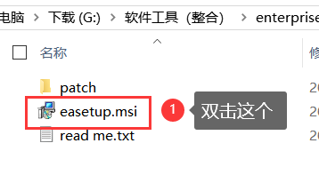

   没有什么可注意的，直接默认就行，安装位置可以自己选。

   

3. 将patch下的EA.exe替换到你的EA安装目录下EA.exe。

4. 这就算破解完成了，接下来就可以正常使用了。

#### 3.1.2 创建项目，创建Model


==下面添加Model，添加完Model，才能画Diagrams==


==选择你要创建哪种类型的图，然后点Create Pattern，这里我以创建类图进行举例==


创建完成

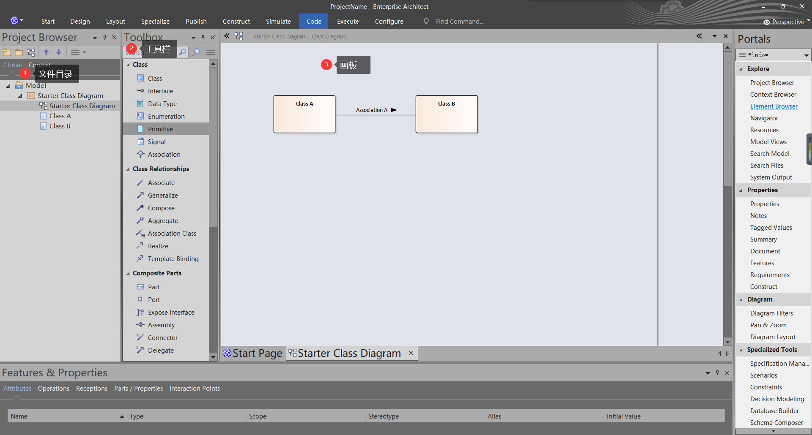


#### 3.1.3类图及自动生成

==这里我以画类图来举例==

创建一个类图Model


##### 1 创建类

1. 从Toolbox工具栏中选中class类拖到工作区

   

2. 设置类的变量

   - 在下面的Features栏中的Attribute设置变量

   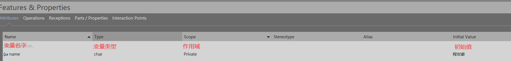

   

3. 设置类的方法

   - 在下面的Features栏中的Operations设置变量

   

##### 2 类关系连接


##### 3 EA从图自动生成代码

这里选择使用装饰模式画的图导出代码


==下面操作要Select All==


==看到下面这个就算导出成功了==


##### 4 EA代码逆向工程

1. 创建一个project


2. 右击model，添加一个Model用于工作视图


3. 这里我选择一个简单的类图，点击Creat Pattern（s）


4. 选择好咱们创建好的model


5. 从上面栏中选择 code -> Import -> File -> Import Source Directory

或者选中model后直接使用快捷键 Crtl + Shift + u


6. 选择好要导入文件的属性，点击OK


7. 在左边就可以看到导入进来的包了


也可以查看图了

#### 3.1.4 EA合并两个eapx文档

**这是两个不同eapx文件中的Model**


下面咱们要将ProjectA和ProjectB两个文档合并到一起

==使用将一个ProjectB导出为xml，再在ProjectA中导入xml==

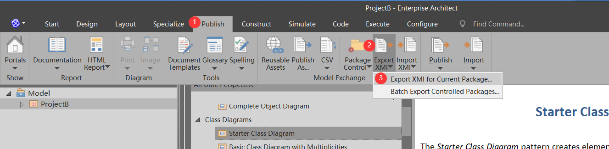


现在咱们切换到另一个工程里


==导入成功==


#### 3.1.5 EA进行数据库设计

##### 1 选择模型


==这里我以创建Student数据库来做演示==

==这里一点需要注意的是选择Model时，要选择你要使用哪种类型的数据库，这儿呢我选择的是DB2，也可以选择其他的，比如MySql、SQlServer==

##### 2 创建表格


选中数据库类型


==数据表建立完成==


##### 3 设置外键


==外键设置完毕==


##### 4 生成代码


==导出成功==


==导出内容==

```mysql
/* ---------------------------------------------------- */
/*  Generated by Enterprise Architect Version 14.0 		*/
/*  Created On : 19-4月-2020 11:48:59 				*/
/*  DBMS       : MySql 						*/
/* ---------------------------------------------------- */

SET FOREIGN_KEY_CHECKS=0
; 
/* Drop Tables */

DROP TABLE IF EXISTS `course` CASCADE
;

DROP TABLE IF EXISTS `sc` CASCADE
;

DROP TABLE IF EXISTS `student` CASCADE
;

/* Create Tables */

CREATE TABLE `course`
(
	`Cno` CHAR(4) NOT NULL,
	`Cname` CHAR(40) NULL,
	`Cpno` CHAR(4) NULL,
	`Ccredit` SMALLINT NULL,
	CONSTRAINT `PK_course` PRIMARY KEY (`Cno` ASC)
)

;

CREATE TABLE `sc`
(
	`Sno` CHAR(9) NOT NULL,
	`Cno` CHAR(4) NOT NULL,
	`Grade` SMALLINT NULL
)

;

CREATE TABLE `student`
(
	`Sno` CHAR(9) NOT NULL,
	`Sname` CHAR(20) NULL,
	`Ssex` CHAR(2) NULL,
	`Sage` SMALLINT NULL,
	`Sdept` CHAR(20) NULL,
	`Cno` CHAR(4) NULL,
	CONSTRAINT `PK_student` PRIMARY KEY (`Sno` ASC)
)

;

/* Create Foreign Key Constraints */

ALTER TABLE `sc` 
 ADD CONSTRAINT `FK_sc_course`
	FOREIGN KEY (`Cno`) REFERENCES `course` (`Cno`) ON DELETE Restrict ON UPDATE Restrict
;

ALTER TABLE `sc` 
 ADD CONSTRAINT `FK_sc_student`
	FOREIGN KEY (`Sno`) REFERENCES `student` (`Sno`) ON DELETE Restrict ON UPDATE Restrict
;

SET FOREIGN_KEY_CHECKS=1
; 

```

##### 5 EA数据库反向工程

==目的：==

1. 不同数据库迁移。
2. 针对老系统的维护，系统中有几百张表，没有数据库设计文件，通过反向工程导入EA更好研究，再次进行设计。

由于EA不支持MySQL 64位的ODBC Driver，所以需要下载

==下载地址==

```
http://dev.mysql.com/get/Downloads/Connector-ODBC/5.1/mysql-connector-odbc-5.1.8-win32.msi/from/http://mysql.oss.eznetsols.org/ (windows 32bit)
```

安装的时候一直默认就行


控制面板--》管理工具--》ODBC Data Sources（32-bit）


==点击Test==


看到上面这个就可以点击OK了

==添加成功==

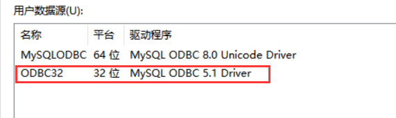

**接下来进行EA里面的操作**


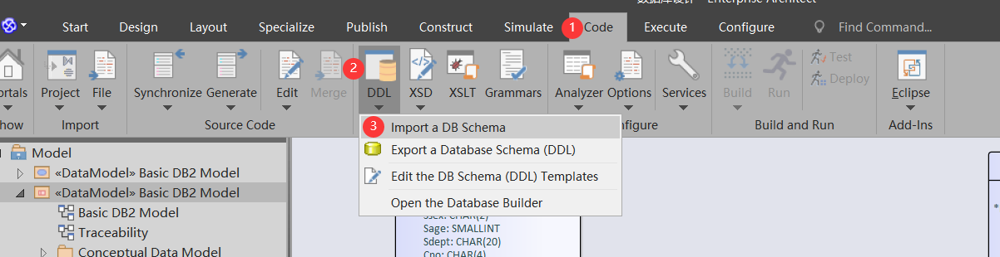


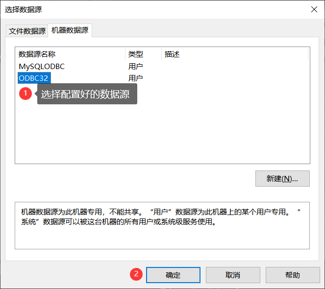==


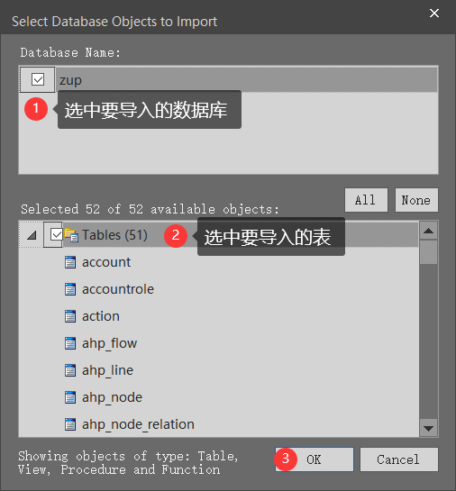

==导入成功==


如果想看外键之间的联系，将Database A图中的所有复制到Tables图中

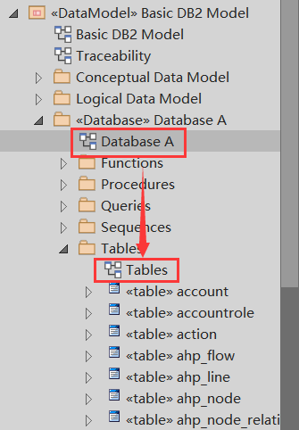


#### 3.1.6 EA文件合并

1. 导出xml文件


2. 导入xml文件

   

3. 合并

   注意经过测试XML File也需要选择 和Merge相同的文件。

   
   
   ### 附录5：原型工具安装与使用
   
   
   
   