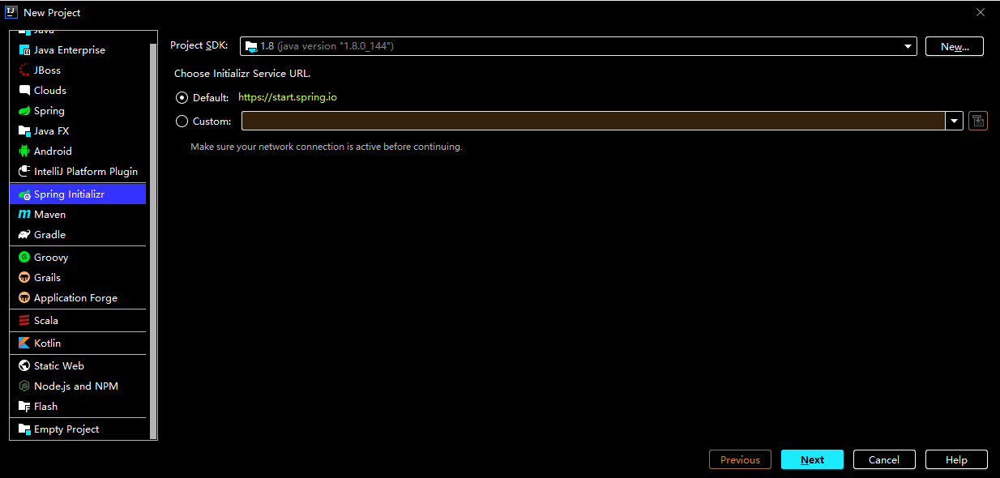
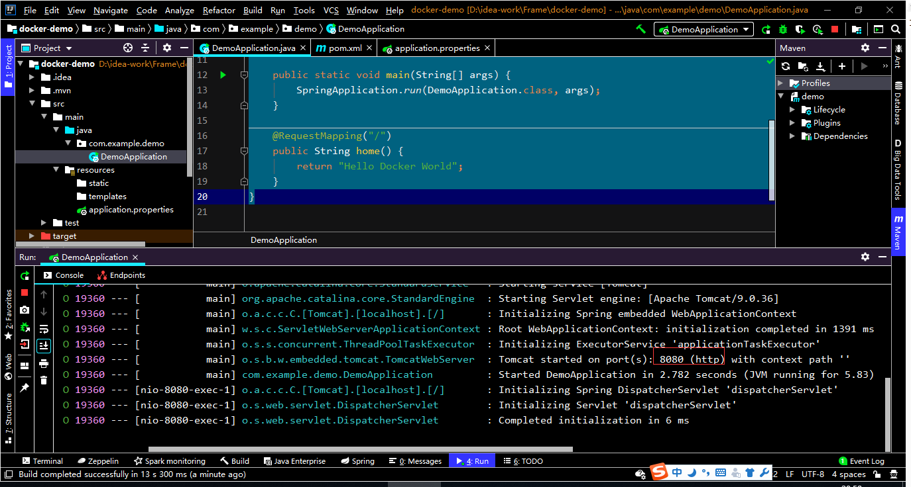
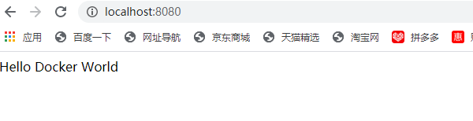

# 企业框架开发：


### 1. 设计思路

采用主流开源技术框架，建设满足企业级应用的框架，能够适应企业高并发、复杂业务处理、扩展性、便于运维的要求，保证可持续性发展。课程包括典型企业应用框架介绍、系统开发部署环境搭建、系统需求分析与建模、企业数据库设计方案、企业主流技术好开发框架选型与应用、物联网平台框架设计与应用等内容。通过本课程，学生能够独立的搭建开发环境，根据需求设计技术方案，选择合适的技术框架、组件，完成系统功能的开发。


### 2. 主要内容

| 单元  | **主要内容**                                                 | **学时** |
| ----- | ------------------------------------------------------------ | -------- |
| **1** | 典型企业架构讲解：信息化系统(ERP/MIS)、物联网平台(设备监控)、电商平台。 | 4        |
| **2** | 系统开发与部署（DevOps）：主流开发工具IDEA、PyCharm的安装与应用；Docker +微服务在企业应用开发、运维中应用；Jenkins+Git /Gitlab 系统开发部署与发布于禅道进行项目管理与缺陷跟踪；JMeter进行压力性能测试。 | 4        |
| **3** | 系统分析与设计：需求分析与建模工具EA、原型设计工具  Axure、数据库设计工具  ERStudio/EA/navicat的掌握与应用。 | 4        |
| **4** | 主流企业开发框架搭建：Spring Boot + Maven+  Spring MVC+MyBatis+MySQL+Redis + 前端框架+商务智能(BI)。 | 4        |
| **5** | 企业级数据库设计：企业业务（组织岗位职责；规章制度业务规范、业务流程、业务场景）基础信息（组织架构、权限体系、日志）建设、业务信息（举例ERP/监控平台）建设。数据介绍（数据库MySQL/HBase/redis）+数据概念（数据资源）。 | 4        |
| **6** | 平台技术选型与框架搭建：操作系统、应用服务器、负载均衡、缓存、数据存储、文件存储、消息队列、搜索设计、开发框架。 | 4        |
| **7** | 物联网平台设计：高并发通信服务(Netty)+消息队列(RabbitMQ /Kafka)+ Redis + MySQL集群+ 组态软件。高并发系统的设计与优化（Nginx 集群+ MySQL集群/Hadoop + 高并发通信+  缓存）。 | 4        |
| **8** | 企业平台Demo设计与开发（基于开源框架，数据库设计、框架搭建、部分功能开发、系统部署、系统运行）。 | 4        |


### 3.技术路线

1. 典型的企业应用讲解

2. 学员进入实战，引导学生进行开发

3. 学员能够独立的搭建开发环境，根据需求设计技术方案，选择合适的技术框架、组件，完成系统功能的开发。


### 4. 具体操作

1. [计划用EA 使用一个原型项目，体系化的 从用例分析、领域模型、 架构设计（业务架构 应用架构 技术架构 数据架构）、业务流程、状态转换、类、接口走一遍。支撑课程建设。]()

2. 大家在设计、开发时，各种工具一起上(axure viso ea/rose 思维导图  wps）画出各种图形，分不清阶段（需求 设计  开发  测试？），找不准讨论的对象（用户 开发人员 专家 设计人员？）。
   UML中类图 状态图在不同的阶段如何使用，也不是非常清晰。需要梳理。

3. 这样学习者学习后，至少知道什么是架构设计，应该在什么阶段出什么样的图，如何指导开发。

   

   


## 1. 系统分析与设计

### 1.1系统开发的阶段

**特点：集百家之长，从系统开发阶段划分、实际案例讲解、UML图的应用场景分析三个方面进行阐述。**


UML图可以应用于需求分析、设计建模、开发实施多个应用场景，只是侧重点不同，细化程度不同。

在需求分析阶段可以用使用用例图、活动图、时序图、类图进行建模。

```
软件工程的一般开发过程：愿景分析、业务建模，需求分析，健壮性设计，关键设计，最终设计，实现……
```


### 1.2 需求分析

需求分析阶段要业务用例图，活动图，对象状态复杂时需要画状态图。

#### 1.2.1 基本概念

用例是用户期望具备的功能，每一个用例说明一个系统提供给它的使用者的一种服务或功能。用例的目标是要定义系统的一个行为，但并不显示系统的内部结构。用例名一般为动宾短语，符号是椭圆加用例。

用例图是指由参与者（Actor）、用例（Use Case），边界以及它们之间的关系构成的用于描述系统功能的视图。 用例图（User Case）是外部用户（被称为参与者）所能观察到的系统功能的模型图。

#### 1.2.2 用例要素构成


#### 1.2.3 用例的关系

a）参与者与用例间的关联关系：参与者与用例之间的通信，也成为关联或通信关系。


##### 1.2.3.1 用例的关系

a）参与者与用例间的关联关系：参与者与用例之间的通信，也成为关联或通信关系。


b）用例与用例之间的关系：包含关系（include）、扩展关系（extend）、泛化关系。


##### 1.2.3.2 包含关系

用例A,用例B都包含用例C。


2.3.2 扩展关系

用例A 为基本用例，用例B为扩展用例。


##### 1.2.3.3 泛化关系

用例B从从里A继承。


#### 1.2.4 用例的确定

###### 1.2.4.1用例图建模及应用

创建用例图模型主要包含3部分内容：

- 识别系统中的角色和用例
- 区分用例之间的先后次序
- 创建用例图模型结构

###### 1.2.4.2识别系统中的角色和用例

这部分工作通常由系统分析员通过和客户沟通来完成。

要获取系统的用例，首先要找出系统的角色。

要获取系统角色可以在与客户沟通时，询问用户一些问题来识别角色。可以参考下列问题：

- 谁将使用系统的主要功能？
- 是需要系统的支持以完成日常工作？
- 谁负责维护、管理系统并保持系统正常运行？
- 系统需要与哪些外部系统交互？
- 系统需要处理哪些硬件设备？
- 谁对系统运行产生的结果比较感兴趣？

当我们获取到系统角色后，我们可以通过角色来列出它的用例。可以通过回答下列问题来识别用例：

- 每个角色执行的操作有什么？
- 什么角色将要创建、存储、改变、删除或者读取系统中的信息？
- 什么用例会创建、存储、改变、删除或读取这个信息？
- 角色需要通知外部系统的突然变化嘛？
- 系统需要通知角色正在发生的事情吗？
- 什么用例将支持和维护系统？

#### 1.2.5 业务用例与系统用例

分清业务用例和系统用例，是做需求分析的第一步:

用例 use case，或译使用案例、用况，是软件工程或系统工程中对系统如何反应外界请求的描述，是一种通过用户的使用场景来获取需求的技术。每个用例提供了一个或多个场景，该场景说明了系统是如何和最终用户或其它系统互动，也就是谁可以用系统做什么，从而获得一个明确的业务目标。

**业务用例：属于业务范围的概念。顾名思义，在具体用户所接触的真实业务中总结出来的例子，体现了需求，属于功能性需求，需要actor来实现的**

**系统用例：属于系统范围的概念。也可理解为要实现某个业务用例的系统级实现**

系统用例并不是业务需求的细分

最常见的例子就是档案管理，从业务用例来说，添加档案，修改档案，删除档案，对于系统用例。可能修改档案比较麻烦，就只是添加档案，删除档案就可以实现业务层面的功能性需求。

比如点菜：在业务层面，点菜人员只需要点菜，或者是取消点菜，但是在需求用例中需要体现增加菜品，减少菜品，取消点单

 

以下是百度结果：

业务用例是用来捕获功能性需求的，功能性需求是由actor的业务目标来体现的。也就是对于actor来说，他所负责的业务需要由一系列的业务目标组成。比如一个档案管理员，他的业务目标就是维护档案。比如论坛管理员，他的业务目标有维护用户，维护帖子等..这些业务目标构成actor职责的全部。业务用例体现了需求。
而需求的实现有多种方式。如何实现它，是由系统用例来体现的，它们并不是一个简单的细分关系，虽然看上去象。就说维护档案吧，这样一个业务目标，会有多种不同的用例场景去完成它，这些场景包括如何增加档案，如何修改档案，如何删除档案....对于系统用例来说，就是通过分析这些场景，来决定哪些场景中的哪些部分是要纳入系统建设范围的。比如维护档案业务用例中，假设由于某个原因，修改档案很困难，只能通过先删除，再全部重建的方式来实现，那么系统用例就增加档案，删除档案，而没有修改档案。
业务用例和系统用例是分别站在客户的业务视角和系统建设视角来规划的。业务用例不是接近，而是完全的直接需求，系统用例也不是业务逻辑的详细划分，而是系统对需求的实现方式，但不是与程序设计无关，它只是说，要建设的系统功能性需求由这些系统用例构成。
所以业务用例和系统用例都是需求范畴，它们分别代表了业务范围和系统范围。

```

```


#### 1.2.6领域模型设计

##### 1.2.6.1建模背景

```
按照一般的项目管理过程，“需求”之后是“分析”，领域模型（ domain model（业务对象模型））是完成从需求分析（自然语言）到面向对象设计的一座桥梁。用例是没有类的概念的，是纯自然的语言（比如英语、汉语）写的，因为用例实际上由客户口述给我们、然后由我们形成文档化的用例文档，无法完成从自然语言到面向对象语言的转换。

领域模型，顾名思义就是显示最重要的业务概念和它们之间关系，是真实世界各个事物的表示（现实世界的可视化抽象字典）。是描述业务领域（业务实体）的静态结构，而不是软件中各构件的表示（类：表示业务概念，通常只包含重要属性；关联、泛化：表达概念之间的关系）。用来帮助我们理解相关领域知识的模型，是描述业务用例实现的对象模型。

领域模型过程中识别出来的对象和具体的语言无关，也没有方法。换句话说，public、private、函数这些面向对象的属性在领域模型阶段不需要分析出来。
参考:
https://www.cnblogs.com/ppgeneve/p/5089113.html
```

##### 1.2.6.2 如何建设模型

领域模型”阶段我们要做什么、该怎么做。**领域建模的三字经方法:找名词、定属性、连关系。** 

（1）找出用例模型中的名词，尽可能多的找出概念类（识别方法：概念类分类列表、名词性短语）。

```
a.概念分类列表：人、事物、地点、组织、概念、事件、规则、抽象名词、交易项目、角色、设备、组织结构（对用例进行识别：实体、过程中的信息、角色的输入输出、操作设备等）

b.名词分析法：识别问题域和用例描述中的名词和名词性短语作为候选的概念类和属性，从候选项中，摒弃多余的名词，确定最终的对象（注意是作为类还是属性，类可以是一种标识、状态和行为）
```

（2）然后识别这些名词本身的相关信息，定属性。

```
a.语法：
      可见性 属性名：类型 多重性=默认值{特性表}  
      [可见性] 属性名 [：类型] [=初始值]
b.属性类型是简单的数据类型为佳，如果是复杂概念，考虑是否单独作为一个概念类
c.任何属性都不表示外键，即不应该用属性来联系概念类，区别于数据库设计中的外键
```

（3）以及名词之间的相互关联关系，关联、继承、依赖。

```
关联：类之间的某种语义关系包括聚合，组合
继承：一般到特殊
依赖：表明一个元素（源元素）的定义或实现依赖另一个元素（被依赖元素）的定义或实现
```


###### 1.找出用例模型中的名词

原有用例如下，用蓝色加黑标出名词（重复的就不标了）：

1）**顾客**携带**商品**到**收银台**；

2）**收银员**扫描**商品条形码**；

3）**系统**根据条形码获取并显示**商品信息**；

4）收银员重复2~3步，直到所有商品扫描完毕；

5）系统计算**商品总额**；

...

n）系统打出**商品清单**，完成**交易**。

这个用例中的名词有“顾客”、“商品”、“收银台”、“收银员”、“商品条形码”、“系统”、“商品信息”、“商品总额”、“商品清单”、“交易”。稍加整理：

1）“顾客”、“收银员”是系统的外部对象，不需要我们进行设计，但这些对象要和系统进行交互；

2）“商品”、“商品条形码”、“商品信息”、“商品总额”、“商品清单”、“交易”是领域对象，但“商品条形码”、“商品信息”可以算作“商品”的属性、“商品总额”可以算作“交易”的属性，最后从这个用例总结出来的领域对象有**“商品”、“商品清单”、“交易”**三个。

###### 2.识别这些名词本身的相关信息

一个对象的属性可能分布在多个用例中，因此可以通过迭代不断的完善一个对象的属性，大家可以看到，我们在第一步中的样例就已经分析了一部分了：“商品条形码”、“商品信息”可以算作“商品”的属性。

对象除了属性外，还有一些约束或者限制，这些在用例中可能有，也可能没有，这就需要分析人员来发现了。比如说交易金额必须大于0.1元小于99999元这种约束，用例中不一定会体现，可能需要分析人员向客户咨询。

###### 3.识别对象间的关系

面向对象设计就是依靠对象间的互相协作来配合完成相应的功能，因此识别出对象和对象本身的属性外，还要识别对象间的关系，例如1对多、1对1、依赖等，详细的各种关系可以参考UML的标准定义。

我们以第一步识别的三个对象为例：“商品清单”包含多个“商品”、一次“交易”对应一个“商品清单”、一个“商品”只能属于一个“交易”等。

###### 4.画出领域模型UML图

结合前三步的分析，画出UML领域模型图。

 参考领域模型：

https://wenku.baidu.com/view/e5ca5879773231126edb6f1aff00bed5b9f37324.html


#### 1.2.7 活动图进行需求分析

​     活动图是状态机的一个变体，用来描述执行算法的工作流程中涉及的活动。活动状态代表了一个活动：一个工作流步骤或一个操作的执行。活动图描述了一组顺序的或并发的活动。活动视图用活动图来体现。

​    活动图（Activity Diagram）可以实现对系统动态行为的建模，主要是将用例细化，即用例内部的细节可以以活动图的方式描述。活动图描述活动的顺序，主要表活动之间的控制流，是内部处理驱动的流程，在本质上是一种流程图。先看一下基本图标。


​	 活动图可以认为是用例的细化。

1. 购物场景：


2. 支付场景


#### 1.2.8 用序列图画业务流程

在潘加宇的《软件方法》[7]中比较了活动图和序列图，推崇使用序列图来表达业务，称之为业务序列图，然后基于业务序列图来识别系统用例（区别于业务用例，即是本文所称用例）。可以发现当处理多个业务角色时，序列图确实拥有与活动图相当的表现力。那么，序列图如果用在用例规约中，将是什么景象？ 


​																图片来源于网络

可以看到序列图表达的内容与基本流文字是一样的，更加直观，但显然的需要更多时间，而且并不能充分说明交互细节，毕竟在图片上不适宜打上密密麻麻的字。更关键的上述这幅图中有“银行主机”，这就超出了单个用例的范畴。

总的来说，序列图不是用例的标准配置，在用例规约中使用序列图可以更好的呈现事件流，但其将花费更多时间，如果在单个用例内再考虑其它角色和其它用例，那么所费时间更多，而且有可能与前期业务分析重复，也有可能与后续设计分析重复。

在编写有效用例一书中，明确指出在用例规约中画序列图是不合适的。

参考：
https://www.cnblogs.com/kubixuesheng/p/5156492.html
https://wenku.baidu.com/view/0123d837abea998fcc22bcd126fff705cd175c45.html


```
业务序列图的组成：业务执行者、业务工人、业务实体，以及三者间的交互，以完成某个业务用例的实现流程。业务工人[Business worker]——位于业务组织内部，负责业务流程中某些工作的人员。比如银行柜员，诊所的医生。业务实体[Business Entity]——在业务用例的实现流程中，业务工人所使用的“系统”。例如银行的数钞机，学校的校园卡系统。业务实体可以和业务工人相互取代各自的职责。


采用序列图来描述业务现状的步骤：

　　1.识别业务对象：业务执行者、业务工人、业务实体；

　　2.确定业务对象间的职责、协作及交互顺序

　　3.绘制业务序列图。

　　其中绘制图的时候，生命线（Lifeline）是一条垂直的虚线，用来表示序列图中的对象在一段时间内的存在

　　

　　示例：比如为某家招聘公司进行业务建模——画出业务现状序列图，招聘的业务用例描述：招聘公司在XXX市人才交流中心前台，要求发布招聘信息，并向工作人员出示公司资质证明，工作人员核实资质的有效性，招聘公司将招聘简介给工作人员。工作人员在招聘记彔本上填写公司招聘职位，招聘条件，以及公司简介等信息，并要求招聘公司核实，招聘公司核实无误后，工作人员将招聘信息用彩纸张贴在招聘信息栏内，工作人员向招聘公司收取一定费用。（注意：在现实工作中，类似如上的信息都是分析师与组织的业务专家深入沟通后才能获得的）。本例的业务对象是，招聘公司（业务执行者），工作人员（业务工人），找到业务对象之后，开始确定各个对象之间的职责，交互……
```


### 1.3架构设计

#### 1.3.1生产力与架构

架构可分为**业务架构、应用架构、技术架构**，业务架构是**生产力**（战略），应用架构是**生产关系**（战术），技术架构是**生产工具**（装备）。业务架构决定应用架构，应用架构需要适配业务架构，并随着业务架构不断进化，同时应用架构依托技术架构最终落地。 


1. 生产力：指具有一定生产经验和劳动技能的**劳动者**和所使用的**生产资料**结合起来, 从而在**物质资料生产过程中所发生的力量**, 也就是人类在生产过程中征服和改造自然界, 并获得适合自己需要的物质资料的能力。

2. 生产关系：指人们在物质资料生产过程中结成的**社会关系**。它的具体内容包括人们在物质资料的生产、交换、分配、消费等方面的关系。生产资料所有制是生产关系的基础。一定的生产资料所有制形式, 决定人们在生产中一定的地位和相互关系、一定的换关系、一定的产品分配和消费关系。

   生产力决定生产关系，生产关系要适应生产力的发展，生产关系是生产力发展的形式，生产关系会反作用于生产力。这是唯物史观的基本原理。 生产关系有两种基本类型：一是以[公有制](https://baike.baidu.com/item/公有制)为基础的生产关系，二是以[私有制](https://baike.baidu.com/item/私有制)为基础的生产关系

3. 生产工具：又称劳动工具，是人们在生产过程中用来直接对劳动对象进行加工的物件。它被用于劳动者和劳动对象之间，起传导劳动的作用。是劳动资料的基本的和主要的部分，是机械性的劳动资料。从原始人的石斧、弓箭，到现代化的各种各样的机器、工具、技术设备等，都同样起着传导劳动的作用，均属生产工具。


#### 1.3.2 架构划分

1. 系统架构：指的完整系统的组成架构。**包括业务规划，业务模块、业务流程，对整个系统的业务进行拆分，对领域模型进行设计，把现实的业务转化成抽象对象。**例如系统分成几个部分？服务平台、管理门户、终端门户、ATM门户、外部系统以及接口、支撑系统等，将这些系统进行合理的划分。然后再进行功能分类细分，例如服务平台内部划分为系统管理、用户管理、帐号管理、支付管理、接口层、统计分析等逻辑功能。总之，将整个系统业务分解为逻辑功能模块，并且科学合理，就是系统架构。

   

2. 应用架构：应用架构定义系统有哪些应用、以及应用之间如何分工和合作。应用作为独立可部署的单元，为系统划分了明确的边界（生产关系，各司其职）。应用架构深刻影响系统功能组织、代码开发、部署和运维等各方面。这里所谓应用就是各个逻辑模块或者子系统。主要考虑部署，例如不同的应用如何分别部署，如何支持灵活扩展、大并发量、安全性等，需要画出物理网络部署图。按照应用进行划分的话，还需要考虑是否支持分布式SOA。

3. 技术架构：从技术层面描述，主要是分层模型，例如持久层、数据层、逻辑层、应用层、表现层等，然后每层使用什么技术框架，确定组成应用系统的实际运行组件（lvs，nginx，tomcat，php-fpm等），这些运行组件之间的关系，以及部署到硬件的策略。系统架构的设计要求架构师具备软件和硬件的功能和性能的过硬知识，这也是架构设计工作中最为困难的工作。

4. 数据架构：

5. 代码架构：

6. 部署拓扑架构（物理架构）：

#### 1.3.3战略与战术设计

系统架构是战略设计与战术设计的完美结合：

- **战略设计**：业务架构用于指导架构师如何进行系统架构设计。

- **战术设计**：应用架构要根据业务架构来设计。

- **战术实施**：应用架构确定以后，就是技术选型。

  

#### 1.3.4业务架构

1. 总体架构图（京东业务架构）

   

2. 业务模块（功能结构图）

3. 业务流程

#### 1.3.5 应用架构

1、职责划分:   明确应用（各个逻辑模块或者子系统）边界
   1）逻辑分层
   2）子系统、模块定义。
   3）关键类。
2、职责之间的协作：
   1）接口协议：应用对外输出的接口。
   2）协作关系：应用之间的调用关系。

    应用分层有两种方式：
    
    一种是水平分（横向），按照功能处理顺序划分应用，比如把系统分为web前端/中间服务/后台任务，这是面向业务深度的划分。
    
    另一种是垂直分（纵向），按照不同的业务类型划分应用，比如进销存系统可以划分为三个独立的应用，这是面向业务广度的划分。
    
     应用的合反映应用之间如何协作，共同完成复杂的业务case，主要体现在应用之间的通讯机制和数据格式，通讯机制可以是同步调用/异步消息/共享DB访问等，数据格式可以是文本/XML/JSON/二进制等。
    
     应用的分偏向于业务，反映业务架构，应用的合偏向于技术，影响技术架构。分降低了业务复杂度，系统更有序，合增加了技术复杂度，系统更无序。
    
     应用架构的本质是通过系统拆分，平衡业务和技术复杂性，保证系统形散神不散。
    
     系统采用什么样的应用架构，受业务复杂性影响，包括企业发展阶段和业务特点；同时受技术复杂性影响，包括IT技术发展阶段和内部技术人员水平。业务复杂性（包括业务量大）必然带来技术复杂性，应用架构目标是解决业务复杂性的同时，避免技术太复杂，确保业务架构落地。

#### 1.3.6 技术架构


#### 1.3.7 物理架构

 拓扑架构，包括架构部署了几个节点，节点之间的关系，服务器的高可用，网路接口和协议等，决定了应用如何运行，运行的性能，可维护性，可扩展性，是所有架构的基础。这个图主要是运维工程师主要关注的对象。


## 2. 典型企业应用框架


### 1.1业务应用场景


1. 业务需求：


2. 物联网监控平台业务场景


### 1.2基础应用框架


​							图1. 基础技术框架


典型的互联网大数据平台的架构Lamda架构：


```
在这张架构图中，大数据平台里面向用户的在线业务处理组件用褐色标示出来，这部分是属于互联网在线应用的部分，其他蓝色的部分属于大数据相关组件，使用开源大数据产品或者自己开发相关大数据组件。你可以看到，大数据平台由上到下，可分为三个部分：数据采集、数据处理、数据输出与展示。

1.数据采集

将应用程序产生的数据和日志等同步到大数据系统中，由于数据源不同，这里的数据同步系统实际上是多个相关系统的组合。数据库同步通常用 Sqoop，日志同步可以选择 Flume，打点采集的数据经过格式化转换后通过 Kafka 等消息队列进行传递。

不同的数据源产生的数据质量可能差别很大，数据库中的数据也许可以直接导入大数据系统就可以使用了，而日志和爬虫产生的数据就需要进行大量的清洗、转化处理才能有效使用。

2.数据处理

这部分是大数据存储与计算的核心，数据同步系统导入的数据存储在 HDFS。MapReduce、Hive、Spark 等计算任务读取 HDFS 上的数据进行计算，再将计算结果写入 HDFS。

MapReduce、Hive、Spark 等进行的计算处理被称作是离线计算，HDFS 存储的数据被称为离线数据。在大数据系统上进行的离线计算通常针对(某一方面的)全体数据，比如针对历史上所有订单进行商品的关联性挖掘，这时候数据规模非常大，需要较长的运行时间，这类计算就是离线计算。

除了离线计算，还有一些场景，数据规模也比较大，但是要求处理的时间却比较短。比如淘宝要统计每秒产生的订单数，以便进行监控和宣传。这种场景被称为大数据流式计算，通常用 Storm、Spark Steaming 等流式大数据引擎来完成，可以在秒级甚至毫秒级时间内完成计算。

3.数据输出与展示

大数据计算产生的数据还是写入到 HDFS 中，但应用程序不可能到 HDFS 中读取数据，所以必须要将 HDFS 中的数据导出到数据库中。数据同步导出相对比较容易，计算产生的数据都比较规范，稍作处理就可以用 Sqoop 之类的系统导出到数据库。

这时，应用程序就可以直接访问数据库中的数据，实时展示给用户，比如展示给用户关联推荐的商品。

除了给用户访问提供数据，大数据还需要给运营和决策层提供各种统计报告，这些数据也写入数据库，被相应的后台系统访问。很多运营和管理人员，每天一上班，就是登录后台数据系统，查看前一天的数据报表，看业务是否正常。如果数据正常甚至上升，就可以稍微轻松一点;如果数据下跌，焦躁而忙碌的一天马上就要开始了。

将上面三个部分整合起来的是任务调度管理系统，不同的数据何时开始同步，各种 MapReduce、Spark 任务如何合理调度才能使资源利用最合理、等待的时间又不至于太久，同时临时的重要任务还能够尽快执行，这些都需要任务调度管理系统来完成。

上面讲的这种大数据平台架构也叫 Lambda 架构，是构建大数据平台的一种常规架构原型方案。
```


Kappa架构：

Jay Kreps认为通过非常，非常快地增加并行度和重播历史来处理重新处理实时数据，避免在实时数据处理系统上再“粘粘”一个离线数据处理系统。于是，他提出了这样的架构：


```
Kafka或者其他消息中间件，具备保留多日数据的能力。正常情况下kafka都是吐出实时数据，经过实时处理系统，进入服务数据库（Serving DB）。

当系统需要数据订正时，重放消息，修正实时处理代码，扩展实时处理系统的并发度，快速回溯过去历史数据。

这样的架构简单，避免了维护两套系统还需要保持结果一致的问题，也很好解决了数据订正问题。

但它也有它的问题：

1、消息中间件缓存的数据量和回溯数据有性能瓶颈。通常算法需要过去180天的数据，如果都存在消息中间件，无疑有非常大的压力。同时，一次性回溯订正180天级别的数据，对实时计算的资源消耗也非常大。

2、在实时数据处理时，遇到大量不同的实时流进行关联时，非常依赖实时计算系统的能力，很可能因为数据流先后顺序问题，导致数据丢失。

例如：一个消费者在淘宝网上搜索商品。正常来说，搜索结果里，商品曝光数据应该早于用户点击数据产出。然而因为可能会因为系统延迟，导致相同商品的曝光数据晚于点击数据进入实时处理系统。如果开发人员没意识到这样的问题，很可能会代码设计成曝光数据等待点击数据进行关联。关联不上曝光数据的点击数据就很容易被一些简单的条件判断语句抛弃。

对于离线处理来说，消息都是批处理，不存在关联不上的情况。在Lambda架构下，即使实时部分数据处理存在一定丢失，但因为离线数据占绝对优势，所以对整体结果影响很小。即使当天的实时处理结果存在问题，也会在第二天被离线处理的正确结果进行覆盖。保证了最终结果正确。
```

先整理一下Lambda架构和Kappa架构的优缺点：


```
Kappa在抛弃了离线数据处理模块的时候，同时抛弃了离线计算更加稳定可靠的特点。Lambda虽然保证了离线计算的稳定性，但双系统的维护成本高且两套代码带来后期运维困难。

为了实现流批处理一体化，Blink采用的将流处理视为批处理的一种特殊形式。因此在内部维持了若干张张流表。通过缓存时间进行约束，限定在一个时间段内的数据组成的表，从而将实时流转为微批处理。

理论上只要把时间窗口开的足够大，Flink的流表可以存下上百日的数据，从而保证微批处理的“微”足够大可以替换掉离线处理数据。

但这样做存在几个问题：

1.Flink的流表是放在内存中，不做持久化处理的。一旦任务发生异常，内存数据丢失，Flink是需要回溯上游消息流，从而转为Kappa的结构。

2.数据窗口开的越大，内存成本越高。受限于成本，对大量数据处理仍然有可支持的物理空间上限。

3.下游接收的通常都是处理结果，对于内存中的流表数据是无法直接访问的。这样无形中增加了开发成本。
```


## 3. 系统开发与部署

### 3.1DevOps


​                        


### 3.2 开发运行环境

 1.  Linux/Ubuntu安装/Docker的使用/Tomcat /Nginx集群(docker)
 2. JDK
 3. IDEA安装、配置	
 4. Kafka 安装    
 5. Redis安装    
 6. FastFS安装
 7. MySQL安装/Navicat安装

### 2.2  配置与部署工具安装

 1. jenkins

    

 2. GITHub使用

### 3.3  设计工具安装

 1. ERStudio安装

    

 2. EA安装

    

 3. Axure安装

    

 4. VISO安装

    
    
    


## 4. SpringBoot构建企业开发框架


从最根本上来讲，Spring Boot就是一些库的集合，它能够被任意项目的构建系统所使用。简便起见，该框架也提供了命令行界面，它可以用来运行和测试Boot应用。框架的发布版本，包括集成的CLI（命令行界面），可以在Spring仓库中手动下载和安装。

- **创建独立的Spring应用程序**
- **嵌入的Tomcat，无需部署WAR文件**
- **简化Maven配置**
- **自动配置Spring**
- **提供生产就绪型功能，如指标，健康检查和外部配置**
- **绝对没有代码生成并且对XML也没有配置要求**

1. springBoot初步

   ```
   https://docs.spring.io/spring-boot/docs/1.5.8.RELEASE/reference/htmlsingle/#getting-started-installing-spring-boot
   
   
   https://www.cnblogs.com/toutou/p/9650939.html
   ```

   

2. 基于Mybatis连接数据库

3. 构建Redis缓存

4. FastFS文件服务器

5. Tomcat+Nginx集群

6. UI LayUI/VUE/MUI

7. 


### 4.1 IDEA创建Spingboot项目

```
https://www.cnblogs.com/little-rain/p/11063967.html
https://www.cnblogs.com/toutou/p/9650939.html
```




2. 模板选择

   ```
   上边下拉框可以选择Spring Boot的版本，这里使用最新版2.2.0 M4。完成后点击 Next。
   
   这里我选择了“Web”类别下的“Spring Web Starter”、“Template”类别下的“Thymeleaf”以及“SQL”类别下的“Spring Data JPA”和“Mysql Driver”。
   ```

   

pom.xml文件

```
<?xml version="1.0" encoding="UTF-8"?>
<project xmlns="http://maven.apache.org/POM/4.0.0" xmlns:xsi="http://www.w3.org/2001/XMLSchema-instance"
         xsi:schemaLocation="http://maven.apache.org/POM/4.0.0 https://maven.apache.org/xsd/maven-4.0.0.xsd">
    <modelVersion>4.0.0</modelVersion>
    <parent>
        <groupId>org.springframework.boot</groupId>
        <artifactId>spring-boot-starter-parent</artifactId>
        <version>2.3.1.RELEASE</version>
        <relativePath/> <!-- lookup parent from repository -->
    </parent>
    <groupId>com.example</groupId>
    <artifactId>demo</artifactId>
    <version>0.0.1-SNAPSHOT</version>
    <name>demo</name>
    <description>Demo project for Spring Boot</description>

    <properties>
        <java.version>1.8</java.version>
    </properties>

    <dependencies>
        <dependency>
            <groupId>org.springframework.boot</groupId>
            <artifactId>spring-boot-starter-data-jpa</artifactId>
        </dependency>
        <dependency>
            <groupId>org.springframework.boot</groupId>
            <artifactId>spring-boot-starter-web</artifactId>
        </dependency>

        <dependency>
            <groupId>mysql</groupId>
            <artifactId>mysql-connector-java</artifactId>
            <scope>runtime</scope>
        </dependency>
        <dependency>
            <groupId>org.springframework.boot</groupId>
            <artifactId>spring-boot-starter-test</artifactId>
            <scope>test</scope>
            <exclusions>
                <exclusion>
                    <groupId>org.junit.vintage</groupId>
                    <artifactId>junit-vintage-engine</artifactId>
                </exclusion>
            </exclusions>
        </dependency>
    </dependencies>

    <build>
        <plugins>
            <plugin>
                <groupId>org.springframework.boot</groupId>
                <artifactId>spring-boot-maven-plugin</artifactId>
            </plugin>
        </plugins>
    </build>
    <repositories>
        <repository>
            <id>alimaven</id>
            <url>https://maven.aliyun.com/repository/public</url>
        </repository>
    </repositories>
    <pluginRepositories>
        <pluginRepository>
            <id>alimaven</id>
            <url>https://maven.aliyun.com/repository/public</url>
        </pluginRepository>
    </pluginRepositories>

</project>

```


```
一个@SpringBootApplication注解就搞定了所有时, 它封装了核心的@SpringBootConfiguration+@EnableAutoConfiguration+@ComponentScan这三个类,大大节省了程序员配置时间,这就是SpringBoot的核心设计思想.

##@SpringBootConfiguration
读取配置文件，配置文件的路径是当前根目录(src/main/resources/application.yml等)

##EnableAutoConfiguration
开启自动配置，扫描当前的所有依赖的jar包，发现新的依赖出现将会将会根据依赖完各种自动配置（扫描start_web，自动配置内置tomcat默认路径、端口；依赖了rabbitmq，自动配置rabbitTemble）

##ComponetScan
属于Spring框架(@Component,@Service,@Controller,@Repository,@Entity)，扫描范围默认情况下是启动类坐在的同名包及其子孙包

```


添加Application.yml 文件，监听端口， 数据库连接。

```
server:
  port: 8000

spring:
  datasource:
    url: jdbc:mysql://localhost:3306/mysql?serverTimezone=UTC
    username: root
    password: 123456
    driver-class-name: com.mysql.jdbc.Driver

```


### 4.2 数据库创建与连接


配置Myatis

```
<dependency>
            <groupId>org.mybatis.spring.boot</groupId>
            <artifactId>mybatis-spring-boot-starter</artifactId>
            <version>1.1.1</version>
</dependency>
<dependency>
            <groupId>mysql</groupId>
            <artifactId>mysql-connector-java</artifactId>
            <version>5.1.30</version>
</dependency>

```


```
use zuche;
CREATE TABLE `users` (
    `id` int(10) unsigned NOT NULL AUTO_INCREMENT,
    `username` varchar(255) NOT NULL,
    `age` int(10) NOT NULL,
    `phone` bigint NOT NULL,
    `email` varchar(255) NOT NULL,
    PRIMARY KEY (`id`)
)ENGINE=InnoDB AUTO_INCREMENT=1 DEFAULT CHARSET=utf8;
insert into users values(1,'赵',23,158,'3658561548@qq.com');
insert into users values(2,'钱',27,136,'3658561548@126.com');
insert into users values(3,'孙',31,159,'3658561548@163.com');
insert into users values(4,'李',35,130,'3658561548@sina.com'
```

添加User

```
package com.athm.pojo;

/**
 * Created by toutou on 2018/9/15.
 */
public class User {
    private int id;
    private String username;
    private Integer age;
    private Integer phone;
    private String email;

    public int getId() {
        return id;
    }

    public void setId(int id) {
        this.id = id;
    }

    public String getUsername() {
        return username;
    }

    public void setUsername(String username) {
        this.username = username;
    }

    public Integer getAge() {
        return age;
    }

    public void setAge(Integer age) {
        this.age = age;
    }

    public Integer getPhone() {
        return phone;
    }

    public void setPhone(Integer phone) {
        this.phone = phone;
    }

    public String getEmail() {
        return email;
    }

    public void setEmail(String email) {
        this.email = email;
    }
}
```

添加UserMapper

```
package com.athm.dao;

import com.athm.pojo.User;
import org.apache.ibatis.annotations.Mapper;
import org.apache.ibatis.annotations.Select;

import java.util.List;

/**
 * Created by toutou on 2018/9/15.
 */
@Mapper
public interface UserMapper {
    @Select("SELECT id,username,age,phone,email FROM USERS WHERE AGE=#{age}")
    List<User> getUser(int age);
}
```

添加UserSevice

```
package com.athm.service;

import com.athm.pojo.User;

import java.util.List;

/**
 * Created by toutou on 2018/9/15.
 */
public interface UserService {
    List<User> getUser(int age);
}
```

添加UserServiceImpl

```
package com.athm.service;

import com.athm.dao.UserMapper;
import com.athm.pojo.User;
import org.springframework.beans.factory.annotation.Autowired;
import org.springframework.stereotype.Service;

import java.util.List;

/**
 * Created by toutou on 2018/9/15.
 */
@Service
public class UserServiceImpl implements UserService{
    @Autowired
    UserMapper userMapper;

    @Override
    public List<User> getUser(int age){
        return userMapper.getUser(age);
    }
}
```


controller添加API方法

```
package com.athm.controller;

import com.athm.pojo.User;
import com.athm.service.UserService;
import org.springframework.beans.factory.annotation.Autowired;
import org.springframework.stereotype.Controller;
import org.springframework.web.bind.annotation.GetMapping;
import org.springframework.web.bind.annotation.RequestMapping;
import org.springframework.web.bind.annotation.ResponseBody;
import org.springframework.web.bind.annotation.RestController;

import java.util.HashMap;
import java.util.List;
import java.util.Map;

/**
 * Created by toutou on 2018/9/15.
 */
@RestController
public class IndexController {
    @Autowired
    UserService userService;
    @GetMapping("/show")
    public List<User> getUser(int age){
        return userService.getUser(age);
    }

    @RequestMapping("/index")
    public Map<String, String> Index(){
        Map map = new HashMap<String, String>();
        map.put("北京","北方城市");
        map.put("深圳","南方城市");
        return map;
    }
}
```


修改Application

```
package com.athm.zuche;

import org.mybatis.spring.annotation.MapperScan;
import org.springframework.boot.SpringApplication;
import org.springframework.boot.autoconfigure.SpringBootApplication;
import org.springframework.context.annotation.ComponentScan;

@SpringBootApplication
@ComponentScan(basePackages = {"com.athm.controller","com.athm.service"})
@MapperScan(basePackages = {"com.athm.dao"})
public class ZucheApplication {

    public static void main(String[] args) {
        SpringApplication.run(ZucheApplication.class, ags);
    }
}

```


### 4.3 Spring boot 生产开发环境配置


一、简单介绍
在项目的开发中，有些配置文件在开发、测试或者生产等不同环境中可能是不同的，例如数据库连接、redis的配置等等。那我们如何在不同环境中自动实现配置的切换呢？Spring给我们提供了profiles机制，下面看看在Spring Boot中是如何使用Profiles功能的。

在Spring Boot中多环境配置文件名需要使用application-{profile}.properties的格式，这里的**{profile}**对应的是你的环境标识。例如：

application-dev.properties — 这是开发环境
application-prod.properties — 这是生产环境
二、激活指定profile
我们在首先在Resource目录下新建两个配置文件，分别命名为application-dev.properties以及application-prod.properties，为了方便看到区别，我们分别在三个配置文件中分别指定tomcat启动端口：


application.properties

server.port=8081
1
application-dev.properties

server.port=8082

application-prod.properties

server.port=8083

这个时候我们没有指定任何profile,执行启动类的main方法，可以看到:

Tomcat started on port(s): 8081 (http) with context path ''


程序会默认加载application.properties中的配置，我们想要使用对应的环境，只需要在application.properties中使用spring.profiles.active属性来设置，值对应上面提到的{profile}，这里就是指dev、prod:

server.port=8081
spring.profiles.active=dev

重新启动Main方法：

Tomcat started on port(s): 8082 (http) with context path ''

可以看到tomcat启动端口为8082。

####从上面的结果可以看出，application-dev.properties中的配置覆盖了application.propertie中的配置。我们在配置文件中可以将与环境无关的属性放到application.propertie中进行配置，而根据环境的变化而变化的配置放到各个application-{profile}.properties文件中。

三、激活profile的方式
上面展示了第一种激活profile的方式，即在application.properties中指定属性spring.profiles.active的值。但是这种方式在实际项目中的使用并不合适，因为你每次提交代码还要手动修改pring.profiles.active的值。

第二种可以使用命令行的方式，Spring Boot的程序一般是打成jar包，在使用java -jar 执行jar包的时候，可以再后面加上：

--spring.profiles.active=dev；

例如

java -jar target/spring-boot-helloworld-0.0.1.jar --spring.profiles.active=prod

可以看到启动端口为：

Tomcat started on port(s): 8083 (http) with context path ''

若是使用IDEA进行开发的话，还可以修改启动配置：


之后执行Main方法，依然激活了dev的配置。

第三种是修改虚拟机的配置，在虚拟机配置哪里加上：

-Dspring.profiles.active=dev

### 4.4基于IDEA自动部署系统

IntelliJ IDEA自动部署如下：
打开IntelliJ IDEA点击Tools/Deployment/Configuration（或者File-Settings-Build,Execution,Deployment-Deployment都行）,界面如下所示：


填写远程服务器信息，并测试远程服务器连接成功(下图表示测试连接成功)；


填写本地和远程服务器项目路径；


基本设置完成，最后用IntelliJ IDEA打开项目，右键点击Deployment，Unpload to 配置名(或者Tools，Deployment，Unpload to)， 上传、运行项目即可！！！


可能配置的时候有些复杂，但是如果你能配置好，测试部署方便很多 ！！！


### 4.5 Docker部署Springboot项目（jar)


```
https://spring.io/guides/gs/spring-boot-docker/
```


#### 1.创建springboot项目


创建springboot项目

添加代码如下：

```css
@SpringBootApplication
@RestController
public class DemoApplication {

    public static void main(String[] args) {
        SpringApplication.run(DemoApplication.class, args);
    }

    @RequestMapping("/")
    public String home() {
        return "Hello Docker World";
    }
}
```


IDEA-Run---- 




在浏览器输入http://localhost:8080



#### 2.打包springboot项目为jar包


IDEA打jar包，并上传到服务器

```
https://www.cnblogs.com/mysummary/p/10144204.html
```

1.打jar包直接配置好maven后，直接用自带命令，clean （清除的是target里面的东西，包括之前打的包），然后package打包就行


 

2.打war包

1 在pom.xml依赖配置中新增 <packaging>war</packaging>


2.

需要对启动类进行改写，添加@override下的代码，继承SpringBootServletInitializer类，在springBoot启动类的同级目录添加一个继承SpringBootServletInitializer 的类，该类在idea开发工具启动springBoot main函数时不会被初始化，在Tomcat启动时才会被初始化


 

[](javascript:void(0);)

```
public class Application extends SpringBootServletInitializer{
    protected static final Logger logger = LoggerFactory.getLogger(Application.class);
    @Override
    protected SpringApplicationBuilder configure(SpringApplicationBuilder builder) {
        return builder.sources(Application.class);
    }
    public static void main(String[] args){
        SpringApplication.run(Application.class, args);
        logger.info("com.cehh.Application is success!");
    }
}
```

[](javascript:void(0);)

 

```
修改pom依赖
<dependency>
   <groupId>org.springframework.boot</groupId>
   <artifactId>spring-boot-starter-tomcat</artifactId>
   <scope>provided</scope>
</dependency>
```

 


 

[](javascript:void(0);)

```
<!-- war 插件 -->
<plugin>
    <groupId>org.apache.maven.plugins</groupId>
    <artifactId>maven-war-plugin</artifactId>
    <configuration>
        <warName>demo</warName>
    </configuration>
</plugin>
```

[](javascript:void(0);)

```
warName改成自己打war包的名字
```

 

 3.在idea顶部菜单栏目中点击Build再选择Build Artifacts产品类型就可以在项目的target目录下生成对应的war；或者直接maven命令package也可以打包


4.

把生成的war放在Tomcat的webapps目录下，Tomcat的端口号最好配置成跟springBoot项目配置文件的端口号一样，不然项目运行后访问会以Tomcat的端口号为准（注意：只支持tomcat8以上运行）

5 运行并访问，运行时会初始化继承SpringBootServletInitializer的类

 

#### 3. 编写Dockerfile文件


```ruby
# Docker image for springboot file run
# VERSION 0.0.1
# Author: eangulee
# 基础镜像使用java
FROM java:8
# 作者
MAINTAINER eangulee <eangulee@gmail.com>
# VOLUME 指定了临时文件目录为/tmp。
# 其效果是在主机 /var/lib/docker 目录下创建了一个临时文件，并链接到容器的/tmp
VOLUME /tmp 
# 将jar包添加到容器中并更名为app.jar
ADD demo-0.0.1-SNAPSHOT.jar app.jar 
# 运行jar包
RUN bash -c 'touch /app.jar'
ENTRYPOINT ["java","-Djava.security.egd=file:/dev/./urandom","-jar","/app.jar"]
```

**解释下这个配置文件：**

1. VOLUME 指定了临时文件目录为/tmp。其效果是在主机 /var/lib/docker 目录下创建了一个临时文件，并链接到容器的/tmp。改步骤是可选的，如果涉及到文件系统的应用就很有必要了。

2. /tmp目录用来持久化到 Docker 数据文件夹，因为 Spring Boot 使用的内嵌 Tomcat 容器默认使用/tmp作为工作目录
3. 项目的 jar 文件作为 “app.jar” 添加到容器的
4. ENTRYPOINT 执行项目 app.jar。为了缩短 Tomcat 启动时间，添加一个系统属性指向 “/dev/./urandom” 作为 Entropy Source

如果是第一次打包，它会自动下载java 8的镜像作为基础镜像，以后再制作镜像的时候就不会再下载了。

#### 4. 部署文件

在服务器新建一个docker文件夹，将maven打包好的jar包和Dockerfile文件复制到服务器的docker文件夹下


docker文件夹

#### 5. 制作镜像

执行下面命令， 看好，最后面有个"."点！


```undefined
docker build -t springbootdemo4docker .
```

-t 参数是指定此镜像的tag名


ls

```
[root@i-s21hd6yt docker_demo_jar]# docker build -t springbootdemo4docker .
Cannot connect to the Docker daemon at unix:///var/run/docker.sock. Is the docker daemon running?
ERRO[0000] failed to dial gRPC: cannot connect to the Docker daemon. Is 'docker daemon' running on this host?: dial unix /var/run/docker.sock: connect: no such file or directory 

没有启动服务


[root@i-s21hd6yt docker_demo_jar]# service docker start
Redirecting to /bin/systemctl start docker.service

```

开始制作镜像：


制作完成后通过**docker images**命令查看我们制作的镜像


#### 6.启动容器


```csharp
[root@localhost docker]# docker run -d -p 9000:8080 springbootdemo4docker  
  
-d参数是让容器后台运行 
-p 是做端口映射，此时将服务器中的9000端口映射到容器中的8080(项目中端口配置的是8080)端口
```

#### 7. 访问网站

直接浏览器访问： http://你的服务器ip地址:8080/


### 4.6 安全管理实现

1. 账户登录
2. 单点登录
3. SQL注入过滤器
4. 日志记录

### 4.7 业务组件实现

1. 基于Srpingboot构建服务Service(流程引擎)
   1. 消息队列
   2. 计算服务
   3. 通信服务(Netty)
   4. 构建实时库
2. 商务智能 BI
3. 流程引擎workflow
4. 权限体系Rbac


## 4. 构建物联网框架


### 4.1高并发通信Netty


### 4.2消息队列Kafka


```
https://www.cnblogs.com/gongshiyun/p/12528000.html


https://www.cnblogs.com/toutou/p/springboot_kafka.html

```

https://www.cnblogs.com/toutou/p/springboot_kafka.html


kafka是一个分布式消息队列。具有高性能、持久化、多副本备份、横向扩展能力。生产者往队列里写消息，消费者从队列里取消息进行业务逻辑。一般在架构设计中起到解耦、削峰、异步处理的作用。kafka对外使用topic的概念，生产者往topic里写消息，消费者从读消息。为了做到水平扩展，一个topic实际是由多个partition组成的，遇到瓶颈时，可以通过增加partition的数量来进行横向扩容。单个parition内是保证消息有序。每新写一条消息，kafka就是在对应的文件append写，所以性能非常高。


#### 4.2.1 Kafka基础架构与术语


Kafka是一种高吞吐量的分布式发布订阅消息系统，也是一个流式数据处理平台，具有高性能、持久化、多副本备份、横向扩展能力。Kafka最初由LinkedIn公司开发的，之后成为Apache项目的一部分。具备下面三个特点：

- 类似消息系统，提供事件流的发布和订阅，即具备数据注入功能
- 存储时间流数据的节点具有故障容错的特点，即具备数据存储功能
- 能够对实时的事件流进行流式的处理和分析，即具备流处理功能

  


**Producer：**发布消息的对象称为生产者

**Consumer：**订阅消息并处理发布的消息的种子的对象称为消费者

**Consumer Group**：我们可以将多个消费者组成一个消费者组，在kafka的设计中同一个分区的数据只能被消费者组中的某一个消费者消费。同一个消费者组的消费者可以消费同一个topic的不同分区的数据，这也是为了提高kafka的吞吐量

**Kafka cluster ：**已发布的消息保存在一组服务器中，称之为Kafka集群

**Broker：**Kafka集群中的每一个服务器都是一个代理(Broker). 消费者可以订阅一个或多个主题（topic），并从Broker拉数据，从而消费这些已发布的消息。

**Topic**：消息的主题，可以理解为消息的分类，kafka的数据就保存在topic。在每个broker上都可以创建多个topic

**Partition：**Topic的分区，每个topic可以有多个分区，分区的作用是做负载，提高kafka的吞吐量。同一个topic在不同的分区数据是不重复的，partition的表现形式就是一个一个的文件夹

**Replication：**每一个分区都有多个副本，副本的作用是做备胎。当主分区（Leader）故障的时候会选择一个备胎（Follower）上位，成为Leader。在kafka中默认副本的最大数量是10个，且副本的数量不能大于Broker的数量，follower和leader绝对是在不同的机器，同一机器对同一个分区也只可能存放一个副本（包括自己）。

**Zookeeper**：kafka集群依赖zookeeper来保存集群的的元信息，来保证系统的可用性

**AR ( Assigned Replicas)：**分区中的所有副本合集

**ISR(In-Sync Replicas)：**所有与leader 副本保持一定程度同步的副本（包括leader 副本在内〕组成 , ISR 集合是AR 集合中的一个子集

**OSR ( Out-of-Sync Replicas )：**与leader 副本同步滞后过多的副本

**ISR = leader + 没有落后太多的副本**

**AR = OSR+ ISR;**

#### 4.2.2 Kafka三大角色

- **消息系统**

  Kafka和传统的消息系统（也称作消息中间件）都具备系统解耦、冗余存储、流量削峰、缓冲、异步通信、扩展性、可恢复性等功能。与此同时， Kafka 还提供了大多数消息系统难以实现的**消息顺序性保障及回溯消费**的功能。

- **存储系统**

  Kafka 把**消息持久化到磁盘**，相比于其他基于内存存储的系统而言，有效地降低了数据丢失的风险。也正是得益于Kafka 的消息持久化功能和多副本机制，我们可以把Kafka 作为长期的数据存储系统来使用，只需要把对应的数据保留策略设置为“永久”或启用主题的日志压缩功能即可。

- **流式处理平台**

  Kafka 不仅为每个流行的流式处理框架提供了可靠的数据来源，还提供了一个完整的**流式处理类库**，比如窗口、连接、变换和聚合等各类操作。


#### 4.2.3 centos安装Kafka


```
1. 安装JDK
2.  wget https://downloads.apache.org/kafka/2.6.0/kafka_2.12-2.6.0.tgz
3. tar -xzvf kafka_2.12-2.4.0.tgz
4.启动 zookeeper

　　　　kafka 在设计上就是依赖于 zookeeper 的，所以启动 kafka 前需要启动 zookeeper。依赖 zookeeper 有两种选择：使用独立的 zookeeper 和 使用 kafka 自带的 zookeeper（高版本的 kafka 已经自带了 zookeeper）。如果使用独立的 zookeeper，就需要修改 kafka 安装目录下的 config/server.properties 文件中的 zookeeper.connect 配置项（zookeeper 对外服务地址）。本例中使用自带的 zookeeper。

　　　　nohup ./bin/zookeeper-server-start.sh config/zookeeper.properties >> zookeeper.nohup &

　　　　检查 zookeeper 进程是否已经启动：ps -ef|grep zookeeper

5.启动 kafka
　nohup ./bin/kafka-server-start.sh config/server.properties >> kafka.nohup &
　　
　7.验证

　　7.1. 启动 producer

　　　　sh bin/kafka-console-producer.sh --broker-list localhost:9092 --topic test

　　7.2.启动 consumer，在另一个终端窗口执行

　　　　sh bin/kafka-console-consumer.sh --bootstrap-server localhost:9092 --topic test --from-beginning

　　7.3.从 producer 终端窗口发送消息，并查看 consumer 窗口的输出，结果如下

　　　　
　　
```

producer窗口：


#### 4.2.4 docker镜像


```
version: '2'
services:
  zookeeper:
    image: wurstmeister/zookeeper
    ports:
      - "2181:2181"
  kafka:
    image: wurstmeister/kafka
    ports:
      - "9092-9095:9092"
    environment:
      KAFKA_ADVERTISED_LISTENERS: PLAINTEXT://localhost:9092
      KAFKA_ADVERTISED_HOST_NAME: 192.168.18.101
      KAFKA_LISTENERS: PLAINTEXT://:9092
      KAFKA_ZOOKEEPER_CONNECT: zookeeper:2181
    volumes:
    # 使容器内可以执行docker ps、docker port等命令
      - /var/run/docker.sock:/var/run/docker.sock
```


1. 创建和启动docker容器

```powershell
docker-compose up -d
```

1. 扩展kafka节点为3个

```powershell
docker-compose scale kafka=3
```


#### 4.2.5 基于Kafka进行开发


```
https://blog.csdn.net/boling_cavalry/article/details/85528519
```


#### Kafka与其他消息队列比较

与RabbitMQ、RocketMQ比较：

- Kafka是LinkedIn开源的分布式发布-订阅消息系统，目前归属于Apache定级项目。Kafka主要特点是基于Pull的模式来处理消息消费，追求高吞吐量，一开始的目的就是用于日志收集和传输。0.8版本开始支持复制，不支持事务，对消息的重复、丢失、错误没有严格要求，适合产生大量数据的互联网服务的数据收集业务。
- RabbitMQ是使用Erlang语言开发的开源消息队列系统，基于AMQP协议来实现。AMQP的主要特征是面向消息、队列、路由（包括点对点和发布/订阅）、可靠性、安全。AMQP协议更多用在企业系统内，对数据一致性、稳定性和可靠性要求很高的场景，对性能和吞吐量的要求还在其次。
- RocketMQ是阿里开源的消息中间件，它是纯Java开发，具有高吞吐量、高可用性、适合大规模分布式系统应用的特点。RocketMQ思路起源于Kafka，但并不是Kafka的一个Copy，它对消息的可靠传输及事务性做了优化，目前在阿里集团被广泛应用于交易、充值、流计算、消息推送、日志流式处理、binglog分发等场景。


### 4.3Redis进行实时数据展示


redis是Nosql数据库中使用较为广泛的非关系型内存数据库，redis内部是一个key-value存储系统。它支持存储的value类型相对更多，包括string(字符串)、list(链表)、set(集合)、zset(sorted set –有序集合)和hash（哈希类型，类似于Java中的map）。Redis基于内存运行并支持持久化的NoSQL数据库，是当前最热门的NoSql数据库之一，也被人们称为数据结构服务器。

1. 物联网实时数据库，存储当前数据
2. RdisTimeSerials 构建时序数据库，存储物联网序列数据。
3. 构建消息中间件，进行消息的收发。
4. 缓存构建，加快采集速度。
4. Nginx+tomcat+redis构建集群


## 5.系统互联


### 5.1 基于RESTFUL系统互联


### 5.2 Get与Post协议简介

GET和POST是什么？HTTP协议中的两种发送请求的方法。 

HTTP的底层是TCP/IP。所以GET和POST的底层也是TCP/IP，也就是说，GET/POST都是TCP链接。GET和POST能做的事情是一样一样的。你要给GET加上request body，给POST带上url参数，技术上是完全行的通的。  

CP就像汽车，我们用TCP来运输数据，它很可靠，从来不会发生丢件少件的现象。但是如果路上跑的全是看起来一模一样的汽车，那这个世界看起来是一团混乱，送急件的汽车可能被前面满载货物的汽车拦堵在路上，整个交通系统一定会瘫痪。为了避免这种情况发生，交通规则HTTP诞生了。HTTP给汽车运输设定了好几个服务类别，有GET, POST, PUT, DELETE等等，HTTP规定，当执行GET请求的时候，要给汽车贴上GET的标签（设置method为GET），而且要求把传送的数据放在车顶上（url中）以方便记录。如果是POST请求，就要在车上贴上POST的标签，并把货物放在车厢里。当然，你也可以在GET的时候往车厢内偷偷藏点货物，但是这是很不光彩；也可以在POST的时候在车顶上也放一些数据，让人觉得傻乎乎的。HTTP只是个行为准则，而TCP才是GET和POST怎么实现的基本。
但是，我们只看到HTTP对GET和POST参数的传送渠道（url还是requrest body）提出了要求。“标准答案”里关于参数大小的限制又是从哪来的呢？


在我大万维网世界中，还有另一个重要的角色：运输公司。不同的浏览器（发起http请求）和服务器（接受http请求）就是不同的运输公司。 虽然理论上，你可以在车顶上无限的堆货物（url中无限加参数）。但是运输公司可不傻，装货和卸货也是有很大成本的，他们会限制单次运输量来控制风险，数据量太大对浏览器和服务器都是很大负担。业界不成文的规定是，（大多数）浏览器通常都会限制url长度在2K个字节，而（大多数）服务器最多处理64K大小的url。超过的部分，恕不处理。如果你用GET服务，在request body偷偷藏了数据，不同服务器的处理方式也是不同的，有些服务器会帮你卸货，读出数据，有些服务器直接忽略，所以，虽然GET可以带request body，也不能保证一定能被接收到哦。 


GET和POST还有一个重大区别，简单的说：GET产生一个TCP数据包；POST产生两个TCP数据包。

长的说：对于GET方式的请求，浏览器会把http header和data一并发送出去，服务器响应200（返回数据）；而对于POST，浏览器先发送header，服务器响应100 continue，浏览器再发送data，服务器响应200 ok（返回数据）。 也就是说，GET只需要汽车跑一趟就把货送到了，而POST得跑两趟，第一趟，先去和服务器打个招呼“嗨，我等下要送一批货来，你们打开门迎接我”，然后再回头把货送过去。 

因为POST需要两步，时间上消耗的要多一点，看起来GET比POST更有效。因此Yahoo团队有推荐用GET替换POST来优化网站性能。但这是一个坑！跳入需谨慎。为什么？

1. GET与POST都有自己的语义，不能随便混用。
2. 据研究，在网络环境好的情况下，发一次包的时间和发两次包的时间差别基本可以无视。而在网络环境差的情况下，两次包的TCP在验证数据包完整性上，有非常大的优点。
3. 并不是所有浏览器都会在POST中发送两次包，Firefox就只发送一次。

### 5.3 例子

```
package cn.zup.data.main;

import cn.zup.data.db.dao.DataDao;
import cn.zup.data.db.model.*;
import cn.zup.data.db.service.RedisService;
import cn.zup.data.util.CThread;
import com.alibaba.fastjson.JSONException;
import net.sf.json.JSONArray;
import net.sf.json.JsonConfig;
import net.sf.json.util.CycleDetectionStrategy;
import org.apache.http.HttpEntity;
import org.apache.http.HttpResponse;
import org.apache.http.client.methods.HttpGet;
import org.apache.http.client.methods.HttpPost;
import org.apache.http.entity.StringEntity;
import org.apache.http.impl.client.HttpClients;
import org.apache.http.util.EntityUtils;
import org.json.JSONObject;
import org.slf4j.Logger;
import org.slf4j.LoggerFactory;
import org.springframework.beans.factory.annotation.Autowired;
import org.springframework.stereotype.Component;

import java.io.IOException;
import java.util.Calendar;
import java.util.List;
import java.util.Map;
import java.util.Set;

/*
数据发布线程
 */
@Component
public class CHttpRequestThread extends CThread {

	private static Logger logger = LoggerFactory.getLogger(CHttpRequestThread.class);

	@Autowired
	CObjectManager m_pObjManager;// = CObjectManager.getInstance();	//取全局管理对象指针

	@Autowired
	private DataDao dataDao;

	@Autowired
	private RedisService redisService;

	@Override
	public void run() {

		System.out.println("Http数据请求线程开始\n");
		while (GetNeedExitFlag() == false) {
			try {
				Calendar nowTime = Calendar.getInstance();
				if (nowTime.get(Calendar.MINUTE) % 2 == 0 && nowTime.get(Calendar.SECOND) == 0) {
					getDataUrl();
					sleep(2000);
				}
			} catch (Exception ex) {
				ex.printStackTrace();
			}
		}
		System.out.println("Http数据请求线程退出!\n");
		SetExitFlag();

	}

	void getDataUrl() {
		List<jk_Conn> jk_connList = init_Conn();
		for (int i = 0; i < jk_connList.size(); i++) {
			List<conn_param> paramList = jk_connList.get(i).getParamList();
			jk_Conn jk_conn = jk_connList.get(i);
			String url = jk_conn.getReq_url() + "?" + jk_conn.getReq_param();
			String result = get(url, null);
			JSONObject jsonObjectResult = null;
			try {
				jsonObjectResult = new JSONObject(result);
				String status = jsonObjectResult.getString("status");
				if(status.matches(jk_conn.getReq_result())){
					System.out.println(jk_conn.getConn_id()+"号请求成功");
					String result_Name = jk_conn.getResult_name();
					org.json.JSONArray jsonAarry = new org.json.JSONArray();
					//如果结果名称中含有-，则表示结果处在第二层，先取出第一层array，然后再取出第二层array；
					//json中中括号[]下的数据需要转化成jsonArray数组，大括号{}下的数据转化为object；
					if(result_Name.contains("-")){
						String[] params = result_Name.split("-");
						org.json.JSONArray firstFloorAarry = jsonObjectResult.getJSONArray(params[0]);
						for(int z=0;z<firstFloorAarry.length();z++){
							JSONObject jsono = (JSONObject)firstFloorAarry.get(z);
							org.json.JSONArray secondFloorAarry = firstFloorAarry.getJSONObject(z).getJSONArray(params[1]);
							resultProc(secondFloorAarry,jk_conn,paramList);
						}
					}else{
						org.json.JSONArray firstFloorAarry = jsonObjectResult.getJSONArray(result_Name);
						resultProc(firstFloorAarry,jk_conn,paramList);
					}
				}
			} catch (JSONException e1) {
				// TODO Auto-generated catch block
				e1.printStackTrace();
			}

			//System.out.println(result);
		}

	}

	void resultProc(org.json.JSONArray jasonResultAarry,jk_Conn jk_conn,List<conn_param> paramList){
		for(int firNum=0;firNum<jasonResultAarry.length();firNum++){

			JSONObject jsono = (JSONObject)jasonResultAarry.get(firNum);
			int bujianId = 0;
			//判断部件标识,如果标识带*，表示此部件id固定，即返回结果均是这个设备的数据，不是设备list。
			if(jk_conn.getI_device_label().contains("*"))
			{
				bujianId = Integer.parseInt(jk_conn.getI_device_label().replace("*",""));
			}
			else
			{
				bujianId = Integer.parseInt(jk_conn.getDeviceMap().get(jsono.getString(jk_conn.getI_device_label())));
			}
			for(int k=0;k<paramList.size();k++){
				int dataType = paramList.get(k).getData_type();
				int bjParam = paramList.get(k).getBjparam();
				int bjType =  jk_conn.getBjtype();
				double fCoef = paramList.get(k).getFCoef();
				double value = 0.0d;
				switch (paramList.get(k).getData_format()){
					case 0://表示数据格式为原始数据
						double dData = jsono.getDouble(paramList.get(k).getI_param_label());
						value = Double.valueOf(dData)*fCoef;
						break;
					case 1://表示数据为字符串格式，或由空格隔开，在前
						String sData = jsono.getString(paramList.get(k).getI_param_label());
						value = Double.valueOf(sData.split(" ")[0])*fCoef;
						break;
					default:
						break;
				}
				SetLiveTime(System.currentTimeMillis());
				Calendar calTime=Calendar.getInstance();
				String redisKey = dataType+"-"+bjType+"-"+bujianId+"-"+bjParam+"-save";
				DataStructure dataStructure = new DataStructure();
				dataStructure.setTime(calTime.getTimeInMillis());
				dataStructure.setValue(value);
				redisService.set(redisKey, dataStructure);
			}
		}
	}
	List<jk_Conn> init_Conn() {
		//获取接口配置信息 jk_conn表
		List<jk_Conn> jk_connList = dataDao.getJkConnInfo();
		jk_Conn conn = new jk_Conn();
		for (int i = 0; i < jk_connList.size(); i++) {
			conn.setConn_id(jk_connList.get(i).getConn_id());
			jk_connList.get(i).setDeviceMap(dataDao.getConnDeviceInfo(conn));
			jk_connList.get(i).setParamList(dataDao.getConnParamInfo(conn));
		}
		return jk_connList;
	}

	/*Author By ZhangSC
	 *post请求
	 *url_param为application/json 的时候 为json（字符串）格式
	 *如果为post请求，param格式需要为：String param = "[{\"userid\":\"585\",\"lan\":\"en-us！\"}]";
	 */
	public static String post(String url, String url_param, Map<String, String> heads) {

		org.apache.http.client.HttpClient httpClient = HttpClients.createDefault();

		HttpResponse httpResponse = null;
		String result = "";

		HttpPost httpPost = new HttpPost(url);
		if (heads != null) {
			Set<String> keySet = heads.keySet();
			for (String s : keySet) {
				httpPost.addHeader(s, heads.get(s));
			}
		}
		try {
			JsonConfig jsonConfig = new JsonConfig();
			jsonConfig.setCycleDetectionStrategy(CycleDetectionStrategy.LENIENT);
			JSONArray jsonArray = JSONArray.fromObject(url_param);
			String jsonstr = jsonArray.toString();
			jsonstr = jsonstr.substring(1, jsonstr.length() - 1);

			HttpPost post = new HttpPost(url);
			StringEntity postingString = new StringEntity(jsonstr);// json传递
			post.setEntity(postingString);
			post.setHeader("Content-type", "application/json");
			HttpResponse response = httpClient.execute(post);
			HttpEntity httpEntity = response.getEntity();
			if (httpEntity != null) {
				result = EntityUtils.toString(httpEntity, "utf-8");
			}
		} catch (IOException e) {
			e.printStackTrace();

		}
		return result;

	}

	//get请求
	public static String get(String url, Map<String, String> heads) {
		org.apache.http.client.HttpClient httpClient = HttpClients.createDefault();
		HttpResponse httpResponse = null;
		String result = "";
		HttpGet httpGet = new HttpGet(url);
		if (heads != null) {
			Set<String> keySet = heads.keySet();
			for (String s : keySet) {
				httpGet.addHeader(s, heads.get(s));
			}
		}
		try {
			httpResponse = httpClient.execute(httpGet);
			HttpEntity httpEntity = httpResponse.getEntity();
			if (httpEntity != null) {
				result = EntityUtils.toString(httpEntity, "utf-8");
			}

		} catch (IOException e) {
			e.printStackTrace();

		}
		return result;
	}

	public JSONObject getJSON(String sb) throws JSONException {
		return new JSONObject(sb);
	}
}

```


## 6.企业级数据库设计


```
数据分析（Data Analytics）从来都不是一个寂寞的领域，每一个时代都赋予数据分析更丰富的内容和精尖的技术。数据分析是指通过数据的收集，进行数据处理和分析，将数据整理成有用的信息，包括有价值的洞察和可以付之于行动的建议。数据分析的目的就是帮助我们把数据（Data）变成信息（Information），再从信息变成知识（Knowledge），最后从知识变成智慧（Wisdom）。在数据分析领域，商务智能（Business Intelligence，BI）、数据挖掘（Data Mining，DM）、联机分析处理（On-Line Analytical Processing，OLAP）等概念在名称上和数据分析方面非常接近，容易混淆，下面做个简单介绍。

商务智能：商务智能（BI）是在商业数据上进行价值挖掘的过程。商务智能的历史很长，很多时候会特别指通过数据仓库技术进行业务报表制作和分析的过程，在分析方法上通常使用聚合（Aggregation）、分片（Slice）等方式进行数据处理。在技术上，商务智能包括ETL（数据的抽取、转换、加载）、数据仓库（Data Warehouse）、OLAP（联机分析处理）、数据挖掘（Data Mining）等技术。

数据挖掘：数据挖掘（DM）是指在大量数据中自动搜索隐藏于其中有着特殊关系（属于Association rule learning）信息的过程。很多年前，它一直是一个热门的研究生专业，直到信息检索专业的出现。

联机分析处理：联机分析处理（OLAP）是一种建立数据系统的方法，其核心思想即建立多维度的数据立方体，以维度（Dimension）和度量（Measure）为基本概念，辅以元数据实现可以钻取（Drill-down/up）、切片（Slice）、切块（Dice）等灵活、系统和直观的数据展现。
```


​	Hadoop，Storm和Spark是目前最重要的三大分布式计算系统，Hadoop常用于离线的复杂的大数据分析处理，Spark常用于离线的快速的大数据处理，而Storm常用于在线的实时的大数据处理。本文主要介绍三大分布式系统的各自特点和其应用场景。

​	其实我们要知道大数据的实质特性：针对增量中海量的结构化，非结构化，半结构数据，在这种情况下，如何快速反复计算挖掘出高效益的市场数据?带着这个问题渗透到业务中去分析，就知道hadoop需要应用到什么业务场景了!!!如果关系型数据库都能应付的工作还需要hadoop吗?

(1)银行的信用卡业务，当你正在刷卡完一笔消费的那一瞬间，假如在你当天消费基础上再消费满某个额度，你就可以免费获得某种令你非常满意的利益等 等，你可能就会心动再去消费，这样就可能提高银行信用卡业务，那么这个消费额度是如何从海量的业务数据中以秒级的速度计算出该客户的消费记录，并及时反馈 这个营销信息到客户手中呢?这时候关系型数据库计算出这个额度或许就需要几分钟甚至更多时间，就需要hadoop了，这就是所谓的“秒级营销”. 针对真正的海量数据，一般不主张多表关联。

(2)在淘宝，当你浏览某个商品的时候，它会及时提示出你感兴趣的同类商品的产品信息和实时销售情况，这或许也需要用到hadoop。

(3)就是报表用到的年度报告或者年度环比数据报告的时候也会用到hadoop去计算。

(4)搜索引擎分析的时候应该也会用到。一个网友说过，其实还是看big data能否带来多大的效益!比如银行在躺着都赚钱的情况下，big data不一定是银行的项目. 况且hadoop是新兴技术，银行业对新技术还是相对保守的。


### 6.1数据库系统分类

​	   数据库系统一般分为两种类型：OLTP、OLAP：


```
a. 数据表要求前缀，代表命名空间。即命名空间_表名字。例如 project_plan
b. 字段统一小写，中间用下划线分割
c. 一个字段不要超过三个word，一般两个字段。
d. id,name 等字段的命名要和表明关联，意义清晰，便于做表连接。例如plan_id,plan_name ,一般不要带上命名空间。
e. 针对flag ,type,一定不要单独作为一个字段，加上有意义的名字，例如fund_type,valid_flag
```


　　1. OLTP（On-Line Transaction Processing，联机事务处理）系统：也称为生产系统，它是事件驱动的、面向应用的，比如电子商务网站的交易系统就是一个典型的OLTP系统。OLTP的基本特点：

　　数据在系统中产生
　　基于交易的处理系统（Transaction-Based）
　　每次交易牵涉的数据量很小
　　对响应时间要求非常高
　　用户数量非常庞大，主要是操作人员
　　数据库的各种操作主要基于索引进行


　　2. OLAP（On-Line Analytical Processing，联机分析处理）系统：是基于数据仓库的信息分析处理过程，是数据仓库的用户接口部分。是跨部门的、面向主题的。OLAP的基本特点是：

　　本身不产生数据，其基础数据来源于生产系统中的操作数据（OperationalData）
　　基于查询的分析系统
　　复杂查询经常使用夺标联结、全表扫描等，牵涉的数据量往往十分庞大
　　响应时间与具体查询有很大关系
　　用户数量相对较小，其用户主要是业务人员与管理人员
　　优于业务问题不固定，数据库的各种操作不能完全基于索引进行


### 6.2 关系数据库与NoSQL


#### 6.2.1mysql

#### 6.2.2postgresql

#### 6.2.3Redis


### 6.3 时序数据库的选型


6.3.1 时序数据库概念


时序数据库时序数据库用于记录过去时间的各个数据点的信息，典型的应用是服务器的各种性能指标，例如CPU、内存使用情况等。目前时序数据库也广泛应用于各种传感器的数据收集分析工作中，这些数据的收集都有一个特点，就是对时间的依赖非常大，每天产生的数据量非常大，因此写入的量非常大，一般的关系型数据库无法满足这些场景。因此，时序数据库在设计上需要支持高吞吐、高效数据压缩，支持历史查询、分布式部署等。虽然Druid 更加接近数据仓库的角色，但是在很多特性上它也属于一种时序数据库。

```
http://hbasefly.com/2017/11/19/timeseries-database-2/
```


时序数据库有着独特的特点（如下面列表所示），如果与其他数据库一起管理的话，通常会是非常低效的：

1. **高速的数据摄入**：不管是IoT使用场景还是市场分析数据，我们都会有一个稳定的数据流，数据以很快的速度抵达，而且常常是爆发性的。对于大多数解决方案，一年中365天，24/7之内都有数据抵达。
2. **数据不可变**：一旦插入到数据库之中，在过期或删除之前，数据点不会进行任何修改。数据通常是带有时间戳和多个数据点的日志。
3. **非结构化的标签**：时序数据通常是在一定的时间范围内有很多源连续生成的。例如，在IoT使用场景中，每个传感器都是时序数据的源。在这样的场景中，序列中的每个数据点都以标签的形式存储源信息和其他传感器测量数据。来自每个源的数据标签可能并不符合相同的结构或顺序。
4. **数据的价值随时间递减**：只有恰当时间范围内的聚合汇总数据才会对未来产生价值。例如，在一年之后，大多数用户都不需要毫秒范围内存储的每个数据点。只有按照分钟、小时或每天聚合和汇总起来的数据才有意义。
5. **查询要根据时间间隔进行聚合**：基于时序数据生成图表能够让我们放大和缩小查询。之所以能够实现这一点是因为它们的数据是根据间隔聚合而成的。一般而言，时序数据查询是聚合的。这与从数据库检索单条记录是截然不同的。

  

```
https://cloud.tencent.com/developer/news/491464
```

时序数据库技术体系中一个非常重要的技术点是时序数据模型设计，不同的时序系统有不同的设计模式，不同的设计模式对时序数据的读写性能、数据压缩效率等各个方面都有不同程度的影响。这篇文章笔者将会分别针对OpenTSDB、Druid、InfluxDB以及Beringei这四个时序系统中的时序数据模型设计进行介绍。


上图是一个典型的时序数据示意图，由图中可以看出，时序数据由两个维度坐标来表示，横坐标表示时间轴，随着时间的不断流逝，数据也会源源不断地吐出来；和横坐标不同，纵坐标由两种元素构成，分别是数据源和metric，数据源由一系列的标签（tag，也称为维度）唯一表示，图中数据源是一个广告数据源，这个数据源由publisher、advertiser、gender以及country四个维度值唯一表示，metric表示待收集的数据源指标。一个数据源通常会采集很多指标（metric），上图中广告数据源就采集了impressions、clicks以及revenue这三种指标，分别表示广告浏览量、广告点击率以及广告收入。

看到这里，相信大家对时序数据已经有了一个初步的了解，可以简单的概括为：一个时序数据点（point）由datasource(tags)+metric+timestamp这三部分唯一确定。然而，这只是逻辑上的概念理解，那具体的时序数据库到底是如何将这样一系列时序数据点进行存储的呢？

比较有名的几个开源数据库：

流计算：

```
流数据，没有边界的数据。
比如车辆的位置信息，设备的运行状态报告，网站的用户点击信息等。尽管它的定义很简单，流数据有几个比较重要的特点。第一个是流数据从产生到处理，存在延迟。因此流数据有两个时间属性：事件时间和处理时间。而处理时间的延迟，并没有严格要求，可能很大，可能很小，可能时大时小变化很大；而这是流数据区别于实时数据的重要方面。流数据不是实时数据，实时数据不考虑事件时间和处理时间的差别。尽管随着硬件性能的提升，很多原生的流处理引擎已经可以支持部分软实时的应用场景，但流数据和实时数据本身并没有什么必然联系，二者之间有交集，但属于不同的应用范畴。流数据第二个特点，它本身是可以做到强一致性的。认为流数据是不可靠的是一种偏见，或者只是为技术上难以实现强一致性找到借口。但根据具体使用场景的不同，应用可以根据实际需求，来决定自己需要达到的一致性目标，比如强一致，最终一致，或者最多一次，最少一次等等。
```


时序数据已用于越来越多的应用中，包括物联网、DevOps、金融、零售、物流、石油天然气、制造业、汽车、太空、SaaS，乃至机器学习和人工智能。虽然当前时序数据库仅局限于采集度量和监控，但是软件开发人员已经逐渐明白，他们的确需要一款时序数据库，真正设计用于运行多种工作负载。主流的实时库timescalDB  OpenTSDB   TiDB  Influxdb  

数据库对比：

```
https://db-engines.com/de/system/InfluxDB%3BOpenTSDB%3BTimescaleDB
```


性能对比（https://www.cnblogs.com/WeaRang/p/12421842.html）

|                    | Timescale | InfluxDB | OpenTSDB | Druid    | Elasticsearch | Beringei |
| ------------------ | --------- | -------- | -------- | -------- | ------------- | -------- |
| write(single node) | 15K/sec   | 470k/sec | 32k/sec  | 25k/sec  | 30k/sec       | 10m/sec  |
| write(5 node)      |           |          | 128k/sec | 100k/sec | 120k/sec      |          |

选择推荐：

```
可以按照以下需求自行选择合适的存储：

小而精，性能高，数据量较小(亿级): InfluxDB

简单，数据量不大（千万级），有联合查询、关系型数据库基础：timescales

数据量较大，大数据服务基础，分布式集群需求： opentsdb、KairosDB

分布式集群需求，olap实时在线分析，资源较充足：druid

性能极致追求，数据冷热差异大：Beringei

兼顾检索加载，分布式聚合计算： elsaticsearch

如果你兼具索引和时间序列的需求。那么Druid和Elasticsearch是最好的选择。其性能都不差，同时满足检索和时间序列的特性，并且都是高可用容错架构。
```


```
InfluxDB 从一开始曾试图使用 Go 完整地重写整个数据库。事实上在 0.9 版发布后，InfluxDB 更加坚定了这一决策方向，进而完全重写了后端存储引擎（Influx 的早期版本意图发展为可插拔使用 LevelDB，RocksDB 等后端）。该决策的确提供了一些切实的优点。例如，开发人员可以构建特定于问题域的压缩算法，以更适合特定用例。InfluxDB 就使用了 Facebook 的 Gorilla 编码。

然而，这些设计决策对可靠性造成了很严重的影响。首先，InfluxDB 必须自己实现全套的容错机制，包括复制，高可用性和备份 / 恢复等。其次，InfluxDB 必须负责其磁盘可靠性。例如，确保其所有数据结构都是持久的，能够抵御出现故障时的数据损坏问题（甚至抵御在故障恢复期间出现故障）。

另一方面，TimescaleDB 的架构决策使得其可以利用过去 25 年多艰苦、细致的工程成果。整个 PostgreSQL 社区已经构建了坚如磐石的数据库，可真正支持关键任务应用。

事实上，这是 TimescaleDB 联合创始人曾发帖“变无趣为有趣”（https://blog.timescale.com/when-boring-is-awesome-building-a-scalable-time-series-database-on-postgresql-2900ea453ee2） 所阐述的一个核心理念。无状态微服务可能会崩溃并重启，或是易于向上和向下扩展。事实上，这正是整个“面向可恢复的计算”（recovery-oriented computing） 的理念，也是新的“无服务器”设计模式背后的理念。一个数据库需要实际去保存数据，并且不应因处于某种被破坏的状态而在凌晨 3 点叫醒用户。

回头对比这两种可靠性

首先，程序可能崩溃，服务器可能会碰上硬件或电源故障，磁盘可能出现故障或遭受损坏。我们可以缓解这些风险，例如采用强大的软件工程实践、不间断的电源、磁盘 RAID 等。但是风险是不可能彻底消除的，这正是系统运行的真实情况。为此，数据库已构建了一系列机制以进一步降低此类风险，包括：流复制为副本、完整的快照备份和恢复、流备份、强大的数据导出工具等。

TimescaleDB 在设计上考虑了利用 Postgres 生态系统提供的全套工具，它们经过了严格的测试，并且均可用于开源系统中。其中包括：流复制实现高可用性和只读副本、pg_dump 和 pg_recovery 实现完整的数据库快照、pg_basebackup 和日志传送 / 流传输实现增量备份和任意时间点恢复，WAL-E 实现连续存档到云存储，以及强大的 COPY FROM 和 COPY TO 工具实现快速导入 / 导出各种格式的数据。

另一方面，InfluxDB 则必须从零开始构建所有这些工具。事实上，时至今日 InfluxDB 依然没有提供所有这些功能。虽然它一开始在其开源版本中提供了复制和高可用性，但随后将此从开源版本中抽取出来，置于企业版产品中。它的备份工具能够执行完整快照和基于时间点的恢复，最近才增加了对手动增量备份的一些支持（也就是说，基于数据库时间范围执行增量备份的方法风险更大，因为时间戳数据可能会无序到达，因此从某一时间段开始的增量备份可能并未反映出晚到的数据）。InfluxDB 在易于安全输出大量数据上的能力也非常有限。我们听过许多用户（包括一些曾有此经历的 Timescale 工程师）必须编写自定义脚本才能安全地导出数据。如果请求超过数万个数据点，就会导致数据库出现内存不足错误和崩溃。

其次，数据库需要提供基于磁盘的强大可靠性和持久性。一旦数据库提交写入存储，那么数据就会安全地保存到磁盘上。实际上，对于数据量非常大的数据，同一观点也适用于索引结构，否则索引可能需要数小时乃至数日才能恢复。鉴于此，文件系统从令人痛苦的 fsck 恢复转向日志机制，这是有十分充分的理由的。

在 TimescaleDB 中，我们决定不从最底层更改 PostgreSQL 的存储，也不干涉其预写日志的正常功能（WAL 确保了一旦写入被接受，就会被写入到磁盘日志，以确保安全性和持久性，甚至在数据写入到最终位置并且所有索引均安全更新之前）。这些数据结构对确保一致性和原子性至关重要，它们可以防止数据丢失或损坏，并确保可安全恢复。这正是数据库社区（和 PostgreSQL）的努力结果。想象一下，如果数据库正处于崩溃中恢复的过程中，再次发生了崩溃（随后尝试恢复），那么这时会发生什么？

而 InfluxDB 必须从零开始设计和实现所有这些功能。 这在数据库领域中是一个众所周知的难题，通常需要几年甚至几十年时间才能得到正确的解决方案。一些度量存储尽管会偶尔丢失数据，但这完全是可以接受的。我们已经看到在一些不能接受度量存储丢失数据的环境中使用了 TimescaleDB。事实上，在我们所有的用户和部署中只有一份数据被破坏的报告，而调查结果表明这是由用户所使用的商业 SAN 存储导致的错误，而非 TimescaleDB 本身，并且用户继而从备份中成功恢复。而 InfluxDB 论坛则充斥着大量抱怨，例如“数据库在重启后丢失”，“高吞吐率期间发生数据丢失”，“InfluxDB 数据库发生数据丢失”，“因磁盘损坏发生崩溃后，数据库无响应”，“恢复多个数据库后，发生数据混乱”，不胜枚举。

参考资料：

https://blog.csdn.net/dechen6073/article/details/102062347?utm_medium=distribute.pc_relevant.none-task-blog-BlogCommendFromMachineLearnPai2-3.nonecase&depth_1-utm_source=distribute.pc_relevant.none-task-blog-BlogCommendFromMachineLearnPai2-3.nonecase
```


GreePlum是专业的时序数据库吗

```
GP是不能取代专门的时序数据库的，因为专业的时序数据库整个底层的数据存储的方式经过特殊设计，这和传统的数据库是完全不一样的，时序数据库为高并发持续写入优化，不需要考虑数据更新的问题。专业的时序数据库只适合部分特殊的场景使用，并不适合通用性的数据分析场景，更加无法实现Greenplum平台这种对数据的综合性应用。
参考
https://www.sohu.com/a/287913453_747818
```


#### 6.3.1 timescaleDB (on postgresql)

```
https://blog.csdn.net/chouxing7777/article/details/100811491?utm_medium=distribute.pc_relevant.none-task-blog-baidujs-1
```


TimescaleDB 具有以下特点

```


1. 基于时序优化

2. 自动分片（自动按时间、空间分片(chunk)）

3. 全 SQL 接口

4. 支持垂直于横向扩展

5. 支持时间维度、空间维度自动分区。空间维度指属性字段（例如传感器 ID，用户 ID 等）

6. 支持多个 SERVER，多个 CHUNK 的并行查询。分区在 TimescaleDB 中被称为 chunk。

7. 自动调整 CHUNK 的大小

8. 内部写优化（批量提交、内存索引、事务支持、数据倒灌）。

内存索引，因为 chunk size 比较适中，所以索引基本上都不会被交换出去，写性能比较好。

数据倒灌，因为有些传感器的数据可能写入延迟，导致需要写以前的 chunk，timescaleDB 允许这样的事情发生(可配置)。

9. 复杂查询优化（根据查询条件自动选择 chunk，最近值获取优化(最小化的扫描,类似递归收敛)，limit 子句 pushdown 到不同的 server,chunks，并行的聚合操作）

10. 利用已有的 PostgreSQL 特性（支持 GIS，JOIN 等），方便的管理（流复制、PITR）

11. 支持自动的按时间保留策略（自动删除过旧数据）
```

基于Docker安装：

```
https://docs.timescale.com/latest/getting-started/installation/docker/installation-docker
```


#### 6.3.2 OpenTSDB(on HBase+hdfs)

```
  OpenTSDB是一个分布式、可伸缩的时序数据库，支持高达每秒百万级的写入能力，支持毫秒级精度的数据存储，不需要降精度也可以永久保存数据。其优越的写性能和存储能力，得益于其底层依赖的Hbase，Hbase采用LSM树结构存储引擎加上分布式的架构，提供了优越的写入能力，底层依赖的完全水平扩展的HDFS提供了优越的存储能力。OpenTSDB对Hbase深度依赖，并且根据Hbase底层存储结构的特性，做了很多巧妙的优化。关于存储的优化，我在这篇文章中有详细的解析。在最新的版本中，还扩展了对BigTable和Cassandra的支持。
```


```
OpenTSDB采用按指标建模的方式，一个数据点会包含以下组成部分：

metric：时序数据指标的名称，例如sys.cpu.user，stock.quote等。
timestamp：秒级或毫秒级的Unix时间戳，代表该时间点的具体时间。
tags：一个或多个标签，也就是描述主体的不同的维度。Tag由TagKey和TagValue组成，TagKey就是维度，TagValue就是该维度的值。
value：该指标的值，目前只支持数值类型的值。
```


#### 6.3.3 Druid

和HBase和Kudu这类KV数据库不同，Druid是另一种玩法。Druid是一个不折不扣的列式存储系统，没有HBase的主键。上述时序数据在Druid中表示是下面这个样子的：


#### 6.3.4 InfluxDB(on mpp)


#### 6.3.5 RedisTimeSeries 

Redis[模块](https://redis.io/modules) RedisTimeSeries 在经过 6 个月的预览版后正式进入[ GA 版](https://redislabs.com/blog/redistimeseries-ga-making-4th-dimension-truly-immersive/)。该模块旨在为[ Redis ](https://www.infoq.com/redis/)中的[时间序列](https://www.infoq.com/time-series-data/)数据提供分析函数。它具有聚合函数等基本的时间序列工具，并利用了Redis 现有的存储[架构](https://docs.redislabs.com/latest/rs/concepts/)。目前还没有同已有时间序列数据库（TSDB，如[ OpenTSDB ](http://opentsdb.net/)和[ InfluxDB ](https://www.infoq.com/influxdb/)）的基准测试对比。

作为一个键值存储，Redis 之前[已经](https://www.infoq.com/articles/redis-time-series/)在其内部使用其它的数据结构来存储时间序列，如[排序集](https://www.talkunafraid.co.uk/2010/12/time-series-data-in-redis/)、哈希和流等。这些方法有一些[限制](https://blog.yugabyte.com/extending-redis-api-with-a-native-time-series-data-type/)，比如没有时间序列工具集，而且还不清楚如何实现 TSDB 的一些特性（如[标签](https://prometheus.io/docs/concepts/data_model/#metric-names-and-labels)）。RedisTimeseries 本身源于 Redis 的内部需求，即存储和分析来自 Redis 所管理集群的时间序列的度量。现有的命令行接口与该模块兼容。

作为一个动态库加载，该模块把[固定大小的内存块](https://oss.redislabs.com/redistimeseries/#memory-model)排列成链表。每个块的样本数量都是预定义好的，并且具有和[ Streams ](https://www.infoq.com/news/2018/10/Redis-5-Released/)相同的索引实现。它具有基本的时间序列功能，如查询、聚合、保留策略、下采样以及压缩等。但是，[这里的压缩](https://oss.redislabs.com/redistimeseries/configuration/#compaction_policy-policy)似乎与其他时间序列数据库（如[ OpenTSDB ](http://opentsdb.net/docs/build/html/user_guide/definitions.html#compaction)）中的[压缩](https://fabxc.org/tsdb/)不同。时间序列数据中的标签也为该序列添加了上下文信息。在这里，它们被实现为辅助索引。当使用毫秒级精度存储数据时，需要注意一些[问题](https://github.com/RedisTimeSeries/RedisTimeSeries/issues/94)。

该模块的第一次集成是作为 Prometheus 的远程写适配器，Prometheus 将 RedisTimeSeries 作为其后端数据库。有一个数据源[ Grafana ](https://github.com/RedisTimeSeries/grafana-redistimeseries)，并将 Telegraf[配置](https://github.com/influxdata/telegraf/pull/5275/files)为指标收集器。虽然有报告称，与现有 Redis 存储时间序列的方式相比，该模块具有更好的性能，但是还没有针对其他时间序列数据库的基准对比。

该模块是开源的，具体代码详见[ Github ](https://github.com/RedisTimeSeries/RedisTimeSeries)。Redis 目前还没有将该模块与核心产品合并的[计划](https://twitter.com/davenielsen/status/1146661209954930688)，未来将会集成更多的可视化工具和数据流供应商。


https://blog.csdn.net/weixin_34400525/article/details/88003590


### 6.4常用的OLAP平台


```

Hive，Hawq，Impala - 基于SQL on Hadoop
Presto和Spark SQL类似 - 基于内存解析SQL生成执行计划

Kylin - 用空间换时间，预计算
Druid - 一个支持数据的实时摄入  kafka  
ClickHouse - OLAP领域的Hbase，单表查询性能优势巨大
Greenpulm - OLAP领域的Postgresql

场景定位：

1.如果你的场景是基于HDFS的离线计算任务，那么Hive，Hawq和Imapla就是你的调研目标；

2.如果你的场景解决分布式查询问题，有一定的实时性要求，那么Presto和SparkSQL可能更符合你的期望；

3.如果你的汇总维度比较固定，实时性要求较高，可以通过用户配置的维度+指标进行预计算，那么不妨尝试Kylin和Druid；

4.ClickHouse则在单表查询性能上独领风骚，远超过其他的OLAP数据库；

5.Greenpulm作为关系型数据库产品，性能可以随着集群的扩展线性增长，更加适合进行数据分析（Greenplum基于Postgresql，也就是说GreenPulm和TiDB的定位类似，想要在OLTP和OLAP上进行统一）

参考：常用数据仓库的比较
https://blog.csdn.net/valada/article/details/100868039

```


#### 6.4.1 Greenplum


```
Greenplum 是最成熟的开源分布式分析型数据库（今年6月份预计发布的 Greenplum 6 之OLTP性能大幅提升，将成为一款真正的HTAP数据库，评测数据将于近期发布），Gartner 2019 最新评测显示 Greenplum 在经典数据分析领域位列全球第三，在实时数据分析领域位列并列第四。两个领域中前十名中唯一一款开源数据库产品。这意味着如果选择一款基于开源的产品，前十名中别无选择，唯此一款。Gartner 报告原文。那么 Greenplum 分布式数据库是如何炼成？众所周知 Greenplum 基于 PostgreSQL。PostgreSQL 是最先进的单节点数据库，其相关内核文档、论文资源很多。而有关如何将单节点 PostgreSQL 改造成分布式数据库的资料相对较少。本文从6个方面介绍将单节点 PostgreSQL 数据库发展成分布式 MPP 数据库所涉及的主要工作。当然这些仅仅是极简概述，做到企业级产品化耗资数亿美元，百人规模的数据库尖端人才团队十几年的研发投入结晶而成。

作者：蓝色麻雀
链接：https://zhuanlan.zhihu.com/p/100703300
来源：知乎
著作权归作者所有。商业转载请联系作者获得授权，非商业转载请注明出处。

```


```
据说很多互联网公司采用Mysql来做OLTP的同时，却采用Postgresql来做内部的OLAP分析数据库，甚至对新的OLTP系统也直接采用Postgresql。

PostGre(关系数据库）  +  TimeScaleDB（实时库）+  Greeplum （数据仓库）提供了完整的解决方案，

```


#### 6.4.2 Druid

和HBase和Kudu这类KV数据库不同，Druid是另一种玩法。Druid是一个不折不扣的列式存储系统，没有HBase的主键。上述时序数据在Druid中表示是下面这个样子的：


### 6.5 应用案例


#### 滴滴Druid

```
参考： http://bigdata.it168.com/a2018/0605/3207/000003207091.shtml
```

　　Druid目前在滴滴使用规模大概为多个集群百余台机器，日原始数据写入量在千亿级别，日落盘数据在TB级别，数百实时数据源、千级实时写入任务，日查询量近千万级。主要承接业务有

**监控、实时报表，大屏展示**等。

#### 　1. 业务监控案例：


　　我们的监控体系大概可以分为三层：

1. 顶层为业务监控，主要由业务方定义指标，然后配置相应的查询和报警。主要目的在于及时发现业务问题并告警;
2. 中层的监控体系是对各服务网关调用的监控日志，主要为了发现某业务问题造成的影响范围和具体影响对象;
3. 底层运维体系主要对网络、机器各方面指标进行监控。

　　**之所以业务监控适用Druid，是因为业务指标通常具有较为复杂多变的业务逻辑。Druid本身是一个OLAP引擎，定义一个数据源就可衍生出众多聚合指标，所以很适合这类灵活查询的配置。**

#### 　2.实时报表类应用

实时报表类应用主要用于运营数据分析，客户端网络性能分析以及客服应答实时统计等。这些用户通常是从Hive数据仓库迁移过来的，因为希望获得实时用户体验而Hive查询速度太慢，所以选择迁移。典型应用场景比如快速获取某下雨区域的用户单据，对用户进行优惠券投放进而刺激用户打车。


#### 　3.大屏展示类应用

​		这类应用主要用于呈现业务性关键结果，通常是PV、UV或TOP N查询，非常适合Druid。


根据配置的指标进行告警，分为两大类，一类是阈值告警;一类是模型告警。通常对规律性不太强的数值配置阈值告警，对规律性较强的指标配置模型告警。如滴滴每天的订单呼叫量基本上呈现一个早高峰、一个晚高峰，中间较平稳的状态。通常会选取过去一段时间的数据进行模型训练，由用户在得到的预测基线上设置置信区间。如果数据超过置信区间，就会报警。当然，也会存在一些较难处理的特殊情况，比如突然下雨、热门电影首映结束等导致的订单激增，需要额外去考虑一些情况。

## 7.系统调试


### Chrome调试js帮助文档


#### 1.Chrome 调试常用板块：


打开要调试的页面，按F12进入控制台，选择Source Tab框


添加断点：选中要设置断点的代码行，在行号的位置单击鼠标左键即可


下面主要介绍几个常用板块：

##### 1.1 Nerwork

Network是网络工具，可以查看请求数据的状态，类型，大小，时间等，如下图。可以查看发送的请求是否正确，返回的数据是否正常等。


##### 1.2 Elements

元素面板，查看Web页面的HTML与CSS，最重要的是可以双击元素，对当前页面进行修改，调试页面样式会非常非常方便。


 

##### 1.3 Sources

Sources可以用来查看页面的源文件，包括JS文件和Html文件。找到想要调试的JS代码，在代码前单击，即可设置断点。当运行JS代码时，会自动进入到断点执行,可以单步运行、进入函数体内调试、直接运行到下一断点等。


当设置断点运行暂停后，我们需要手动控制代码的执行，

Sources有五个按钮来方便我们调试js问题，从左到右依次是恢复执行，跳过下一个函数，跳入下一个函数和跳出下一个函数以及逐步执行下一行


1）恢复执行

点击恢复执行按钮，代码就会跳到下一个断点处

2）跳过下一个函数

如果觉得代码中调用的某个函数是值得信任的，那么当代码执行到这一行时，可以点击跳过

3）跳入下一个函数

如果代码执行到某行调用了某个函数，可以点击跳入函数，继续执行

5）跳出下一个函数

如果不想继续查看调用函数的内部代码，可以点击跳出按钮，回到调用该函数的主流程中

6）逐步执行下一行

如果不知道哪里出了问题，希望一行行的查找问题，这个时候可以点击逐步执行按钮，这样代码就会按照执行逻辑一行一行的运行。


#### 2.代码调试


##### 

我们点击Sources中的Javascript代码文件，可以看出，这些代码是经过压缩的。如果直接阅读这一块代码，很快就会感到理解困难了。

我们点击下方的大括号｛｝图标，即可使用Pretty Print功能了。


会在一个新标签页面打开反压缩后并经过重新排版美化的Javascript代码。

#### 3.Network查看

```
如图所示，Chrome的Network面板主要由5个部分组成，包括控制器、过滤器、概览、请求列表、概要，下面简单介绍下这5个部分的作用。

控制器：控制面板的外观与功能

过滤器：过滤请求列表中显示的资源

按住Command（Mac）或Ctrl（Window/Linux），然后点击过滤器可以同时选择多个过滤器。
概览：显示HTTP请求、响应的时间轴。

请求列表：默认时间排序，可选择显示列。

概要：请求总数、总数据量、总花费时间等。
```

Network用来


```
initiator 标记请求是由哪个对象或进程发起的(请求源)
parser: 请求由 chrome 的 HTML 解析器发起
redirect: 请求是由 http 页面发起的重定向
script: 请求是由 script 脚本发起的
other: 请求是由其他进程发起的,比如用户点击一个链接跳转到另一个页面或者在地址栏输入 URL 地址
```


##### 3.3 查看资源详情

通过点击某个资源的Name可以查看该资源的详细信息，根据选择的资源类型显示的信息也不太一样，可能包括如下Tab信息：

Headers 该资源的HTTP头信息。
Preview 根据你所选择的资源类型（JSON、图片、文本）显示相应的预览。
Response 显示HTTP的Response信息。
Cookies 显示资源HTTP的Request和Response过程中的Cookies信息。
Timing 显示资源在整个请求生命周期过程中各部分花费的时间。


###### 3.3.1 资源HTTP头信息

在Headers标签里面可以看到HTTP Request URL、HTTP Method、Status Code、Remote Address等基本信息和详细的Response Headers 、Request Headers以及Query String Parameters或者Form Data等信息。

1. Request请求方法

```
1   GET     请求指定的页面信息，并返回实体主体。
2   HEAD    类似于get请求，只不过返回的响应中没有具体的内容，用于获取报头
3   POST    向指定资源提交数据进行处理请求（例如提交表单或者上传文件）。数据被包含在请求体中。POST请求可能会导致新的资源的建立和/或已有资源的修改。
4   PUT     从客户端向服务器传送的数据取代指定的文档的内容。
5   DELETE  请求服务器删除指定的页面。
6   CONNECT HTTP/1.1协议中预留给能够将连接改为管道方式的代理服务器。
7   OPTIONS 允许客户端查看服务器的性能。
8   TRACE   回显服务器收到的请求，主要用于测试或诊断。
9   PATCH   实体中包含一个表，表中说明与该URI所表示的原内容的区别。
10  MOVE    请求服务器将指定的页面移至另一个网络地址。
11  COPY    请求服务器将指定的页面拷贝至另一个网络地址。
12  LINK    请求服务器建立链接关系。
13  UNLINK  断开链接关系。
14  WRAPPED 允许客户端发送经过封装的请求。
15  Extension-mothed    在不改动协议的前提下，可增加另外的方法。
```


Status Code HTTP 状态码
Remote Address 服务器远程地址

Referrer
referrer是HTTP请求header的报文头，用于指明当前流量的来源参考页面。通过这个信息，我们可以知道访客是怎么来到当前页面的。这对于Web Analytics非常重要，可以用于分析不同渠道流量分布、用户搜索的关键词等。
但是，这个字段同时会造成用户敏感信息泄漏（如：带有敏感信息的重置密码URL，若被Web Analytics收集，则存在密码被重置的危险）。

Referrer Policy States
No Referrer：任何情况下都不发送Referrer信息

No Referrer When Downgrade：仅当协议降级（如HTTPS页面引入HTTP资源）时不发送Referrer信息。是大部分浏览器默认策略。

Origin Only：发送只包含host部分的referrer.

Origin When Cross-origin：仅在发生跨域访问时发送只包含host的Referer，同域下还是完整的。与Origin Only的区别是多判断了是否Cross-origin。协议、域名和端口都一致，浏览器才认为是同域。

Unsafe URL：全部都发送Referrer信息。最宽松最不安全的策略。

```

```


###### 3.3.2 资源预览信息

在Preview标签里面可根据选择的资源类型（JSON、图片、文本、JS、CSS）显示相应的预览信息。下图显示的是当选择的资源是JSON格式时的预览信息。

###### 3.3.3 资源Response信息

在Response标签里面可根据选择的资源类型（JSON、图片、文本、JS、CSS）显示相应资源的Response响应内容(纯字符串)。下图显示的是当选择的资源是CSS格式时的响应内容。

###### 3.3.4 6资源Cookies信息

如果选择的资源在Request和Response过程中存在Cookies信息，则Cookies标签会自动显示出来，在里面可以查看所有的Cookies信息。

###### 3.3.5 时间消耗：

 分析资源在请求的生命周期内各部分时间花费信息
在Timing标签中可以显示资源在整个请求生命周期过程中各部分时间花费信息，可能会涉及到如下过程的时间花费情况：
Queuing 排队的时间花费。可能由于该请求被渲染引擎认为是优先级比较低的资源（图片）、服务器不可用、超过浏览器的并发请求的最大连接数（Chrome的最大并发连接数为6）.
Stalled 从HTTP连接建立到请求能够被发出送出去(真正传输数据)之间的时间花费。包含用于处理代理的时间，如果有已经建立好的连接，这个时间还包括等待已建立连接被复用的时间。
Proxy Negotiation 与代理服务器连接的时间花费。
DNS Lookup 执行DNS查询的时间。网页上每一个新的域名都要经过一个DNS查询。第二次访问浏览器有缓存的话，则这个时间为0。
Initial Connection / Connecting 建立连接的时间花费，包含了TCP握手及重试时间。
SSL 完成SSL握手的时间花费。
Request sent 发起请求的时间。
Waiting (Time to first byte (TTFB)) 是最初的网络请求被发起到从服务器接收到第一个字节这段时间，它包含了TCP连接时间，发送HTTP请求时间和获得响应消息第一个字节的时间。
Content Download 获取Response响应数据的时间花费。

```

```


3.4 Capture screenshots（捕捉网页截图） 

Capture screenshots是自动分析DOM树的变化，截下DOM树变化各个重要阶段时的页面。除了截图外，还能看到每个截图所对应的Network情况，通过横向比较，可以发现一些请求（图片、js、css、xhr等）对页面的影响。

ctr+shift+i或者F12打开开发者工具；

打开Network面板，点亮左上角那个像是摄像机的图标（鼠标移上去会提示Capture screenshots）。

[](https://www.gwygd.com/upload/d/36/d36246f052acbc8a4de31d0efa017be5.jpg)

点亮该图标后，会打开新的一折叠面板，在该面板上会提示按Ctrl + R来启动截图。

[](https://www.gwygd.com/upload/2/8f/28f24d2e5af52dee59c972416538028b.jpg)

按Ctrl + R后，截图就自动完成了，如下图所示：

双击某截图就能看大图；

[](https://www.gwygd.com/upload/2/d4/2d4697117e63e58a61fe4009e15cd9e7.jpg)

点击选中某截图，就能查看该截图时刻的Network情况。

[](https://www.gwygd.com/upload/6/f0/6f0540c42c92191bb28d2466918409b5.jpg)


# 附录


## 附录1：开发环境配置

### 1. Maven

#### 1. 1下载

官网下载地址：http://maven.apache.org/download.cgi


下载最新版本的即可

#### 1.2.安装

下载完成后，将下载到的压缩包解压即可。

文件目录：


#### 1.3. 配置

##### 1.3.1 环境变量配置

添加系统变量：

- 变量名：M2_HOME
- 变量值：Maven解压目录


##### 1.3.2 编辑Path环境变量

在Path环境变量处，增加新的变量值：

- %M2_HOME%\bin


##### 1.3.3 cmd窗口测试

打开cmd，输入mvn -v检测


##### 1.3.4 创建本地仓库

Maven的作用可以简单的理解为下载项目所需jar包，既然需要下载jar包，那么就要指定jar包的下载目录，即本地仓库

1. 在自己选定的位置创建文件夹，作为本地仓库，来存放jar包
   
   local为我自己的本地仓库

2. 在Maven的配置文件seeting.xml文件中，添加上本地仓库的目录

   1. IDEA打开Maven目录下conf下的settings.xml文件
      可以看到，settings.xml文件中多数都为注释部分

   2. 在settings标签下添加本地仓库的绝对路径

      ```xml
      <localRepository>本地仓库的绝对路径</localRepository>
      ```

      

##### 1.3.5 增加国内镜像

增加国内镜像，可以大幅提高jar包下载速度

1. IDEA打开IDEA打开Maven目录下conf下的settings.xml文件

2. 在<mirrors>标签中增加如下代码：

   ```xml
   <mirror>
   <id>alimaven</id>
   <mirrorOf>central</mirrorOf>
   <name>aliyun maven</name>
   <url>http://maven.aliyun.com/nexus/content/groups/public/</url>
   </mirror>
   ```

#### 4. IDEA相关设置

Ctrl + Alt + S打开设置，搜索Maven，出现下图界面：


- Maven home directory：Maven安装目录
- User settings file：Maven目录下conf下的settings.xml文件
- Local repository：本地仓库路径（如果settings.xml文件书写正常，本地仓库可被自动识别）

### 2. SVN配置

1. 下载

官网下载地址：https://tortoisesvn.net/downloads.zh.html


选择对应32位或64位

#### 2. 安装

安装过程非常简单，但需要注意一点：选择command line cilent tools


这一项默认是没有选择的，一定要自己手动选择！

#### 3. IDEA相关设置

Ctrl + Alt + S打开设置，Versin Control--->Subversion


在右边，输入svn，下方的Use custom configuration directory ，IDEA会自动识别。

### 3. Tomcat

#### 1. 下载

官网下载地址：https://tomcat.apache.org/download-90.cgi


#### 2. 安装

将下载得到的压缩包解压，即可完成安装。


#### 3. 配置

3.1 环境变量配置

添加系统变量：

- 变量名：CATALINA_HOME
- 变量值：Tomcat解压目录


##### 3.2 编辑Path环境变量

在Path环境变量处，增加新的变量值：

- %CATALINA_HOME%\bin
- %CATALINA_HOME%\lib

##### 3.3 Tomcat启动测试

双击Tomcat安装目录下bin下startup.bat


出现上图界面，即安装配置完成。

### 4. IDEA相关设置

1. 点击run下的Edit Configurations
   

2. 选择左上角的+号，然后选择local Tomcat
   

3. 在Name处，填写自己想要选取的名字，然后点击Configure
   

4. 在Tomcat Home处，选择Tomcat的安装目录；在Tomcat base directory处选择Tomcat的安装目录
   

   完成配置。

   ### Anaconda搭建Python开发环境

   参考来源：
   https://blog.csdn.net/qq_326324545/article/details/84522368
   https://blog.csdn.net/sizhi_xht/article/details/80964099
   https://zhuanlan.zhihu.com/p/37611680
   https://blog.csdn.net/ben1010101010/article/details/90897405

   欢迎讨论交流，如有侵权请联系本人！

   1. 下载并安装Anaconda：

      ```bash
      # 下载Linux平台版本Anaconda，下例网页链接版本为Anaconda 2019.03 Python 3.7 version 64-Bit (x86) Installer for Linux
      wget https://repo.anaconda.com/archive/Anaconda3-2019.03-Linux-x86_64.sh
      # 安装Anaconda，建议直接安装，不使用root权限，除非你是系统的管理员
      bash Anaconda3-2019.03-Linux-x86_64.sh
      ```

      以下为安装过程中的选项说明：

      ```text
      # 确认安装位置，默认位置为用户个人文件夹下的anaconda3文件夹
      Anaconda3 will now be installed into this location...
      [/home/current_user/anaconda3] >>>
      # 确认是否由Anaconda进行终端的初始化，一般选择是，否则无法使用虚拟环境
      Do you wish the installer to initialize Anaconda3 by running conda init? [yes|no]
      [no] >>> yes
      ```

      安装完成后，Anaconda会设置终端开启时，自动进入base虚拟环境，我们需要取消这一设置，因为虚拟环境是可嵌套的，在base环境中再进入虚拟环境可能会产生不可控的问题。使用以下命令取消这一行为：

      ```bash
      conda config --set auto_activate_base false
      ```

   2. 创建并使用虚拟环境：

      建议不要直接使用本地的Python环境，而是创建自己的虚拟环境。这样做有两点好处，一是能够在虚拟Anaconda环境中进行随意的定制而不用担心破坏原本的终端环境，二是熟悉了虚拟环境的用法之后，可以制作多个虚拟环境用于不同的任务，这样就可以使得对于依赖包的版本要求不同的项目可以共存在一个账号上。

      ```bash
      # 创建名为my_virtual_env的虚拟环境，并安装Python3.7及必要的Python库。此命令也可以不指定Python版本，但会创建一个不含Python的空环境，如果没有特殊需求，请直接指定Python版本
      conda create -n my_virtual_env python=3.7
      # 激活虚拟环境
      conda activate my_virtual_env
      # 关闭虚拟环境
      conda deactivate
      # 列出所有存在的虚拟环境名称
      conda env list
      # 删除指定虚拟环境，如果为空环境则此命令失效（也就是未指定Python版本的时候）
      conda remove -n my_virtual_env --all
      # 删除指定虚拟环境，无论此环境是否为空
      conda env remove -n my_virtual_env
      # 安装Anaconda收录的Python包，使用此命令Anaconda会自动检查新安装包与已安装包之间是否有依赖库版本冲突
      conda install package
      # 安装所有Python收录的包，包括Anaconda未收录的Python包，不会检查依赖库版本冲突
      pip install package
      # 查找相关包的所有收录版本
      conda search package
      # 导出虚拟环境配置表及使用配置表文件创建虚拟环境
      conda env export > conda_env.yaml
      conda env create -f conda_env.yaml
      ```

   3. 在`~/.bash_aliases`中添加以下内容，以便以后快速开启关闭虚拟环境：

      ```bash
      alias jumpin='conda activate my_virtual_env'
      alias crawlout='conda deactivate'
      ```

      添加完成后使用`source ~/.bash_aliases`命令重新执行该文件，之后就可以使用定制命令操作虚拟环境的激活和关闭

      

##  附录2：运行环境搭建


### 1.1 云服务环境

```
https://docs.qingcloud.com/product/quick_start/   青云帮助文档
```

青云提供了两种组网方式：基础网络、私有网络（VxNet）。 前者是一个由青云系统维护的全局网络，后者是用户各自自行组建的网络。

基础网络的好处是简单、无需用户做任何配置与管理，即可直接使用， 但正因为它是全局网络，所以其安全保障是依靠防火墙（Security Group）来实现的。 与之相对应，私有网络需要用户创建并管理 （当然，为了简化管理，青云提供了路由器来帮助用户）， 但私有网络之间是100%隔离的，以满足对安全的100%追求。

私有网络类似物理世界中使用交换机（L2 Switch）将多台服务器连接在一起， 组成的局域网。它有两种管理方式：受管（Managed）、自管（Unmanaged）。 路由器用于多个受管私有网络之间互联，并提供三项附加服务： DHCP 服务、端口转发、VPN 隧道服务，涵盖了常用的网络配置与管理工作。 如果青云提供的路由器功能无法满足您对网络管理的需求， 您可以创建自管私有网络，并自行配置和管理该网络。

公网 IP 地址是在互联网上合法的静态 IP 地址。 在青云系统中，公网 IP 地址与您的账户而非特定的资源（主机或路由器）关联， 您可以将申请到的公网 IP 地址分配到任意位于基础网络中的资源， 并随时可以解绑、再分配到其他资源，如此可以快速替换您的对外资源。


1.2 配置YUM源

yum仓库就是使用yum命令下载软件的镜像地址。

我们通常使用 yum install 命令来在线安装 linux系统的软件， 这种方式可以自动处理依赖性关系，并且一次安装所有依赖的软体包，但是经常会遇到从国外镜像下载速度慢，无法下载的情况。那么此时我们就需要把我们的yum 源改为国内的镜像。

yum的配置文件
yum 的配置文件在 /etc/yum.repos.d 目录下, 其中有多个配置文件,每一个配置文件中都可以配置一个或多个repository, 但是最终会被合并为一个交给系统，所以多个文件只是为了方便管理。

2、yum仓库配置
下面提供了 阿里和 清华大学 两个镜像仓库配置操作说明，=实际使用时，选择其中一个配置即可。

```
yum install vim   #安装VIM编辑器
yum install wget   #安装下载工具
```

1）、备份，将 CentOS-Base.repo 为CentOS-Base.repo.backup

```
mv   /etc/yum.repos.d/CentOS-Base.repo /etc/yum.repos.d/CentOS-Base.repo.backup

 cp  /etc/yum.repos.d/CentOS-Base.repo.bak /etc/yum.repos.d/CentOS-Base.repo
```

（2）、下载新的 http://mirrors.aliyun.com/repo/Centos-7.repo,并命名为CentOS-Base.repo

```
wget -O /etc/yum.repos.d/CentOS-Base.repo http://mirrors.aliyun.com/repo/Centos-7.repo
或者
curl -o /etc/yum.repos.d/CentOS-Base.repo http://mirrors.aliyun.com/repo/Centos-7.repo
```

（3）、清除缓存

```
yum clean all # 清除系统所有的yum缓存
yum makecache # 生成yum缓存
yum update

yum install vim
```

### 1.2 安装Docker

1、Docker 要求 CentOS 系统的内核版本高于 3.10 ，查看本页面的前提条件来验证你的CentOS 版本是否支持 Docker 。

通过 **uname -r** 命令查看你当前的内核版本

```
 $ uname -r
```

2、使用 `root` 权限登录 Centos。确保 yum 包更新到最新。

```
$ sudo yum update
```


3、卸载旧版本(如果安装过旧版本的话)

```
$ sudo yum remove docker  docker-common docker-selinux docker-engine
```

4、安装需要的软件包， yum-util 提供yum-config-manager功能，另外两个是devicemapper驱动依赖的

```
$ sudo yum install -y yum-utils device-mapper-persistent-data lvm2
```

5、设置yum源

```
$ sudo yum-config-manager --add-repo https://download.docker.com/linux/centos/docker-ce.repo
```

 

6、可以查看所有仓库中所有docker版本，并选择特定版本安装

```
$ yum list docker-ce --showduplicates | sort -r
```


7、安装docker

```
$ sudo yum install docker-ce  #由于repo中默认只开启stable仓库，故这里安装的是最新稳定版17.12.0

```

 

8、启动并加入开机启动

```
$ sudo systemctl start docker
$ sudo systemctl enable docker
```

9、验证安装是否成功(有client和service两部分表示docker安装启动都成功了)

```
$ docker version
```


####  1.2.2 Docker常用命令

1. 列出所有容器 ID

```
docker ps -aq
```

2. 停止所有容器

```
docker stop $(docker ps -aq)
```

3. 停止单个容器

```
docker stop 要停止的容器名
```

4. 删除所有容器

```
docker rm $(docker ps -aq)
```

5. 删除单个容器

```
docker rm 要删除的容器名
```

6. 删除镜像

```
删除指定
docker rmi 6a8e2d5dd257  -f

删除所有image
docker rmi $(docker images -q)
```

7. 要让docker 的容器自动在开机启动，

```
docker run 指令中加入 --restart=always 就行。
sudo docker run --restart=always .....

如果创建时未指定 --restart=always ,可通过update 命令设置
docker update --restart=always xxx
```


### 1.3搭建Maven仓库

​		maven的仓库分为本地仓库，远程仓库和私服仓库。私服仓库一般是公司内部私有的，内部进行维护的。公司员工连接私服，从私服中下载jar，或者将自身的jar传到私服上。私服还可以从中央仓库下载jar，当私服中没用jar的时候，就会从中央仓库下载。

​	常用的私服有：[Apache Archiva](http://archiva.apache.org/index.cgi)，[Artifactory](http://www.jfrog.com/home/v_artifactory_opensource_overview/)，[Sonatype Nexus](http://www.sonatype.org/nexus/)。这里我们使用 Sonatype Nexus。


```
https://www.cnblogs.com/yhaing/p/8568043.html
```


#### 1.3.1Maven 的概念


Maven是一个软件项目管理工具，通过它可便捷的管理项目的生命周期。即项目的jar包依赖，开发，测试，发布打包、版本等。虽然目前的IDE工具（如eclipse）可管理开发、发布、打包工作，但还没有形成一套完成的体系。

Maven有以下几个功能特点：

1、 jar包依赖

　　这个也许会maven最突出的特点。使用maven进行开发时，不需要上网单独下载jar包，只需要在配置文件pom.xml中配置jar包的依赖关系，就可以自动下载jar包到我们的项目中（在联网情况下，maven可自动从https://repo.maven.apache.org/maven2中下载所需要的jar包。如果无法联网，可搭建基于Nexus私服的中央库并提供jar包下载）。这样，别人开发或者使用这个工程时，不需要来回的拷贝jar包，只需要复制这个pom.xml就可以自动的下载这些jar包。而且，我们自己下载jar包，还有可能造成版本的不一致，这样在协同开发的过程中就有可能造成代码运行的不一致。通过使用maven精确的匹配jar包，就不会出现这种问题了。

以下是一个项目的pom.xml中对jar包依赖的描述：


       <!-- spring需要的jar包 --> 
       <dependency> 
           <groupId>org.springframework</groupId> 
           <artifactId>spring-context</artifactId> 
           <version>3.2.4.RELEASE</version> 
           <type>jar</type> 
        </dependency> 


2 项目坐标

Maven通过特定的标识来定义项目名称，这样既可以唯一的匹配其他的jar包，也可以通过发布，使别人能使用自己的发布产品。这个标识就被叫做坐标，长的其实很普通，就是简单的xml而已。比如，以下为一个web项目的项目坐标描述信息（在该项目的pom.xml文件的开始位置）

```
  <groupId>com.nci</groupId>
  <artifactId>first_maven</artifactId>
  <version>1.0.0</version>
<packaging>war</packaging>
```

各字段说明：

  groupId：所述的项目名称，由于有的项目并不是一个jar包构成的，而是由很多的jar包组成的。因此这个groupId就是整个项目的名称。

artifactId：包的名称。

version：版本号。

packaging：包的类型，一般都是jar，也可以是war之类的。如果不填，默认就是jar。War代表web项目。


#### 1.3.2 私服搭建

​	搭建私有仓库，放到青云上。VPN登录上来。Docker容器比较

1. 执行以下命令，会自动从hub.docker.com下载最新的nexus镜像，然后启动一个名为nexus的容器，当前电脑的8081端口被映射到容器的8081端口： 
   `docker run -idt -p 8081:8081 --name nexus -v /home/data/nexus:/sonatype-work sonatype/nexus `

2. 执行命令

   docker logs -f nexus

   查看容器日志滚动信息，显示如下信息时nexus启动成功：

    

   ```
   2018-01-20 03:37:42,187+0000 INFO [jetty-main-1] org.sonatype.nexus.webresources.internal.WebResourceServiceImpl - Discovered 1971 resources 
   2018-01-20 03:37:42,189+0000 INFO [jetty-main-1] org.sonatype.nexus.webresources.internal.WebResourceServlet - Max-age: 30 days (2592000 seconds) 
   2018-01-20 03:37:42,304+0000 INFO [jetty-main-1] org.sonatype.nexus.bootstrap.jetty.InstrumentedSelectChannelConnector - Metrics enabled 
   2018-01-20 03:37:42,348+0000 INFO [jetty-main-1] org.eclipse.jetty.server.AbstractConnector - Started InstrumentedSelectChannelConnector@0.0.0.0:8081 
   2018-01-20 03:37:42,352+0000 INFO [jetty-main-1] org.sonatype.nexus.bootstrap.jetty.JettyServer - Running 
   2018-01-20 03:37:42,352+0000 INFO [main] *SYSTEM org.sonatype.nexus.bootstrap.jetty.JettyServer - Started 
   ```

   查看当前电脑的/usr/local/work/dockermaven目录，可以看到nexus容器中应用的相关文件已经在此处创建，如下图： 
   

3. 在浏览器输入地址访问nexus：http://192.168.18.110:8081/nexus

4. 对maven私有仓库的使用者来说，完全感受不到实际安装和在docker安装私有仓库的区别，您可以像前两章的实战那样，体验此仓库的jar缓存和保存二方库的服务；

5. 发布一个二方库到nexus，deploy成功后，可以在nexus上看到新的二方库，如下图所示，(deploy之前记得在nexus上设置允许上传，并且设置deployment账号的密码，详见上一章)： 
   

至此，实战maven私有仓库三部曲系列就全部结束了，希望其中的实战和demo能够助您一臂之力；


#### 1.3.3Nexus 的仓库分类

·    要用于部署无法从公共仓库获取的构件（如 oracle 的 JDBC 驱动）以及自己或第三方的项目构件。nexus内置了三个host库。

3rd party：第三方库，如mysql 的jdbc驱动jar

Release：自己开发的release版本的jar

Snapshots：自己开发的snapshot版本的jar（可理解为测试版本）


### 1.4 搭建Gitlab服务器

#### 1.4.1 gitlab以及使用

##### 1.gitlab镜像拉取


```ruby
# gitlab-ce为稳定版本，后面不填写版本则默认pull最新latest版本
$ docker pull gitlab/gitlab-ce
```


拉取镜像

##### 2.运行gitlab镜像


```csharp
$ docker run -d  -p 8082:80 -p 8083:443 -p 8084:22  --name gitlab --restart always -v /home/data/gitlab/config:/etc/gitlab -v /home/data/gitlab/logs:/var/log/gitlab -v /home/data/gitlab/data:/var/opt/gitlab gitlab/gitlab-ce
# -d：后台运行
# -p：将容器内部端口向外映射
    22: SSH访问端口，
    80：Http 访问端口，
    443：Https 访问端口，
# --name：命名容器名称
# -v：将容器内数据文件夹或者日志、配置等文件夹挂载到宿主机指定目录
    
    
```

运行成功后出现一串字符串


运行成功:

http://192.168.18.101:8082/

8082:80 -p 8083:443 -p 8084:22


此处设置密码，用户为root，最高管理权限。


##### 3.配置

按上面的方式，gitlab容器运行没问题，但在gitlab上创建项目的时候，生成项目的URL访问地址是按容器的hostname来生成的，也就是容器的id。作为gitlab服务器，我们需要一个固定的URL访问地址，于是需要配置gitlab.rb（宿主机路径：/home/data/gitlab/config/gitlab.rb）。


```uby
# gitlab.rb文件内容默认全是注释
$ vim /home/gitlab/config/gitlab.rb
```


```ruby
# 配置http协议所使用的访问地址,8082---->80
external_url 'http://192.168.18.201:8082'   #外部IP监听端口
nginx['listen_port'] = 80    #容器监听端口，默认80
# https需要下面这句
nginx['redirect_http_to_https_port'] = 8082   

# 配置ssh协议所使用的访问地址和端口
gitlab_rails['gitlab_ssh_host'] = '192.168.18.201'
gitlab_rails['gitlab_shell_ssh_port'] = 8084 # 此端口是run时22端口映射的8084端口 

```


以下文件是自动生成的，不能进行修改。

```
修改/home/data/gitlab/data/gitlab-rails/etc/gitlab.yml

vi gitlab.yml

找到关键字 * ## Web server settings *
将host的值改成映射的外部主机ip地址和端口
```


修改好后保持，退出，进入容器内，应用重新配好的配置并重启GitLab,然后查看GitLab的状态。

```
docker exec -ti gitlab /bin/bash

gitlab-ctl reconfigure #花时间比较多
gitlab-ctl restart
gitlab-ctl status

```


支持ssl(未测试)

```
vi /etc/gitlab/gitlab.rb

nginx['ssl_certificate'] = "/var/opt/gitlab/elooyoo.com/fullchain.pem"
nginx['ssl_certificate_key'] = "/var/opt/gitlab/elooyoo.com/privkey.pem"
nginx['redirect_http_to_https'] = true

```


```ruby
# 重启gitlab容器
$ docker restart gitlab
```

此时项目的仓库地址就变了。如果ssh端口地址不是默认的22，就会加上ssh:// 协议头
 打开浏览器输入ip地址(因为我的gitlab端口为80，所以浏览器url不用输入端口号，如果端口号不是80，则打开为：ip:端口号)

##### 4.创建一个项目

第一次进入要输入新的root用户密码，设置好之后确定就行


gitlab页面

下面我们就可以新建一个项目了，点击Create a project


Create a project

创建完成后：


创建完成！

#### 1.4.2 gitlab-runner安装


### 1.5 搭建Jenkins服务器


1. 使用docker 安装jenkins

```
docker run -p 8086:8080 -p 8087:50000 -v /home/data/jenkins/data:/var/jenkins_home jenkinsci/blueocean
```

docker 运行后， 执行docker logs -f myjenkins时报错：

touch: cannot touch ‘/var/jenkins_home/copy_reference_file.log’: Permission denied
Can not write to /var/jenkins_home/copy_reference_file.log. Wrong volume permissions?

需要修改下目录权限, 因为当映射本地数据卷时，/home/docker/jenkins目录的拥有者为root用户，而容器中jenkins user的uid为1000
执行如下命令即可：

chown -R 1000:1000 /home/docker/jenkins


2. 访问jenkins地址 8086


 

注意：第一次启动的时候正在加载jenkins大概会等待3-10分钟。

3.解锁jenkins

 


```
[root@i-qvtplnds data]# docker exec -it jenkisci/blueocen /bin/bash
Error: No such container: jenkisci/blueocen
[root@i-qvtplnds data]# ls
com.cloudbees.hudson.plugins.folder.config.AbstractFolderConfiguration.xml  jenkins.telemetry.Correlator.xml  secret.key.not-so-secret
config.xml                                                                  jobs                              secrets
copy_reference_file.log                                                     logs                              updates
hudson.model.UpdateCenter.xml                                               nodeMonitors.xml                  userContent
hudson.plugins.git.GitTool.xml                                              nodes                             users
identity.key.enc                                                            plugins                           war
jenkins.install.UpgradeWizard.state                                         secret.key                        workflow-libs
[root@i-qvtplnds data]# cd sercrets
-bash: cd: sercrets: No such file or directory
[root@i-qvtplnds data]# cd secret
-bash: cd: secret: No such file or directory
[root@i-qvtplnds data]# cd secrets
[root@i-qvtplnds secrets]# ls
filepath-filters.d    jenkins.model.Jenkins.crumbSalt  org.jenkinsci.main.modules.instance_identity.InstanceIdentity.KEY  whitelisted-callables.d
initialAdminPassword  master.key                       slave-to-master-security-kill-switch
[root@i-qvtplnds secrets]# cat initialAdminPassword 
87eab010550c42bba8b479e5b50955de
[root@i-qvtplnds secrets]# 

```

 


 

 

docker exec -it 7f485bd95c3b  /bin/bash 进入jenkins容器 

cat /var/jenkins_home/secrets/initialAdminPassword

### 1.6 搭建Tomcat服务器

3. 获取Tomcat8版本

   docker pull tomcat:8  

   

4. 启动tomcat

```
 docker run -d -p 8088:8080 tomcat
```

 -d表示后台运行，-p端口映射，前面的8088是外围访问端口（也就是本机ip对外开放的端口），后面8080是docker容器内部的端口。


http://localhost:8080

出现以下错误：**资源服务器未能找到目标资源的表示或者是不愿公开一个已经存在的资源表示。**

这是容器中的webapps为空导致的，执行以下命令进入容器交互模式：

```
 docker exec -it 6f6679679be8   /bin/bash
```


```
root@6f6679679be8:/usr/local/tomcat# cd webapps
//将webapps.dist内容拷贝过来
root@6f6679679be8:/usr/local/tomcat/webapps# cp -r ../webapps.dist/*  ./
root@6f6679679be8:/usr/local/tomcat/webapps# ls
ROOT  docs  examples  host-manager  manager  webapps.dist


```

执行正常：


挂在宿主机器目录到容器，持久化存储：

1. tomcat 容器 webapps 路径：/usr/local/tomcat/webapps

2. 在宿主目录下新建目录 /home/data/tomcat/webapps

3. 停止 tomcat 容器并删除该容器

   1. 查找容器的 CONTAINER ID

      ```
      docker ps -a 
      ```

   2. 停止容器

      ```
       docker stop CONTAINER_ID
      ```

   3. 删除容器

      ```
      docker rm CONTAINER_ID 
      ```

4. 重新跑一个 tomcat 容器并挂载宿主目录

   ```
   docker run --name tomcat-service -d -p 8080:8080 -v /home/data/tomcat/webapps:/usr/local/tomcat/webapps tomcat  
   
   docker run --name tomcat-service1 -d -p 8090:8080 -v /home/data/tomcat/webapps:/usr/local/tomcat/webapps tomcat
   
   docker run --name tomcat-service2 -d -p 8091:8080 -v /home/data/tomcat/webapps:/usr/local/tomcat/webapps tomcat
   
   
   docker run --name tomcat-service3 -d -p 8092:8080 -v /home/data/tomcat/webapps:/usr/local/tomcat/webapps tomcat
   ```


   5.此时访问仍然出错**资源服务器未能找到目标资源的表示或者是不愿公开一个已经存在的资源表示。**

进入容器内容拷贝内容

```
root@1a8599cd150c:/usr/local/tomcat# cd webapps
root@1a8599cd150c:/usr/local/tomcat/webapps# cd webapps
bash: cd: webapps: No such file or directory
root@1a8599cd150c:/usr/local/tomcat/webapps# cp ../webapps.dist/* ./
cp: -r not specified; omitting directory '../webapps.dist/ROOT'
cp: -r not specified; omitting directory '../webapps.dist/docs'
cp: -r not specified; omitting directory '../webapps.dist/examples'
cp: -r not specified; omitting directory '../webapps.dist/host-manager'
cp: -r not specified; omitting directory '../webapps.dist/manager'
root@1a8599cd150c:/usr/local/tomcat/webapps# cp -r ../webapps.dist/* ./
root@1a8599cd150c:/usr/local/tomcat/webapps# ls
ROOT  docs  examples  host-manager  manager
root@1a8599cd150c:/usr/local/tomcat/webapps# 

```

回到宿主机下面，进行webapps，发现内容实际拷贝到宿主机器下面

```
[root@i-s21hd6yt tomcat]# ls
webapps
[root@i-s21hd6yt tomcat]# cd webapps/
[root@i-s21hd6yt webapps]# ls
docs  examples  host-manager  manager  ROOT
[root@i-s21hd6yt webapps]# 

```

访问http://localhost :8080 可以正常访问。


### 1.7搭建Mysql数据库

```
https://blog.csdn.net/weixin_39791387/article/details/93375560
```


```
docker run -p 3306:3306 --name mysql  -v /home/data/mysql/conf:/etc/mysql  -v /home/data/mysql/logs:/var/log/mysql  -v /home/data/mysql/data:/var/lib/mysql  -e MYSQL_ROOT_PASSWORD=123456  -d mysql:5.7


docker run -p 3307:3306 --name mysql3307  -v /home/data/mysql3307/conf:/etc/mysql  -v /home/data/mysql3307/logs:/var/log/mysql  -v /home/data/mysql3307/data:/var/lib/mysql  -e MYSQL_ROOT_PASSWORD=123456  -d mysql:5.7


docker run -p 3308:3306 --name mysql3308  -v /home/data/mysql3308/conf:/etc/mysql  -v /home/data/mysql3308/logs:/var/log/mysql  -v /home/data/mysql3308/data:/var/lib/mysql  -e MYSQL_ROOT_PASSWORD=123456  -d mysql:5.7


docker run -p 3309:3306 --name mysql3309  -v /home/data/mysql3309/conf:/etc/mysql  -v /home/data/mysql3309/logs:/var/log/mysql  -v /home/data/mysql3309/data:/var/lib/mysql  -e MYSQL_ROOT_PASSWORD=123456  -d mysql:5.7

测试库：

docker run -p 3310:3306 --name mysql3310  -v /home/data/mysql3310/conf:/etc/mysql  -v /home/data/mysql3310/logs:/var/log/mysql  -v /home/data/mysql3310/data:/var/lib/mysql  -e MYSQL_ROOT_PASSWORD=123456  -d mysql:5.7

docker run -p 3311:3306 --name mysql3311  -v /home/data/mysql3311/conf:/etc/mysql  -v /home/data/mysql3311/logs:/var/log/mysql  -v /home/data/mysql3311/data:/var/lib/mysql  -e MYSQL_ROOT_PASSWORD=123456  -d mysql:5.7


docker run -p 3312:3306 --name mysql3311  -v /home/data/mysql3312/conf:/etc/mysql  -v /home/data/mysql3312/logs:/var/log/mysql  -v /home/data/mysql3312/data:/var/lib/mysql  -e MYSQL_ROOT_PASSWORD=123456  -d mysql:5.7

```


### 1.8搭建WEB服务器集群

​    nginx +tomcat   


​		搭建Nginx

```
docker pull nginx
docker run --name nginx-test -p 8080:80 -d nginx
```

运行结果如下：


### 1.9 安装可视化工具

```
docker run -d -p 8085:3000 --name=grafana -v /home/data/grafana/data:/var/lib/grafana -v /home/data/grafana/conf:/usr/share/grafana/conf grafana/grafana
```

选择挂载数据文件(/var/lib/grafana)和配置文件(/usr/share/grafana/conf)。前者存放panels、datasoure、页面等数据，后者为配置文件，挂载后可以直接在宿主机器上修改，重启容器后生效


#### 4.Redis安装部署


### 4.1 安装redis


#### 第一步：下载redis安装包

wget http://download.redis.io/releases/redis-4.0.6.tar.gz

[](javascript:void(0);)

```
[root@iZwz991stxdwj560bfmadtZ local]# wget http://download.redis.io/releases/redis-4.0.6.tar.gz
--2017-12-13 12:35:12--  http://download.redis.io/releases/redis-4.0.6.tar.gz
Resolving download.redis.io (download.redis.io)... 109.74.203.151
Connecting to download.redis.io (download.redis.io)|109.74.203.151|:80... connected.
HTTP request sent, awaiting response... 200 OK
Length: 1723533 (1.6M) [application/x-gzip]
Saving to: ‘redis-4.0.6.tar.gz’

100%[==========================================================================================================>] 1,723,533    608KB/s   in 2.8s   

2017-12-13 12:35:15 (608 KB/s) - ‘redis-4.0.6.tar.gz’ saved [1723533/1723533]
```

[](javascript:void(0);)

 

#### 第二步：解压压缩包

tar -zxvf redis-4.0.6.tar.gz

```
[root@iZwz991stxdwj560bfmadtZ local]# tar -zxvf redis-4.0.6.tar.gz
```

 

#### 第三步：yum安装gcc依赖

yum install gcc

```
[root@iZwz991stxdwj560bfmadtZ local]# yum install gcc
```

遇到选择,输入y即可

 

#### 第四步：redis解压目录下

cd redis-4.0.6

```
[root@iZwz991stxdwj560bfmadtZ local]# cd redis-4.0.6
```

 

#### 第五步：编译安装

make MALLOC=libc　　

```
[root@iZwz991stxdwj560bfmadtZ redis-4.0.6]# make MALLOC=libc
```

 

将/usr/local/redis-4.0.6/src目录下的文件加到/usr/local/bin目录

cd src && make install

[](javascript:void(0);)

```
[root@iZwz991stxdwj560bfmadtZ redis-4.0.6]# cd src && make install
    CC Makefile.dep

Hint: It's a good idea to run 'make test' ;)

  

```

[](javascript:void(0);)

 

### 4.2启动redis的三种方式

 

先切换到redis src目录下

```
[root@iZwz991stxdwj560bfmadtZ redis-4.0.6]# cd src
```

 

#### 1、直接启动redis

./redis-server

[](javascript:void(0);)

```
[root@iZwz991stxdwj560bfmadtZ src]# ./redis-server
18685:C 13 Dec 12:56:12.507 # oO0OoO0OoO0Oo Redis is starting oO0OoO0OoO0Oo
18685:C 13 Dec 12:56:12.507 # Redis version=4.0.6, bits=64, commit=00000000, modified=0, pid=18685, just started
18685:C 13 Dec 12:56:12.507 # Warning: no config file specified, using the default config. In order to specify a config file use ./redis-server /path/to/redis.conf
                _._                                                  
           _.-``__ ''-._                                             
      _.-``    `.  `_.  ''-._           Redis 4.0.6 (00000000/0) 64 bit
  .-`` .-```.  ```\/    _.,_ ''-._                                   
 (    '      ,       .-`  | `,    )     Running in standalone mode
 |`-._`-...-` __...-.``-._|'` _.-'|     Port: 6379
 |    `-._   `._    /     _.-'    |     PID: 18685
  `-._    `-._  `-./  _.-'    _.-'                                   
 |`-._`-._    `-.__.-'    _.-'_.-'|                                  
 |    `-._`-._        _.-'_.-'    |           http://redis.io        
  `-._    `-._`-.__.-'_.-'    _.-'                                   
 |`-._`-._    `-.__.-'    _.-'_.-'|                                  
 |    `-._`-._        _.-'_.-'    |                                  
  `-._    `-._`-.__.-'_.-'    _.-'                                   
      `-._    `-.__.-'    _.-'                                       
          `-._        _.-'                                           
              `-.__.-'                                               

18685:M 13 Dec 12:56:12.508 # WARNING: The TCP backlog setting of 511 cannot be enforced because /proc/sys/net/core/somaxconn is set to the lower value of 128.
18685:M 13 Dec 12:56:12.508 # Server initialized
18685:M 13 Dec 12:56:12.508 # WARNING overcommit_memory is set to 0! Background save may fail under low memory condition. To fix this issue add 'vm.overcommit_memory = 1' to /etc/sysctl.conf and then reboot or run the command 'sysctl vm.overcommit_memory=1' for this to take effect.
18685:M 13 Dec 12:56:12.508 # WARNING you have Transparent Huge Pages (THP) support enabled in your kernel. This will create latency and memory usage issues with Redis. To fix this issue run the command 'echo never > /sys/kernel/mm/transparent_hugepage/enabled' as root, and add it to your /etc/rc.local in order to retain the setting after a reboot. Redis must be restarted after THP is disabled.
18685:M 13 Dec 12:56:12.508 * Ready to accept connections　　
```

[](javascript:void(0);)

 

如上图：redis启动成功，但是这种启动方式需要一直打开窗口，不能进行其他操作，不太方便。

 

按 ctrl + c可以关闭窗口。

　　

#### 2、以后台进程方式启动redis

第一步：修改redis.conf文件

将

```
daemonize no
```

 

修改为

```
daemonize yes
```

　

第二步：指定redis.conf文件启动

```
./redis-server /usr/local/redis-4.0.6/redis.conf
[root@iZwz991stxdwj560bfmadtZ src]# ./redis-server /usr/local/redis-4.0.6/redis.conf 
18713:C 13 Dec 13:07:41.109 # oO0OoO0OoO0Oo Redis is starting oO0OoO0OoO0Oo
18713:C 13 Dec 13:07:41.109 # Redis version=4.0.6, bits=64, commit=00000000, modified=0, pid=18713, just started
18713:C 13 Dec 13:07:41.109 # Configuration loaded
```

 

第三步：关闭redis进程

首先使用ps -aux | grep redis查看redis进程

```
[root@iZwz991stxdwj560bfmadtZ src]# ps -aux | grep redis
root     18714  0.0  0.1 141752  2008 ?        Ssl  13:07   0:00 ./redis-server 127.0.0.1:6379
root     18719  0.0  0.0 112644   968 pts/0    R+   13:09   0:00 grep --color=auto redis
```

 

使用kill命令杀死进程

```
[root@iZwz991stxdwj560bfmadtZ src]# kill 18714
```

　 

#### 3、设置redis开机自启动

1、在/etc目录下新建redis目录

mkdir redis

```
[root@iZwz991stxdwj560bfmadtZ etc]# mkdir redis
```

 

2、将/usr/local/redis-4.0.6/redis.conf 文件复制一份到/etc/redis目录下，并命名为6379.conf　　

```
[root@iZwz991stxdwj560bfmadtZ redis]# cp /usr/local/redis-4.0.6/redis.conf /etc/redis/6379.conf
```

 

3、将redis的启动脚本复制一份放到/etc/init.d目录下

```
[root@iZwz991stxdwj560bfmadtZ init.d]# cp /usr/local/redis-4.0.6/utils/redis_init_script /etc/init.d/redisd
```

 

4、设置redis开机自启动

先切换到/etc/init.d目录下

然后执行自启命令

```
[root@iZwz991stxdwj560bfmadtZ init.d]# chkconfig redisd on
service redisd does not support chkconfig　
```

 

看结果是redisd不支持chkconfig

解决方法：

使用vim编辑redisd文件，在第一行加入如下两行注释，保存退出

```
# chkconfig:   2345 90 10
# description:  Redis is a persistent key-value database
```

 

注释的意思是，redis服务必须在运行级2，3，4，5下被启动或关闭，启动的优先级是90，关闭的优先级是10。


 

再次执行开机自启命令，成功

```
[root@iZwz991stxdwj560bfmadtZ init.d]# chkconfig redisd on
```

　

现在可以直接已服务的形式启动和关闭redis了

启动：

service redisd start　

```
[root@izwz991stxdwj560bfmadtz ~]# service redisd start
Starting Redis server...
2288:C 13 Dec 13:51:38.087 # oO0OoO0OoO0Oo Redis is starting oO0OoO0OoO0Oo
2288:C 13 Dec 13:51:38.087 # Redis version=4.0.6, bits=64, commit=00000000, modified=0, pid=2288, just started
2288:C 13 Dec 13:51:38.087 # Configuration loaded
```

 

关闭：

方法1：service redisd stop

```
[root@izwz991stxdwj560bfmadtz ~]# service redisd stop
Stopping ...
Redis stopped
```

 

方法2：redis-cli SHUTDOWN

　 

### 4.3TimeSerials安装

安装信息

```
https://github.com/RedisTimeSeries/RedisTimeSeries
```


```
[root@i-wsad3ybt RedisTimeSeries]# ./system-setup.py 
/bin/python2 -m pip --version
pip 20.1.1 from /usr/lib/python2.7/site-packages/pip (python 2.7)
/bin/python2 -m pip install --disable-pip-version-check wheel
/bin/python2 -m pip install --disable-pip-version-check setuptools --upgrade
yum install -q -y git jq curl
yum groupinstall -y 'Development Tools'
yum install -q -y redhat-lsb-core
yum install -q -y lcov
Error: Nothing to do

```


解决办法 ：

```
方法一、更换源
mv /etc/yum.repos.d/CentOS-Base.repo /etc/yum.repos.d/CentOS-Base.repo.backup1
wget -O /etc/yum.repos.d/CentOS-Base.repo http://mirrors.aliyun.com/repo/Centos-7.repo
运行 yum makecache 生成缓存

方法二、
用EPEL方式安装nginx：
sudo yum install epel-release
yum update
yum install -q -y lcov


```

————————————————
重新安装

```
[root@i-wsad3ybt RedisTimeSeries]# yum install -q -y lcov
Package lcov-1.13-1.el7.noarch already installed and latest version
[root@i-wsad3ybt RedisTimeSeries]# ./system-setup.py 
/bin/python2 -m pip --version
pip 20.1.1 from /usr/lib/python2.7/site-packages/pip (python 2.7)
/bin/python2 -m pip install --disable-pip-version-check wheel
/bin/python2 -m pip install --disable-pip-version-check setuptools --upgrade
yum install -q -y git jq curl
yum groupinstall -y 'Development Tools'
yum install -q -y redhat-lsb-core
yum install -q -y lcov
/bin/python2 -m pip install --disable-pip-version-check git+https://github.com/RedisLabs/RAMP@master
/bin/python2 -m pip install --disable-pip-version-check -r tests/requirements.txt
/bin/python2 -m pip install --disable-pip-version-check jinja2

```

build

```
[root@i-wsad3ybt RedisTimeSeries]# make build
Compiling chunk.c...
Compiling compressed_chunk.c...
Compiling config.c...
Compiling compaction.c...
Compiling generic_chunk.c...
Compiling gorilla.c...
Compiling indexer.c...
Compiling module.c...
Compiling parse_policies.c...
Compiling rdb.c...
Compiling tsdb.c...
Building rmutil...
parse_policies.c: In function ‘parse_string_to_millisecs’:
parse_policies.c:26:5: warning: format ‘%llu’ expects argument of type ‘long long unsigned int *’, but argument 3 has type ‘u_int64_t *’ [-Wformat=]
     if (sscanf(timeStr, "%llu%c%c", &timeSize, &interval_type, &should_be_empty) != 2) {
     ^
Compiling ../../deps/RedisModulesSDK/rmutil/util.c...
Compiling ../../deps/RedisModulesSDK/rmutil/strings.c...
Compiling ../../deps/RedisModulesSDK/rmutil/sds.c...
Compiling ../../deps/RedisModulesSDK/rmutil/alloc.c...
Compiling ../../deps/RedisModulesSDK/rmutil/vector.c...
Compiling ../../deps/RedisModulesSDK/rmutil/periodic.c...
Creating ../../bin/linux-x64-release/rmutil/librmutil.a...

```

生成 /Timeserials/bin/TimeSerials.so 文件，需要加载到Redis server。ls 

### 4.4  Redis加载模块TimeSerials

#### 4.4.1 通过普通方式加载

模块有两种加载方式，一是在配置文件redis.conf中使用
 `loadmodule /path/to/TimeSerials.so` 在 Redis 启动时加载。

查看加载的模块:


file

另一种方式在运行时使用命令 `MODULE LOAD /path/to/panda.so` 加载。


file

使用MODULE UNLOAD panda卸载。


file

在载入的模块的时候可以传入参数，如：loadmodule panda.so hello panda 1234，
 参数会被传入模块的OnLoad方法中。


#### 4.4.2通过Docker 加载

You can either get RedisTimeSeries setup in a Docker container or on your own machine.

To quickly try out RedisTimeSeries, launch an instance using docker:

```
docker run -p 6379:6379 -it --rm redislabs/redistimeseries

```


#### 4.4.3 访问TimeSerials

```
 RedisTimeSeries rts = new RedisTimeSeries("localhost", 6379);
   
   Map<String, String> labels = new HashMap<>();
   labels.put("country", "US");
   labels.put("cores", "8"); 
   rts.create("cpu1", 60*10 /*10min*/, 100, labels);
   
   rts.create("cpu1-avg", 60*10 /*10min*/, 100, null);
   rts.createRule("cpu1", Aggregation.AVG, 60 /*1min*/, "cpu1-avg");
   
   rts.add("cpu1", System.currentTimeMillis()/1000 /* time sec */, 80);
   
   // Get all the timeseries in US in the last 10min average per min  
   rts.mrange(System.currentTimeMillis()/1000 - 10*60, System.currentTimeMillis()/1000, Aggregation.AVG, 60, "country=US")
```


### 5.负载均衡


#### 四层负载均衡

四层负载均衡工作在 OSI 模型的传输层，由于在传输层，只有 TCP/UDP 协议，这两种协议中除了包含源 IP、目标 IP 以外，还包含源端口号及目的端口号。

四层负载均衡服务器在接受到客户端请求后，以后通过修改数据包的地址信息（ IP+端口号 ）将流量转发到应用服务器


#### 七层负载均衡

七层负载均衡工作在 OSI 模型的应用层，应用层协议较多，常用 HTTP、Radius、DNS 等。

七层负载就可以基于这些协议来负载。 这些应用层协议中会包含很多有意义的内容。


 

 

 


#### LVS

也就是 Linux 虚拟服务器，是一个由章文嵩博士发起的自由软件项目。 使用 LVS 技术要达到的目标是：通过 LVS 提供的负载均衡技术和 Linux 操作系统实现一个高性能、高可用的服务器群集，它具有良好可靠性、可扩展性和可操作性。从而以低廉的成本实现最优的服务性能。


 

 

阿里云当前提供四层和七层的负载均衡服务。

四层采用开源软件LVS（Linux Virtual Server）+ keepalived的方式实现负载均衡，并根据云计算需求对其进行了个性化定制。

七层采用Tengine实现负载均衡。Tengine是由淘宝网发起的Web服务器项目，它在Nginx的基础上，针对有大访问量的网站需求，添加了很多高级功能和特性

https://help.aliyun.com/document_detail/27544.html?spm=a2c4g.11186623.6.549.1e7969f7ADhDwE


 

### 6. reids安装

You can either get RedisTimeSeries setup in a Docker container or on your own machine.

To quickly try out RedisTimeSeries, launch an instance using docker:

```
sudo docker run -p 6379:6379 --name=redis --restart=always  redislabs/redistimeseries

如果不在服务器上：
redis-server --loadmodule /home/RedisTimeSeries/bin/redistimeseries.so
```


```
创建容器时没有添加参数  --restart=always ，导致的后果是：当 Docker 重启时，容器未能自动启动。

现在要添加该参数怎么办呢，方法有二：

1、Docker 命令修改

docker container update --restart=always 容器名字
```


## 附录3：配置库Git使用


https://www.jianshu.com/p/25e5e07b2464  如果看不到图片，请参考

### 1 GitHub工作流程与介绍

github是通过Git进行版本控制的软件源代码托管服务平台。github除了Git代码仓库托管及基本的Web管理界面以外，它还提供了一些方便社会化共同软件开发的功能，即一般人口中的社群功能，包括允许用户追踪其他用户、组织、软件库的动态，对[软件代码](https://baike.sogou.com/lemma/ShowInnerLink.htm?lemmaId=4196027&ss_c=ssc.citiao.link)的改动和bug提出评论等。


#### 1.1 工作流程


上图展示了git的整体架构，以及和各部分相关的主要命令，其中涉及的各部分。

1. ***工作区(working directory)，***简言之就是你工作的区域。对于git而言，就是本地工作目录。工作区的内容会包含提交到暂存区和版本库(当前提交点)的内容，同时也包含自己的修改内容。

   git add 【文件名】或者【 . (全部)】：将文件从工作去提交到暂存区

   git pull：将远程仓库的改动更新到本地工作区

2. ***暂存区(stage area, 又称为索引区index)，***是git中一个非常重要的概念。是我们把修改提交版本库前的一个过渡阶段。查看GIT自带帮助手册的时候，通常以index来表示暂存区。在工作目录下有一个.git的目录，里面有个index文件，存储着关于暂存区的内容。git add命令将工作区内容添加到暂存区。

   git commit -m "提交描述"：将暂存区提交到本地仓库

3. ***本地仓库(local repository)，***版本控制系统的仓库，存在于本地。当执行git commit命令后，会将暂存区内容提交到仓库之中。在工作区下面有.git的目录，这个目录下的内容不属于工作区，里面便是仓库的数据信息，暂存区相关内容也在其中。这里也可以使用merge或rebase将***远程仓库副本***合并到本地仓库。图中的只有merge，注意这里也可以使用rebase。

   git push：将本地仓库提交到远程仓库

4. ***远程库(remote repository)***与本地仓库概念基本一致，不同之处在于一个存在远程，可用于远程协作，一个却是存在于本地。通过push/pull可实现本地与远程的交互；

   git pull：将远程仓库的改动更新到本地工作区

   

   其他命令：

   git remote -v：查看origin和upstream源

   git remote add origin/upstream git地址：添加origin/upstream源

   git fetch upstream：获取upstream源仓库的提交和改变

   git checkout master：切换到master

   git merge upstream/master：合并远程的master

#### 1.2 栏目介绍


- code：代码所在地
- issues：讨论、bug跟踪
- pull request：提交请求，进行code view
- project：项目管理、工作计划
  1. To Do：待完成任务
  2. Doing：正在进行中
  3. Done：已完成的
- Wiki：项目介绍，资料存放处（可放md格式）

#### 1.3 GitHub创建主程序仓库

1. 创建主程序仓库helloworld，账户liuxinfengabc,属性为public


2. 仓库名字helloworld,属性public，任何人可见，初始化一个readme文件。

   

3. 创建成功 https://github.com/liuxinfengabc/helloworld

   

#### 1.4  GitHub 创建开发者仓库

1. 创建开发人员账号  


2. 创建开发账户 ，申请新的QQ邮箱 1871418434@qq.com进行账户的创建。

3. 登录Github进行邮箱验证

4. 前往 https://github.com/liuxinfengabc/helloworld，点击Fork，复制代码到自己的开发者仓库

   

5. Fork成功

   

6. 回到自己的界面github.com,看到自己Fork的代码


#### 1.5 GitHub中提交文件

​    在github中可以进行简单操作，创建文件，提交文件，如何复杂的操作，需要在本地仓库进行操作，提交。


### 2. Git安装与配置

####  2.1  准备工作

1. Git官网（https://git-scm.com/）下载Git。
2. GitHub官网（https://github.com/）注册账号。
3. 测试仓库 https://github.com/liuxinfengabc/cultivate.git 

#### 2.2 安装Git

1. 点击安装，选择目录为根目录，文件夹为Git，然后Next->默认安装。
2. 安装完成后打开根目录，找到Git文件夹，右键git-bash.exe可执行文件将其固定的工具栏，点击git-bash.exe运行。
3. 输入指令 ls 查看文件目录。


**正常安装完成！**

#### 2.3 运行Git注册用户

1. 设置用户名和邮箱。

   设置用户名：$ git config --global user.name "Your Name"。

   设置邮箱：  $ git config --globaluser,email "email@example.com"。

   设置用户名和邮箱，修改后提交到远程仓库能够看到是提交者，用于在团队合作开发中，表明代码作者。

   ```
   1. 查看当前登录账号：
   git config user.name
   2. 查看当前登录邮箱：
   git config user.email
   3. 修改用户名和邮箱：
   git config --global user.name "Your_username"
   git config --global user.email "Your_email"
   ```

   

2. 输入 $ git init 启动Git。

#### 2.4 GitHub设置公钥免密提交

1. .新建/连接主存储库。

2. 输入 $ ssh-keygen -t rsa -C "[email@example.com](mailto:"13963639551@163.com")" 按三次回车生成公钥，在C:\Users\Administrator\.ssh下找到id_rsa.pub文件，记事本打开复制公钥。或则

   

3. 在GitHub上新建密钥，自定义标题（title）将公钥粘贴保存。

   1. 选择设置

      

   2. 知道到SSH and GPS keys 菜单，点击 New SSH key

   

   

   3. 复制生成的key
   4. 收到邮件

   


#### 2.5 常用git命令

1. 文件操作

   - mkdir 文件名：创建文件夹
   - cd 文件夹名：进入文件夹
   - touch 文件名：创建文件
   - git rm 文件名

2. 复制仓库

   - git init：在本地初始化，创建Git仓库
   - git clone：  复制仓库到本地仓库。
   - git status：查看当前状态

3. 提交信息

   - git add 【文件名】或者【 . (全部)】：将文件从工作去提交到暂存区

   - git commit -m "提交描述"：将暂存区提交到本地仓库

   - git push：将本地仓库提交到远程仓库

     ```
     在使用git commit命令将修改从暂存区提交到本地版本库后，只剩下最后一步将本地版本库的分支推送到远程服务器上对应的分支了
      git push的一般形式为 git push <远程主机名> <本地分支名> <远程分支名> ，
      
      例如 git push origin master：refs/for/master ，即是将本地的master分支推送到远程主机origin上的对应master分支， origin 是远程主机名。第一个master是本地分支名，第二个master是远程分支名。
     
     git push origin master
     如果远程分支被省略，如上则表示将本地分支推送到与之存在追踪关系的远程分支（通常两者同名），如果该远程分支不存在，则会被新建
     git push origin ：refs/for/master
     如果省略本地分支名，则表示删除指定的远程分支，因为这等同于推送一个空的本地分支到远程分支，等同于 git push origin –delete master
     git push origin
     如果当前分支与远程分支存在追踪关系，则本地分支和远程分支都可以省略，将当前分支推送到origin主机的对应分支
     git push
     如果当前分支只有一个远程分支，那么主机名都可以省略，形如 git push，可以使用git branch -r ，查看远程的分支名
     ```

     

4. 更新仓库信息

   - git pull：将远程仓库的改动更新到本地工作区
   - git remote -v：查看origin和upstream源
   - git remote add origin/upstream git地址：添加origin/upstream源
   - git fetch upstream：获取upstream源仓库的提交和改变
   - git checkout master：切换到master
   - git merge upstream/master：合并远程的master


### 3. Git本地仓库操作

​	1. 本文假定：主程序员GitHub地址：https://github.com/liuxinfengabc/helloworld

​	2.  开发人员登录，先从主程序员GitHub（https://github.com/liuxinfengabc/helloworld）中进行fork，然后再clone到自己的Github中：

​	开发人员GitHub地址：https://github.com/github-develop/helloworld

3. 获取项目地址

   https://github.com/github-develop/helloworld.git

   


#### 3.1 创建本地库

　　**git init**  主要用来初始化一个空的`git`本地仓库。执行完上面的命令，当前目录下会自动生成`.git`隐藏文件夹，该隐藏文件夹就是`git`版本库。

​	   使用方法：进入某个空的文件夹下，打开`Git Bash`命令窗口输入

1. git init  

   2. git clone https://github.com/github-develop/helloworld.git


3. 下载结果

   

#### 3.2  向远程仓库添加文件

开发者在本地修改内容后，需要进入要操作的文件夹内进行git操作

1. git add .  # .   表示当前文件夹
2. git commit -m "注释信息“
3. git push  #推送到开发者仓库

##### 3.2.1 开发者工作区-->开发者远程仓库

  命令操作，打开 git bash 命令：

- cd test   #进入文件夹
- touch one.js   
- git add one.js  #添加需要提交的文件
- git status  #查看状态
- git commit    -m "修改XXXXXX"  #提交到本地仓库
- git push  #从本地仓库推送到远程仓库

**这时候只是在自己的GitHub仓库，还没有到主程序员的GitHub仓库**

**解决git push代码到github上一直提示输入用户名及密码的问题**

在github系统上克隆代码的地址默认采用的是http的方式，我们一般这样clone代码：
git clone https://github.com/yychuyu/linux-system-programming.git
而如果采用ssh方式的话，是这样clone代码的：
git clone git@github.com:yychuyu/linux-system-programming.git

解决办法很简单，将http方式改为ssh方式即可。

1 先查看当前方式：
git remote -v

2 把http方式改为ssh方式。先移除旧的http的origin：
git remote rm origin

3 再添加新的ssh方式的origin：
git remote add origin git@github.com:yychuyu/linux-system-programming.git

4 检查一下有没改变成功：
git remote -v

5 改动完之后直接执行git push是无法推送代码的，需要设置一下上游要跟踪的分支，与此同时会自动执行一次git push命令，此时已经不用要求输入用户名及密码啦！
git push --set-upstream origin master

##### 3.2.2 开发者GitHub仓库-->主程序员GitHub仓库

1. 登录Github,进入项目，点击New pull request 命令，

   

2. 通过Create pull request 进行提交，**提交给主程序员了，通知审核**


```
[
github-develop](https://github.com/github-develop) wants to merge 1 commit into [liuxinfengabc:master](https://github.com/liuxinfengabc/helloworld) from [github-develop:master](https://github.com/github-develop/helloworld)
```


##### 3.2.3主程序员合并request

1. 主程序员登录Github ，查看pull request 

   

2. 点击FileChanged 查看修改内容，进行审核，并进行合并


**这样就从开发人员的GitHub中更新到自己原来fork的仓库主程序员中了**

#### 3.3 同步主程序员仓库中的更新

**说明：开发人员仓库和主程序员的仓库是两个独立的仓库，主程序员仓库更新后不会自动更新到开发人员仓库中**。需要主动进行更新。

可以通过GitHub界面直接操作，参见:

```
https://blog.csdn.net/qq1332479771/article/details/56087333?utm_medium=distribute.pc_relevant.none-task-blog-BlogCommendFromMachineLearnPai2-2.nonecase&depth_1-utm_source=distribute.pc_relevant.none-task-blog-BlogCommendFromMachineLearnPai2-2.nonecase
```

也可以参见命令行：

##### 3.3.1 基本步骤

1. git remote -v：查看origin和upstream源
2. git remote add origin/upstream git地址：添加origin/upstream源
3. git remote rm origin/upstream  #删除origin/upstream
4. git fetch upstream
5. git checkout master
6. git merge upstream/master
7. git push

##### 3.3.2 开发人员的仓库

可以看出这时候开发人员的仓库还没更新。

1. git remote -v：查看origin和upstream源。

   - origin 表示远程主机（开发人员仓库），upstream表示（主程序员仓库）

   - liuxinfengabc账户登录（主程序员账户）

     ```
     D:\idea-work\zup-boot-org>git remote -v
     origin  https://github.com/zonedaylab/zup-boot.git (fetch)
     origin  https://github.com/zonedaylab/zup-boot.git (push)
     ```

     

2. 添加主程序仓库地址

   git remote add upstream https://github.com/liuxinfengabc/helloworld

3. git fetch upstream  # 获取远程主程序仓库（upstream)代码

4. git checkout master   #切换到本地Master

5. git merge upstream/master  #合并远程分支  

6. git push  #推送到开发人员远程仓库。

   **此时，开发人员本地库已经和主程序员的原仓库已经完全同步了。但是注意，此时只是你电脑上的本地库和远程的github原仓库同步了，你自己的github仓库还没有同步，此时需要使用“git push”命令把你本地的仓库提交到github中。**


#### 3.4 版本回退

**说明：如果发现某次的版本提交完毕后有错误，需要回退，可以用下面的方法**

==步骤：==

1. git log  #查看版本

2. git reset --hard 版本号   #回退版本（本地）

3. git push -f   #push到远程仓库

   


**此时回退版本已经完毕**


**==当push出错时可以尝试下面的命令==**

- git push origin master
- git push -f origin master

#### 3.5 常见错误


#### 3.5.1解决GitHub每次push时都提示输入用户名和密码的问题

1. 原因

   我们在建立远程仓库或者克隆项目时，使用的是HTTPS方式 ，HTTPS方式push不会保存用户名和密码。我们需要把HTTPS方式改成SSH的方式

2. 查看远程连接方式 git remote -v

```
$ git remote -v
origin  git@github.com:liuxinfengabc/https://github.com/liuxinfengabc/cultivate/cultivate.git (fetch)
origin  git@github.com:liuxinfengabc/https://github.com/liuxinfengabc/cultivate/cultivate.git (push)
```

3. 删除origin

```
$ git remote rm origin
```

4.配置SSH方式


```
$ git remote add origin git@github.com:liuxinfengabc/cultivate.git
```

### 4. 开发环境中使用GitHub

#### 4.1 tortoiseGit(windows)简化操作

tortoiseGit是一个开放的git版本控制系统的源客户端，支持Winxp/vista/win7.该软件功能和git一样,不同的是：git是命令行操作模式，tortoiseGit界面化操作模式，不用记git相关命令就可以直接操作，可根据自己情况选择安装.

tortoiseGit下载地址：https://download.tortoisegit.org/tgit/

1. git commit 操作。 修改了文件后，右键选择commit，输入Message后，点Commit提交到本地仓库。

 

2. git pull 拉取服务器文件。在项目文件夹下右键菜单，选择TortoiseGit->Pull，点击OK.
3. git push 提交代表到服务器，TortoiseGit-> git push

 

如果文件出现感叹号则表示有冲突，必须先解决冲突：

```
1.在点击close后可以直接在弹出的窗口中点击yes来查看冲突，也可以通过点击Diff看本地仓库文件和服务器上面的文件哪里冲突了。
2.在弹出的窗口中双击打开冲突文件，解决冲突问题。
3.冲突解决完之后，删除在目录下生成出的多余文件，再次commit。
```


新增篇：

第一步：在仓库中新增文件后，先pull，然后可以在diff中查看和仓库区别

第二步：右键->commit，选择你需要提交的文件，然后点击commit

第三步：push文件


#### 4.2 idea中使用Git/GitHub

##### 4.2.1 配置Git和GitHub

1. 设置git.exe路径

File-->Settings-->Version Control-->Git/GitHub


2. 登录Github账户


##### 4.2.2 从GitHub上clone项

1. File ->New->Project from Version Control


2. 设置GitHub地址以及存储路径


3. 点击Clone


**4. 克隆完毕**


##### 4.2.3 提交项目到本地仓库/远程仓库

1. 添加新增文件(git add)


2. 提交文件按 VCS-->Git-->Commit Changes


**看到这个说明已经push成功**


**如果往主程序员的仓库更新，就参考前面讲的pull request**

##### 4.2.4 更新项目到本地仓库

**若别人更新了仓库，在idea中怎么办呢？**


**这三个地方都可以**


##### 4.2.5 在终端中使用Git命令

**File-->Settings-->Tools-->Terminal-->Shell path**


Alt +F12 打开命令窗口，进行命令操作,与在Git bash下使用一样的效果，可以执行以下命令。

1. git remote -v：查看origin和upstream源

   

2. git remote add origin/upstream git地址：添加origin/upstream源

3. git fetch upstream

4. git checkout master

5. git merge upstream/master

6. git push

   

##### 4.2.6 创建项目并上传github


**点击Share**


**点击Add，就可以将项目传到GitHub上了，不存在仓库就会创建一个名字为testJava的仓库**


**看到Successfully，表示创建成功**


#### 4.3 eclipse中使用Git/Github

##### 4.3.1 eclipse中使用Git导入工程

1. 打开Git Repositories窗口，点击右上角Add an existing local Git Repository to this view图标
2. 在Directory中选择你本地Git总仓库，在下方选择你想导入的Git仓库目录
3. 打开你导入的仓库->Working Tree，选择你想导入的工程，右键->Import Projects...
4. 调整选项，导入工程
5. 右键已导入工程->Gradle->Refresh Gradle Project

##### 4.3.2 eclipse中使用Git同步工程

1. 右键工程->Team->Synchronize Workspace进入同步窗口
2. 对双向红箭头文件，打开，进行代码合并操作，操作完成后 右键->Mark asMerged
3. 选择要上传的文件，右键->Add to Index/在Unstaged Changes中右键->Add to Index
4. 在Staged Changes中可以查看要提交的文件，在Commit Message中输入提交内容备注，以及作者相关，点击commit至本地
5. Pull拉取服务器上更新文件
6. 最后Push至服务器

### 5.Gitlab使用

#### 5.1 idea使用Gitlab

##### 5.1.1下载Gitlab插件


##### 5.1.2登录Github查找token

https下不用配置


##### 5.1.3idea设置gitlab


##### 5.1.4复制代码地址


http://124.130.192.24:10015/liuxinfengabc/test.git

##### 5.1.5Clone代码


5.1.6 更新代码


出错：


但是命令行可以：


#### 5.2 pycharm使用Gitlab

与idea基本相同

##### 5.2.1下载gitlab插件


##### 5.2.2配置GitLab服务器


##### 5.2.3 Clone代码源

1. 获取代码地址，首先需要注册账户，并且有代码权限


```
http://git.iesnengyuan.com/jianda/gisofflinemapsystem
```

2. pyCharm执行Clone命令

```
打开VCS菜单-->Git--->Git Clone
```


3. 输入用户名和密码

   

##### 5.2.4配置Terminal 执行git命令


ALT＋Ｆ１２显示终端


#### 5.3 HBuilderX使用GitLab

##### 5.2.1git插件安装

1、打开工具--》插件安装


2、安装git


##### 5.2.2从gitlab加载项目

1、选择文件--》新建--》项目


2、选择文件--》导入--》导入git项目--》输入地址--》导入即可


## 附录4:UML建模工具


### 1. UML十八般武器


基本思路： 

**特点：集百家之长，从系统开发阶段划分、实际案例讲解、UML图的应用场景分析三个方面进行阐述。**


1. UML讲解

```
1. 用自然界讲解UML图。形象有趣的案例。 动物王国/疯狂动物城？

2. 用真实项目案例进行观摩（有真实系统，能够运行）github?  分布式能源运维？钉钉？禅道？

3. 用一个小的项目管理系统布置作业（简单可靠），
   人员管理 权限体系  成本管理 进度管理  报销管理  
```

2. 从项目应用的角度进行讲解，每个图在项目开发不同的阶段的应用。

   ```
   在UML系统开发中有三个主要的模型：
   功能模型: 从用户的角度展示系统的功能，包括用例图。
   对象模型: 采用对象，属性，操作，关联等概念展示系统的结构和基础，包括类图。
   动态模型: 展现系统的内部行为。 包括序列图，活动图，状态图。
   ```

   

#### 4.1 UML思维导图

UML中有3种构造块：事物、关系和图。

1. 事物是对模型中最具有代表性的成分的抽象；

   ```
   构件事物是名词，是模型的静态部分。
   行为事物是动态部分，表示行为。
   分组事物是组织部分。
   注释事物是解释部
   ```

2. 关系是把事物结合在一起

   ```
   依赖：一个事物变化会引起另一个事物变化。
   聚集：特殊的关联，描述整体与部分的组合关系。
   泛化：是一种特殊与一般的关系，如子元素（特殊）与父元素（一般），箭头指向父元素。
   实现：类元之间的关系，其中一个类元指定了由另一个类元保证执行的契约。一般用在接口和实现他们的类之间或用例和实现它们的协作之间。
   ```

3. 图聚集了相关的的事物。

​      UML提供9种视图：类图、对象图，用例图，序列图、协作图，状态图、活动图，构件图和部署图。


```

```


#### 4.2  静态结构

##### 4.2.1  类图


   类图实例：


##### 4.2.2  对象图

#### 4.3  动态行为图

##### 4.3.1 状态图

 用来描述一个特定的对象所有可能的状态,以及由于各种事件的发生而引起的状态之间的转移和变化。
并不是所有的类都需要画状态图，有明确意义的状态，在不同状态下行为有所不同的类才需要画状态图。如下，
一个机器的状态图 

```
https://blog.csdn.net/pzq915981048/article/details/83038008
```


再如CD Player的状态图：


不同对象之间的状态转换。

1.  原始状态图

​                        

2. 通过UML修改后的状态图


使用状态图，能更清晰体现出Action State的转换关系。

##### 4.3.2 活动图

 活动图(activity diagram)是UML的动态视图之一，用来描述事物或对象的活动变化流程。活动图可看作状态图的特殊形式。**特殊性在于活动图中的一个活动结束后将立即进入下一个活动而不需要事件触发活动的转移。** 活动图用于描述系统的工作流程和并发行为。活动图被设计用于简化描述一个过程或操作的工作步骤。例如，可以用活动图对一个软件的开发过程建模；还可以对诸如求Fibnacci数列第n个数的数值之类的操作进行建模。


4.2.1 活动图组成元素

```
▪活动（Activity）
▪动作流（Action Flow）
▪分支（Branch）与合并（Merge）
▪分叉（Fork）和汇合（Join）
▪泳道（Swimlane）
▪对象流（Object Flow）
```


###### 4.2.1 带泳道的活动图

```
泳道代表特定含义的状态职责的部分。在活动图中，每个活动只能明确的属于一个泳道，泳道明确的表示了哪些活动是由哪些对象进行的。
每个泳道都有一个与其他泳道不同的名称。
每个泳道可能由一个或者多个类实施，类所执行的动作或拥有的状态按照发生的事件顺序自上而下的排列在泳道内。


```

###### 4.2.2 活动图绘制要点

```
⑴ 识别要对工作流描述的类或对象。找出负责工作流实现的业务对象，这些对象可以是显示业务领域的实体，也可以是一种抽象的概念和事物。找出业务对象的目的是为每一个重要的业务对象建立泳道。

⑵ 确定工作流的初始状态和终止状态，明确工作流的边界。

⑶ 对动作状态或活动状态建模。找出随时间发生的动作和活动，将它们表示为动作状态或活动状态。

⑷ 对动作流建模。对动作流建模时可以首先处理顺序动作，接着处理分支与合并等条件行为，然后处理分叉与汇合等并发行为。

⑸ 对对象流建模。找出与工作流相关的重要对象，并将其连接到相应的动作状态和活动状态。

⑹ 对建立的模型进行精化和细化。

```


##### 4.3.3 时序图

类图模型描述了系统的类及类之间的关系。类图模型也称为系统的静态结构，因此从类图模型中我们还看不到业务的处理过程以及类与类交互的信息，在UML建模语言中，这些信息是通过顺序图来描述的。

**顺序图用于描述在业务处理过程中类之间的交互顺序，这些交互顺序是在场景或用例的信息流中发生的。由于描述的是动态行为，顺序图中类被称为对象，也就是实例化后的类。**

**在顺序图中共有四个基本符号：**

（1）参与者符号，由一个方框加一个小人图形表示，小人图形在方框之上，方框内写入参与者的名称；

参与者是一个外部、物理的人，它扮演用户的角色，代表物理的人。对象是系统中被实例化的类，例如人脉系统的用户类在系统运行过程中，会创建多个对象，每个对象就是类的一个实例，一个实例对应一个外部参与者。

（2）对象符号，由一个方框表示，方框内写入对象的名称；

（3）生命线符号，由虚线或狭窄的竖直方框表示；

**竖直的虚线称为生命线**，每一个参与者和对象都有生命线，它用于描述场景内的参与者和对象的生命周期，时间是从上到下，生命线显示了消息的顺序，消息沿生命线从上到下依次发生。

（4）消息符号，有带消息描述的方向箭头表示。下图是一个典型的顺序图，表明了顺序图要使用的通用格式和符号。


​															图 1 顺序图的符号


**对象生命线上的长条矩形框表示对象处于激活状态**，当一条消息传递给对象的时候，对象响应该消息并触发对象的某个行为，这时该对象就处于激活状态。当对象没有被激活时，对象处于休眠状态，等待接收消息被激活。

在顺序图中，对象之间的交互是通过发送和接收消息来实现的。一个对象向另一个对象发送消息并希望得到回应时，会有两种情况，**一种情况是暂停活动并等待消息的回应，直至收到消息回应后再开启活动，这是同步消息；另外一种情况是不管是否收到消息的回应，活动照样执行，即不需要暂停活动来等待消息的回应，这是异步消息**。

在顺序图中，还有一种消息就是自关联消息，自关联消息就是对象向自己发送消息。例如，对象在活动中调用内部的方法或函数。

下图是各种消息的表示方法。

图 2 顺序图中消息的表示方法

```

```

　消息的名字代表责任和目的！！！具体格式就是，A—》B，A请求B做某事的过程，注意是B做事情，A只请求，如下对比；


消息的方向代表了责任的委托！绝不是数据的流动！如下对比：


在绘制顺序图模型时，可能需要绘制一些流程控制，例如循环和条件流程控制，消息机制无法绘制这些流程控制。顺序图另外提供了“片段”机制用于描述比较复杂的动作序列，支持的片段有循环片段、可选片段、备用片段和其他片段。

图 3 用户登录顺序图

上图是用户登录顺序图。用户在登录系统的过程中，可能会输错账号或密码，系统允许用户重新输入账号或密码再次登录。因此用户的登录过程是一个循环流程，在顺序图用循环片段来表示。


#### 4.3才艺比拼

3. 活动图与流程图的区别
   活动图描述系统使用的活动、判定点和分支，看起来和流程图没什么两样，并且传统的流程图所能表示的内容，大多数情况下也可以使用活动图表示，但是两者是有区别的，不能将两个概念混淆。

     活动图与流程图的区别：
     ⑴ 流程图着重描述处理过程，它的主要控制结构是顺序、分支和循环，各个处理过程之间有严格的顺序和时间关系
     活动图描述的是对象活动的顺序关系所遵循的规则，它着重表现的是系统的行为，而非系统的处理过程。
     ⑵ 活动图能够表示并发活动的情形，而流程图不能。
     ⑶ 活动图是面向对象的，而流程图是面向过程的。

4. 活动图与状态图区别
   活动图与状态图都是状态机的表现形式，但是两者还是有本质区别：
     状态图着重描述从一个状态到另一个状态的流程，主要有外部事件的参与。
     活动图着重表现从一个活动到另一个活动的控制流，是内部处理驱动的流程

5. 活动图与顺序图的区别：

  6. 活动图描述的是对象活动的顺序关系所遵循的规则，它着重**表现的是系统的行为**，表现**数据业务流程**，而非系统的处理过程。

  7. 顺序图**着重描述处理过程**，它的主要控制结构是顺序、分支和循环，各个处理过程之间有严格的顺序和时间关系。

     使用阶段：

     **在需求分析阶段使用：用例图和活动图。**

     **在详细设计阶段使用：时序图、协作图**

     

     协作图展示对象的交互关系
     时序图主要侧重于对象间消息传递在时间上的先后关系, 
     而协作图表达对象间的交互过程及对象间的关联关系，或者说为空间上的关系

#### 4.10 状态图与状态模式

##### 4.4.1文档的状态流程


问题：

```
1.状态定义不清晰,容易产生歧义。
2.动作与状态没有分开。
```

##### 4.4.2 设计模式-状态模式


```
在很多情况下，一个对象的行为取决于一个或多个动态变化的属性，这样的属性叫做状态，这样的对象叫做有状态的 (stateful)对象，这样的对象状态是从事先定义好的一系列值中取出的。当一个这样的对象与外部事件产生互动时，其内部状态就会改变，从而使得系统的行为也随之发生变化。在UML中可以使用状态图来描述对象状态的变化。

状态模式(State Pattern) ：允许一个对象在其内部状态改变时改变它的行为，对象看起来似乎修改了它的类。其别名为状态对象(Objects for States)，状态模式是一种对象行为型模式。

```


##### 4.4.3修改后的状态图


```
1.用线标识Action(动作)
2.用文本框标识State(状态)
清晰，直观。
```

优化后的版本：


优化：泳道图进行优化：


4.4.4 编程实现


```
在每个页面对应的服务中实现状态转换
1、保存函数
if(State==1  &&Action==1)
		State=2
2、提交函数
if(State==2 &&Action==2)
		State=3

3、任务接受函数
     if(State==2  &&Action==4)
		State=4   

```

缺点：
1）多个编程者分别实现，容易出错
2）状态流程改动，需要全局替换，维护量大


改进后：

```
getState(Action,currentState)
{
	int nextState=;
	if(State==2  &&Action==3)
		NextState=3;
	else if(state==2&& Action==4)
	      NextState=5;
	……
	return nextState;	
}

优点：
1）单独状态函数，方便修改
2）独立控制

```


```
Struct{ int aciton ,int currentState,int  Next State}status; 
Map <string key, status>mapState?

getState(Action,currentState)
{
	key=Action+currentState;
	return mapState.getKey(key);
}

优点：
1）状态放到配置信息中，对外开发
2）可以写成独立的Util


```


Java代码

```
package cn.weld.utils;
import java.util.HashMap;
import java.util.Map;
//usage: StateMachine.getInstance.getNextState();

public class  StateMachine {

    private Map<String ,Status>mapState=new HashMap<String ,Status>(); 
      private static StateMachine singletonState = new StateMachine();    
      public static StateMachine getInstance() {
            return singletonState;
     }
    private StateMachine()  {
        Status sta=new Status(1,2,3); 
        mapState.put(sta.getKey(), sta);
        sta=new Status(1,2,4);//--->
        mapState.put(sta.getKey(), sta);
    }

    public int getNextState(int action ,int currentState){
        String key=String.format("%d%d",currentState+action);
        return mapState.get(key).getNextState();
    }

    private class Status {
        int currentState;
        int action;
        int nextState;
        String key;
        Status(int currentState,int action,int nextState){
        this.currentState=currentState;
        this.action=action;
        this. nextState=nextState;
        this.key=String.format("%d%d",currentState+action);
    }

    public int getNextState() {
        return nextState;
    }
    public String getKey() {
        return key;
    }
}
```

### 2. EA安装与使用


```
 
1、你还在没经过设计就直接敲代码吗？ 设计先行的理念哪去了？
2、你难道不想要有一种工具，可以把你设计的东西直接转换成代码或者sql语句，以减轻你的工作量吗？
3、你想一直都敲代码吗？程序员可不是吃青春饭的，时间久了，就该要好好考虑转变开发角色的事情了。


一、什么是EA？
Enterprise Architect 是Sparx Systems 公司的旗舰产品。它覆盖了系统开发的整个周期，除了开发类模型之外，还包括事务进程分析，使用案例需求，动态模型，组件和布局，系统管理，非功能需求，用户界面设计，测试和维护等。    
```


详细讲解了EA的安装，用EA进行逆向工程，用EA画图，代码生成，EA合并文档，数据库设计等多个主题。

任务：

1. 完成EA的下载安装;
2. 使用EA画出类图;
3. 能够设计数据表，导出到物理数据库(mysql)
4. 提交格式：  姓名-班级-EA工具初步使用.doc

#### 1. 安装EA

1. 解压安装包。

2. 找到enterprisearchitect14\EA 14.0.1422下的easetup.msi。

   

   没有什么可注意的，直接默认就行，安装位置可以自己选。

   

3. 将patch下的EA.exe替换到你的EA安装目录下EA.exe。

4. 这就算破解完成了，接下来就可以正常使用了。

#### 2. 创建项目，创建Model


==下面添加Model，添加完Model，才能画Diagrams==


==选择你要创建哪种类型的图，然后点Create Pattern，这里我以创建类图进行举例==


创建完成


#### 3. 类图及自动生成

==这里我以画类图来举例==

创建一个类图Model


##### 3.1 创建类

1. 从Toolbox工具栏中选中class类拖到工作区

   

2. 设置类的变量

   - 在下面的Features栏中的Attribute设置变量

   

   

3. 设置类的方法

   - 在下面的Features栏中的Operations设置变量

   

##### 3.2 类关系连接


##### 3.3 EA从图自动生成代码

这里选择使用装饰模式画的图导出代码


==下面操作要Select All==


==看到下面这个就算导出成功了==


##### 3.4 EA代码逆向工程

##### 3.4.1创建一个project


##### 3.4.2右击model，添加一个Model用于工作视图


##### 3.4.3这里我选择一个简单的类图，点击Creat Pattern（s）


##### 3.4.4选择好咱们创建好的model


##### 3.4.5从上面栏中选择 code -> Import -> File -> Import Source Directory

或者选中model后直接使用快捷键 Crtl + Shift + u


##### 3.4.6选择好要导入文件的属性，点击OK


##### 3.4.7在左边就可以看到导入进来的包了


也可以查看图了

#### 4.EA合并两个eapx文档

**这是两个不同eapx文件中的Model**


下面咱们要将ProjectA和ProjectB两个文档合并到一起

==使用将一个ProjectB导出为xml，再在ProjectA中导入xml==


现在咱们切换到另一个工程里


==导入成功==


#### 5. EA进行数据库设计

##### 5.1选择模型


==这里我以创建Student数据库来做演示==

==这里一点需要注意的是选择Model时，要选择你要使用哪种类型的数据库，这儿呢我选择的是DB2，也可以选择其他的，比如MySql、SQlServer==

##### 5.2创建表格


选中数据库类型


==数据表建立完成==


##### 5.3设置外键


==外键设置完毕==


##### 5.4生成代码


==导出成功==


==导出内容==

```mysql
/* ---------------------------------------------------- */
/*  Generated by Enterprise Architect Version 14.0 		*/
/*  Created On : 19-4月-2020 11:48:59 				*/
/*  DBMS       : MySql 						*/
/* ---------------------------------------------------- */

SET FOREIGN_KEY_CHECKS=0
; 
/* Drop Tables */

DROP TABLE IF EXISTS `course` CASCADE
;

DROP TABLE IF EXISTS `sc` CASCADE
;

DROP TABLE IF EXISTS `student` CASCADE
;

/* Create Tables */

CREATE TABLE `course`
(
	`Cno` CHAR(4) NOT NULL,
	`Cname` CHAR(40) NULL,
	`Cpno` CHAR(4) NULL,
	`Ccredit` SMALLINT NULL,
	CONSTRAINT `PK_course` PRIMARY KEY (`Cno` ASC)
)

;

CREATE TABLE `sc`
(
	`Sno` CHAR(9) NOT NULL,
	`Cno` CHAR(4) NOT NULL,
	`Grade` SMALLINT NULL
)

;

CREATE TABLE `student`
(
	`Sno` CHAR(9) NOT NULL,
	`Sname` CHAR(20) NULL,
	`Ssex` CHAR(2) NULL,
	`Sage` SMALLINT NULL,
	`Sdept` CHAR(20) NULL,
	`Cno` CHAR(4) NULL,
	CONSTRAINT `PK_student` PRIMARY KEY (`Sno` ASC)
)

;

/* Create Foreign Key Constraints */

ALTER TABLE `sc` 
 ADD CONSTRAINT `FK_sc_course`
	FOREIGN KEY (`Cno`) REFERENCES `course` (`Cno`) ON DELETE Restrict ON UPDATE Restrict
;

ALTER TABLE `sc` 
 ADD CONSTRAINT `FK_sc_student`
	FOREIGN KEY (`Sno`) REFERENCES `student` (`Sno`) ON DELETE Restrict ON UPDATE Restrict
;

SET FOREIGN_KEY_CHECKS=1
; 

```

##### 5.5EA数据库反向工程

==目的：==

1. 不同数据库迁移。
2. 针对老系统的维护，系统中有几百张表，没有数据库设计文件，通过反向工程导入EA更好研究，再次进行设计。

由于EA不支持MySQL 64位的ODBC Driver，所以需要下载

==下载地址==

```
http://dev.mysql.com/get/Downloads/Connector-ODBC/5.1/mysql-connector-odbc-5.1.8-win32.msi/from/http://mysql.oss.eznetsols.org/ (windows 32bit)
```

安装的时候一直默认就行


控制面板--》管理工具--》ODBC Data Sources（32-bit）


==点击Test==


看到上面这个就可以点击OK了

==添加成功==


**接下来进行EA里面的操作**


==


==导入成功==


如果想看外键之间的联系，将Database A图中的所有复制到Tables图中


#### 6 EA文件合并

1. 导出xml文件


2. 导入xml文件

   

3. 合并

   注意经过测试XML File也需要选择 和Merge相同的文件。

   
   
   ### 附录5：原型工具安装与使用
   
   
   
   