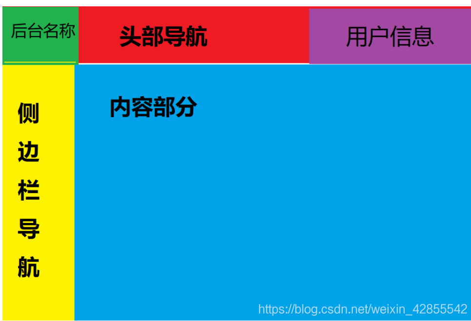
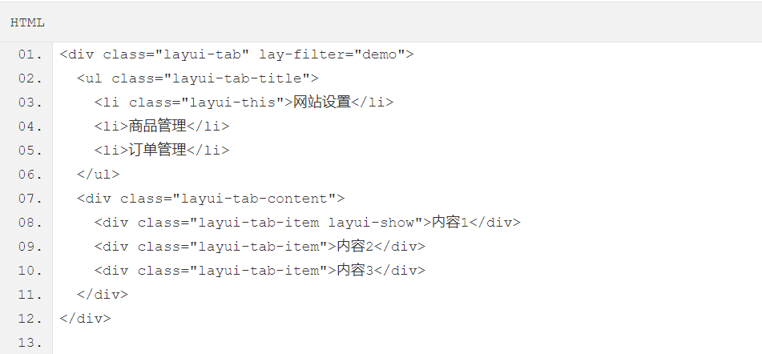
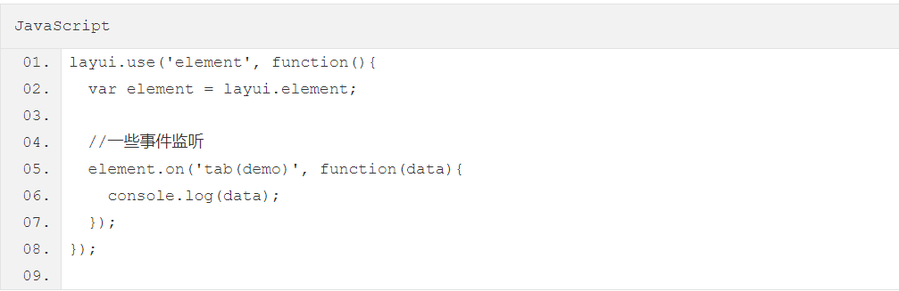

## 1. Layui介绍

Layui 是一款采用自身模块规范编写的国产前端UI框架，遵循原生HTML/CSS/JS的书写与组织形式，门槛极低，拿来即用。其外在极简，却又不失饱满的内在，体积轻盈，组件丰盈，从核心代码到API的每一处细节都经过精心雕琢，非常适合界面的快速开发。layui还很年轻，首个版本发布于2016年金秋，她区别于那些基于MVVM底层的UI框架，却并非逆道而行，而是信奉返璞归真之道，准确地说，她更多是为服务端程序员量身定做，你无需涉足各种前端工具的复杂配置，只需面对浏览器本身，让一切你所需要的元素与交互、从这里信手拈来。

```
https://www.layui.com/demo/grid.html
```


## 2.栅格系统与布局

layui 的栅格系统采用业界比较常见的 12 等分规则，内置移动设备、平板、桌面中等和大型屏幕的多终端适配处理，最低能支持到ie8。而你应当更欣喜的是，layui 终于开放了它经典的后台布局方案，快速搭建一个属于你的后台系统将变得十分轻松自如

栅格布局规则：

| 1.   | 采用 *layui-row* 来定义行，如：*<div class="layui-row"></div>* |
| ---- | ------------------------------------------------------------ |
| 2.   | 采用类似 *layui-col-md** 这样的预设类来定义一组列（column），且放在行（row）内。其中：变量*md* 代表的是不同屏幕下的标记（可选值见下文）变量*** 代表的是该列所占用的12等分数（如6/12），可选值为 1 - 12如果多个列的“等分数值”总和等于12，则刚好满行排列。如果大于12，多余的列将自动另起一行。 |
| 3.   | 列可以同时出现最多四种不同的组合，分别是：*xs*（超小屏幕，如手机）、*sm*（小屏幕，如平板）、*md*（桌面中等屏幕）、*lg*（桌面大型屏幕），以呈现更加动态灵活的布局。 |
| 4.   | 可对列追加类似 *layui-col-space5*、 *layui-col-md-offset3* 这样的预设类来定义列的间距和偏移。 |
| 5.   | 最后，在列（column）元素中放入你自己的任意元素填充内容，完成布局！ |


### 2.1初步使用

例子1：

```
<!DOCTYPE html>
<html lang="en">
<head>
    <meta charset="UTF-8">
    <title>Title</title>

    <link rel="stylesheet" href="layui/css/layui.css">
    <script src="layui/layui.js"></script>
    
</head>
<body>

//模块和回调函数
<script>
    //一般直接写在一个js文件中
    layui.use(['layer', 'form'], function(){
      var layer = layui.layer
      ,form = layui.form;

      layer.msg('Hello World');
    });
</script>
</body>
</html>
```


例子2：

```
<!DOCTYPE html>
<html lang="en">
<head>
    <meta charset="UTF-8">
    <title>Title</title>

    <link rel="stylesheet" href="layui/css/layui.css">
    <script src="layui/layui.js"></script>
</head>
<body>
<ul class="layui-nav" lay-filter="">
    <li class="layui-nav-item"><a href="">最新活动</a></li>
    <li class="layui-nav-item layui-this"><a href="">产品</a></li>
    <li class="layui-nav-item"><a href="">大数据</a></li>
    <li class="layui-nav-item">
        <a href="javascript:;">解决方案</a>
        <dl class="layui-nav-child"> <!-- 二级菜单 -->
            <dd><a href="">移动模块</a></dd>
            <dd><a href="">后台模版</a></dd>
            <dd><a href="">电商平台</a></dd>
        </dl>
    </li>
    <li class="layui-nav-item"><a href="">社区</a></li>
</ul>

<script>
    //注意：导航 依赖 element 模块，否则无法进行功能性操作
    layui.use('element', function(){
        var element = layui.element;

        //…
    });
</script>
</body>
</html>
```


该框架的模块加载机制主要是使用define和use这两个方法来实现的，define方法适用于定义模块，use方法是用于使用模块，它们都定义在Lay构造函数的原型对象上，而window.layui = new Lay()；，所以可以通过layui.define、layui.use来直接调用。

define以及use方法的定义如下：

```
Lay.fn.define = function(deps, callback) {
    // 相关处理代码
};
Lay.fn.use = function(apps, callback, exports) {
    // 相关处理代码
};
```

在该官网上介绍了该框架的几种使用，常用有两种方式：
1、自定义模块，在自己定义的模块中使用相关的模块，如下面所示：

```
index.js文件代码如下：
    layui.define(['layer'], function(exports) {
        var layer = layui.layer;
        exports('index', {});
    })
在html文件中使用index模块:
    layui.config({
        base: 'index所在目录路径'
    }).use('index');
```

2、直接使用use方法

```
layui.use(['layer'], function() {
    var layer = layui.layer;
});
```


### 2.2 Layui基本方法

全局配置

方法：*layui.config(options)*

你可以在使用模块之前，全局化配置一些参数，尽管大部分时候它不是必须的。所以我们目前提供的全局配置项非常少，这也是为了减少一些不必要的工作，尽可能让使用变得更简单。目前支持的全局配置项如下：

```
layui.config({
  dir: '/res/layui/' //layui.js 所在路径（注意，如果是 script 单独引入 layui.js，无需设定该参数。），一般情况下可以无视
  ,version: false //一般用于更新模块缓存，默认不开启。设为 true 即让浏览器不缓存。也可以设为一个固定的值，如：201610
  ,debug: false //用于开启调试模式，默认 false，如果设为 true，则JS模块的节点会保留在页面
  ,base: '' //设定扩展的 layui 模块的所在目录，一般用于外部模块扩展
});            
```

定义模块

方法：*layui.define([mods], callback)*

通过该方法可定义一个 *layui 模块*。参数 mods 是可选的，用于声明该模块所依赖的模块。callback 即为模块加载完毕的回调函数，它返回一个 exports 参数，用于输出该模块的接口。

```
layui.define(function(exports){
  //do something
  
  exports('demo', function(){
    alert('Hello World!');
  });
});
   
```


加载所需模块

方法：*layui.use([mods], callback)*

layui 的内置模块并非默认就加载的，他必须在你执行该方法后才会加载。它的参数跟上述的 define 方法完全一样。
另外请注意，mods 里面必须是一个合法的模块名，不能包含目录。如果需要加载目录，建议采用 extend 建立别名（详见模块规范）

```
layui.use(['laypage', 'layedit'], function(){
  var laypage = layui.laypage
  ,layedit = layui.layedit;
  
  //do something
});
        
```

该方法的函数其实返回了所加载的模块接口，所以你其实也可以不通过 layui 对象赋值获得接口（这一点跟 Sea.js 很像哈）：

```
layui.use(['laypage', 'layedit'], function(laypage, layedit){
  
  //使用分页
  laypage();
  
  //建立编辑器
  layedit.build();
});
```


### 2.2界面布局

```
https://blog.csdn.net/weixin_42855542/article/details/83476597?utm_medium=distribute.pc_relevant_t0.none-task-blog-BlogCommendFromMachineLearnPai2-1.channel_param&depth_1-utm_source=distribute.pc_relevant_t0.none-task-blog-BlogCommendFromMachineLearnPai2-1.channel_param
```




代码：

```
<!DOCTYPE html>
<html lang="en">
<head>
    <meta charset="UTF-8">
    <title>Title</title>

    <link rel="stylesheet" href="layui/css/layui.css">
    <script src="layui/layui.js"></script>
</head>
<body class="layui-layout-body" style="overflow: hidden">
<div class="layui-layout layui-layout-admin">
    <div class="layui-header">
        <div class="layui-logo">layui 后台布局</div>
        <ul class="layui-nav layui-layout-left">
            <li class="layui-nav-item"><a href="">layui文档</a></li>
        </ul>
        <ul class="layui-nav layui-layout-right">
            <li class="layui-nav-item"><a href="">layui文档</a></li>
        </ul>
    </div>

    <div class="layui-side layui-bg-black">
        <div class="layui-side-scroll">
            <ul class="layui-nav layui-nav-tree"  lay-filter="test">
                <li class="layui-nav-item"><a href="">侧边栏导航</a></li>
            </ul>
        </div>
    </div>

    <div class="layui-body" >
        <!-- 内容主体区域 -->
        <iframe src="https://www.baidu.com/" frameborder="0" height="100%" width="100%"></iframe>
    </div>

    <div class="layui-footer">
        <!-- 底部固定区域 -->
        © layui.com - 底部固定区域
    </div>
</div>
<!--<script src="../src/layui.js"></script>-->
<script>
    //JavaScript代码区域
    layui.use('element', function(){
        var element = layui.element;

    });
</script>
</body>
</body>
</html>
```


## 3. Layui原理解析

### 3.1 首先熟悉js面向对象开发

- 面向对象开发可提高整体性能，重写方法等，更多优势等小伙伴去挖掘。layui框架运用了原型模式（prototype）给layui对象添加方法。
- ***javascript里面有一句话，函数即对象\***，如View 是对象，module.export =View, 即相当于导出整个view对象。外面模块调用它的时候，能够调用View的所有方法。不过需要注意，***只有是View的静态方法的时候，才能够被调用，prototype创建的方法，则属于View的私有方法。\***

*静态方法是：*


```jsx
View.test1 = function(){
  console.log('test1')
 }
```

*私有方法是：*

```jsx
View.prototype.test = function(){
  console.log('test')
 }
```

- 就简单介绍到这里，更多面向对象开发，有兴趣的同学可以自行去学习，这里不详细介绍。

### 3.2 目录结构

- 知彼知己，百战不殆。只有了解目录结构才能有目的的开发使用，这里只用到模块核心目录及核心库。
  下面是官方给出的目录结构，更多详细信息请移步到官方网站了解。


```cpp
├─css //css目录
  │  │─modules //模块css目录（一般如果模块相对较大，我们会单独提取，比如下面三个：）
  │  │  ├─laydate
  │  │  ├─layer
  │  │  └─layim
  │  └─layui.css //核心样式文件
  ├─font  //字体图标目录
  ├─images //图片资源目录（目前只有layim和编辑器用到的GIF表情）
  │─lay //模块核心目录
  │  └─modules //各模块组件
  │─layui.js //基础核心库
  └─layui.all.js //包含layui.js和所有模块的合并文件
```

### 1.3 核心文件解读layui.js

- *怎么工作的？*

  首先页面调用use方法时，会执行首次加载模块程序（createElement），然后检测define方法是否有传入两个参数，如果有则一直循环不同模块的首次加载程序，直至define方法只传入一个参数的时候，会调用onCallback方法，激活最后一个加载的模块的status状态，即执行加载中的模块脚本（暴露操作对象，如jquery），并储存在layui对象中，便于下一次调用。加载模块循环的结束后layui对象中将保存所有需要的模块数据，这样就可以在各个模块中相互使用其中的方法。

  

> 话外音：这里定义全局layui对象可以比作临时的数据库，它可以存储我们需要用到所有的数据（即js中可操作对象及变量等 ），在当前页面我们可以任意去使用其中的方法，这个思路可以用在商城的购物车系统，即使用户频繁操作购物车数据也不会对服务器造成压力；也可以用在一些结构比较复杂的单页面用户使用的系统，如某宝商家后台定义邮费模板，上面提到的购物车系统等

- *用到的方法：*
  模块的加载主要运用到define/use核心方法：
- a、前端页面首先执行use方法（加载该模块），执行到核心库里面会用死循环等待相应js文件加载完成后，就是等待其他module文件加载完成；最后再执行这里面的用户脚本。（使用神奇的方法apply执行回调用户脚本，也是模块化框架的主要部分）

> 话外音：common.js规范，加载模块是同步的，所以只有加载完成才能执行后面的操作

- b、其次加载js文件必然会执行define方法（通过define函数定义了一个模块），主要用于暴露相应的模块对象，并激活对应模块的status状态，如开始使用code.js，如果第一个参数不是function，则继续加载js文件，直至第一个参数是function的时候，就会激活上一个加载模块的status，执行回调，以此类推，直至激活最后一个模块（即暴露code对象）并将所有加载的模块对象存储再layui对象中，便于页面调用（这一步主要验证相应js文件是否加载成功，并激活code的status状态，否则error）
- c、如果前端有指定加载多个module（即use([a,b,c,...])或者define([a,b,c,...])），则会重复执行b步骤，直至所有需要的module相应的js文件加载完成，最后就会执行a步骤中的用户脚本，结束整个模块加载流程。
- d、最后会执行a里面的use中callback，一个function，是用来处理加载完毕后的逻辑。（即用户页面需要执行的页面js效果逻辑）


### 1.5 核心代码展示


ayer.js是一个专注于弹出层的框架，这个框架本身可以实现5种弹出层类型，其他的就不多说了，可以去看看它的官网，下面说一下它的主要组织形式：

1. 首先，这个框架本身就是一个IIFE（立即执行函数表达式），保证了局部环境，避免了全局变量污染的问题
2. 框架内部主要是三个对象构成，分别是Class构造函数、layer对象、ready对象
3. 通过window来暴露对外api

```
https://blog.csdn.net/s1879046/article/details/76034784
```


- *核心库*

```jsx
/*
 @Title: Layui
 @Descrition: 更多相关信息请移步官方http://www.layui.com/
 @License：MIT
 */
 
;!function(win){
    "use strict";

    var doc = document
    ,config = {
        modules: {} //记录模块物理路径
        ,status: {} //记录模块加载状态
        ,timeout: 10 //符合规范的模块请求最长等待秒数
        ,event: {} //记录模块自定义事件
    }

    ,Layui = function(){
        this.v = '1.0.0'; //版本号
    }

    //异常提示
    ,error = function(msg){
        win.console && console.error && console.error('Layui hint: ' + msg);
    }

    //内置模块
    ,modules = {
        code: 'code' // 自定义的模块
        ,jquery: 'jquery'
        ,demomodule: 'demomodule' //弹层
        ,mobile: 'modules/mobile' //移动大模块 | 若当前为开发目录，则为移动模块入口，否则为移动模块集合
    };

    
    //记录基础数据
    Layui.prototype.cache = config;

    //存储模块的回调
    config.callback = {};

    //定义模块
    Layui.prototype.define = function(deps, factory){
        var that = this
        ,type = typeof deps === 'function'
        ,callback = function(){
            
            var setApp = function(app, exports){
                layui[app] = exports;
                config.status[app] = true;
            };

            typeof factory === 'function' && factory(function(app, exports){
            setApp(app, exports);
            config.callback[app] = function(){
                factory(setApp);
            }
            });

            return this;
        };

        // 这里是加载插件的时候，一定会执行的，而且一定会产生apps.length == 0的情况，如code.js中的参数 function(exports){}
        type && (
            factory = deps,
            deps = []
        );
        
        that.use(deps, callback);
        
        return that;
    };

    //使用特定模块
    Layui.prototype.use = function(apps, callback, exports){
        var that = this
        ,head = doc.getElementsByTagName('head')[0];

        apps = typeof apps === 'string' ? [apps] : apps;
        //如果页面已经存在jQuery1.7+库且所定义的模块依赖jQuery，则不加载内部jquery模块
        if(window.jQuery && jQuery.fn.on){
            that.each(apps, function(index, item){
                if(item === 'jquery'){
                apps.splice(index, 1);
                }
            });
            layui.jquery = layui.$ = jQuery;
        }
        var item = apps[0]
        ,timeout = 0;
        exports = exports || [];

        //静态资源host
        config.host = config.host || '';
        
        //加载完毕
        function onScriptLoad(e, url){
            var readyRegExp = navigator.platform === 'PLaySTATION 3' ? /^complete$/ : /^(complete|loaded)$/
            
            if (e.type === 'load' || (readyRegExp.test((e.currentTarget || e.srcElement).readyState))) {
                config.modules[item] = url;
                head.removeChild(node);
                (function poll() {
                if(++timeout > config.timeout * 1000 / 4){
                    return error(item + ' is not a valid module');
                };
                config.status[item] ? onCallback() : setTimeout(poll, 4);
                }());
            }
        }
        
        //回调
        function onCallback(){
            apps.length > 1 ?
                 that.use(apps.slice(1), callback, exports)
            : ( typeof callback === 'function' && callback.apply(layui, exports)); // 当item是空的是，这里的callback是define中定义的callback；当item不为空的时候 这里是运行页面里的use()里面的逻辑, 即执行外部应用
        }
        
        // 如果使用了
        if(apps.length === 0){
          return onCallback(), that;
        }

        //首次加载模块
        if(!config.modules[item]){
            var node = doc.createElement('script')
            
            //如果是内置模块，则按照 dir 参数拼接模块路径
            //如果是扩展模块，则判断模块路径值是否为 {/} 开头，
            //如果路径值是 {/} 开头，则模块路径即为后面紧跟的字符。
            //否则，则按照 base 参数拼接模块路径
            ,url = ( modules[item] ? ''
                : (/^\{\/\}/.test(config.modules[item]) ? '' : (config.base || ''))
            ) + (config.modules[item] || item) + '.js';
            
            url = url.replace(/^\{\/\}/, '');
            
            node.async = true;
            node.charset = 'utf-8';
            node.src = url + function(){
                var version = config.version === true 
                ? (config.v || (new Date()).getTime())
                : (config.version||'');
                return version ? ('?v=' + version) : '';
            }();
            head.appendChild(node);
            
            if(node.attachEvent && !(node.attachEvent.toString && node.attachEvent.toString().indexOf('[native code') < 0) && !isOpera){
                node.attachEvent('onreadystatechange', function(e){
                    onScriptLoad(e, url);
                });
            } else {
                node.addEventListener('load', function(e){
                    onScriptLoad(e, url);
                }, false);
            }
            
            config.modules[item] = url;
        } else {
            //缓存
            (function poll() {
                if(++timeout > config.timeout * 1000 / 4){
                return error(item + ' is not a valid module1');
                };
                (typeof config.modules[item] === 'string' && config.status[item]) 
                ? onCallback()
                : setTimeout(poll, 4);
            }());
        }
        return that;
    };
    
    //全局配置
    Layui.prototype.config = function(options){
        options = options || {};
        for(var key in options){
            config[key] = options[key];
        }
        return this;
    };

    //记录全部模块
    Layui.prototype.modules = function(){
        var clone = {};
        for(var o in modules){
            clone[o] = modules[o];
        }
        return clone;
    }();

    //存储模块的回调
    config.callback = {};
    
    //重新执行模块的工厂函数
    Layui.prototype.factory = function(modName){
        if(layui[modName]){
        return typeof config.callback[modName] === 'function' 
            ? config.callback[modName]
        : null;
        }
    };

    //提示
    Layui.prototype.hint = function(){
        return {
            error: error
        }
    };

    win.layui = new Layui();
}(window);
```


## 4. 自定义模块及使用模块

### 4.1 layui模块使用

layui 的模块是基于 *layui.js* 内部实现的异步模块加载方式，它并不遵循于AMD（没有为什么，毕竟任性呀！），而是自己定义了一套更轻量的模块规范。并且这种方式在经过了大量的实践后，成为 layui 最核心的模块加载引擎。

Layui的模块加载采用核心的 *layui.use(mods, callback)*方法，当你的JS 需要用到Layui模块的时候，我们更推荐你采用预先加载，因为这样可以避免到处写layui.use的麻烦。你应该在最外层如此定义：

```
/*
  Demo1.js
  使用Layui的form和upload模块
*/
layui.use(['form', 'upload'], function(){  //如果只加载一个模块，可以不填数组。如：layui.use('form')
  var form = layui.form //获取form模块
  ,upload = layui.upload; //获取upload模块
  
  //监听提交按钮
  form.on('submit(test)', function(data){
    console.log(data);
  });
  
  //实例化一个上传控件
  upload({
    url: '上传接口url'
    ,success: function(data){
      console.log(data);
    }
  })
});    
```

### 4.2 常用模块

```
https://blog.csdn.net/qq_28057577/article/details/73480164
```


### 2.3 模块element使用

页面中有许多元素需要自动去完成一些处理，譬如导航菜单的小滑块、Tab的切换等操作，他们往往不需要去单独调用一个方法来开启一项功能，而页面上恰恰有太多这样的小交互，所以我们统一归类为element组件。跟表单一样，基于元素属性和事件驱动的接口书写方式。

```
https://www.layui.com/doc/modules/element.html#on
```

元素功能的开启只需要加载element模块即会自动完成，所以不用跟其它模块一样为某一个功能而调用一个方法。她只需要找到她支持的元素，如你的页面存在一个 Tab元素块，那么element模块会自动赋予她该有的功能。




前提是你要加载element模块



参考：

```
https://www.layui.com/doc/modules/element.html#on
```


### 4.2 扩展一个 layui 模块

layui 官方提供的模块有时可能还无法满足你，或者你试图按照layer的模块规范来扩展一个模块。那么你有必要认识*layui.define()*方法，相信你在文档左侧的“底层方法”中已有所阅读。下面就就让我们一起扩展一个Layui模块吧：

第一步：确认模块名，假设为：*mymod*，然后新建一个*mymod.js* 文件放入项目任意目录下（注意：不用放入layui目录）

第二步：编写test.js 如下：

```
/**
  扩展一个test模块
**/      
 
layui.define(function(exports){ //提示：模块也可以依赖其它模块，如：layui.define('layer', callback);
  var obj = {
    hello: function(str){
      alert('Hello '+ (str||'mymod'));
    }
  };
  
  //输出test接口
  exports('mymod', obj);
});    
   
```

第三步：设定扩展模块所在的目录，然后就可以在别的JS文件中使用了

```
//config的设置是全局的
layui.config({
  base: '/res/js/' //假设这是你存放拓展模块的根目录
}).extend({ //设定模块别名
  mymod: 'mymod' //如果 mymod.js 是在根目录，也可以不用设定别名
  ,mod1: 'admin/mod1' //相对于上述 base 目录的子目录
});
 
//你也可以忽略 base 设定的根目录，直接在 extend 指定路径（主要：该功能为 layui 2.2.0 新增）
layui.extend({
  mod2: '{/}http://cdn.xxx.com/lib/mod2' // {/}的意思即代表采用自有路径，即不跟随 base 路径
})
 
//使用拓展模块
layui.use(['mymod', 'mod1'], function(){
  var mymod = layui.mymod
  ,mod1 = layui.mod1
  ,mod2 = layui.mod2;
  
  mymod.hello('World!'); //弹出 Hello World!
});
```

大体上来说，layui 的模块定义很类似 Require.js 和 Sea.js，但跟他们又有着明显的不同，譬如在接口输出等地方。


## 5.系统解析

### 5.1 Index.html代码解析


```
//注意：导航 依赖 element 模块，否则无法进行功能性操作
    layui.use('element', function () {
        var $ = layui.jquery
            , element = layui.element;
        element.on('nav(iframeContent)', function (elem) {
            //console.log(elem.getAttribute("meun_id")); //得到当前点击的DOM对象
            var id = $(this).attr("meun_id");
            if (typeof (id) != "undefined") {
                console.log('进入方法');
                element.tabAdd('demo1', {
                    title: '新选项' + (Math.random() * 1000 | 0) //用于演示
                    ,
                    content: '<iframe src="test.html" style="width:100%;height:491px;" scrolling="auto" frameborder="0"></iframe>'
                    ,
                    id: id//实际使用一般是规定好的id，这里以时间戳模拟下z
                })
                element.tabChange('demo1', id);
            }
        });
        //获取所有的菜单
        $.ajax({
            type: "GET",
            url: "/system/getMenu",
            dataType: "json",
            success: function (data) {
                //先添加所有的主材单
                $.each(data, function (i, obj) {
                    var content = '<li class="layui-nav-item">';
                    content += '<a href="javascript:;">' + obj.name + '</a>';
                    //这里是添加所有的子菜单
                    content += loadchild(obj);
                    content += '</li>';
                    $(".layui-nav-tree").append(content);
                });
                element.init();
            },
            error: function (jqXHR) {
                alert("发生错误：" + jqXHR.status);
            }
        });


        window.changeMenu = function (url) {
            $("#iframeContent").attr("src", url);
        };

        //组装子菜单的方法
        function loadchild(obj) {
            if (obj == null) {
                return;
            }
            var content = '';
            if (obj.children != null && obj.children.length > 0) {
                content += '<dl class="layui-nav-child">';
            } else {
                content += '<dl>';
            }
            if (obj.children != null && obj.children.length > 0) {
                $.each(obj.children, function (i, note) {
                    content += '<dd>';
                    content += '<a href="javascript:;" onclick="changeMenu(\'' + note.url + '\')">' + note.name + '</a>';
                    if (note.children == null) {
                        return;
                    }
                    content += loadchild(note);
                    content += '</dd>';
                });
                content += '</dl>';
            }
            return content;
        }
    });
</script>
```


| 方法名                             | 描述                                                         |
| :--------------------------------- | :----------------------------------------------------------- |
| var element = layui.element;       | element模块的实例 返回的*element*变量为该实例的对象，携带一些用于元素操作的基础方法 |
| element.on(filter, callback);      | 用于元素的一些事件监听                                       |
| element.tabAdd(filter, options);   | 用于新增一个Tab选项 参数*filter*：tab元素的 lay-filter="value" 过滤器的值（value） 参数*options*：设定可选值的对象，目前支持的选项如下述示例：`codeelement.tabAdd('demo', {  title: '选项卡的标题'  ,content: '选项卡的内容' //支持传入html  ,id: '选项卡标题的lay-id属性值'});                           ` |
| element.tabDelete(filter, layid);  | 用于删除指定的Tab选项 参数*filter*：tab元素的 lay-filter="value" 过滤器的值（value） 参数*layid*：选项卡标题列表的 属性 lay-id 的值`示例element.tabDelete('demo', 'xxx'); //删除 lay-id="xxx" 的这一项                ` |
| element.tabChange(filter, layid);  | 用于外部切换到指定的Tab项上，参数同上，如： element.tabChange('demo', 'layid'); //切换到 lay-id="yyy" 的这一项 |
| element.tab(options);              | 用于绑定自定义 Tab 元素（即非 layui 自带的 tab 结构）。*该方法为 layui 2.1.6 新增* 参数*options*：设定可选值的对象，目前支持的选项如下述示例：`code//HTML<ul id="tabHeader">  <li>标题1</li>  <li>标题2</li>  <li>标题3</li></ul><div id="tabBody">  <div class="xxx">内容1</div>  <div class="xxx">内容2</div>  <div class="xxx">内容4</div></div>              //JavaScript              element.tab({  headerElem: '#tabHeader>li' //指定tab头元素项  ,bodyElem: '#tabBody>.xxx' //指定tab主体元素项});                           ` |
| element.progress(filter, percent); | 用于动态改变进度条百分比： element.progress('demo', '30%');  |