## 4. SpringBoot构建开发框架流程

```
 Spring Boot是由Pivotal团队提供的全新框架，其设计目的是用来简化新Spring应用的初始搭建以及开发过程。该框架使用了特定的方式来进行配置，从而使开发人员不再需要定义样板化的配置。通过这种方式，Spring Boot致力于在蓬勃发展的快速应用开发领域(rapid application development)成为领导者。从最根本上来讲，Spring Boot就是一些库的集合，它能够被任意项目的构建系统所使用。简便起见，该框架也提供了命令行界面，它可以用来运行和测试Boot应用。框架的发布版本，包括集成的CLI（命令行界面），可以在Spring仓库中手动下载和安装。 
 企业框架搭建： 
 https://blog.csdn.net/zongjinlong/article/details/107745286?utm_medium=distribute.pc_relevant.none-task-blog-title-2&spm=1001.2101.3001.4242
```


使用SpringBoot创建支持企业日常开发的单应用框架（后续会加上单点登录），数据库使用MySQL/MariaDB，Druid连接池，支持多数据源，MyBatis执行CRUD操作，用LogBack记录应用日志。为方便开发，使用 MyBatis提供的generator工具生成通用mapper及实体。使用SpringSecurity实现资源权限管理，实现前后端分离，提供 REST风格的接口


1. springBoot初步

   ```
   https://docs.spring.io/spring-boot/docs/1.5.8.RELEASE/reference/htmlsingle/#getting-started-installing-spring-boot
   https://www.cnblogs.com/toutou/p/9650939.html
   ```
   
   

2. 基于Mybatis连接数据库

3. 构建Redis缓存

4. FastFS文件服务器

5. Tomcat+Nginx集群

6. UI LayUI/VUE/MUI


```

```


### 4.1Spingboot初步（IDEA) 

#### 4.1.1 项目搭建

```
https://blog.csdn.net/mxxrgxg/article/details/81134057
```

第一种，在IDEA中通过Spring Initializr生成，这种方式后续熟练之后开发中最常用。

第二种：访问http://start.spring.io/，这是spring官方提供的快速生成方式。进入页面后，选择maven构建工具，java开发语言，springBoot版本选择当前最新的稳定版。

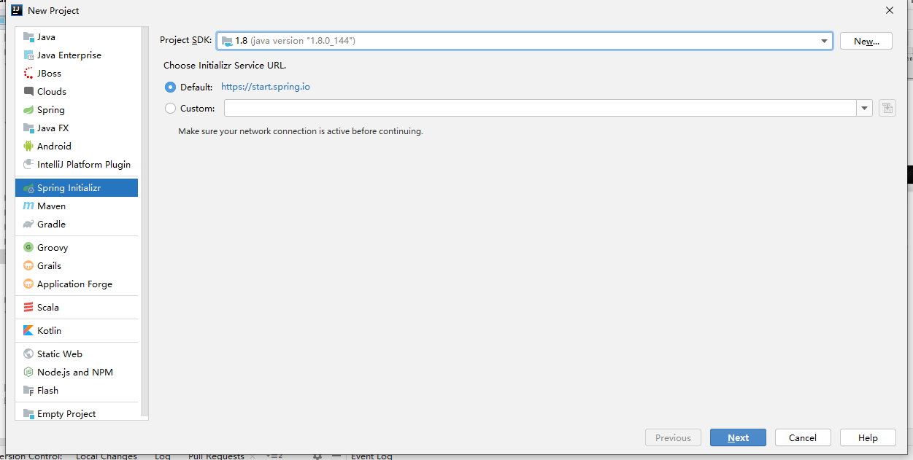


pom.xml文件

```

```

pom.xml文件中默认有两个模块：

spring-boot-starter：核心模块，包括自动配置、日志和YAML支持

spring-boot-starter-test：测试模块，包括JUnit、Hamcrest、Mockito


```
一个@SpringBootApplication注解就搞定了所有时, 它封装了核心的@SpringBootConfiguration+@EnableAutoConfiguration+@ComponentScan这三个类,大大节省了程序员配置时间,这就是SpringBoot的核心设计思想.

##@SpringBootConfiguration
读取配置文件，配置文件的路径是当前根目录(src/main/resources/application.yml等)

##EnableAutoConfiguration
开启自动配置，扫描当前的所有依赖的jar包，发现新的依赖出现将会将会根据依赖完各种自动配置（扫描start_web，自动配置内置tomcat默认路径、端口；依赖了rabbitmq，自动配置rabbitTemble）

##ComponetScan
属于Spring框架(@Component,@Service,@Controller,@Repository,@Entity)，扫描范围默认情况下是启动类坐在的同名包及其子孙包

```


添加Application.yml 文件，监听端口， 数据库连接。

```
server:
  port: 8000
spring:
  datasource:
    url: jdbc:mysql://localhost:3306/mysql?serverTimezone=UTC
    username: root
    password: 123456
    driver-class-name: com.mysql.jdbc.Driver

```


#### 4.1.3 目录管理

  Maven约定优于配置：它提出这一概念，为项目提供合理的默认行为，无需不必要的配置。提供了默认的目录 ：

```
src                   ——>       源代码和测试代码的根目录
main                            应用代码的源目录
Java                 源代码
resources           项目的资源文件
test                测试代码的源目录
java                测试代码
resources           测试的资源文件
target              编译后的类文件、jar文件等 

   对于Maven约定优于配置的理解，一方面对于小型项目基本满足我们的需要基本不需要自己配置东西，使用Maven已经配置好的，快速上手，学习成本降低；另一方面，对于不满足我们需要的还可以自定义设置，体现了灵活性。配置大量减少了，随着项目变的越复杂，这种优势就越明显。
```

具体文件管理：

```
DemoApplication.java：一个带有main()方法的类，用于SpringBoot的启动
application.properties：一个空的properties配置文件，可根据需要添加配置
DemoApplicationTest.java：一个空的Junit测试，后续会对测试模块作说明
pom.xml：Maven构建文件

#下面文件基本不会需要你知道怎么用，只要知道他们是干什么的即可
.gitignore：开发中不需要加入到git管理的过滤配置
mvnw、mvnw.cmd：来自于Maven wrapper的分别用于Linux和Windows的文件
demo.iml：包含了项目依赖的所有jar包
```


#### 4.1.4 springboot常用注解（宸）

```
[SpringBoot入门教程(十六)@Autowired、@Inject、@Resource](https://www.cnblogs.com/toutou/p/9907381.html)
```

1. @Autowired 注释:自动导入依赖的bean
2. @Inject: 等价于默认的@Autowired，只是没有required属性；
3. @Resource :  @Resource(name=”name”,type=”type”)：没有括号内内容的话，默认byName。与@Autowired干类似的事。


```
[SpringBoot入门教程(十七)@Service、@Controller、@Repository、@Component](https://www.cnblogs.com/toutou/p/9907392.html)
```

1. @Service:  一般用于修饰service层的组件
2. @Controller:用于定义控制器类，在spring项目中由控制器负责将用户发来的URL请求转发到对应的服务接口（service层），一般这个注解在类中，通常方法需要配合注解@RequestMapping。
3. @Repository: 使用@Repository注解可以确保DAO或者repositories提供异常转译，这个注解修饰的DAO或者repositories类会被ComponetScan发现并配置，同时也不需要为它们提供XML配置项。
4. @Component: 泛指组件，当组件不好归类的时候，我们可以使用这个注解进行标注。


```
[SpringBoot入门教程(十八)@value、@Import、@ImportResource、@PropertySource](https://www.cnblogs.com/toutou/p/9907753.html)
```

1. @value:注入Spring boot application.properties配置的属性的值
2. @Import: 用来导入其他配置类。
3. @ImportResource:  用来加载xml配置文件
4. @PropertySource: 加载指定的配置文件(@Value和@ConfigurationProperties都可以用于获取配置文件的属性值，不过有个细节容易被忽略，那就是，这两个注解在Springboot项目中都是获取默认配置文件的属性值，也就是application.yml或者application.properties的属性值。但是使用@propertysource可以加载指定的配置文件。)


### 4.2 构建多Module模块

```
参考：

https://blog.csdn.net/weixin_44421461/article/details/107218689?utm_medium=distribute.pc_relevant.none-task-blog-title-7&spm=1001.2101.3001.4242
```

一个层次分明的多模块工程结构不仅方便维护，而且有利于后续微服务化。在此结构的基础上还可以扩展common层（公共组件）、server层（如dubbo对外提供的服务）。此为项目重构的第一步，后续还会的框架中集成logback、disconf、redis、kafka等组件。


#### 4.2.1 多模块添加

#### 4.2.2配置模块依赖管理


各个子模块的依赖关系：biz层依赖dao层，web层依赖biz层

① 父pom文件中声明所有子模块依赖（dependencyManagement及dependencies的区别自行查阅文档）

```go
 <properties>
        <java.version>1.8</java.version>
        <frame.version>0.0.1-SNAPSHOT</frame.version>
 </properties>
```

```
  <dependencyManagement>
        <dependencies>
            <dependency>
                <groupId>com.yibao.beta</groupId>
                <artifactId>beta-biz</artifactId>
                <version>${beta.version}</version>
            </dependency>
            <dependency>
                <groupId>com.yibao.beta</groupId>
                <artifactId>beta-dao</artifactId>
                <version>${beta.version}</version>
            </dependency>
            <dependency>
                <groupId>com.yibao.beta</groupId>
                <artifactId>beta-web</artifactId>
                <version>${beta.version}</version>
            </dependency>
        </dependencies>
    </dependencyManagement>
```


② 在web层中的pom文件中添加biz依赖

```go
<dependency>
            <groupId>cn.edu.sdjzu</groupId>
            <artifactId>biz</artifactId>
 </dependency>
```

#### 4.2.3 web层调用biz层接口测试

① 在biz层创建cn.edu.sdjzu.biz包，添加service目录并在其中创建DemoService接口类

```

package cn.edu.sdjzu.biz.service;


public interface DemoService{

        String test();
        }
```


```
package cn.edu.sdjzu.biz.service.impl;
import cn.edu.sdjzu.biz.service.DemoService;
import org.springframework.stereotype.Service;
@Service
public  class  DemoServiceImpl  implements DemoService {
                @Override
        public  String  test()  {
                        return  "this is biz module,hello";
                }
        }
```


② DemoController通过@Autowired注解注入DemoService，修改DemoController的test方法使之调用DemoService的test方法，最终如下所示:

```
package cn.edu.sdjzu.web.controller;

import cn.edu.sdjzu.biz.service.DemoService;
import org.springframework.beans.factory.annotation.Autowired;
import org.springframework.web.bind.annotation.GetMapping;
import org.springframework.web.bind.annotation.RequestMapping;
import org.springframework.web.bind.annotation.RestController;

@RestController
@RequestMapping("demo")
public class DemoController {
    @Autowired
    private DemoService demoService;
    @GetMapping("test")
    public String test() {
        return demoService.test();
       // return "计算机科学与技术2017级同学，Hello World!";
            }
        }
```

运行结果：

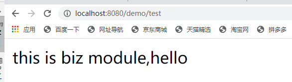

#### 4.2.4 dependencyManagement

​     当我们的项目模块很多的时候，我们使用Maven管理项目非常方便，帮助我们管理构建、文档、报告、依赖、scms、发布、分发的方法。可以方便的编译代码、进行依赖管理、管理二进制库等等。

​     由于我们的模块很多，所以，抽出一个itoo-base-parent来管理子项目的公共的依赖。为了项目的正确运行，**必须让所有的子项目使用依赖项的统一版本，必须确保应用的各个项目的依赖项和版本一致，才能保证测试的和发布的是相同的结果。**

​    在项目顶层的POM文件中，会看到dependencyManagement元素。通过它元素来管理jar包的版本，让子项目中引用一个依赖而不用显示的列出版本号。Maven会沿着父子层次向上走，直到找到一个拥有dependencyManagement元素的项目，然后使用在这个dependencyManagement元素中指定的版本号。来看看我们项目中的应用：

​                                               pom继承关系图：


依赖关系：

Itoo-base-parent(pom.xml)

```
<dependencyManagement>            
      <dependencies>  
           <dependency>  
               <groupId>org.eclipse.persistence</groupId>  
               <artifactId>org.eclipse.persistence.jpa</artifactId>              	<version>${jpa.version}</version> 
            </dependency>                
            <dependency>  
                <groupId>javax</groupId>  
                <artifactId>javaee-api</artifactId>  
                <version>${javaee-api.version}</version>  
            </dependency>  
        </dependencies>  
 </dependencyManagement>  
```

Itoo-base(pom.xml)

```
<!--继承父类-->  
<parent>  
        <artifactId>itoo-base-parent</artifactId>  
        <groupId>com.tgb</groupId>    
        <version>0.0.1-SNAPSHOT</version>         
</parent>  
        <modelVersion>4.0.0</modelVersion>  
        <artifactId>itoo-base</artifactId>  
        <packaging>ejb</packaging>  
          
        <!--依赖关系-->  
        <dependencies>  
        <dependency>  
            <groupId>javax</groupId>  
            <artifactId>javaee-api</artifactId>  
        </dependency>            
        <dependency>  
            <groupId>com.fasterxml.jackson.core</groupId>  
            <artifactId>jackson-annotations</artifactId>  
        </dependency>            
        <dependency>  
            <groupId>org.eclipse.persistence</groupId>  
            <artifactId>org.eclipse.persistence.jpa</artifactId>  
            <scope>provided</scope>  
        </dependency>  
    </dependencies>  

```

​     这样做的好处：统一管理项目的版本号，确保应用的各个项目的依赖和版本一致，才能保证测试的和发布的是相同的成果，因此，在顶层pom中定义共同的依赖关系。同时可以避免在每个使用的子项目中都声明一个版本号，这样想升级或者切换到另一个版本时，只需要在父类容器里更新，不需要任何一个子项目的修改；如果某个子项目需要另外一个版本号时，只需要在dependencies中声明一个版本号即可。子类就会使用子类声明的版本号，不继承于父类版本号。

 

####  4.2.5 问题处理

2. 创建project后，一定要删除iml文件，否则会出现错误。


2. IDEA想创建package,却只有directory 

解决办法这是因为java是普通的文件夹,不是源文件的根目录，要设置为*source* *root*  。右键点击java文件夹进行设计

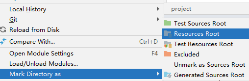

3. IDEA 启动项目报错 Error running 'XXXApplication': No jdk for module 'XXX'

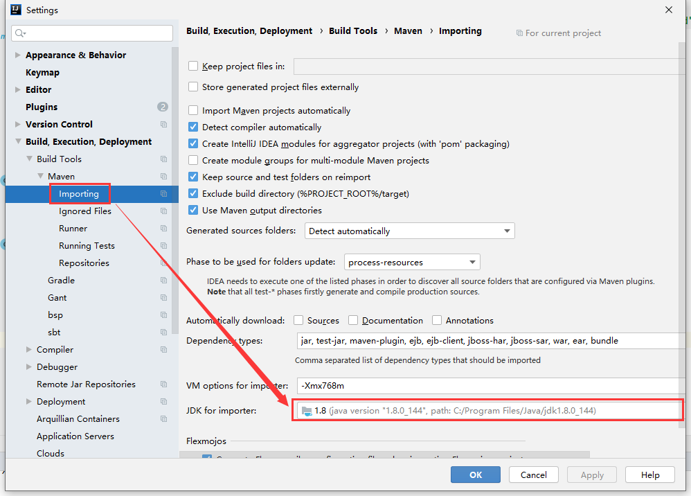

### 4.3 集成Mybatis模块


#### 4.3.1 数据表创建：

```
create table test.tb_user
(
    usertype     varchar(20) null,
    userid       varchar(20) not null comment '用户名'
        primary key,
    username     varchar(20) null comment '用户姓名',
    userpwd      varchar(32) null comment '密码',
    operator     varchar(20) null,
    operatedtime datetime    null
);

```

#### 4.3.2 添加依赖

① 父pom文件中声明mybatis-spring-boot-starter及lombok依赖

```go
dependencyManagement>
    <dependencies>
        <dependency>
            <groupId>org.mybatis.spring.boot</groupId>
            <artifactId>mybatis-spring-boot-starter</artifactId>
            <version>1.3.2</version>
        </dependency>
        <dependency>
            <groupId>org.projectlombok</groupId>
            <artifactId>lombok</artifactId>
            <version>1.16.22</version>
        </dependency>
    </dependencies>
</dependencyManagement>
```

② 在dao层中的pom文件中添加上述依赖

```go
<dependencies>
    <dependency>
        <groupId>org.mybatis.spring.boot</groupId>
        <artifactId>mybatis-spring-boot-starter</artifactId>
    </dependency>
    <dependency>
        <groupId>mysql</groupId>
        <artifactId>mysql-connector-java</artifactId>
    </dependency>
    <dependency>
        <groupId>org.projectlombok</groupId>
        <artifactId>lombok</artifactId>
    </dependency>
</dependencies>
```

#### 4.3.3 语句自动生成

③ 在dao层创建cn.edu.sdzju.dao包，通过mybatis-genertaor工具生成dao层相关文件（DO、Mapper、xml），存放目录如下

也可以通过IDEA的自动生成器进行生成。


连接数据库：

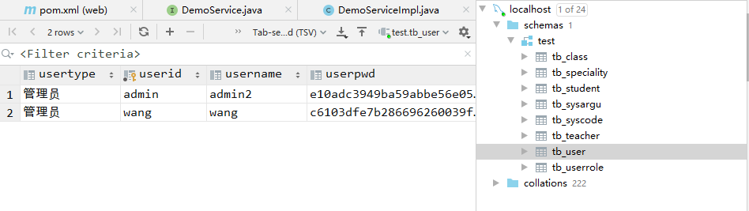


选择tb_user数据表，右键“mybatis generate tool”


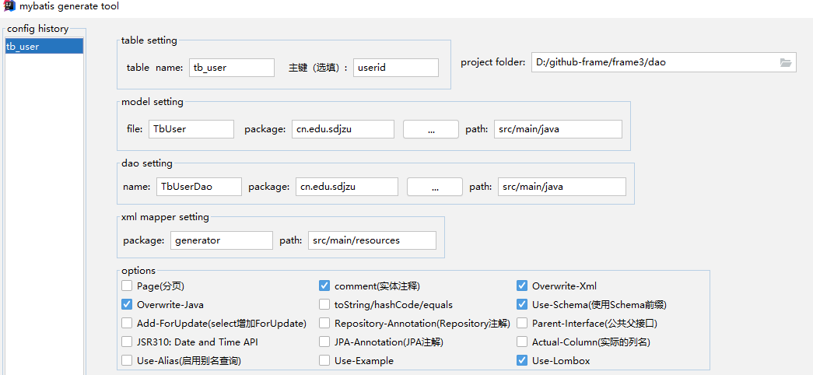


自动生成的代码如图

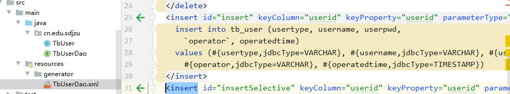


④ applicatio.properties文件添加jdbc及mybatis相应配置项

```go
spring.datasource.driverClassName = com.mysql.jdbc.Driver
spring.datasource.url = jdbc:mysql://192.168.1.1/test?useUnicode=true&characterEncoding=utf-8
spring.datasource.username = test
spring.datasource.password = 123456
mybatis.mapper-locations = classpath:mybatis/*.xml
mybatis.type-aliases-package = com.yibao.beta.dao.entity
```

⑤ DemoService通过@Autowired注解注入UserMapper，修改DemoService的test方法使之调用UserMapper的selectByPrimaryKey方法，最终如下所示

```go
package cn.edu.sdjzu.biz.service.impl;

import cn.edu.sdjzu.TbUserDao;
import cn.edu.sdjzu.biz.service.DemoService;
import org.springframework.beans.factory.annotation.Autowired;
import org.springframework.stereotype.Service;

@Service
public  class  DemoServiceImpl  implements DemoService {
    @Autowired
    private TbUserDao userMapper;
    @Override
    public  String  test()  {
                    return  "this is biz module,hello";
            }
    }
```

⑥ 再次运行WebApplication类中的main方法启动项目，发现如下报错

```go
Action:
Consider defining a bean of type 'cn.edu.sdjzu.TbUserDao' in your configuration.
Process finished with exit code 1
```

原因是找不到TbUserDao类，此时需要在WebApplication入口类中增加dao层包扫描，添加@MapperScan注解并设置其值为com.yibao.beta.dao.mapper，最终如下所示

```go
package cn.edu.sdjzu.web;
import org.mybatis.spring.annotation.MapperScan;
import org.springframework.boot.SpringApplication;
import org.springframework.boot.autoconfigure.SpringBootApplication;


@SpringBootApplication(scanBasePackages = "cn.edu.sdjzu")
@MapperScan("cn.edu.sdjzu.dao")
public class frameWebApplication {

    public static void main(String[] args){
        
        SpringApplication.run(frameWebApplication.class,args);
    }
}
```


#### 4.3.4 错误解析：

1.

```
org.apache.ibatis.binding.BindingException: Invalid bound statement (not found)
```

Mapper接口开发需要遵循以下规范：

```
1. Mapper.xml文件中的namespace与mapper接口的类路径相同。
2. Mapper接口方法名和Mapper.xml中定义的每个statement的id相同
3. Mapper接口方法的输入参数类型和mapper.xml中定义的每个sql 的parameterType的类型相同
4. Mapper接口方法的输出参数类型和mapper.xml中定义的每个sql的resultType的类型相同
```

resources 底下xml和mapper接口的路径不同，例如创建的包名是com.bwai.mapper，它在这里不是一级一级的创建文件夹而是创建了一个com.bwai.mapper名字的一个包，所以需要com/bwai/mapper 这样创建


2. 

```
### The error may involve cn.edu.sdjzu.dao.TbUserDao.selectByPrimaryKey
### The error occurred while executing a query
### Cause: org.springframework.jdbc.CannotGetJdbcConnectionException: Failed to obtain JDBC Connection; nested exception is java.sql.SQLException: The server time zone value '�й���׼ʱ��' is unrecognized or represents more than one time zone. You must configure either the server or JDBC driver (via the 'serverTimezone' configuration property) to use a more specifc time zone value if you want to utilize time zone support.] with root cause
```

报错提示很明确，JDBC driver 需要添加 serverTimezone 配置项。所以在配置 JDBC 连接时在 url 中添加参数即可：

```
spring:
  datasource:
    url: jdbc:mysql://localhost:3306/test?serverTimezone=GMT%2B8
    driver-class-name: com.mysql.jdbc.Driver
    username: root
    password:
```

在设置 serverTimezone 时也要注意，我们是在东八区，所以需要设置成 GMT%2B8 或 Asia/Shanghai，不要设置成 GMT 或 UTC 了。


### 4.4 springboot 错误异常处理-陈宸/王安轼

```
SpringBoot入门教程(六)SpringBoot2.0统一处理404,500等http错误跳转页

https://www.cnblogs.com/toutou/p/9802800.html

```

继承 ErrorController + @ControllerAdvice + @ExceptionHandle 处理一切异常。已知@ControllerAdvice + @ExceptionHandle可以处理 除 404 以外的 运行异常，那么，捕获不到的异常就是404了。采用这种方式自定义方法，想返回什么就返回什么，无论是HTML还是json。

404异常处理：

```
@Controller
public class HttpErrorController implements ErrorController {
//    private static final String ERROR_PATH = "/error";
//
//    @RequestMapping(value = ERROR_PATH)
//    public String handleERror(){
//        return "errorpage/404";
//    }
//
//    @Override
//    public String getErrorPath(){
//        return ERROR_PATH;
//    }
    @Override
    public String getErrorPath(){
        return "/error";
    }
    @RequestMapping(value = {"/error"})
    @ResponseBody
    public Object error(HttpServletRequest request){
        Map<String , Object> body = new HashMap<>();
        body.put("error","not found");
        body.put("错误类型","404");
        return body;
    }
}
```

500异常处理：

```
@ControllerAdvice
public class ExceptionController {
 
    @ExceptionHandler(value = {Exception.class})
    @ResponseBody
    public Object error(Exception ex){
 
        Map<String,String> map = new HashMap<>();
        map.put("error", ex.getMessage());
        map.put("code", "500");
        return map;
    }
}
```


```
[SpringBoot入门教程(十九)@ControllerAdvice+@ExceptionHandler全局捕获Controller异常](https://www.cnblogs.com/toutou/p/9907401.html)
```


### 4.5 springboot 过滤器和拦截器 -田玉超/刘佳慧

#### 4.5.1 过滤与拦截

```
[过滤器和拦截器](https://www.cnblogs.com/toutou/p/9831678.html)
```


#### 4.5.2 SQL注入过滤器


#### 4.5.3 日志记录


### 4.6 springboot-附近的人-陈梦雅/刘行

找附近的人

```
https://www.cnblogs.com/toutou/p/9771386.html      
```

做一遍，录制一个小视频（10分钟以内） FastStone


### 4.6 安全框架(包晨/韩春港)

Shiro是Apache下的一个顶级开源安全框架，适应于java SE和java EE环境，不依赖于容器管理。集认证、授权、加密、会话管理、与Web集成、缓存等。shiro功能强大、易于扩展，并且不是很难，容易学习。

```
https://blog.csdn.net/mxxrgxg/article/details/81358536?utm_medium=distribute.pc_relevant.none-task-blog-title-3&spm=1001.2101.3001.4242
```


### 4.7  Redis配置(吕鹏飞)

[SpringBoot进阶教程(五十二)整合Redis](https://www.cnblogs.com/toutou/p/spring_boot_redis.html)


#### 4.7.1 redis安装与配置

#### 4.7.2 redis访问

#### 4.7.3 共享session

```
pringBoot进阶教程(五十四)整合Redis之共享Session](https://www.cnblogs.com/toutou/p/redis_session.html)
```


第十七章: 介绍SpringBoot Cache功能，并重点介绍了Redis作为分布式缓存的实现。在此基础上，改进了Redis分布式缓存，通过较少的代码实现了一个具备一二级缓存的技术。


### 4.8 整合Kafka消息队列


### 4.9 Springboot监控功能

Spring Boot提供了内置监控功能，使得用户通过HTTP请求就能知晓服务器健康状态，如数据源是否可用，NOSQL服务是否可用，最近的HTTP访问的内容等监控信息。本章讲述了线程栈，内存，在线日志，HTTP访问，Request Mapping等常用监控功能。其中讲述通过dump线程栈和内存来解决SpringBoot应用中的一些性能故障。


### 4.10 ES检索与查询应用


```
https://blog.csdn.net/pyfysf/article/details/100810846
```

ElasticSearch是一个即具有全文搜索功能，也具备NOSQL的功能。通过REST和Spring Data 俩中方式访问Elastc Search. 


### 4.11可视化工具应用


1. grafana

```
docker run -d -p 8085:3000 --name=grafana -v /home/data/grafana/data:/var/lib/grafana -v /home/data/grafana/conf:/usr/share/grafana/conf grafana/grafana
```

选择挂载数据文件(/var/lib/grafana)和配置文件(/usr/share/grafana/conf)。前者存放panels、datasoure、页面等数据，后者为配置文件，挂载后可以直接在宿主机器上修改，重启容器后生效

2. 另一个工具：kibana


### 4.13 文件服务器fastdfs应用


### 4.14 构建服务Service模块

#### 4.13.1 计算服务

#### 4.13.2 通信服务(Netty)


## 5. 基于SpringbootPlus开源框架


基于SpringBoot 2 的管理后台系统, 是一个使用简单，功能较为复杂的开源系统，已经数十家商业公司采用有数十个基于此的商业应用，包含了用户管理，组织机构管理，角色管理，功能点管理，菜单管理，权限分配，数据权限分配，代码生成等功能 相比其他开源的后台开发平台脚手架，SpringBoot-Plus 使用简单，可以轻易完成中型，大型系统开发。同时技术栈较为简单，基于Spring Boot2.1技术，前端采用了Layui2.4。数据库以MySQL/Oracle/Postgres/SQLServer为实例，理论上是跨数据库平台。

```
https://gitee.com/xiandafu/springboot-plus.git
```

如何判断一个开源开发平台适合自己

- 要明白单体系统，系统拆分，微服务三个不同构建开发平台方式，plus支持单体和系统拆分，一般而言，后台管理系统适合单体和系统拆分。微服务并不适合系统管理，以我知道的互联网大厂，央企后台管理系统，还是以前俩个为多
- 你需要的是技术框架还是开发平台，技术框架就是技术堆砌，开发平台必须具备一定复杂基础业务功能
- 看权限模型，支持功能权限和数据权限。plus具备强大的功能权限和数据权限，且可以扩展n种数据权限
- 看用户是否能属于多个部门，用户兼职情况很常见
- 看数据字典是否支持级联，数据字典级联太常见了，平台需要提供数据和前端的支持。puls系统支持
- 看代码生成是否支持预览，为什么要预览，因为生成会覆盖，预览可以修改已经生成的代码


#### 5.1 系统运行步骤

1. 创建数据库

   查看amin-console 模块中的application.properties

   ```
   spring.datasource.baseDataSource.url=jdbc:mysql://127.0.0.1:3306/starter?useUnicode=true&characterEncoding=UTF-8&serverTimezone=GMT%2B8&useSSL=false&useInformationSchema=true
   spring.datasource.baseDataSource.username=root
   spring.datasource.baseDataSource.password=123456
   spring.datasource.baseDataSource.driver-class-name=com.mysql.cj.jdbc.Driver
   ```

   

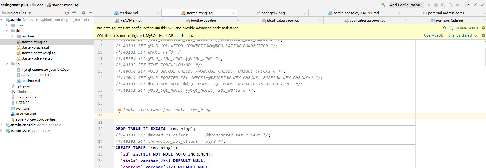


2. 代码运行 admin-console模块中的ConsoleApplication


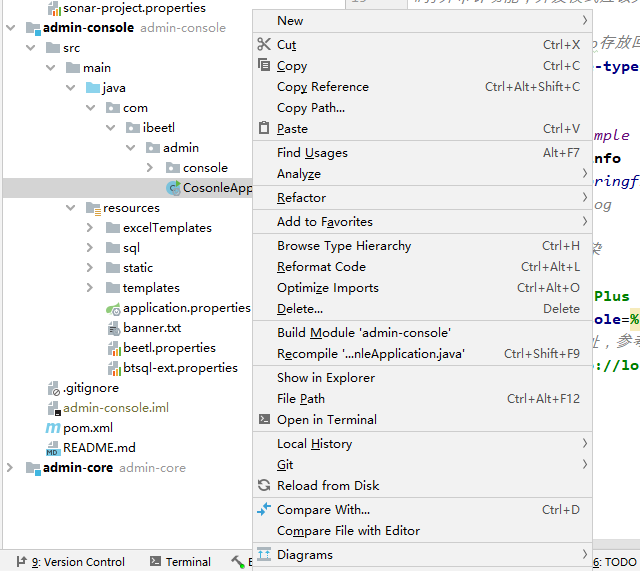

3. 运行结果

   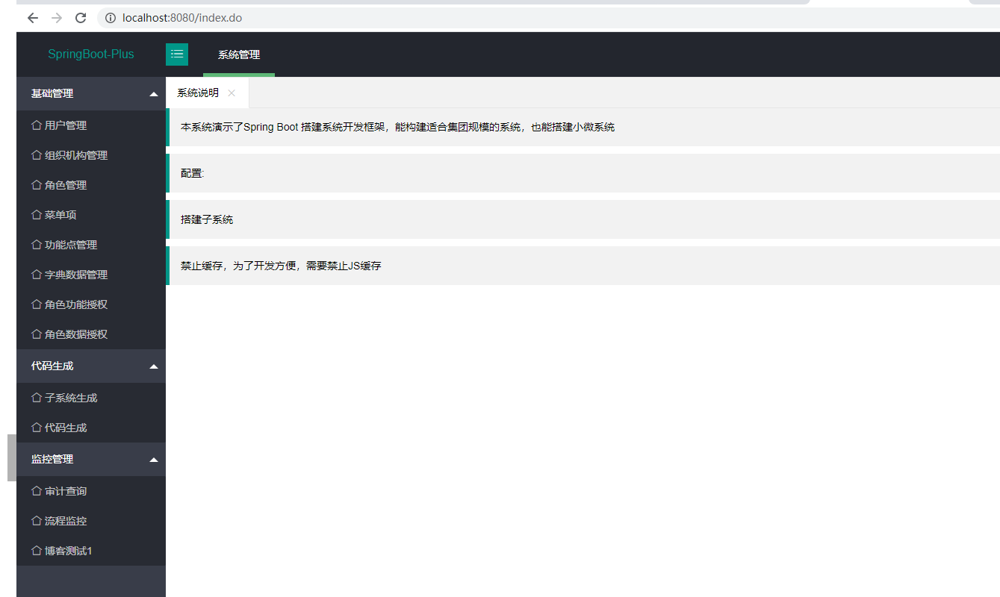


#### 5.2  系统访问流程

admin ------------->  son of  -------->      admin_console ------>    depend---------->admin_core

​    admin_core 在resources 目录下包括 login.html，index.html，help.html,error.html ,用于系统的登录、主页面、帮助、异常处理等。

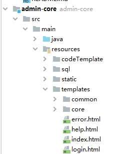


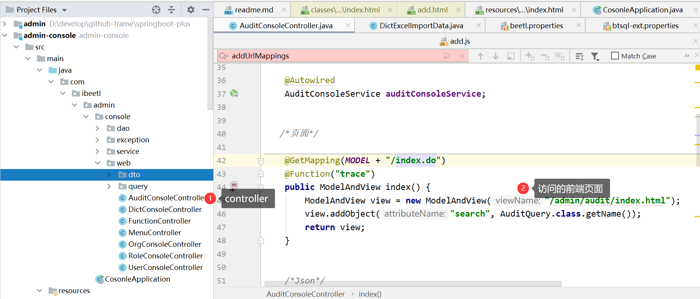

```
  /*页面*/
    
    @GetMapping(MODEL + "/index.do")
    @Function("trace")
    public ModelAndView index() {
		ModelAndView view = new ModelAndView("/admin/audit/index.html");
		view.addObject("search", AuditQuery.class.getName());
        return view;
    }  
    
```

前端页面 index.html

```
<!--#layout("/common/layout.html",{"jsBase":"/js/admin/audit/"}){ -->
<layui:searchForm formId="auditSearchForm"  condition="${search}">

</layui:searchForm>

<table id="auditTable" lay-filter="auditTable"></table>
<!--#} -->
<script>

layui.use(['index'], function(){
  var index = layui.index
  index.init();
});
</script>
```


#### 5.3 login.html解析

```
<!DOCTYPE html>
<html lang="en">
<head>
    <meta charset="UTF-8">
    <title>Spring Boot开发平台</title>
    <link rel="stylesheet" href="${ctxPath}/plugins/layui/css/layui.css">
    <script src="${ctxPath}/plugins/layui/layui.js"></script>
  
    <!-- 让IE8/9支持媒体查询，从而兼容栅格 -->
    <!--[if lt IE 9]>
    <script src="https://cdn.staticfile.org/html5shiv/r29/html5.min.js"></script>
    <script src="https://cdn.staticfile.org/respond.js/1.4.2/respond.min.js"></script>
    <![endif]-->
    <style rel="stylesheet" type="text/css">
        .layui-tab-title li:first-child > i {
            display: none;
        }
    </style>
</head>
<body class="layui-layout-body">
<fieldset class="layui-elem-field layui-field-title" style="margin-top: 20px;">
  <legend>用户登录</legend>
</fieldset>
 
<form class="layui-form" action="${ctxPath}/login.do" method="post">
  <div class="layui-form-item">
    <label class="layui-form-label">用户名</label>
    <div class="layui-input-block">
      <input type="text" name="code" lay-verify="title" autocomplete="off" 
      	placeholder="请输入用户名" class="layui-input"  value="admin">
    </div>
  </div>
  <div class="layui-form-item">
    <label class="layui-form-label">密码</label>
    <div class="layui-input-block">
      <input type="password" name="password" lay-verify="required"  name="" placeholder="请输入密码" autocomplete="off"
       class="layui-input" value="123456">
    </div>
  </div>
  <div class="layui-form-item">
    <div class="layui-input-block">
      <button class="layui-btn" lay-submit="" lay-filter="demo1">立即登录</button>
    </div>
  </div>
  </form>
</body>
</html>
```

点击登录，进行跳转：

```
<form class="layui-form" action="${ctxPath}/login.do" method="post">
```

控制器：

```
	@PostMapping("/login.do")
	public ModelAndView login(String code, String password) {
		UserLoginInfo info = userService.login(code, password);
		if (info == null) {
			throw new PlatformException("用户名密码错");
		}
		CoreUser user = info.getUser();
		CoreOrg currentOrg = info.getOrgs().get(0);
		for (CoreOrg org : info.getOrgs()) {
			if (org.getId() == user.getOrgId()) {
				currentOrg = org;
				break;
			}
		}

		info.setCurrentOrg(currentOrg);
		// 记录登录信息到session
		this.platformService.setLoginUser(info.getUser(), info.getCurrentOrg(), info.getOrgs());
		ModelAndView view = new ModelAndView("redirect:/index.do");
		return view;
	}
```


#### 5.4 前端框架LayUI学习

```
https://www.layui.com/demo/anim.html
```


## 6. 基于JavaWeb开源框架（韩春港/陈宸）

```
https://gitee.com/javaweb520/JavaWeb
```


#### 6.1 系统简介

JavaWeb专业版,企业级开发框架SpringBoot+Layui+Thymeleaf+MybatisPlus开发权限(RBAC)及内容管理框架，框架中集成了权限管理、模块管理,数据库管理、富文本编辑器(已集成ueditor,kindeditor)，后台支持多主题切换、布局管理、广告管理、配置管理、字典管理、切图管理、CMS内容管理等常用功能模块，以方便开发者快速构建自己的应用。框架专注于为中小企业提供最佳的行业基础后台框架解决方案，执行效率、扩展性、稳定性值得信赖，操作体验流畅，使用非常优化，欢迎大家使用及进行二次开发。


#### 6.2 项目介绍

1、模块化：全新的架构和模块化的开发机制，便于灵活扩展和二次开发。
2、模型/栏目/分类信息体系：通过栏目和模型绑定，以及不同的模型类型，不同栏目可以实现差异化的功能，轻松实现诸如资讯、下载、讨论和图片等功能。通过分类信息和栏目绑定，可以自动建立索引表，轻松实现复杂的信息检索。
3、JavaWeb企业级开发框架是一套基于SpringBoot2 + Layui开发出来的框架。
4、支持SQLServer、MySQL、Oracle、PostgreSQL、SQLite等多数据库类型。模块化设计，层次结构清晰。
5、Shiro权限认证，操作权限控制精密细致，对所有管理链接都进行权限验证，可控制到导航菜单、功能按钮。提高开发效率及质量。
6、常用类封装，日志、缓存、验证、字典、文件（本地、七牛云）。等等，目前兼容浏览器（Chrome、Firefox、360浏览器等）
7、适用范围：可以开发OA、ERP、BPM、CRM、WMS、TMS、MIS、BI、电商平台后台、物流管理系统、快递管理系统、教务管理系统等各类管理软件。

#### 6.3 框架解析

##### 6.3.1模块划分 

​     模块划分：

 主模块为javaweb模块。

```
<modules>
    <module>javaweb-common</module>
    <module>javaweb-generator</module>
    <module>javaweb-system</module>
    <module>javaweb-admin</module>
    <module>javaweb-quartz</module>
</modules>
```


##### 6.3.2 数据库设计


##### 6.3.3 system模块分析


##### 6.3.4 common模块分析


##### 6.3.5 admin模块分析


## 7. 基于vue+springboot的开源框架（程宏豪）


```
https://github.com/lenve/vhr
```

微人事是一个前后端分离的人力资源管理系统，项目采用 SpringBoot + Vue 开发。权限管理相关的模块主要有两个，分别是 [系统管理->基础信息设置->权限组] 可以管理角色和资源的关系， [系统管理->操作员管理] 可以管理用户和角色的关系。另外，本项目也在不断的更新中，小伙伴们可以通过下方的更新记录查看最新完成的功能。

**项目演示：**


`mall`项目致力于打造一个完整的电商系统，采用现阶段流行技术实现。

```
https://github.com/macrozheng/mall
```


## 8.环境配置及部署

#### 6.1 环境配置

一、简单介绍
在项目的开发中，有些配置文件在开发、测试或者生产等不同环境中可能是不同的，例如数据库连接、redis的配置等等。那我们如何在不同环境中自动实现配置的切换呢？Spring给我们提供了profiles机制，下面看看在Spring Boot中是如何使用Profiles功能的。

在Spring Boot中多环境配置文件名需要使用application-{profile}.properties的格式，这里的**{profile}**对应的是你的环境标识。例如：

```
application-dev.properties — 这是开发环境
开发环境是windows
application-prod.properties — 这是生产环境
```

二、激活指定profile
我们在首先在Resource目录下新建两个配置文件，分别命名为application-dev.properties以及application-prod.properties，为了方便看到区别，我们分别在三个配置文件中分别指定tomcat启动端口：


```
application.properties
server.port=8081

application-dev.properties
server.port=8082

application-prod.properties
server.port=8083
```

这个时候我们没有指定任何profile,执行启动类的main方法，可以看到:

Tomcat started on port(s): 8081 (http) with context path ''


程序会默认加载application.properties中的配置，我们想要使用对应的环境，只需要在application.properties中使用spring.profiles.active属性来设置，值对应上面提到的{profile}，这里就是指dev、prod:

server.port=8081
spring.profiles.active=dev

重新启动Main方法：

Tomcat started on port(s): 8082 (http) with context path ''

可以看到tomcat启动端口为8082。

####从上面的结果可以看出，application-dev.properties中的配置覆盖了application.propertie中的配置。我们在配置文件中可以将与环境无关的属性放到application.propertie中进行配置，而根据环境的变化而变化的配置放到各个application-{profile}.properties文件中。

三、激活profile的方式
上面展示了第一种激活profile的方式，即在application.properties中指定属性spring.profiles.active的值。但是这种方式在实际项目中的使用并不合适，因为你每次提交代码还要手动修改pring.profiles.active的值。

第二种可以使用命令行的方式，Spring Boot的程序一般是打成jar包，在使用java -jar 执行jar包的时候，可以再后面加上：

--spring.profiles.active=dev；

例如

java -jar target/spring-boot-helloworld-0.0.1.jar --spring.profiles.active=prod

可以看到启动端口为：

Tomcat started on port(s): 8083 (http) with context path ''

若是使用IDEA进行开发的话，还可以修改启动配置：

之后执行Main方法，依然激活了dev的配置。

第三种是修改虚拟机的配置，在虚拟机配置哪里加上：

-Dspring.profiles.active=dev


#### 6.2 基于IDEA部署系统

IntelliJ IDEA自动部署如下：
打开IntelliJ IDEA点击Tools/Deployment/Configuration（或者File-Settings-Build,Execution,Deployment-Deployment都行）,界面如下所示：


填写远程服务器信息，并测试远程服务器连接成功(下图表示测试连接成功)；


填写本地和远程服务器项目路径；


基本设置完成，最后用IntelliJ IDEA打开项目，右键点击Deployment，Unpload to 配置名(或者Tools，Deployment，Unpload to)， 上传、运行项目即可！！！


可能配置的时候有些复杂，但是如果你能配置好，测试部署方便很多 ！！！


#### 6.3 Docker部署（jar)

```
https://spring.io/guides/gs/spring-boot-docker/
```

##### 1.创建springboot项目


创建springboot项目

添加代码如下：

```css
@SpringBootApplication
@RestController
public class DemoApplication {

    public static void main(String[] args) {
        SpringApplication.run(DemoApplication.class, args);
    }

    @RequestMapping("/")
    public String home() {
        return "Hello Docker World";
    }
}
```


IDEA-Run---- 


在浏览器输入http://localhost:8080


##### 2.打包springboot项目为jar包


IDEA打jar包，并上传到服务器

```
https://www.cnblogs.com/mysummary/p/10144204.html
```

1.打jar包直接配置好maven后，直接用自带命令，clean （清除的是target里面的东西，包括之前打的包），然后package打包就行


 

2.打war包

1 在pom.xml依赖配置中新增 <packaging>war</packaging>


2.需要对启动类进行改写，添加@override下的代码，继承SpringBootServletInitializer类，在springBoot启动类的同级目录添加一个继承SpringBootServletInitializer 的类，该类在idea开发工具启动springBoot main函数时不会被初始化，在Tomcat启动时才会被初始化


 

[](javascript:void(0);)

```
public class Application extends SpringBootServletInitializer{
    protected static final Logger logger = LoggerFactory.getLogger(Application.class);
    @Override
    protected SpringApplicationBuilder configure(SpringApplicationBuilder builder) {
        return builder.sources(Application.class);
    }
    public static void main(String[] args){
        SpringApplication.run(Application.class, args);
        logger.info("com.cehh.Application is success!");
    }
}
```

[](javascript:void(0);)

 

```
修改pom依赖
<dependency>
   <groupId>org.springframework.boot</groupId>
   <artifactId>spring-boot-starter-tomcat</artifactId>
   <scope>provided</scope>
</dependency>
```

 


 

[](javascript:void(0);)

```
<!-- war 插件 -->
<plugin>
    <groupId>org.apache.maven.plugins</groupId>
    <artifactId>maven-war-plugin</artifactId>
    <configuration>
        <warName>demo</warName>
    </configuration>
</plugin>
```

[](javascript:void(0);)

```
warName改成自己打war包的名字
```

 

 3.在idea顶部菜单栏目中点击Build再选择Build Artifacts产品类型就可以在项目的target目录下生成对应的war；或者直接maven命令package也可以打包


4.

把生成的war放在Tomcat的webapps目录下，Tomcat的端口号最好配置成跟springBoot项目配置文件的端口号一样，不然项目运行后访问会以Tomcat的端口号为准（注意：只支持tomcat8以上运行）

5 运行并访问，运行时会初始化继承SpringBootServletInitializer的类

 

##### 3. 编写Dockerfile文件


```ruby
# Docker image for springboot file run
# VERSION 0.0.1
# Author: eangulee
# 基础镜像使用java
FROM java:8
# 作者
MAINTAINER eangulee <eangulee@gmail.com>
# VOLUME 指定了临时文件目录为/tmp。
# 其效果是在主机 /var/lib/docker 目录下创建了一个临时文件，并链接到容器的/tmp
VOLUME /tmp 
# 将jar包添加到容器中并更名为app.jar
ADD demo-0.0.1-SNAPSHOT.jar app.jar 
# 运行jar包
RUN bash -c 'touch /app.jar'
ENTRYPOINT ["java","-Djava.security.egd=file:/dev/./urandom","-jar","/app.jar"]
```

**解释下这个配置文件：**

1. VOLUME 指定了临时文件目录为/tmp。其效果是在主机 /var/lib/docker 目录下创建了一个临时文件，并链接到容器的/tmp。改步骤是可选的，如果涉及到文件系统的应用就很有必要了。

2. /tmp目录用来持久化到 Docker 数据文件夹，因为 Spring Boot 使用的内嵌 Tomcat 容器默认使用/tmp作为工作目录
3. 项目的 jar 文件作为 “app.jar” 添加到容器的
4. ENTRYPOINT 执行项目 app.jar。为了缩短 Tomcat 启动时间，添加一个系统属性指向 “/dev/./urandom” 作为 Entropy Source

如果是第一次打包，它会自动下载java 8的镜像作为基础镜像，以后再制作镜像的时候就不会再下载了。

##### 4. 部署文件

在服务器新建一个docker文件夹，将maven打包好的jar包和Dockerfile文件复制到服务器的docker文件夹下


docker文件夹

##### 5. 制作镜像

执行下面命令， 看好，最后面有个"."点！


```undefined
docker build -t springbootdemo4docker .
```

-t 参数是指定此镜像的tag名


ls

```
[root@i-s21hd6yt docker_demo_jar]# docker build -t springbootdemo4docker .
Cannot connect to the Docker daemon at unix:///var/run/docker.sock. Is the docker daemon running?
ERRO[0000] failed to dial gRPC: cannot connect to the Docker daemon. Is 'docker daemon' running on this host?: dial unix /var/run/docker.sock: connect: no such file or directory 

没有启动服务


[root@i-s21hd6yt docker_demo_jar]# service docker start
Redirecting to /bin/systemctl start docker.service

```

开始制作镜像：


制作完成后通过**docker images**命令查看我们制作的镜像


##### 6.启动容器


```csharp
[root@localhost docker]# docker run -d -p 9000:8080 springbootdemo4docker  
  
-d参数是让容器后台运行 
-p 是做端口映射，此时将服务器中的9000端口映射到容器中的8080(项目中端口配置的是8080)端口
```

##### 7. 访问网站

直接浏览器访问： http://你的服务器ip地址:8080/


### 