## 环境与工具：配置库Git使用

https://www.jianshu.com/p/25e5e07b2464  如果看不到图片，请参考

### 1. GitHub工作流程与介绍

github是通过Git进行版本控制的软件源代码托管服务平台。github除了Git代码仓库托管及基本的Web管理界面以外，它还提供了一些方便社会化共同软件开发的功能，即一般人口中的社群功能，包括允许用户追踪其他用户、组织、软件库的动态，对[软件代码](https://baike.sogou.com/lemma/ShowInnerLink.htm?lemmaId=4196027&ss_c=ssc.citiao.link)的改动和bug提出评论等。

#### 1.1 工作流程


上图展示了git的整体架构，以及和各部分相关的主要命令，其中涉及的各部分。

1. ***工作区(working directory)，***简言之就是你工作的区域。对于git而言，就是本地工作目录。工作区的内容会包含提交到暂存区和版本库(当前提交点)的内容，同时也包含自己的修改内容。

   git add 【文件名】或者【 . (全部)】：将文件从工作去提交到暂存区

   git pull：将远程仓库的改动更新到本地工作区

2. ***暂存区(stage area, 又称为索引区index)，***是git中一个非常重要的概念。是我们把修改提交版本库前的一个过渡阶段。查看GIT自带帮助手册的时候，通常以index来表示暂存区。在工作目录下有一个.git的目录，里面有个index文件，存储着关于暂存区的内容。git add命令将工作区内容添加到暂存区。

   git commit -m "提交描述"：将暂存区提交到本地仓库

3. ***本地仓库(local repository)，***版本控制系统的仓库，存在于本地。当执行git commit命令后，会将暂存区内容提交到仓库之中。在工作区下面有.git的目录，这个目录下的内容不属于工作区，里面便是仓库的数据信息，暂存区相关内容也在其中。这里也可以使用merge或rebase将***远程仓库副本***合并到本地仓库。图中的只有merge，注意这里也可以使用rebase。

   git push：将本地仓库提交到远程仓库

4. ***远程库(remote repository)***与本地仓库概念基本一致，不同之处在于一个存在远程，可用于远程协作，一个却是存在于本地。通过push/pull可实现本地与远程的交互；

   git pull：将远程仓库的改动更新到本地工作区

   

   其他命令：

   git remote -v：查看origin和upstream源

   git remote add origin/upstream git地址：添加origin/upstream源

   git fetch upstream：获取upstream源仓库的提交和改变

   git checkout master：切换到master

   git merge upstream/master：合并远程的master

#### 1.2 栏目介绍


- code：代码所在地
- issues：讨论、bug跟踪
- pull request：提交请求，进行code view
- project：项目管理、工作计划
  1. To Do：待完成任务
  2. Doing：正在进行中
  3. Done：已完成的
- Wiki：项目介绍，资料存放处（可放md格式）


### 2. Git安装与配置

####  2.1  准备工作

1. Git官网（https://git-scm.com/）下载Git。
2. GitHub官网（https://github.com/）注册账号。
3. 测试仓库 https://github.com/liuxinfengabc/cultivate.git 

#### 2.2 安装Git

1. 点击安装，选择目录为根目录，文件夹为Git，然后Next->默认安装。
2. 安装完成后打开根目录，找到Git文件夹，右键git-bash.exe可执行文件将其固定的工具栏，点击git-bash.exe运行。
3. 输入指令 ls 查看文件目录。

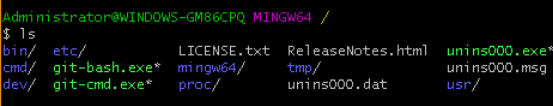

**正常安装完成！**

#### 2.3 运行Git注册用户

1. 设置用户名和邮箱。

   设置用户名：$ git config --global user.name "Your Name"。

   设置邮箱：  $ git config --globaluser,email "email@example.com"。

   设置用户名和邮箱，修改后提交到远程仓库能够看到是提交者，用于在团队合作开发中，表明代码作者。

   ```
   1. 查看当前登录账号：
   git config user.name
   2. 查看当前登录邮箱：
   git config user.email
   3. 修改用户名和邮箱：
   git config --global user.name "liuxinfeng"
   git config --global user.email "624310862@qq.com"
   ```

   

2. 输入 $ git init 启动Git。

#### 2.4 GitHub设置公钥免密提交

1. 新建/连接主存储库。

2. 输入 $ ssh-keygen -t rsa -C "[email@example.com](mailto:"13963639551@163.com")" 按三次回车生成公钥，在C:\Users\Administrator\.ssh下找到id_rsa.pub文件，记事本打开复制公钥。或则

   ```
   例如：  ssh-keygen -t rsa -C "624310862@qq.com"
   ```

   

   

   

   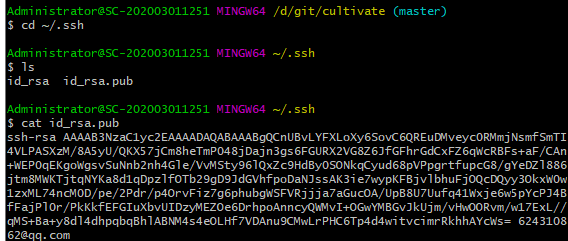

3. 在GitHub上新建密钥，自定义标题（title）将公钥粘贴保存。

   1. 选择设置

      

   2. 知道到SSH and GPS keys 菜单，点击 New SSH key

   

   

   3. 复制生成的key
   4. 收到邮件

   


#### 2.5 常用git命令

1. 文件操作

   - mkdir 文件名：创建文件夹
   - cd 文件夹名：进入文件夹
   - touch 文件名：创建文件
   - git rm 文件名

2. 复制仓库

   - git init：在本地初始化，创建Git仓库
   - git clone：  复制仓库到本地仓库。
   - git status：查看当前状态

3. 提交信息

   - git add 【文件名】或者【 . (全部)】：将文件从工作去提交到暂存区

   - git commit -m "提交描述"：将暂存区提交到本地仓库

   - git push：将本地仓库提交到远程仓库

     ```
     在使用git commit命令将修改从暂存区提交到本地版本库后，只剩下最后一步将本地版本库的分支推送到远程服务器上对应的分支了
      git push的一般形式为 git push <远程主机名> <本地分支名> <远程分支名> ，
      
      例如 git push origin master：refs/for/master ，即是将本地的master分支推送到远程主机origin上的对应master分支， origin 是远程主机名。第一个master是本地分支名，第二个master是远程分支名。
     
     git push origin master
     如果远程分支被省略，如上则表示将本地分支推送到与之存在追踪关系的远程分支（通常两者同名），如果该远程分支不存在，则会被新建
     git push origin ：refs/for/master
     如果省略本地分支名，则表示删除指定的远程分支，因为这等同于推送一个空的本地分支到远程分支，等同于 git push origin –delete master
     git push origin
     如果当前分支与远程分支存在追踪关系，则本地分支和远程分支都可以省略，将当前分支推送到origin主机的对应分支
     git push
     如果当前分支只有一个远程分支，那么主机名都可以省略，形如 git push，可以使用git branch -r ，查看远程的分支名
     ```

     

4. 更新仓库信息

   - git pull：将远程仓库的改动更新到本地工作区
   - git remote -v：查看origin和upstream源
   - git remote add origin/upstream git地址：添加origin/upstream源
   - git fetch upstream：获取upstream源仓库的提交和改变
   - git checkout master：切换到master
   - git merge upstream/master：合并远程的master


### 3. Git基本操作


此处开发人员自己根据指令创建仓库 ，仓库名为helloworld-姓名拼音

#### 3.1 GitHub创建远程仓库

1. 创建远程仓库helloworld，账户liuxinfengabc,属性为public

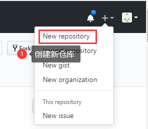

2. 仓库名字helloworld,属性public，任何人可见，初始化一个readme文件。

   

3. 创建成功 https://github.com/liuxinfengabc/helloworld

   

#### 3.2 GitHub修改仓库内容

##### 3.2.1 Github中修改仓库内容

​    在github中可以进行简单操作，创建文件/上传文件，并提交。复杂的操作，需要在本地仓库进行操作，提交。


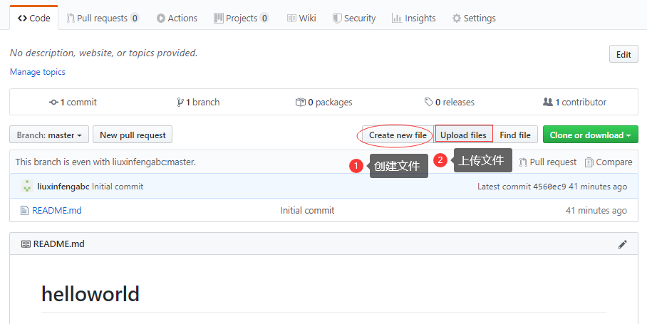


##### 3.2.2 利用命令修改内容提交

1. git init  初始化创建本地仓库

   **git init**  主要用来初始化一个空的`git`本地仓库。执行完上面的命令，当前目录下会自动生成`.git`隐藏文件夹，该隐藏文件夹就是`git`版本库。

   使用方法：进入某个空的文件夹下，打开`Git Bash`命令窗口输入以下命令，下载文件

2. git clone https://github.com/github-develop/helloworld.git 将远程仓库的内容克隆到本地仓库

   


3. 下载结果

   
   
   4.更新内容
   
   在本地修改文件，修改后可以利用命令查看项目状态。命令如下：
   
   git status
   
   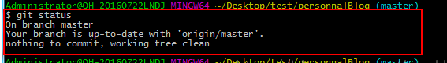
   
   5.提交
   
   （1）将修改后的文件修改提交到本地暂存区。基本命令如下：
   
   git add file，file 为修改文件名
   
   （2）提交当前工作空间的修改内容。基本命令如下：
   
   git commit -m “修改”，引号里面是提交信息
   
   （3）将项目更新到github或服务器。基本命令如下：
   
   git push

### 4. 高级操作

####  4.0 主程序员仓库，开发人员仓库

 1. 本文假定：

    主程序员GitHub地址：https://github.com/liuxinfengabc/helloworld

    开发人员GitHub地址：https://github.com/github-develop/helloworld

2. 获取项目地址

   https://github.com/github-develop/helloworld.git

   

#### 4.1 GitHub创建主程序仓库

1. 创建主程序仓库helloworld，账户liuxinfengabc,属性为public


2. 仓库名字helloworld,属性public，任何人可见，初始化一个readme文件。

   

3. 创建成功 https://github.com/liuxinfengabc/helloworld

   

#### 4.2  GitHub 创建开发者仓库

1. 创建开发人员账号  


2. 创建开发账户 ，申请新的QQ邮箱 1871418434@qq.com进行账户的创建。

3. 登录Github进行邮箱验证

4. 前往 https://github.com/liuxinfengabc/helloworld，点击Fork，复制代码到自己的开发者仓库

   

5. Fork成功

   

6. 回到自己的界面github.com,看到自己Fork的代码


#### 4.3 创建本地库

1. git init  初始化一个空的`git`本地仓库

2. git clone https://github.com/github-develop/helloworld.git 克隆开发者仓库的内容到本地仓库


3. 下载结果

   

#### 4.4  向远程仓库添加文件

开发者在本地修改内容后，需要进入要操作的文件夹内进行git操作

```
1. git add .                    # . 表示当前文件夹
2. git commit -m "注释信息“
3. git push                     #推送到开发者仓库
```

##### 4.4.1 开发者工作区-->开发者远程仓库

  命令操作，打开 git bash 命令：

```
- cd test                      #进入文件夹
- touch one.js                 #新建一个新的文件one.js 
```

  可以在本地打开该文件，添加内容。

  提交到开发者远程仓库：

```
- git add one.js                      #添加需要提交的文件

- git status                          #查看状态

- git commit    -m "修改XXXXXX"        #提交到本地仓库

- git push                            #从本地仓库推送到远程仓库
```

这样，就将本地仓库中新添加的one.js 文件添加到了开发者远程仓库。

**注：这时候只是在自己的GitHub仓库进行了修改，还没有修改主程序仓库内容**

##### 4.4.2 开发者GitHub仓库-->主程序员GitHub仓库

1. 登录Github，进入项目，点击Pull requests。

   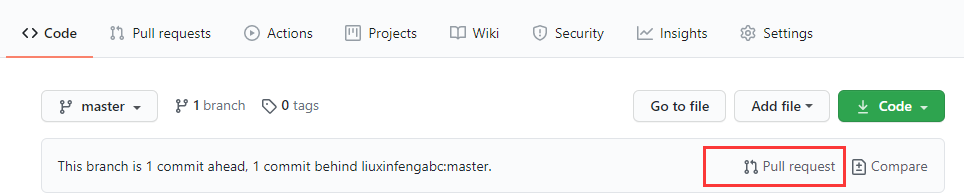

2. 通过Create pull request 进行提交，**提交给主程序员了，通知审核**


```
[github-develop](https://github.com/github-develop) wants to merge 1 commit into [liuxinfengabc:master](https://github.com/liuxinfengabc/helloworld) from [github-develop:master](https://github.com/github-develop/helloworld)
```


##### 4.4.3主程序员合并request

1. 主程序员登录Github ，查看pull request 

   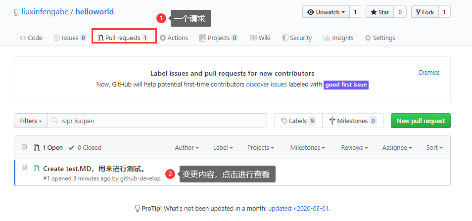

2. 点击FileChanged 查看修改内容，进行审核，并进行合并


**这样就从开发人员的GitHub中更新到自己原来fork的仓库主程序员中了**

#### 4.5 同步主程序员仓库中的更新

**说明：开发人员仓库和主程序员的仓库是两个独立的仓库，主程序员仓库更新后不会自动更新到开发人员仓库中**。需要主动进行更新。

可以通过GitHub界面直接操作，参见:

```
https://blog.csdn.net/qq1332479771/article/details/56087333?utm_medium=distribute.pc_relevant.none-task-blog-BlogCommendFromMachineLearnPai2-2.nonecase&depth_1-utm_source=distribute.pc_relevant.none-task-blog-BlogCommendFromMachineLearnPai2-2.nonecase
```

也可以参见命令行（在IDEA中ALT+F12打开命令行），命令行的配置：

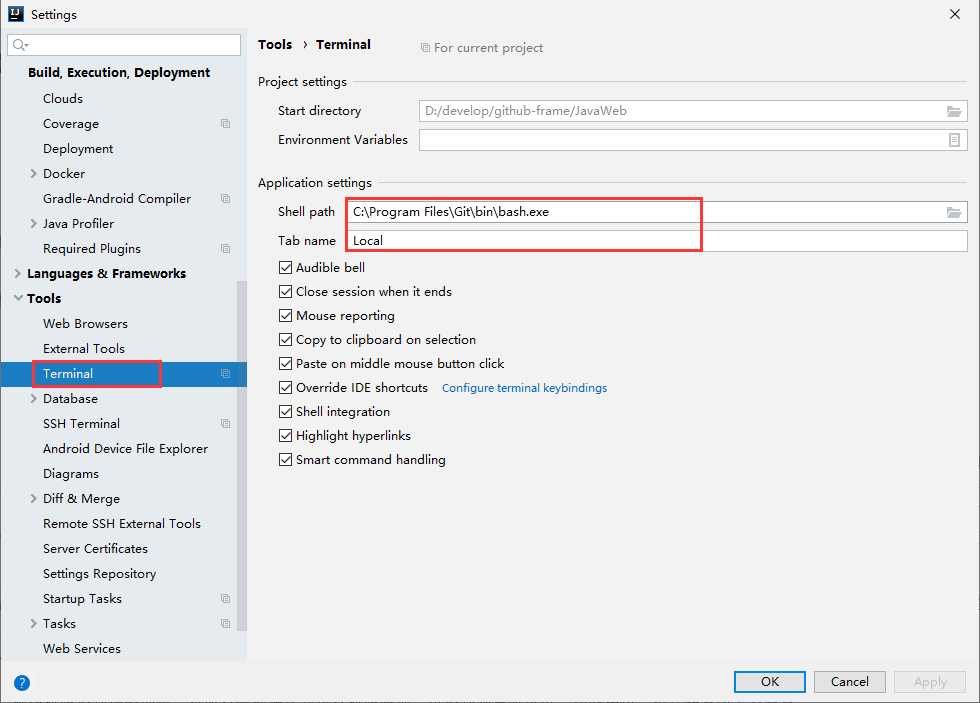

##### 4.5.1 基本步骤

1. git remote -v：查看origin和upstream源
2. git remote add origin/upstream git地址：添加origin/upstream源
3. git remote rm origin/upstream  #删除origin/upstream
4. git fetch upstream
5. git checkout master
6. git merge upstream/master
7. git push

##### 4.5.2 开发人员的仓库

可以看出这时候开发人员的仓库还没更新。

1. git remote -v：查看origin和upstream源。

   - origin 表示远程主机（开发人员仓库），upstream表示（主程序员仓库）

   - liuxinfengabc账户登录（主程序员账户）

     ```
     D:\idea-work\zup-boot-org>git remote -v
     origin  https://github.com/zonedaylab/zup-boot.git (fetch)
     origin  https://github.com/zonedaylab/zup-boot.git (push)
     ```

     

2. 添加主程序仓库地址

   git remote add upstream https://github.com/liuxinfengabc/helloworld

3. git fetch upstream  # 获取远程主程序仓库（upstream)代码

4. git checkout master   #切换到本地Master

5. git merge upstream/master  #合并远程分支  

6. git push  #推送到开发人员远程仓库。

   **此时，开发人员本地库已经和主程序员的原仓库已经完全同步了。但是注意，此时只是你电脑上的本地库和远程的github原仓库同步了，你自己的github仓库还没有同步，此时需要使用“git push”命令把你本地的仓库提交到github中。**

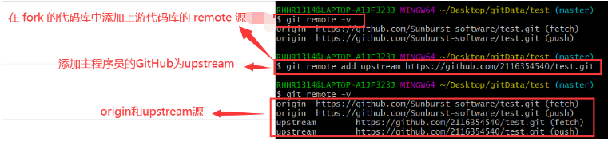


#### 4.6 版本回退

**说明：如果发现某次的版本提交完毕后有错误，需要回退，可以用下面的方法**

==步骤：==

1. git log  #查看版本

2. git reset --hard 版本号   #回退版本（本地）

3. git push -f   #push到远程仓库

   

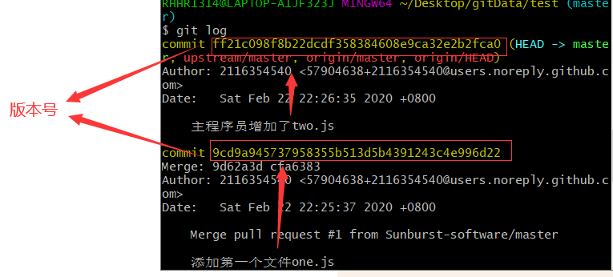


**此时回退版本已经完毕**


**==当push出错时可以尝试下面的命令==**

- git push origin master
- git push -f origin master

#### 4.7 常见错误


#### 4.7.1解决GitHub每次push时都提示输入用户名和密码的问题

1. 原因

   我们在建立远程仓库或者克隆项目时，使用的是HTTPS方式 ，HTTPS方式push不会保存用户名和密码。我们需要把HTTPS方式改成SSH的方式。

   

   在github系统上克隆代码的地址默认采用的是http的方式，我们一般这样clone代码：
   git clone https://github.com/yychuyu/linux-system-programming.git
   而如果采用ssh方式的话，是这样clone代码的：
   git clone git@github.com:yychuyu/linux-system-programming.git

2. 查看远程连接方式 git remote -v

```
$ git remote -v
origin  git@github.com:liuxinfengabc/https://github.com/liuxinfengabc/cultivate/cultivate.git (fetch)
origin  git@github.com:liuxinfengabc/https://github.com/liuxinfengabc/cultivate/cultivate.git (push)
```

3. 把http方式改为ssh方式，先移除旧的http的origin

```
$ git remote rm origin
```

4. 配置SSH方式

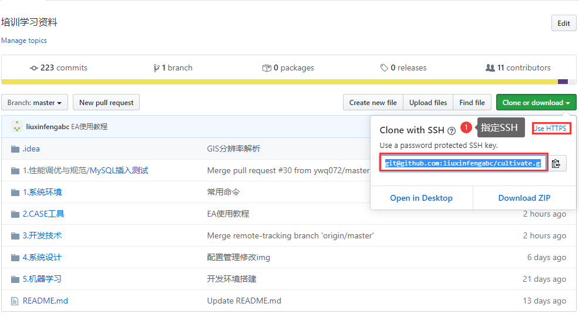

```
命令方式：
$ git remote add origin git@github.com:liuxinfengabc/cultivate.git
```

5. 检查一下有没改变成功：

   git remote -v

6. 改动完之后直接执行git push是无法推送代码的，需要设置一下上游要跟踪的分支，与此同时会自动执行一次git push命令，此时已经不用要求输入用户名及密码啦！

   git push --set-upstream origin master

#### 5. 开发环境中使用GitHub

#### 5.1 tortoiseGit(windows)简化操作

tortoiseGit是一个开放的git版本控制系统的源客户端，支持Winxp/vista/win7.该软件功能和git一样,不同的是：git是命令行操作模式，tortoiseGit界面化操作模式，不用记git相关命令就可以直接操作，可根据自己情况选择安装.

tortoiseGit下载地址：https://download.tortoisegit.org/tgit/

1. git commit 操作。 修改了文件后，右键选择commit，输入Message后，点Commit提交到本地仓库。

 

2. git pull 拉取服务器文件。在项目文件夹下右键菜单，选择TortoiseGit->Pull，点击OK.
3. git push 提交代表到服务器，TortoiseGit-> git push

 

如果文件出现感叹号则表示有冲突，必须先解决冲突：

```
1.在点击close后可以直接在弹出的窗口中点击yes来查看冲突，也可以通过点击Diff看本地仓库文件和服务器上面的文件哪里冲突了。
2.在弹出的窗口中双击打开冲突文件，解决冲突问题。
3.冲突解决完之后，删除在目录下生成出的多余文件，再次commit。
```


新增篇：

第一步：在仓库中新增文件后，先pull，然后可以在diff中查看和仓库区别

第二步：右键->commit，选择你需要提交的文件，然后点击commit

第三步：push文件


#### 5.2 idea中使用Git/GitHub

##### 5.2.1 配置Git和GitHub

1. 设置git.exe路径

File-->Settings-->Version Control-->Git/GitHub


2. 登录Github账户（添加账户）


##### 5.2.2 从GitHub上clone项

1. File ->New->Project from Version Control


2. 设置GitHub地址以及存储路径


3. 点击Clone

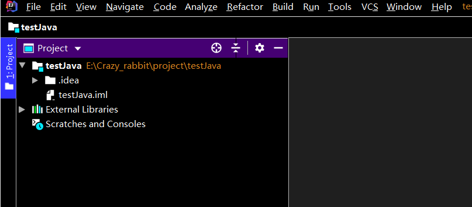

**4. 克隆完毕**


##### 5.2.3 提交项目到本地仓库/远程仓库

1. 添加新增文件(git add)，或者文件更新后。


2. 提交文件按 VCS-->Git-->Commit Changes


**看到这个说明已经push成功**

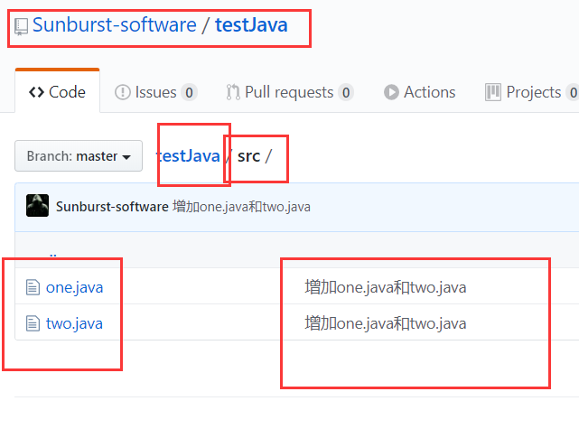

**如果往主程序员的仓库更新，就参考前面讲的pull request**

##### 5.2.4 更新项目到本地仓库

**若别人更新了仓库，在idea中怎么办呢？**


**这三个地方都可以**


##### 5.2.5 在终端中使用Git命令

**File-->Settings-->Tools-->Terminal-->Shell path**


Alt +F12 打开命令窗口，进行命令操作,与在Git bash下使用一样的效果，可以执行以下命令。

1. git remote -v：查看origin和upstream源

   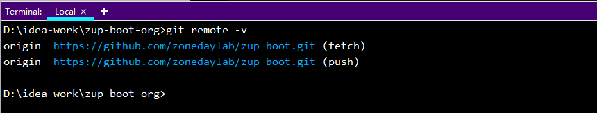

2. git remote add origin/upstream git地址：添加origin/upstream源

3. git fetch upstream

4. git checkout master

5. git merge upstream/master

6. git push

   

##### 5.2.6 创建项目并上传github


**点击Share**

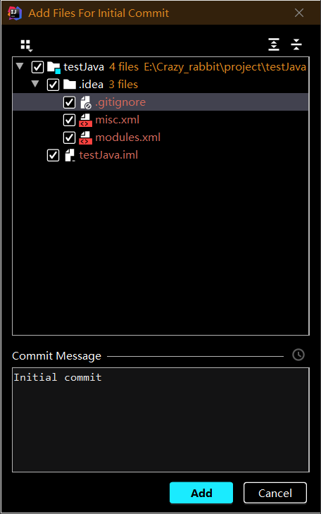

**点击Add，就可以将项目传到GitHub上了，不存在仓库就会创建一个名字为testJava的仓库**


**看到Successfully，表示创建成功**


#### 5.3 eclipse中使用Git/Github

##### 5.3.1 eclipse中使用Git导入工程

1. 打开Git Repositories窗口，点击右上角Add an existing local Git Repository to this view图标
2. 在Directory中选择你本地Git总仓库，在下方选择你想导入的Git仓库目录
3. 打开你导入的仓库->Working Tree，选择你想导入的工程，右键->Import Projects...
4. 调整选项，导入工程
5. 右键已导入工程->Gradle->Refresh Gradle Project

##### 5.3.2 eclipse中使用Git同步工程

1. 右键工程->Team->Synchronize Workspace进入同步窗口
2. 对双向红箭头文件，打开，进行代码合并操作，操作完成后 右键->Mark asMerged
3. 选择要上传的文件，右键->Add to Index/在Unstaged Changes中右键->Add to Index
4. 在Staged Changes中可以查看要提交的文件，在Commit Message中输入提交内容备注，以及作者相关，点击commit至本地
5. Pull拉取服务器上更新文件
6. 最后Push至服务器

### 6.Gitlab使用

#### 6.1 idea使用Gitlab

##### 6.1.1下载Gitlab插件


##### 6.1.2登录Github查找token

https下不用配置


##### 6.1.3idea设置gitlab


##### 6.1.4复制代码地址


http://124.130.192.24:10015/liuxinfengabc/test.git

##### 6.1.5Clone代码


##### 6.1.6 更新代码


出错：


但是命令行可以：

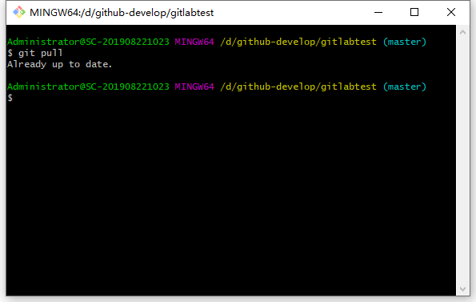

#### 6.2 pycharm使用Gitlab

与idea基本相同

##### 6.2.1下载gitlab插件


##### 6.2.2配置GitLab服务器


##### 6.2.3 Clone代码源

1. 获取代码地址，首先需要注册账户，并且有代码权限


```
http://git.iesnengyuan.com/jianda/gisofflinemapsystem
```

2. pyCharm执行Clone命令

```
打开VCS菜单-->Git--->Git Clone
```


3. 输入用户名和密码

   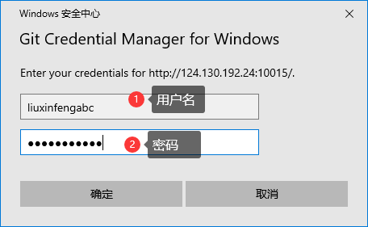

##### 6.2.4配置Terminal 执行git命令


ALT＋Ｆ１２显示终端

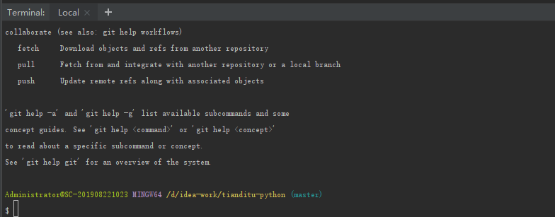

#### 6.3 HBuilderX使用GitLab

##### 6.3.1git插件安装

1、打开工具--》插件安装

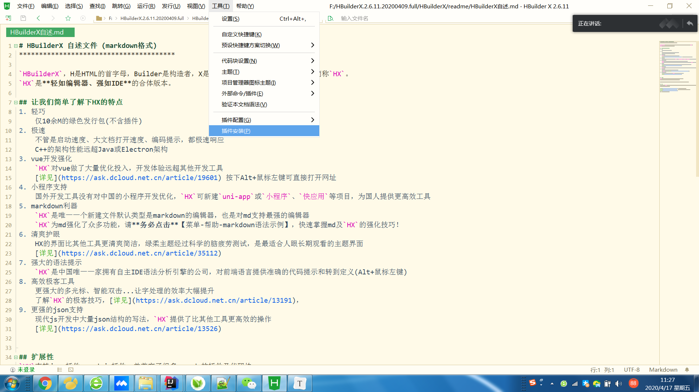

2、安装git


##### 6.3.2从gitlab加载项目

1、选择文件--》新建--》项目

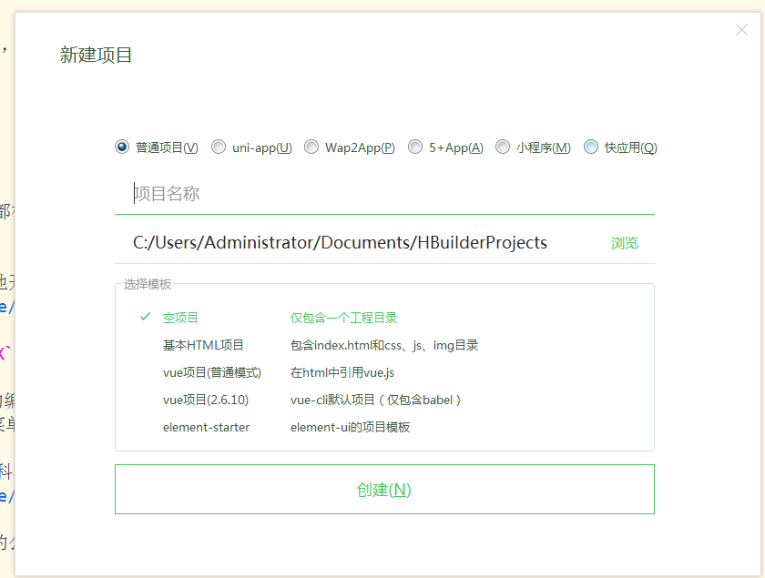


2、选择文件--》导入--》导入git项目--》输入地址--》导入即可

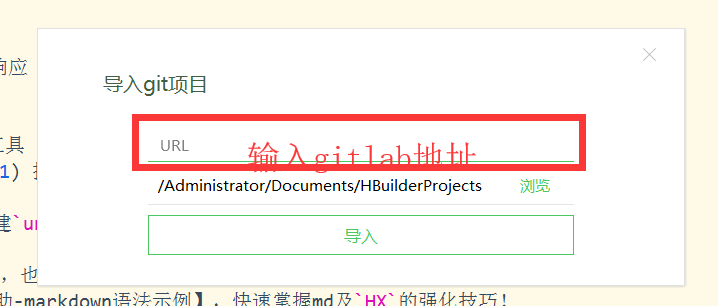