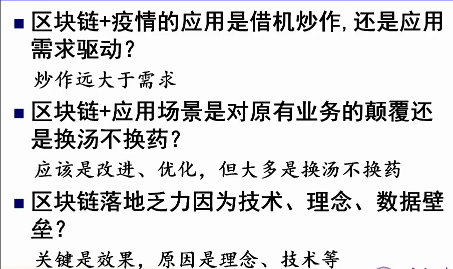

#### 1.引导发言

##### 1.1

炒作远远大于需求，落地 

共识：打包成一个智能合约。信息共享过程没有和业务结合起来。

个人简历验证，简历上链，个人涉及的企业上链。难点：企业上链。

区块链的战略方向：

产业组织形态：众心化、直接化、生态化、智能化。

面临的问题：如何可信互联；交互过程如何便捷、高效、智能。避免突发灾难。

区块链牵牛鼻子竞争优势的发展方向：

1.区块链网（可信基础网络）

2.智能操作系统

3.可信众智新品

4.可信众智服务器

5.信息自主管控技术

6. 基础理论方向

崔晓辉：区块链：推开世界信任的大门

如何保证上链的数据是否可靠。区块链应用的核心不在技术，而在于让民众相信区块链的真实性和不可更改性。

区块链解决的问题：谁当仲裁，怎么当仲裁，怎么确保认证当仲裁。

区块链适合的场景特性：同步、溯源、互信

供应链金融：信息不对称 信用传递难  自动计算难，监管难。

思辨环节：

高志鹏：

1.有炒作的空间，需求的挖掘非常困难。炒作非常多

李庆忠:

这两个不能是对立的，驱动为主。

两种需求：真需求、披马甲的

华伟：该用不该用，想不想用。

唐贺：华伟老师说的也是我想说的 ，很多行业“该用”，比如说供应链管理等等。但是“想用”是落地过程中最难的也是需要寻找契合点的，短浅的理解还是利益分配。

李 晋江：金融行业可以，没有很好解决行业的痛点。

工商局已经做了电子营业执照，试点了，等待进一步推广。电子证照是区块链很重要的应用场景。电子证照用到的更多是哈希的基本原理

电子证照放出去，防止穿盖，通过区块链进行加持。

柴：目前炒作的效果比实际效果要好的多。

李瑞：一个特别新的东西，一个时间阶段。特别早期的一个应用。我们具体怎么去用这个技术？交付给客户的是什么东西。（分布式的数据库）。分布进行

议题2： 技术 理念还是壁垒

何德彪:技术没有办法支持大量应用。

达到10000TPS的区块链系统，往往会阉割掉很多区块链的精髓思想，比如去中心化。

金测清：区块链。每个节点数据是全复制的。

共识与合约目前都有很好的工作再出来，提高效率。

崔晓辉：愿不愿意用，怎么用，想不想用。

1 理念。理念的问题。。研究，对上的交代；公开透明(去中心化)没有一个具体的应用，价值不大。
2 落地方向选择透明华要求较高或者说有透明化需求的应用

通过其他方式

李瑞：技术不是问题。

志鹏：

最好的是理念，带来非常全新的格局。

产业对区块链本身的需求打一个问号。为企业带来新的效益，或者场景。

不能高度现在的能力，也不要低估未来的能力。

华伟：大数据 人工智能 区块链的结合。政府的观念导致

柴教授：缺乏创造需求，创造场景的能力。结合现有的技术创造新的场景。

何德彪：学术、产业、企业结合起来。

议题3：

可信  可用 可变。

支持新的企业。

barry：都上链的话，查询或验证的性能呢

唐卫清：区块链只是保障存入的和读出的一致，无法保证存入的是正确的信息。如何保障可信？现在讲的是否可以理解为广义的区块链?还是区块链需要的支持技术?如何可信？众智和区块链什么关系。数据肯定是有错误的，不能认为可信的人提供的信息都是对的。区块链如何建立信任？一直没有搞明白。代码的可信，一般通过开源来表白

主观相信，和客观可信不一样，后者是需要证明的

刘聪 YOCSEF济南：业务流程管理技术与区块链技术应该如何深度融合？

北邮高志鹏
现在区块链上的信息也并非都是可信的。你可以在以太坊上写入你自己想写的任何信息，可以是假信息。信任不是无边界的，是针对特定信任目标的，不可无限扩大

郭文生
区块链只是主观信任吧。区块链仅仅是一种技术，可能无法解决客观可信的问题。

区块链的信任建立在不用节点自我证明身份的场景上。

还有一个关键点：信任不是无边界的，是针对特定信任目标的，不可无限扩大

包云岗-YOCSEF总部AC
目前中美之间就是面临这种信任危机啊

构建中美关系区块链：

李克峰-YOCSEF济南
如何通过数据来建立客观上的可信任？

杨程问题

1. 大家以前普遍认为 比特币可以作为避险资产，但是在这次经济动荡中，比特币也跌了很多，而且以前普遍认为的避险资产黄金也无法躲避经济危机的冲击。各位嘉宾怎么看这个问题呢，比特币是避险资产吗，世界上有真正的避险资产吗

2. 区块链的应用距离在全民普及还有很长的一段路要走，其中一个挑战就是普通人无法妥善的保管自己的私钥，很多人甚至普通的密码都管理不好。各位嘉宾对于区块链应用普通民众中的普及有什么看法，我们应该把私钥交给用户自己处理吗。

3. 我们知道央行正在准备我们自己的数字货币，各位嘉宾觉得，如果央行的数字货币发行出来，会对我们现有的金融体系产生什么样的影响，会对人民币在国际上的地位有什么影响，我们普通民众应该做什么准备去迎接数字货币的发行。

4. 在这次的疫情期间，大家非常关注的一个问题就是我们的公益慈善的不透明的问题，我们的捐款捐物的去向很多时候都是不明确的，而区块链就有存证溯源方面的技术优势。各位嘉宾觉得区块链在慈善行业有发展前景吗，其中的优势和挑战是什么。

区块链的基石是信任，那么信任在联盟、私有链上的信任会不会被把持；量子计算机对区块链形成的冲击有多大？

#### 群里的意见

13:05
刘新锋 YOCSEF济南
聊天
杨程
正常
刘新锋 YOCSEF济南
ok
13:21
刘新锋 YOCSEF济南
所有嘉宾实名 姓名-单位
13:30
杨程
发送了一条未知消息，请升级后查看。
宋昌-YOCSEF太原
预祝CCF YOCSEF 济南线上论坛圆满成功！

刘新锋 YOCSEF济南
谢谢宋昌
13:36
王振岭YOCSEF济南
已经改名
严丽娟西财中国区块链研究中心
怎么改名啊？
严丽娟西财中国区块链研究中心
我是成都AC
任建吉 YOCSEF郑州
成员列表后面自己名字有个箭头
帅智川 大一学生
在成员栏里点＞，改名
王振岭YOCSEF济南
看到成员列表了么
王振岭YOCSEF济南
点击自己的名字
王振岭YOCSEF济南
改名
郭延辉YOCSEF济南
点击自己的名字，改好之后，回车即可
唐贺
名字规则是什么
嘉宾严丽娟西财中国区块链研究中心
华为的朋友是哪位？
刘新锋 YOCSEF济南
姓名-论坛名字
或者
姓名-单位名字
唐贺
在哪里改？抱歉 没找到
任建吉 YOCSEF郑州
成员列表 自己名字后面箭头
唐贺—神思电子
找到了 谢谢 
改完了 3Q
13:52
王涛@苏州15250003992
好活动
唐贺—神思电子
目前还没有具体的应用
王振岭YOCSEF济南
文正，改下名字
唐贺—神思电子
不好意思 我这不太方便说话 
唐贺—神思电子
好的
主要是学习为主 哈哈
唐卫清
大家好
周桐
大家好
李云龙Chainlink&泉链
老师们好
唐卫清
最好都实名
王振岭YOCSEF济南
大家入会改一下名字
姜新波（yocsef济南）
发送了一条未知消息，请升级后查看。
王振岭YOCSEF济南
发送了一条未知消息，请升级后查看。
王朋YOCSEF济南
发送了一条未知消息，请升级后查看。
李克峰
发送了一条未知消息，请升级后查看。
刘聪 YOCSEF济南
发送了一条表情弹幕，请升级后查看。
14:05
李云龙Chainlink&泉链
非常棒的规则啊！
田杰 YOCSEF济南
感谢云龙的肯定与支持！
郭延辉YOCSEF济南
发送了一条未知消息，请升级后查看。
唐卫清
是不是被静音了？
A-嘉宾-李瑞-众享比特
刚才是我发的---谁把我的名字改成了李云龙啊。。。我刚刚改回来了
A-嘉宾-李瑞-众享比特
哈哈
姜新波（yocsef济南）
可以开始 
杨磊-山东建筑大学
好的
姜新波（yocsef济南）
能看到 
14:19
蔺帅
听得到
肖临-广西财院
听到
刘新锋 YOCSEF济南
能听到
桑春艳-YOCSEF重庆
能听到。
吴才锋-华为云区块链
OK
barry
都上链的话，查询或验证的性能呢？
刘新锋 YOCSEF济南
改一下名字 barry
barry
好的
刘新锋 YOCSEF济南
@田杰，收集一下群里的问题。
王振岭
大家没改名的改一下名字，改名规则  姓名+单位或者姓名+分论坛
14:28
田杰 YOCSEF济南
好的@刘新峰
王振岭
大家没改名的改一下名字，改名规则  姓名+单位或者姓名+分论坛
唐卫清
区块链只是保障存入的和读出的一致，无法保证存入的是正确的信息。如何保障可信？
刘聪 YOCSEF济南
业务流程管理技术与区块链技术应该如何深度融合？
唐卫清
现在讲的是否可以理解为广义的区块链?
唐卫清
还是区块链需要的支持技术?
刘新锋 YOCSEF济南
我们都整理好
北邮高志鹏
现在区块链上的信息也并非都是可信的。你可以在以太坊上写入你自己想写的任何信息，可以是假信息。
唐卫清
如何可信？
刘新锋 YOCSEF济南
唐卫清：区块链只是保障存入的和读出的一致，无法保证存入的是正确的信息。如何保障可信？现在讲的是否可以理解为广义的区块链?还是区块链需要的支持技术?如何可信？
刘新锋 YOCSEF济南
卫清，这是你的问题，一会问
唐卫清
一边听，一般在这里可以讨论起来
唐卫清
这是在线论坛的优势
刘新锋 YOCSEF济南
是的
刘新锋 YOCSEF济南
而且成本低，充分利用时间，高效。参会人员接入快
刘新锋 YOCSEF济南
而且可以记录，反复看
唐卫清
众智和区块链什么关系？
王朋YOCSEF济南
发送了一条未知消息，请升级后查看。
北邮高志鹏
发送了一条未知消息，请升级后查看。
韩龙威  暨南大学学生
发送了一条未知消息，请升级后查看。
刘聪 YOCSEF济南
发送了一条表情弹幕，请升级后查看。
郭延辉YOCSEF济南
发送了一条未知消息，请升级后查看。
包云岗-YOCSEF总部AC
发送了一条未知消息，请升级后查看。
刘涛 YOCSEF济南
发送了一条未知消息，请升级后查看。
王帅
发送了一条未知消息，请升级后查看。
蔺帅
结束
苏媛西安
新锋，聊天室记录随时截屏记录，页数一多过会清掉
北邮高志鹏
这个刚好是讲信任，可以对比看一下
唐卫清
对
孔兰菊YOCSEF济南
感谢苏媛的宝贵经验
唐卫清
区块链如何建立信任？一直没有搞明白
孔兰菊YOCSEF济南
待会好好讨论这个点
王景
可追溯性是信任的基础
孔兰菊YOCSEF济南
不可篡改、可追溯
重庆
发送了一条未知消息，请升级后查看。
唐卫清
有一定作用
陈贞翔@UJN
@卫清 应该是提供建立信任的平台和工具？
唐卫清
但还不能下结论
郭文生
多数人相信和相互制约
北邮高志鹏
还有一个关键点：信任不是无边界的，是针对特定信任目标的，不可无限扩大
唐卫清
主观相信，和客观可信不一样，后者是需要证明的
郭文生
区块链只是主观信任吧
郭文生
共识就是多数人相信
刘聪 YOCSEF济南
区块链可以解决共识问题，从共识到信任还是有区别的
北邮高志鹏
你借我100元，我信任你能还；你借我100万，我不敢信任

郭文生
是的[表情]
唐卫清
一定要准确，在概念一致的基础上来讨论
唐卫清
可信的含义是什么？
北邮高志鹏
区块链的信任建立在不用节点自我证明身份的场景上
刘新锋 YOCSEF济南
谢谢苏，已经保存
包云岗-YOCSEF总部AC
目前中美之间就是面临这种信任危机啊
北邮高志鹏
构建中美关系区块链：）
包云岗-YOCSEF总部AC
有必要[表情]
郭文生
区块链仅仅是一种技术，可能无法解决客观可信的问题
李克峰-YOCSEF济南
如何通过数据来建立客观上的可信任？
郭文生
比如链下数据上链的可信性是无法保证的
北邮高志鹏
可信也要分为不同层级，身份可信、行为可信、内容可信
唐卫清
代码不是全部可信的
李克峰-YOCSEF济南
信任通常是很主观的问题，想要客观化是个很复杂的问题
唐卫清
对，应该说清楚
孔兰菊YOCSEF济南
代码的可信，一般通过开源来表白
北邮高志鹏
是的，现在线下数据上链难以保障数据的真实性
唐卫清
相信是主观的，可信是客观的
唐卫清
一般用可信
李克峰-YOCSEF济南
想要让信息可信必须数据的获取、存储和传输都必须可信，区块链只能一定程度上保证存储和传输的可信吧？
郭文生
区块链仅仅保证执行的逻辑和结果是可信的，但数据本身是无法确定客观可信的

唐卫清
数据肯定是有错误的，不能认为可信的人提供的信息都是对的
北邮高志鹏
我理解区块链目前不提供内容可信的解决方案
郭文生
是的
北邮高志鹏
提供的是节点行为的可信性机理保障
唐卫清
如果内容无法可信，那他这个可信指什么？
陈贞翔@UJN
区块链没法解决线下可信问题，但是会影响线下对信任的重新认识和评估。
刘新锋 YOCSEF济南
代码开源就可信？谁来证明？我信吗？
北邮高志鹏
节点接入区块链网络后，我不管你是否是恶意节点，你只要遵照我的协议进行共识，你和其他区块链节点组成的区块链系统就是“去信任”的
唐卫清
机理方面，原理可能可以，实际可能做不到
北邮高志鹏
行为可信目前也无法泛指所有的节点行为
唐卫清
这个的前提是绝大多数节点是可信的
牛双诚
区块链不能保证上链的数据是正确的，但可以保证一旦个体输入了错误信息，信息将被永远保存，不可抵赖，以至于个体不敢输入错误信息
孔兰菊YOCSEF济南
现在更多是联盟链，有一定的准入门槛
郭文生
区块链就是数据一致性的记账技术
唐卫清
如果有一个较大比例节点不可信，那么究竟哪个节点是可信的就很难判断
北邮高志鹏
无法有完美的全部可信的模型，就像无法通过计算机画出一个绝对的圆形
北邮高志鹏
在数学意义上可信即可
郭文生
所以需要大量的节点参与，使作恶很难
北邮高志鹏
比如说在2的100次方的计算过程中可信
牛双诚
计算过程可信，历史可查
唐卫清
我希望的是大家能够追下去，将概念和原理真正弄清楚，将结论搞准确
北邮高志鹏
比特币节点的51%攻击，上升到哲学意义，就是：如果一个社团，一半以上的人认为对的事，就是对这个社团对的事
郭文生
是的，就是投票
唐卫清
因为人之间无法建立完全信任，机器之间大概率也无法建立信任，区块链有一定作用，但也无法突破
北邮高志鹏
密码学可信——》系统行为可信，这是区块链的贡献，但是这个箭头我觉得不能保证100%的效率
唐卫清
一些内容有人认可，有人不认可，立场不同
北邮高志鹏
要看完全是怎么定义了
唐卫清
我就是在追定义
北邮高志鹏
现在对区块链技术和应用的描述，大量似是而非的词句
北邮高志鹏
感觉人类有些词穷
唐卫清
必须在清晰定义的基础上讨论才能有正确的结果
唐卫清
论坛如果能够理清几个概念就是贡献
北邮高志鹏
是
北邮高志鹏
另外，大家现在讨论的区块链，我觉得还要区分一下是哪种链
北邮高志鹏
我觉得联盟链和最初的区块链应用（比特币），不是一种东西
唐卫清
我三点要参加另外一个会议，先退出了。预祝论坛取得成功[表情]
北邮高志鹏
[表情]
王朋YOCSEF济南
发送了一条未知消息，请升级后查看。
北邮高志鹏
发送了一条未知消息，请升级后查看。
姜新波（yocsef济南）
发送了一条未知消息，请升级后查看。
王振岭YOCSEF济南
发送了一条未知消息，请升级后查看。
王振岭YOCSEF济南
发送了一条未知消息，请升级后查看。
孙洪波
发送了一条未知消息，请升级后查看。
郭文生
发送了一条未知消息，请升级后查看。
suyan
发送了一条表情弹幕，请升级后查看。
姜新波（yocsef济南）
发送了一条未知消息，请升级后查看。
郭延辉YOCSEF济南
发送了一条未知消息，请升级后查看。
王雨
发送了一条未知消息，请升级后查看。
田杰 YOCSEF济南
发送了一条未知消息，请升级后查看。
肖临-广西财院
听到
jm
区块链的应用 目前是不是噱头大于实质？去中心化的这种技术思路是否和中心化之间相冲突，从而被抑制？
北邮高志鹏
国内鼓励发展的是联盟链应用
北邮高志鹏
对公链不鼓励。但是对公链的某些技术可以从研究角度开展研发
北邮高志鹏
包括矿机芯片研发
李晋江
区块链很多应用都是伪需求。
刘新锋 YOCSEF济南
谢谢卫清的倾情参与，提出这么多宝贵的意见。
北邮高志鹏
是的，李晋江
李晋江
有些应用号称用区块链解决了“信息不对称”问题，但解决信息不对称最简单有效的方式是“信息公开”，并不需要非用区块链来解决。
北邮高志鹏
Gartner炒作曲线就想说明这一点

杨作明-山东特检
联盟链怎么解决51%被攻击的问题，或者直接是人为操纵，怎么信任？
北邮高志鹏
目前来看，有没有现有信息技术解决不了而非要区块链解决的场景