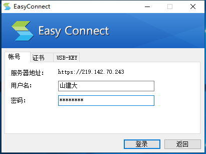
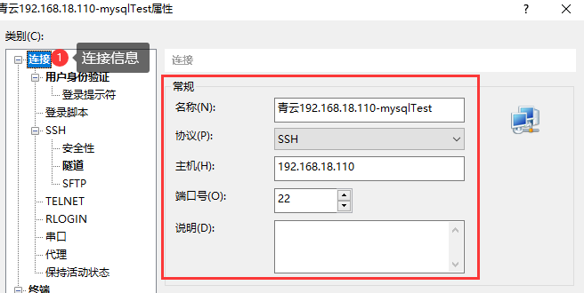
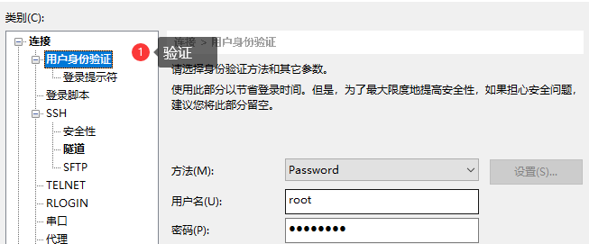
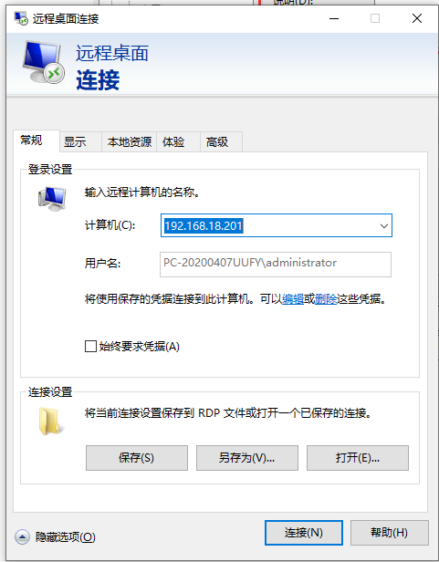
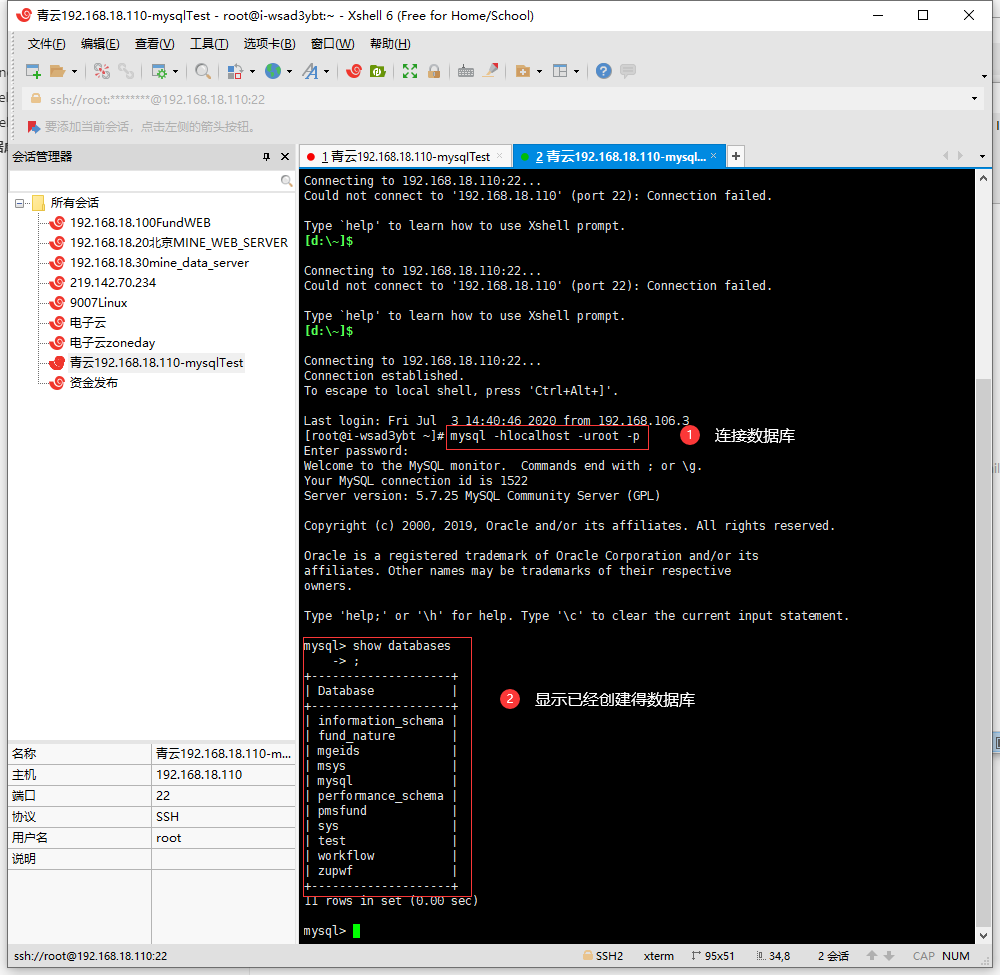
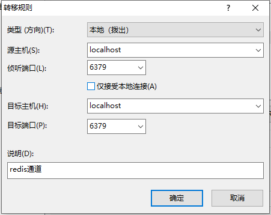
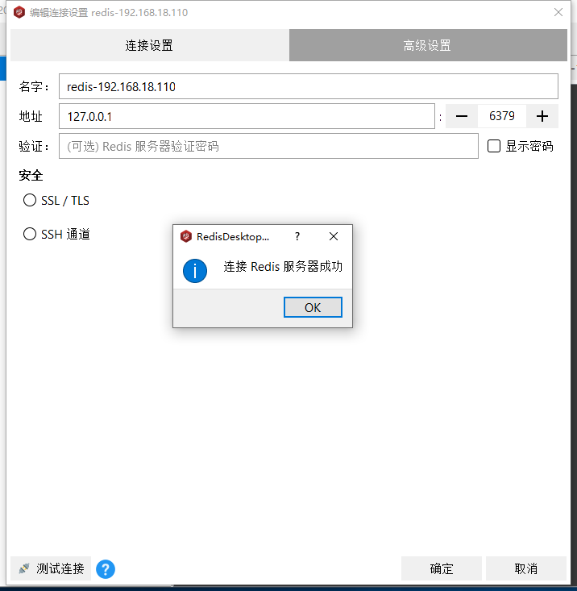
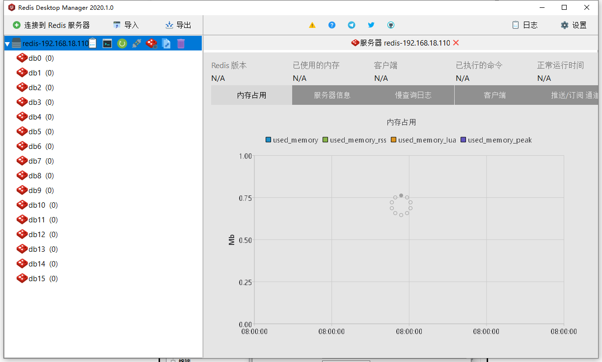
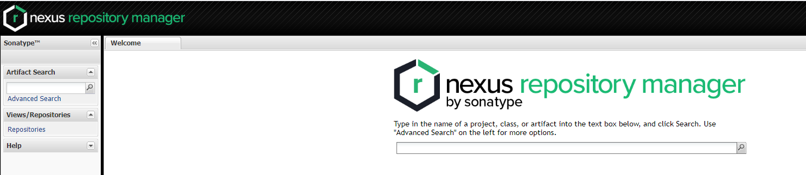

### 1.系统初始化连接

#### 1.easyConnect  连接网络

https://219.142.70.243      用户名 山建大   sjd6789#

#### 2.基于XShell连接服务器

centos:  192.168.18.201
连接用户 mysql  密码: mysql

#### 			3. 基于远程桌面连接windows工作站

​					例如192.168.18.201   用户名administrator  密码 Zoneday123!@#

### 2.Mysql开发服务器

#### 3.xshell隧道连接mysql  

####         4.xshell连接服务器

#### 5.连接数据库

mysql root  123456

### 2.Redis开发服务器

1. 安装Redis客户端工具-redis-desktop-manager-2020.1.0（开源）

2. 通过xShell连接192.168.18.110服务器

3. 设置隧道  6379

   

4. 配置客户端工具

查看Redis信息

### 3.  Maven开发服务器

![image-20200713123538375](img/image-20200713123538375.png

### 4. Jenkins开发部署服务器

### 5. GitLab开发配置服务器

​	http://192.168.18.101:8082

  root  Zd666666

### 6. 集群开发测试服务器